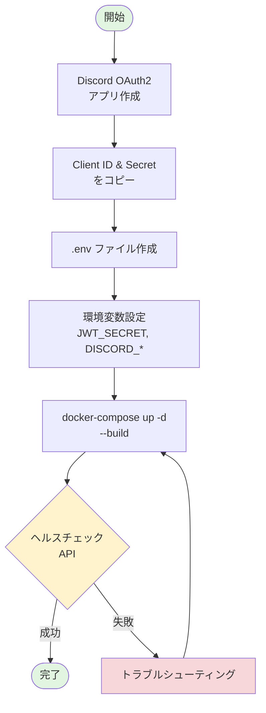
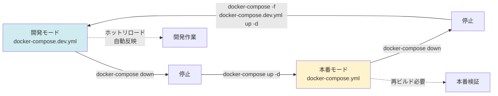

# FRP認証システム - クイックスタートガイド

**所要時間:** 5分  
**対象:** 初めてシステムをセットアップする方

---

## 📋 事前準備

### 必要なもの
- Docker & Docker Compose
- Discord Developer Account
- 基本的なターミナル操作の知識

### システム要件
- Docker Engine 20.10+
- Docker Compose 2.0+
- 空きポート: 8080, 7000, 7500

---

## 🚀 5分でセットアップ

### セットアップフロー全体図



### ステップ1: Discord OAuth2アプリケーション作成

1. [Discord Developer Portal](https://discord.com/developers/applications) にアクセス
2. 「New Application」をクリック
3. アプリケーション名を入力（例: FRP Auth System）
4. 「OAuth2」→「General」に移動
5. 「Redirects」に以下を追加:
   ```
   http://localhost:8080/api/auth/callback
   ```
6. **Client ID** と **Client Secret** をコピー

### ステップ2: 環境変数の設定

```bash
cd backend/Docker
cp .env.example .env
```

`.env` ファイルを編集:

```env
# JWT署名鍵（セキュアな値を生成）
JWT_SECRET=$(openssl rand -base64 32)

# Discord OAuth2設定
DISCORD_CLIENT_ID=<ステップ1でコピーしたClient ID>
DISCORD_CLIENT_SECRET=<ステップ1でコピーしたClient Secret>
DISCORD_REDIRECT_URI=http://localhost:8080/api/auth/callback

# ベースURL
BASE_URL=http://localhost:8080

# FRPバイナリバージョン
FRP_VERSION=0.65.0
```

### ステップ3: コンテナ起動

```bash
docker-compose up -d --build
```

### ステップ4: 動作確認

```bash
# すべてのコンテナが起動していることを確認
docker-compose ps

# ヘルスチェック
curl http://localhost:8080/api/frp/health
curl http://localhost:8080/api/assets/frp/info
```

**期待される結果:**
```json
{
  "success": true,
  "data": {
    "version": "0.65.0",
    "...": "..."
  }
}
```

---

## 🎉 完了！

これで以下のサービスが利用可能になりました:

| サービス | URL | 説明 |
|---------|-----|------|
| API Gateway | http://localhost:8080 | すべてのAPIエンドポイント |
| FRP Dashboard | http://localhost:7500 | FRPサーバー管理画面（admin/admin） |
| FRP Server | tcp://localhost:7000 | FRPクライアント接続ポート |

---

## 📚 次のステップ

### 初めての認証テスト

```bash
# テストクライアントを使用
cd test-client
npm install
npm start
```

### ユーザー権限設定

`frp-authz/data/users.json` を編集:

```json
{
  "users": [
    {
      "discordId": "YOUR_DISCORD_ID",
      "allowedPorts": [25565, 22, 3000],
      "maxSessions": 3,
      "createdAt": "2025-12-04T00:00:00Z",
      "updatedAt": "2025-12-04T00:00:00Z"
    }
  ]
}
```

Discord IDの取得方法:
1. Discordでデベロッパーモードを有効化
2. 自分のアイコンを右クリック
3. 「IDをコピー」

---

## 🛠️ 開発モード

開発時はホットリロード対応の開発モードを使用できます:

```bash
# 開発モードで起動
docker-compose -f docker-compose.dev.yml up -d

# ログをリアルタイム監視
docker-compose -f docker-compose.dev.yml logs -f

# 特定のコンテナのログ
docker-compose -f docker-compose.dev.yml logs -f frp-authjs

# 停止
docker-compose -f docker-compose.dev.yml down
```

### 開発モードと本番モードの違い

| 機能 | 開発モード | 本番モード |
|-----|-----------|-----------|
| ソースコード | ボリュームマウント | イメージに含む |
| 変更反映 | 自動リロード | 再ビルド必要 |
| node_modules | 保護される | イメージ内 |
| 用途 | ローカル開発 | デプロイ |

### モード切り替えフロー



---

## 🔧 トラブルシューティング

### ポートが既に使用されている

**エラー:** `Bind for 0.0.0.0:8080 failed: port is already allocated`

**解決策:**
```bash
# ポート使用状況を確認
lsof -i :8080
# または
netstat -an | grep 8080

# 既存プロセスを停止してから再起動
```

### Discord OAuth2エラー

**エラー:** `Invalid OAuth2 redirect URI`

**解決策:**
1. Discord Developer Portalの設定を再確認
2. Redirect URIが完全一致しているか確認（末尾のスラッシュに注意）
3. `.env`の`DISCORD_REDIRECT_URI`を確認

### コンテナが起動しない

**確認手順:**
```bash
# ログを確認
docker-compose logs

# 特定のコンテナの状態確認
docker-compose ps
docker inspect <container-name>

# クリーンな状態で再起動
docker-compose down -v
docker-compose up -d --build
```

### JWT_SECRET未設定エラー

**エラー:** `JWT_SECRET is required`

**解決策:**
```bash
# セキュアなシークレットを生成
openssl rand -base64 32

# .envファイルに追加
echo "JWT_SECRET=$(openssl rand -base64 32)" >> .env
```

---

## 📖 より詳しい情報

- **APIリファレンス**: [02-API_REFERENCE.md](./02-API_REFERENCE.md)
- **システム構成**: [03-ARCHITECTURE.md](./03-ARCHITECTURE.md)
- **ミドルウェア統合**: [04-INTEGRATION_GUIDE.md](./04-INTEGRATION_GUIDE.md)
- **メインドキュメント**: [../README.md](../README.md)

---

## 💡 ヒント

### データの永続化

以下のディレクトリがホストにマウントされます:
- `frp-authjs/data/` - 認証セッション
- `frp-authz/data/` - ユーザー権限とアクティブセッション
- `AssetServ/` - アセットサーバーデータ

### ログの確認方法

```bash
# すべてのコンテナ
docker-compose logs -f

# 特定のコンテナ（認証サービス）
docker-compose logs -f frp-authjs

# 最新100行のみ表示
docker-compose logs --tail=100 frp-authjs

# タイムスタンプ付き
docker-compose logs -f --timestamps
```

### コンテナの再ビルド

```bash
# 特定のコンテナのみ
docker-compose up -d --build frp-authjs

# すべて再ビルド
docker-compose down
docker-compose up -d --build
```

---

## ✅ チェックリスト

セットアップ完了の確認:

- [ ] Discord OAuth2アプリケーションが作成されている
- [ ] `.env`ファイルが正しく設定されている
- [ ] すべてのコンテナが`Up`状態である
- [ ] ヘルスチェックAPIが正常に応答する
- [ ] FRP Dashboardにアクセスできる
- [ ] `users.json`に自分のDiscord IDが登録されている

すべてチェックできたら、実際の認証フローを試してみましょう！
