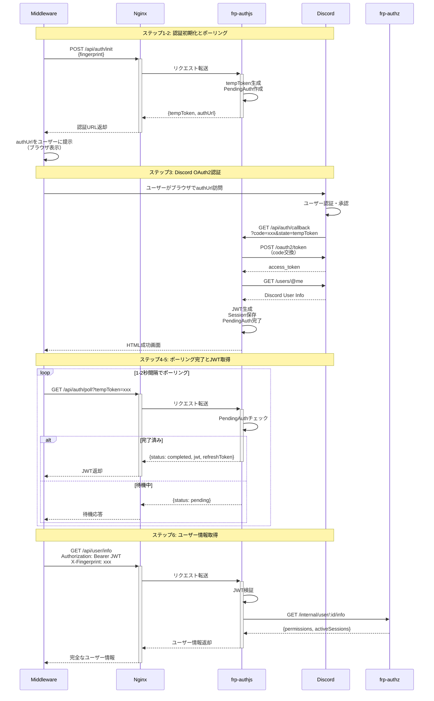
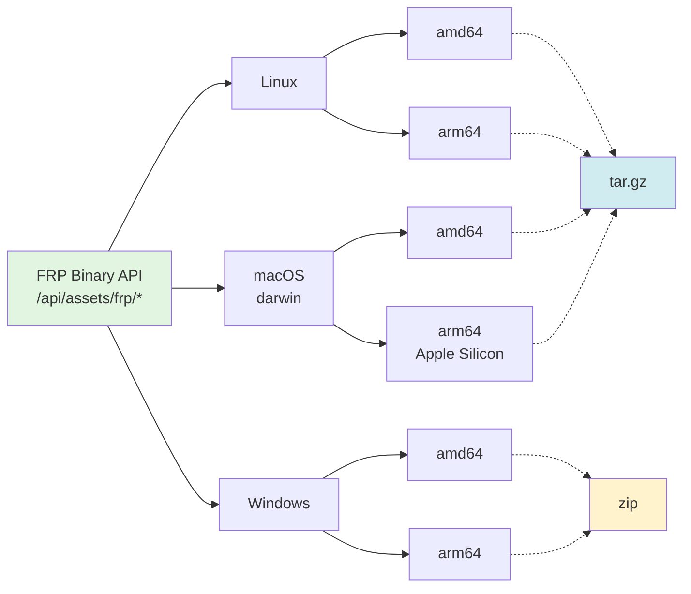
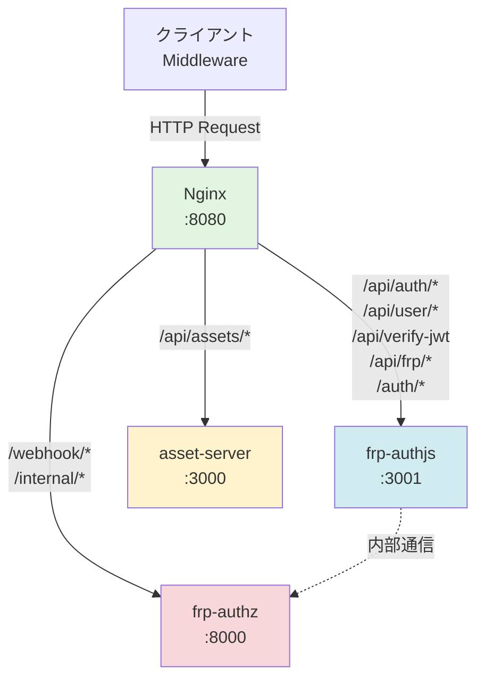

# FRP認証システム - API完全リファレンス

**バージョン:** v3.2.0  
**最終更新:** 2025-12-04

---

## 📌 概要

このドキュメントは、FRP認証システムが提供するすべてのAPIエンドポイントの完全なリファレンスです。

### ベースURL

```
http://localhost:8080
```

すべてのリクエストはNginxリバースプロキシ経由で処理されます。

### 認証方式

- **Discord OAuth2**: 初回認証
- **JWT Bearer Token**: API認証
- **Fingerprint**: セッション検証（`X-Fingerprint`ヘッダー）

### 認証フロー全体図



---

## 🔐 認証API (frp-authjs)

### 1. 認証初期化

ポーリングベース認証フローを開始します。

**エンドポイント:** `POST /api/auth/init`

**リクエスト:**
```json
{
  "fingerprint": "sha256_hex_string"
}
```

**レスポンス (200 OK):**
```json
{
  "success": true,
  "data": {
    "tempToken": "temp_abc123...",
    "authUrl": "https://discord.com/oauth2/authorize?client_id=...",
    "expiresIn": 600,
    "expiresAt": "2025-12-04T10:15:00Z"
  },
  "timestamp": "2025-12-04T10:05:00Z"
}
```

**フィールド説明:**
- `tempToken`: ポーリング用の一時トークン（10分間有効）
- `authUrl`: ユーザーがブラウザで開くDiscord認証URL
- `expiresIn`: 有効期限（秒）
- `expiresAt`: 有効期限（ISO 8601形式）

---

### 2. 認証状態ポーリング

認証完了を待つためのポーリングエンドポイント。

**エンドポイント:** `GET /api/auth/poll?tempToken={token}`

**クエリパラメータ:**
- `tempToken` (必須): 初期化時に取得した一時トークン

**レスポンス (200 OK) - 待機中:**
```json
{
  "status": "pending",
  "expiresAt": "2025-12-04T10:15:00Z"
}
```

**レスポンス (200 OK) - 完了:**
```json
{
  "status": "completed",
  "jwt": "eyJhbGciOiJIUzI1NiIsInR5cCI6IkpXVCJ9...",
  "refreshToken": "refresh_abc123...",
  "expiresAt": "2025-12-04T18:05:00Z",
  "refreshExpiresAt": "2025-12-11T10:05:00Z",
  "discordUser": {
    "id": "123456789012345678",
    "username": "username",
    "discriminator": "0000",
    "avatar": "abc123...",
    "email": "user@example.com"
  }
}
```

**レスポンス (200 OK) - 有効期限切れ:**
```json
{
  "status": "expired",
  "message": "Authentication session expired"
}
```

**推奨ポーリング間隔:** 1〜2秒

---

### 3. Discord OAuth2コールバック

Discord認証後のリダイレクト先（ユーザー向けHTML）。

**エンドポイント:** `GET /api/auth/callback?code={code}&state={state}`

**動作:**
1. Discordから`code`と`state`を受信
2. トークンを交換してセッションを完了
3. 成功/失敗メッセージのHTMLを表示

**レスポンス:** HTML（ブラウザ表示用）

---

### 4. トークンリフレッシュ

アクセストークンを更新します。

**エンドポイント:** `POST /api/auth/refresh`

**リクエスト:**
```json
{
  "refreshToken": "refresh_abc123...",
  "fingerprint": "sha256_hex_string"
}
```

**レスポンス (200 OK):**
```json
{
  "success": true,
  "accessToken": "eyJhbGciOiJIUzI1NiIsInR5cCI6IkpXVCJ9...",
  "refreshToken": "refresh_xyz789...",
  "expiresAt": "2025-12-04T18:05:00Z",
  "refreshExpiresAt": "2025-12-11T10:05:00Z"
}
```

**エラーレスポンス (401 Unauthorized):**
```json
{
  "success": false,
  "error": {
    "message": "Token refresh failed",
    "code": "TOKEN_EXPIRED",
    "reason": "token_expired"
  }
}
```

**エラー理由:**
- `token_expired`: リフレッシュトークンの有効期限切れ
- `fingerprint_mismatch`: Fingerprintが一致しない（全セッション無効化）
- `session_not_found`: セッションが存在しない

---

### 5. ユーザー情報取得

現在のユーザー情報、権限、アクティブセッションを取得します。

**エンドポイント:** `GET /api/user/info`

**ヘッダー:**
```
Authorization: Bearer <jwt>
X-Fingerprint: <fingerprint>
```

**レスポンス (200 OK):**
```json
{
  "success": true,
  "data": {
    "discordUser": {
      "id": "123456789012345678",
      "username": "username",
      "discriminator": "0000",
      "avatar": "abc123...",
      "email": "user@example.com"
    },
    "session": {
      "id": "session_abc123...",
      "createdAt": "2025-12-04T10:05:00Z",
      "expiresAt": "2025-12-04T18:05:00Z",
      "lastRefreshed": "2025-12-04T10:05:00Z"
    },
    "permissions": {
      "allowedPorts": [25565, 22, 3000, 8080],
      "maxSessions": 3
    },
    "activeSessions": [
      {
        "sessionId": "frp_session_123",
        "remotePort": 25565,
        "connectedAt": "2025-12-04T10:00:00Z",
        "fingerprint": "sha256...",
        "status": "active"
      }
    ]
  },
  "timestamp": "2025-12-04T10:05:00Z"
}
```

**警告ヘッダー:**
```
X-Warning: Failed to fetch user permissions from frp-authz
```
（frp-authz接続失敗時、基本情報のみ返却）

---

### 6. JWT検証 (内部API)

frp-authzから呼ばれるJWT検証エンドポイント。

**エンドポイント:** `POST /api/verify-jwt`

**リクエスト:**
```json
{
  "jwt": "eyJhbGciOiJIUzI1NiIsInR5cCI6IkpXVCJ9...",
  "fingerprint": "sha256_hex_string"
}
```

**レスポンス (200 OK):**
```json
{
  "valid": true,
  "discordId": "123456789012345678",
  "sessionId": "session_abc123..."
}
```

**エラーレスポンス (401 Unauthorized):**
```json
{
  "valid": false,
  "error": "Invalid token or fingerprint mismatch"
}
```

---

### 7. ヘルスチェック

サービスの稼働状態を確認します。

**エンドポイント:** `GET /api/frp/health`

**レスポンス (200 OK):**
```json
{
  "status": "healthy",
  "timestamp": "2025-12-04T10:05:00Z",
  "service": "frp-authjs",
  "version": "3.2.0",
  "pendingAuthentications": 2
}
```

---

## 📦 FRPバイナリ配信API (asset-server)

### サポートプラットフォーム



### 1. 全バイナリ情報一覧

すべてのサポートプラットフォームのバイナリ情報を取得します。

**エンドポイント:** `GET /api/assets/frp/binaries`

**レスポンス (200 OK):**
```json
{
  "success": true,
  "data": {
    "version": "0.65.0",
    "binaries": [
      {
        "platform": "linux",
        "arch": "amd64",
        "downloadUrl": "https://github.com/fatedier/frp/releases/download/v0.65.0/frp_0.65.0_linux_amd64.tar.gz",
        "version": "0.65.0",
        "extension": "tar.gz",
        "clientBinaryName": "frpc",
        "serverBinaryName": "frps",
        "archivePath": "frp_0.65.0_linux_amd64"
      },
      {
        "platform": "windows",
        "arch": "amd64",
        "downloadUrl": "https://github.com/fatedier/frp/releases/download/v0.65.0/frp_0.65.0_windows_amd64.zip",
        "version": "0.65.0",
        "extension": "zip",
        "clientBinaryName": "frpc.exe",
        "serverBinaryName": "frps.exe",
        "archivePath": "frp_0.65.0_windows_amd64"
      }
    ],
    "supportedPlatforms": [
      { "platform": "linux", "arch": "amd64" },
      { "platform": "linux", "arch": "arm64" },
      { "platform": "darwin", "arch": "amd64" },
      { "platform": "darwin", "arch": "arm64" },
      { "platform": "windows", "arch": "amd64" },
      { "platform": "windows", "arch": "arm64" }
    ]
  },
  "timestamp": "2025-12-04T10:05:00Z"
}
```

---

### 2. クライアントバイナリ情報

frpcバイナリのダウンロード情報を取得します。

**エンドポイント:** `GET /api/assets/frp/client-binary`

**クエリパラメータ:**
- `platform` (オプション): `linux`, `darwin`, `windows` (デフォルト: `linux`)
- `arch` (オプション): `amd64`, `arm64` (デフォルト: `amd64`)

**例:**
```bash
# Linux amd64 (デフォルト)
GET /api/assets/frp/client-binary

# Windows amd64
GET /api/assets/frp/client-binary?platform=windows&arch=amd64

# macOS ARM64
GET /api/assets/frp/client-binary?platform=darwin&arch=arm64
```

**レスポンス (200 OK) - Linux:**
```json
{
  "success": true,
  "data": {
    "downloadUrl": "https://github.com/fatedier/frp/releases/download/v0.65.0/frp_0.65.0_linux_amd64.tar.gz",
    "version": "0.65.0",
    "platform": "linux",
    "arch": "amd64",
    "binaryName": "frpc",
    "archivePath": "frp_0.65.0_linux_amd64/frpc",
    "extension": "tar.gz",
    "notes": [
      "Download the archive and extract the frpc binary",
      "The frpc binary is located at frp_0.65.0_linux_amd64/frpc within the archive",
      "Make sure to set executable permissions (chmod +x frpc on Unix-like systems)"
    ]
  },
  "timestamp": "2025-12-04T10:05:00Z"
}
```

**エラーレスポンス (400 Bad Request):**
```json
{
  "success": false,
  "error": {
    "message": "Unsupported platform/arch combination: freebsd/amd64",
    "code": "UNSUPPORTED_PLATFORM",
    "supportedPlatforms": [
      { "platform": "linux", "arch": "amd64" },
      { "platform": "linux", "arch": "arm64" },
      ...
    ]
  },
  "timestamp": "2025-12-04T10:05:00Z"
}
```

---

### 3. サーバーバイナリ情報

frpsバイナリのダウンロード情報を取得します。

**エンドポイント:** `GET /api/assets/frp/server-binary`

**パラメータとレスポンス:** `/client-binary`と同じ（`binaryName`が`frps`または`frps.exe`）

---

### 4. FRP情報サマリー

FRP関連情報の概要を取得します。

**エンドポイント:** `GET /api/assets/frp/info`

**レスポンス (200 OK):**
```json
{
  "success": true,
  "data": {
    "version": "0.65.0",
    "releaseUrl": "https://github.com/fatedier/frp/releases/download/v0.65.0",
    "clientBinaryEndpoint": "/api/assets/frp/client-binary",
    "serverBinaryEndpoint": "/api/assets/frp/server-binary",
    "binariesEndpoint": "/api/assets/frp/binaries",
    "description": "FRP (Fast Reverse Proxy) binary distribution endpoints",
    "supportedPlatforms": [
      { "platform": "linux", "arch": "amd64", "extension": "tar.gz" },
      { "platform": "linux", "arch": "arm64", "extension": "tar.gz" },
      { "platform": "darwin", "arch": "amd64", "extension": "tar.gz" },
      { "platform": "darwin", "arch": "arm64", "extension": "tar.gz" },
      { "platform": "windows", "arch": "amd64", "extension": "zip" },
      { "platform": "windows", "arch": "arm64", "extension": "zip" }
    ]
  },
  "timestamp": "2025-12-04T10:05:00Z"
}
```

---

## 🔒 FRP認可API (frp-authz)

### 1. Webhook ハンドラー (内部)

FRPサーバーからのHTTP Pluginイベントを処理します。

**エンドポイント:** `POST /webhook/handler`

**イベントタイプ:**
- `Login`: クライアント認証
- `NewProxy`: 新規プロキシ作成
- `CloseProxy`: プロキシ切断
- `Ping`: ヘルスチェック

**リクエスト例 (Login):**
```json
{
  "version": "0.65.0",
  "op": "Login",
  "content": {
    "user": "user@example.com",
    "metas": {
      "token": "eyJhbGciOiJIUzI1NiIsInR5cCI6IkpXVCJ9...",
      "fingerprint": "sha256_hex_string"
    }
  }
}
```

**レスポンス (200 OK) - 許可:**
```json
{
  "reject": false,
  "reject_reason": "",
  "unchange": true
}
```

**レスポンス (200 OK) - 拒否:**
```json
{
  "reject": true,
  "reject_reason": "Invalid JWT or fingerprint mismatch",
  "unchange": true
}
```

---

### 2. ユーザー情報取得 (内部)

frp-authjsから呼ばれるユーザー権限情報取得エンドポイント。

**エンドポイント:** `GET /internal/user/:discordId/info`

**レスポンス (200 OK):**
```json
{
  "success": true,
  "data": {
    "discordId": "123456789012345678",
    "permissions": {
      "allowedPorts": [25565, 22, 3000, 8080],
      "maxSessions": 3
    },
    "activeSessions": [
      {
        "sessionId": "frp_session_123",
        "remotePort": 25565,
        "connectedAt": "2025-12-04T10:00:00.000Z",
        "fingerprint": "sha256..."
      }
    ],
    "currentSessionCount": 1
  },
  "timestamp": "2025-12-04T10:05:00Z"
}
```

**エラーレスポンス (404 Not Found):**
```json
{
  "success": false,
  "error": {
    "message": "User not found",
    "code": "USER_NOT_FOUND"
  }
}
```

---

### 3. ヘルスチェック

**エンドポイント:** `GET /health`

**レスポンス (200 OK):**
```json
{
  "status": "healthy",
  "timestamp": "2025-12-04T10:05:00Z",
  "service": "frp-authz",
  "activeSessions": 1
}
```

---

## 🌐 ルーティングマップ

### Nginx → サービス振り分け



### パスマッピング詳細

| 外部パス | 転送先サービス | 説明 |
|---------|--------------|------|
| `/api/auth/*` | frp-authjs | 認証API |
| `/api/user/*` | frp-authjs | ユーザー情報API |
| `/api/verify-jwt` | frp-authjs | JWT検証 |
| `/api/assets/*` | asset-server | アセット配信・FRPバイナリAPI |
| `/api/frp/*` | frp-authjs | レガシー互換パス |
| `/auth/*` | frp-authjs | 認証UI/API |
| `/webhook/*` | frp-authz | FRP Webhook |
| `/internal/*` | frp-authz | 内部API |

---

## 📝 エラーコード一覧

### 認証エラー

| コード | 説明 | HTTPステータス |
|-------|------|---------------|
| `INVALID_FINGERPRINT` | Fingerprintが無効または欠落 | 400 |
| `INVALID_TEMP_TOKEN` | 一時トークンが無効 | 400 |
| `AUTH_EXPIRED` | 認証セッションの有効期限切れ | 400 |
| `TOKEN_EXPIRED` | JWTまたはリフレッシュトークンの有効期限切れ | 401 |
| `FINGERPRINT_MISMATCH` | Fingerprintが一致しない | 401 |
| `UNAUTHORIZED` | 認証が必要 | 401 |

### 権限エラー

| コード | 説明 | HTTPステータス |
|-------|------|---------------|
| `PORT_NOT_ALLOWED` | ポートが許可されていない | 403 |
| `MAX_SESSIONS_EXCEEDED` | 最大セッション数を超過 | 403 |
| `USER_NOT_FOUND` | ユーザーが見つからない | 404 |

### システムエラー

| コード | 説明 | HTTPステータス |
|-------|------|---------------|
| `INTERNAL_ERROR` | 内部エラー | 500 |
| `SERVICE_UNAVAILABLE` | サービス利用不可 | 503 |

---

## 🔧 開発者向けTips

### Fingerprintの生成例

```javascript
import crypto from 'crypto';

function generateFingerprint() {
  const components = [
    navigator.userAgent,
    navigator.language,
    screen.colorDepth,
    new Date().getTimezoneOffset()
  ];
  return crypto.createHash('sha256').update(components.join('|')).digest('hex');
}
```

### cURLでのテスト例

```bash
# 認証初期化
curl -X POST http://localhost:8080/api/auth/init \
  -H "Content-Type: application/json" \
  -d '{"fingerprint":"test_fingerprint_123"}'

# ユーザー情報取得
curl http://localhost:8080/api/user/info \
  -H "Authorization: Bearer YOUR_JWT_HERE" \
  -H "X-Fingerprint: test_fingerprint_123"

# FRPバイナリ情報
curl http://localhost:8080/api/assets/frp/client-binary?platform=linux&arch=amd64
```

---

## 📚 関連ドキュメント

- **クイックスタート**: [01-QUICK_START.md](./01-QUICK_START.md)
- **システム構成**: [03-ARCHITECTURE.md](./03-ARCHITECTURE.md)
- **ミドルウェア統合**: [04-INTEGRATION_GUIDE.md](./04-INTEGRATION_GUIDE.md)
