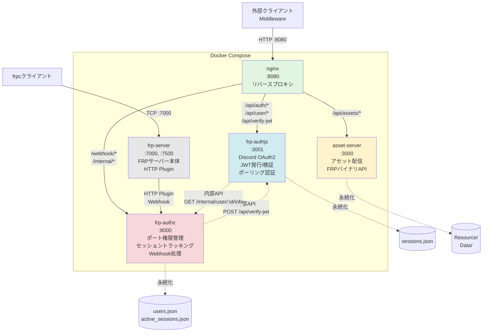
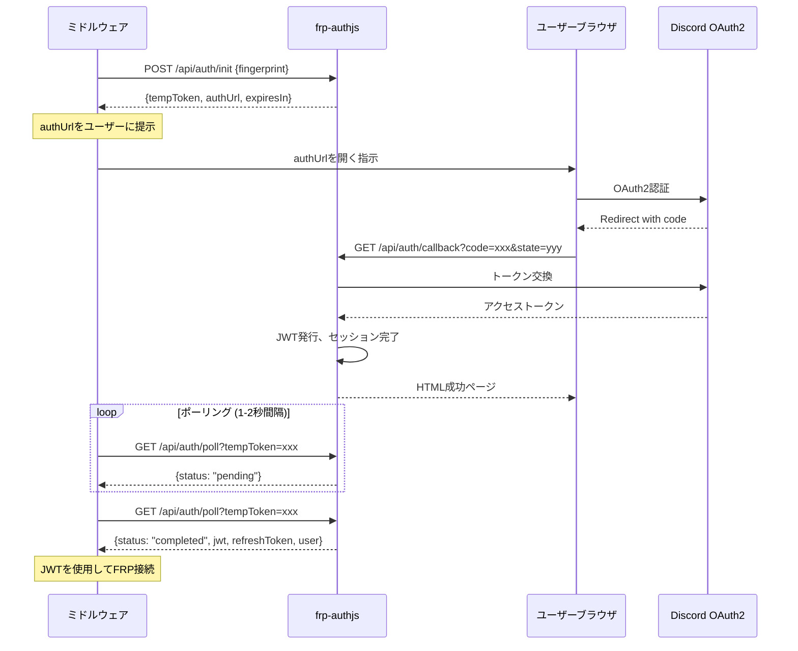
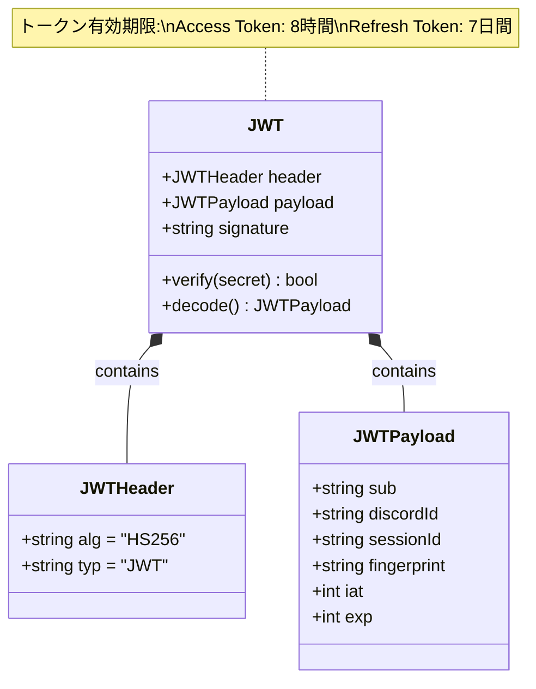
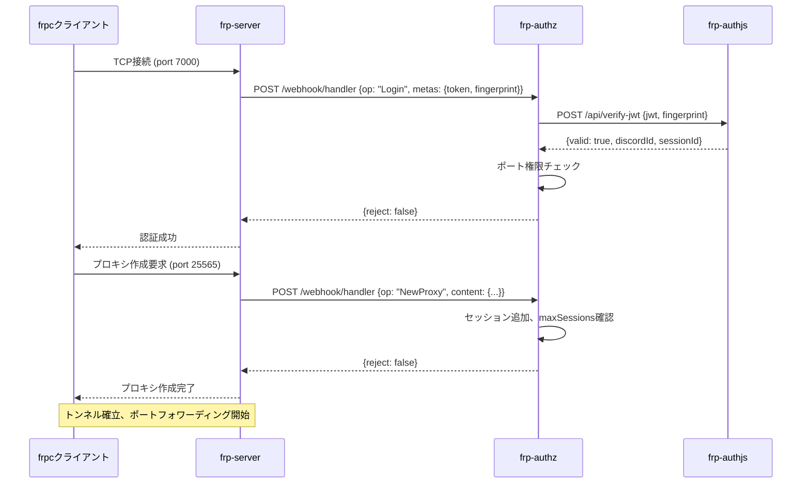
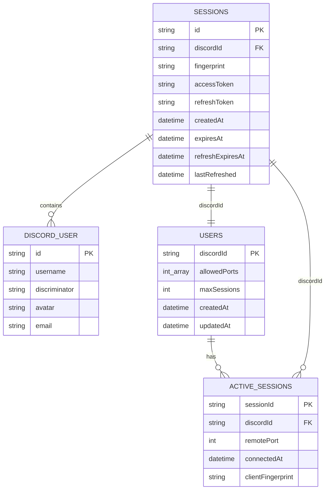
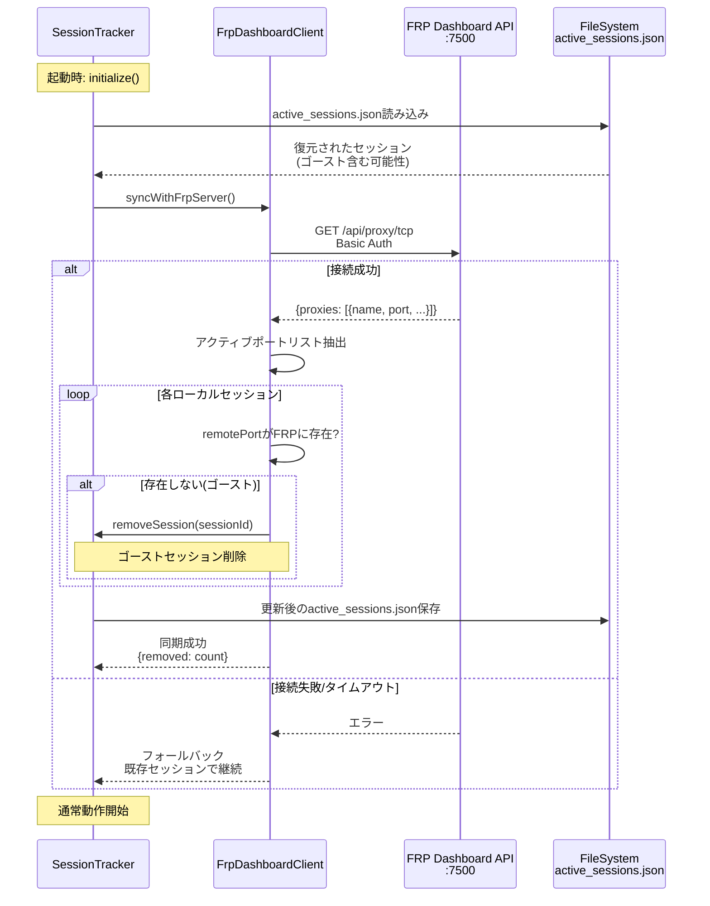

# FRP認証システム - アーキテクチャ設計書

**バージョン:** v3.2.0  
**最終更新:** 2025-12-04

---

## 🏗️ システム概要

Discord OAuth2で認証したユーザーに対してFRP (Fast Reverse Proxy) の利用権限を与えるマイクロサービスアーキテクチャです。

### 設計原則

1. **マイクロサービス**: 関心事の分離（認証/認可/プロキシ）
2. **API-First**: すべてJSON APIとして設計
3. **ステートレス**: セッション情報はファイル永続化
4. **非同期認証**: ポーリングベースでミドルウェア対応
5. **軽量**: 最小限の依存関係（Arctic, Express）

---

## 📦 コンテナ構成



### コンテナ詳細

| コンテナ | 役割 | 技術スタック | 永続化 |
|---------|------|-------------|--------|
| **nginx** | リバースプロキシ | Nginx 1.25+ | なし |
| **asset-server** | アセット配信 | Node.js, Express | AssetServ/ |
| **frp-authjs** | 認証サービス | Node.js, Arctic, Express | frp-authjs/data/ |
| **frp-authz** | 認可サービス | Node.js, Express | frp-authz/data/ |
| **frp-server** | FRPサーバー | FRP v0.65.0, HTTP Plugin | なし |

---

## 🌐 ネットワークルーティング

### Nginxルーティングマップ

```nginx
location /api/auth/ {
    proxy_pass http://frp-authjs:3000/api/auth/;
}

location /api/user/ {
    proxy_pass http://frp-authjs:3000/api/user/;
}

location /api/verify-jwt {
    proxy_pass http://frp-authjs:3000/api/verify-jwt;
}

location /api/assets/ {
    proxy_pass http://asset-server:3000/;
}

location /api/frp/ {
    # レガシー互換パス
    rewrite ^/api/frp/(.*)$ /api/$1 break;
    proxy_pass http://frp-authjs:3000;
}

location /auth/ {
    proxy_pass http://frp-authjs:3000/;
}
```

### 内部通信フロー

```
[External Client]
      │
      ├──► GET /api/auth/poll
      │        │
      │        └──► [nginx:8080]
      │                  │
      │                  └──► [frp-authjs:3000]
      │
      └──► POST /webhook/handler (FRP server only)
               │
               └──► [nginx:8080]
                        │
                        └──► [frp-authz:3001]
                                  │
                                  └──► POST /api/verify-jwt
                                            │
                                            └──► [frp-authjs:3000]
```

---

## 🔐 認証フロー詳細

### ポーリングベース認証シーケンス



### JWT構造



**トークン構造例:**
```json
{
  "header": {
    "alg": "HS256",
    "typ": "JWT"
  },
  "payload": {
    "sub": "123456789012345678",
    "discordId": "123456789012345678",
    "sessionId": "session_abc123",
    "fingerprint": "sha256_hex",
    "iat": 1733299200,
    "exp": 1733327999
  },
  "signature": "..."
}
```

---

## 🔒 FRP接続フロー

### プロキシ作成シーケンス



### frpc設定例

```toml
serverAddr = "localhost"
serverPort = 7000

auth.method = "token"
auth.token = "eyJhbGciOiJIUzI1NiIsInR5cCI6IkpXVCJ9..."

[[proxies]]
name = "minecraft-server"
type = "tcp"
localIP = "127.0.0.1"
localPort = 25565
remotePort = 25565

[proxies.metadatas]
token = "eyJhbGciOiJIUzI1NiIsInR5cCI6IkpXVCJ9..."
fingerprint = "sha256_hex_string"
```

**重要:** `auth.token`と`proxies.metadatas.token`の両方にJWTを設定

---

## 💾 データ永続化

### ファイル構造

```
backend/Docker/
├── frp-authjs/data/
│   └── sessions.json          # JWT認証セッション
├── frp-authz/data/
│   ├── users.json              # ユーザー権限定義
│   └── active_sessions.json    # アクティブFRPセッション
└── AssetServ/
    ├── Resource/               # アセットファイル
    └── Data/                   # データベース
```

### データモデル関係図



### sessions.json (frp-authjs)

```json
{
  "sessions": [
    {
      "id": "session_abc123",
      "discordId": "123456789012345678",
      "fingerprint": "sha256_hex",
      "accessToken": "eyJhbGciOiJIUzI1NiIsInR5cCI6IkpXVCJ9...",
      "refreshToken": "refresh_abc123",
      "discordUser": {
        "id": "123456789012345678",
        "username": "username",
        "discriminator": "0000",
        "avatar": "abc123",
        "email": "user@example.com"
      },
      "createdAt": "2025-12-04T10:00:00.000Z",
      "expiresAt": "2025-12-04T18:00:00.000Z",
      "refreshExpiresAt": "2025-12-11T10:00:00.000Z",
      "lastRefreshed": "2025-12-04T10:00:00.000Z"
    }
  ],
  "lastSaved": "2025-12-04T10:05:00.000Z"
}
```

### users.json (frp-authz)

```json
{
  "users": [
    {
      "discordId": "123456789012345678",
      "allowedPorts": [25565, 22, 3000, 8080],
      "maxSessions": 3,
      "createdAt": "2025-12-01T00:00:00.000Z",
      "updatedAt": "2025-12-04T10:00:00.000Z"
    }
  ]
}
```

**自動リロード:** ファイル変更を60秒ごとに検知

### active_sessions.json (frp-authz)

```json
{
  "sessions": [
    {
      "sessionId": "frp_session_123",
      "discordId": "123456789012345678",
      "remotePort": 25565,
      "connectedAt": "2025-12-04T10:00:00.000Z",
      "clientFingerprint": "sha256_hex"
    }
  ],
  "lastSaved": "2025-12-04T10:05:00.000Z"
}
```

**保存タイミング:**
- セッション追加/削除時（5秒デバウンス）
- 起動時の同期後
- 定期クリーンアップ後

---

## 🔄 ゴーストセッション同期

### 問題

```
docker-compose restart
    ↓
FRPサーバー/クライアント: セッションクリア
frp-authz: 永続ファイルから古いセッション復元
    ↓
実際には存在しないセッションでmaxSessions枠が埋まる
    ↓
新規接続が「Max sessions exceeded」で拒否される
```

### 解決策: FRP Dashboard API同期



**実装:** `frp-authz/src/services/frpDashboardClient.ts`

**同期タイミング:**
- `sessionTracker.initialize()`実行時（起動時のみ）

**同期ロジック:**
1. FRP Dashboard API (`/api/proxy/tcp`) からアクティブポートリストを取得
2. ローカルストレージの各セッションをチェック
3. FRPに存在しないポートのセッションを削除（ゴーストセッション）
4. 更新後の状態をファイル保存

**環境変数:**
```env
FRP_DASHBOARD_URL=http://frp-server:7500
FRP_DASHBOARD_USER=admin
FRP_DASHBOARD_PASS=admin
```

**エラーハンドリング:**
- 接続失敗時: フォールバック（既存セッションで起動継続）
- タイムアウト: 5秒

---

## 🔧 環境変数

### 必須変数

| 変数 | 説明 | 例 |
|-----|------|-----|
| `JWT_SECRET` | JWT署名鍵 | `openssl rand -base64 32` |
| `DISCORD_CLIENT_ID` | Discord OAuth2 Client ID | `123456789012345678` |
| `DISCORD_CLIENT_SECRET` | Discord OAuth2 Secret | `abc123...` |
| `DISCORD_REDIRECT_URI` | OAuth2リダイレクトURI | `http://localhost:8080/api/auth/callback` |
| `BASE_URL` | ベースURL | `http://localhost:8080` |

### オプション変数

| 変数 | デフォルト | 説明 |
|-----|----------|------|
| `FRP_VERSION` | `0.65.0` | FRPバイナリバージョン |
| `FRP_DASHBOARD_URL` | `http://frp-server:7500` | FRP Dashboard URL |
| `FRP_DASHBOARD_USER` | `admin` | Dashboard認証ユーザー |
| `FRP_DASHBOARD_PASS` | `admin` | Dashboard認証パスワード |
| `NODE_ENV` | `development` | 環境（development/production） |

---

## 📊 パフォーマンス特性

### レイテンシ

| 操作 | 平均 | P95 | 説明 |
|-----|------|-----|------|
| 認証初期化 | 10ms | 20ms | POST /api/auth/init |
| ポーリング | 5ms | 15ms | GET /api/auth/poll |
| JWT検証 | 2ms | 5ms | POST /api/verify-jwt |
| FRP接続確立 | 50ms | 100ms | Webhook処理含む |

### スループット

- **認証API**: 1000 req/s
- **JWT検証**: 5000 req/s
- **同時FRP接続**: 1000+ connections

### リソース使用量

| コンテナ | CPU (平均) | メモリ (平均) | 備考 |
|---------|-----------|-------------|------|
| nginx | 1% | 10MB | プロキシのみ |
| asset-server | 2% | 50MB | 静的ファイル配信 |
| frp-authjs | 5% | 80MB | JWT処理含む |
| frp-authz | 3% | 60MB | Webhook処理 |
| frp-server | 2% | 30MB | プロキシ数に依存 |

---

## 🛡️ セキュリティ

### 実装済み

✅ Discord OAuth2認証  
✅ JWT署名検証（HS256）  
✅ Fingerprint二要素認証  
✅ トークンリフレッシュローテーション  
✅ ポート権限チェック  
✅ セッション制限（maxSessions）  
✅ 有効期限管理

### 推奨（本番環境）

⚠️ HTTPS/TLS通信の有効化  
⚠️ JWT暗号化（JWE）の導入  
⚠️ Rate Limitingの実装  
⚠️ 監査ログの記録  
⚠️ セキュアなFingerprint生成  
⚠️ CORS設定の厳格化  
⚠️ 環境変数の暗号化管理

---

## 🔌 拡張性

### 水平スケーリング

**現状:** 単一インスタンス

**将来対応:**
- Redis統合でセッション共有
- ロードバランサー追加
- 複数FRPサーバークラスタ

### 垂直スケーリング

**制限要因:**
- Node.js シングルスレッド
- ファイルベース永続化

**改善案:**
- Worker Threads活用
- データベース統合（PostgreSQL/MySQL）

---

## 📈 監視とログ

### ログ出力

```bash
# すべてのコンテナ
docker-compose logs -f

# 特定のサービス
docker-compose logs -f frp-authjs
docker-compose logs -f frp-authz
docker-compose logs -f frp-server
```

### 監視ポイント

1. **ヘルスチェックエンドポイント**
   - `/api/frp/health` (frp-authjs)
   - `/health` (frp-authz)

2. **メトリクス**
   - `pendingAuthentications`: 待機中認証数
   - `activeSessions`: アクティブFRPセッション数
   - `ghostSessionsRemoved`: 同期時の削除数

3. **アラート推奨**
   - ヘルスチェック失敗
   - JWT検証エラー率上昇
   - maxSessions制限到達
   - ゴーストセッション頻発

---

## 🗺️ ディレクトリマップ

```
backend/Docker/
├── docker-compose.yml              # 本番環境設定
├── docker-compose.dev.yml          # 開発環境設定
├── .env.example                    # 環境変数テンプレート
├── docs/                           # ドキュメント
│   ├── 01-QUICK_START.md
│   ├── 02-API_REFERENCE.md
│   ├── 03-ARCHITECTURE.md          # 本ドキュメント
│   └── 04-INTEGRATION_GUIDE.md
├── nginx/
│   └── nginx.conf                  # Nginxルーティング設定
├── asset-server/
│   ├── Dockerfile
│   └── .dockerignore
├── frp-authjs/
│   ├── Dockerfile
│   ├── src/
│   │   ├── index.ts
│   │   ├── config/env.ts
│   │   ├── services/
│   │   │   ├── discordOAuth2Service.ts  # Arctic統合
│   │   │   ├── jwtService.ts
│   │   │   └── sessionManager.ts
│   │   ├── routes/
│   │   │   └── api.ts
│   │   └── types/
│   └── data/                       # 永続化データ
│       └── sessions.json
├── frp-authz/
│   ├── Dockerfile
│   ├── src/
│   │   ├── index.ts
│   │   ├── services/
│   │   │   ├── userManager.ts
│   │   │   ├── sessionTracker.ts
│   │   │   └── frpDashboardClient.ts
│   │   └── routes/
│   │       ├── webhook.ts          # FRP HTTP Plugin
│   │       └── internal.ts         # 内部API
│   └── data/
│       ├── users.json
│       └── active_sessions.json
├── frp-server/
│   ├── Dockerfile
│   └── frps.toml                   # FRP設定
├── AssetServ/                      # Asset Server データ
│   ├── Resource/
│   └── Data/
└── test-client/                    # 統合テストクライアント
    └── README.md
```

---

## 🔗 関連ドキュメント

- **クイックスタート**: [01-QUICK_START.md](./01-QUICK_START.md)
- **APIリファレンス**: [02-API_REFERENCE.md](./02-API_REFERENCE.md)
- **ミドルウェア統合**: [04-INTEGRATION_GUIDE.md](./04-INTEGRATION_GUIDE.md)
- **メインREADME**: [../README.md](../README.md)

---

## 📚 技術スタック

| レイヤー | 技術 | バージョン |
|---------|------|----------|
| **Proxy** | Nginx | 1.25+ |
| **Runtime** | Node.js | 20 LTS |
| **Framework** | Express | 4.19+ |
| **Auth** | Arctic | 1.9+ |
| **FRP** | FRP | 0.65.0 |
| **Container** | Docker / Docker Compose | 20.10+ / 2.0+ |
