# FRP認証システム - ミドルウェア統合ガイド

**対象読者:** フロントエンドミドルウェア開発者  
**前提知識:** Node.js, TypeScript, Express

---

## 📋 概要

このガイドでは、`backend/Docker`のFRP認証システムを`frontend/middleware/main`に統合する手順を説明します。

### 統合後の機能

✅ Discord OAuth2認証  
✅ FRP接続の管理（作成/停止/一覧）  
✅ JWT自動リフレッシュ  
✅ セッション永続化  
✅ ログ管理  
✅ マルチプラットフォーム対応バイナリ自動ダウンロード

---

## 🏗️ 統合アーキテクチャ

```mermaid
graph TD
    MW[Frontend Middleware<br/>FRP Manager統合]
    Nginx[Nginx<br/>:8080]
    
    AuthJS[frp-authjs<br/>認証サービス]
    Asset[asset-server<br/>バイナリ配信]
    AuthZ[frp-authz<br/>認可サービス]
    FRPSrv[frp-server<br/>プロキシサーバー]
    
    MW -->|GET /api/auth/init<br/>GET /api/auth/poll<br/>POST /api/auth/refresh| Nginx
    MW -->|GET /api/assets/frp/client-binary| Nginx
    MW -->|frpc TCP接続| FRPSrv
    
    Nginx -->|/api/auth/*| AuthJS
    Nginx -->|/api/assets/*| Asset
    Nginx -->|/webhook/*| AuthZ
    
    FRPSrv -->|HTTP Plugin<br/>Webhook| AuthZ
    AuthZ -.->|内部API| AuthJS
    
    style MW fill:#e1f5e1
    style Nginx fill:#fff3cd
    style AuthJS fill:#d1ecf1
    style Asset fill:#ffeaa7
    style AuthZ fill:#f8d7da
```



---

## 📦 Phase 1: FRP Managerライブラリの実装

### ファイル構造

```
frontend/middleware/main/lib/
└── frp-manager/
    ├── src/
    │   ├── Main.ts                # FrpManagerAPP（メインクラス）
    │   ├── AuthSessionManager.ts  # 認証管理
    │   ├── FrpProcessManager.ts   # frpcプロセス管理
    │   ├── FrpBinaryManager.ts    # バイナリダウンロード
    │   ├── FrpLogService.ts       # ログ管理
    │   ├── SessionStore.ts        # セッション永続化
    │   ├── config.ts              # 設定管理
    │   └── types.ts               # 型定義
    ├── tests/
    │   └── *.test.ts
    ├── package.json
    └── README.md
```

### FRP Managerライブラリ全体クラス図


### config.ts の実装

```typescript
// frontend/middleware/main/lib/frp-manager/src/config.ts

import path from "path";
import os from "os";
import { BinaryDownloadTarget, FrpManagerConfig } from "./types";

function resolveDataDir(): string {
  if (process.env.FRP_DATA_DIR) {
    return path.resolve(process.env.FRP_DATA_DIR);
  }
  return path.join(process.cwd(), "userdata", "frp");
}

function resolveDownloadTargets(baseUrl: string): BinaryDownloadTarget[] {
  const targets: BinaryDownloadTarget[] = [];

  // Linux amd64
  targets.push({
    platform: "linux",
    arch: "x64",
    url: process.env.FRPC_DOWNLOAD_URL_LINUX_X64 || 
         `${baseUrl}/client-binary?platform=linux&arch=amd64`,
    fileName: "frpc",
  });

  // Linux arm64
  targets.push({
    platform: "linux",
    arch: "arm64",
    url: process.env.FRPC_DOWNLOAD_URL_LINUX_ARM64 || 
         `${baseUrl}/client-binary?platform=linux&arch=arm64`,
    fileName: "frpc",
  });

  // macOS amd64
  targets.push({
    platform: "darwin",
    arch: "x64",
    url: process.env.FRPC_DOWNLOAD_URL_DARWIN_X64 || 
         `${baseUrl}/client-binary?platform=darwin&arch=amd64`,
    fileName: "frpc",
  });

  // macOS arm64
  targets.push({
    platform: "darwin",
    arch: "arm64",
    url: process.env.FRPC_DOWNLOAD_URL_DARWIN_ARM64 || 
         `${baseUrl}/client-binary?platform=darwin&arch=arm64`,
    fileName: "frpc",
  });

  // Windows amd64
  targets.push({
    platform: "win32",
    arch: "x64",
    url: process.env.FRPC_DOWNLOAD_URL_WINDOWS_X64 || 
         `${baseUrl}/client-binary?platform=windows&arch=amd64`,
    fileName: "frpc.exe",
  });

  // Windows arm64
  targets.push({
    platform: "win32",
    arch: "arm64",
    url: process.env.FRPC_DOWNLOAD_URL_WINDOWS_ARM64 || 
         `${baseUrl}/client-binary?platform=windows&arch=arm64`,
    fileName: "frpc.exe",
  });

  return targets;
}

export function loadFrpManagerConfig(): FrpManagerConfig {
  const dataDir = resolveDataDir();
  const binaryDir = path.join(dataDir, "bin");
  const configDir = path.join(dataDir, "configs");
  const logsDir = path.join(dataDir, "logs");

  const baseAssetUrl =
    process.env.FRP_BINARY_BASE_URL || "http://localhost:8080/api/assets/frp";

  return {
    authServerUrl: process.env.FRP_AUTH_SERVER_URL || "http://localhost:8080",
    frpServerAddr: process.env.FRP_SERVER_ADDR || "127.0.0.1",
    frpServerPort: Number(process.env.FRP_SERVER_PORT || 7000),
    jwtRefreshIntervalHours: Number(process.env.FRP_JWT_REFRESH_INTERVAL_HOURS || 6),
    jwtRefreshMarginMinutes: Number(process.env.FRP_JWT_REFRESH_MARGIN_MINUTES || 5),
    authPollIntervalMs: Number(process.env.FRP_AUTH_POLL_INTERVAL_MS || 1000),
    dataDir,
    binaryDir,
    configDir,
    logsDir,
    sessionsFile: path.join(dataDir, "sessions.json"),
    binaryVersion: process.env.FRPC_VERSION || "1.0.0",
    downloadTargets: resolveDownloadTargets(baseAssetUrl),
    logRetention: {
      maxLines: Number(process.env.FRP_LOG_MAX_LINES || 400),
      maxBytes: Number(process.env.FRP_LOG_MAX_BYTES || 5 * 1024 * 1024),
      rotateLimit: Number(process.env.FRP_LOG_ROTATE_LIMIT || 5),
    },
  };
}
```

### FrpBinaryManager.ts の実装

```mermaid
sequenceDiagram
    participant APP as FrpManagerAPP
    participant BM as FrpBinaryManager
    participant FS as FileSystem
    participant AS as Asset Server API
    participant GH as GitHub Releases
    
    APP->>BM: ensureBinary()
    BM->>BM: resolveTargetForHost()<br/>(OS/arch判定)
    BM->>FS: Check binary exists?
    
    alt Binary exists
        FS-->>BM: バイナリパス返却
        BM-->>APP: 既存バイナリパス
    else Binary not found
        BM->>AS: GET /api/assets/frp/client-binary<br/>?platform=xxx&arch=xxx
        
        alt API成功
            AS-->>BM: {downloadUrl, version, ...}
            BM->>GH: GET downloadUrl<br/>(frp_x.x.x_platform_arch.tar.gz)
            GH-->>BM: Binary Stream
        else API失敗
            BM->>BM: フォールバックURL使用
            BM->>GH: GET fallback URL
            GH-->>BM: Binary Stream
        end
        
        BM->>FS: Write binary + chmod 755
        BM->>FS: Write metadata.json
        BM-->>APP: 新規バイナリパス
    end
```



**実装コード例:**

```typescript
// frontend/middleware/main/lib/frp-manager/src/FrpBinaryManager.ts

import axios from "axios";
import fs from "fs/promises";
import path from "path";
import { createWriteStream } from "fs";
import { FrpManagerConfig } from "./types";
import { resolveTargetForHost } from "./config";

interface FrpBinaryInfo {
  downloadUrl: string;
  version: string;
  platform: string;
  arch: string;
  binaryName: string;
  archivePath?: string;
}

export class FrpBinaryManager {
  private config: FrpManagerConfig;
  private metadataPath: string;

  constructor(config: FrpManagerConfig) {
    this.config = config;
    this.metadataPath = path.join(config.binaryDir, "metadata.json");
  }

  async ensureBinary(): Promise<string> {
    const target = resolveTargetForHost(this.config);
    await fs.mkdir(this.config.binaryDir, { recursive: true });

    const binaryName = target.fileName || `frpc-${target.platform}-${target.arch}`;
    const binaryPath = path.join(this.config.binaryDir, binaryName);

    if (await this.needsDownload(binaryPath)) {
      // Try to get download URL from Asset Server API
      let downloadUrl = target.url;
      try {
        const binaryInfo = await this.fetchBinaryInfo();
        if (binaryInfo?.downloadUrl) {
          downloadUrl = binaryInfo.downloadUrl;
        }
      } catch (error) {
        console.warn("Failed to fetch binary info from Asset Server, using fallback URL:", error);
      }

      await this.downloadBinary(downloadUrl, binaryPath);
      await fs.chmod(binaryPath, 0o755);
      await this.writeMetadata({
        version: this.config.binaryVersion,
        installedAt: new Date().toISOString(),
        platform: target.platform,
        arch: target.arch,
      });
    }

    return binaryPath;
  }

  private async fetchBinaryInfo(): Promise<FrpBinaryInfo | null> {
    try {
      const target = resolveTargetForHost(this.config);
      const baseUrl = target.url.replace(/\/[^/]+$/, "");

      const response = await axios.get(`${baseUrl}/client-binary`, {
        timeout: 5000,
      });

      if (response.data?.success && response.data?.data) {
        return response.data.data;
      }
      return null;
    } catch (error) {
      console.error("Error fetching binary info:", error);
      return null;
    }
  }

  private async downloadBinary(url: string, destPath: string): Promise<void> {
    console.log(`Downloading FRP binary from ${url}...`);
    const response = await axios.get(url, {
      responseType: "stream",
      timeout: 30000,
    });

    const writer = createWriteStream(destPath);
    response.data.pipe(writer);

    return new Promise((resolve, reject) => {
      writer.on("finish", resolve);
      writer.on("error", reject);
    });
  }

  private async needsDownload(binaryPath: string): Promise<boolean> {
    try {
      await fs.access(binaryPath);
      return false; // Binary exists
    } catch {
      return true; // Binary does not exist
    }
  }

  private async writeMetadata(metadata: any): Promise<void> {
    await fs.writeFile(this.metadataPath, JSON.stringify(metadata, null, 2));
  }
}
```

### Main.ts の実装（FrpManagerAPP）

```typescript
// frontend/middleware/main/lib/frp-manager/src/Main.ts

import { EventEmitter } from "events";
import { FrpManagerConfig } from "./types";
import { loadFrpManagerConfig } from "./config";
import { FrpBinaryManager } from "./FrpBinaryManager";
import { AuthSessionManager } from "./AuthSessionManager";
import { FrpProcessManager } from "./FrpProcessManager";
import { FrpLogService } from "./FrpLogService";
import { SessionStore } from "./SessionStore";

export class FrpManagerAPP extends EventEmitter {
  private config: FrpManagerConfig;
  private binaryManager: FrpBinaryManager;
  private authManager: AuthSessionManager;
  private processManager: FrpProcessManager;
  private logService: FrpLogService;
  private sessionStore: SessionStore;
  private binaryPath: string | null = null;

  constructor(config?: Partial<FrpManagerConfig>) {
    super();
    this.config = config ? { ...loadFrpManagerConfig(), ...config } : loadFrpManagerConfig();
    this.binaryManager = new FrpBinaryManager(this.config);
    this.authManager = new AuthSessionManager(this.config);
    this.logService = new FrpLogService(this.config);
    this.sessionStore = new SessionStore(this.config);
    this.processManager = new FrpProcessManager(this.config, this.logService);
  }

  async initialize(): Promise<void> {
    console.log("Initializing FRP Manager...");
    
    // Ensure binary is available
    this.binaryPath = await this.binaryManager.ensureBinary();
    console.log(`FRP binary ready at: ${this.binaryPath}`);

    // Load saved sessions
    await this.sessionStore.load();
    console.log("Session store loaded");

    // Setup event listeners
    this.setupEventListeners();

    console.log("FRP Manager initialized successfully");
  }

  /**
   * Start Discord OAuth2 authentication flow
   */
  async startAuth(fingerprint: string): Promise<{
    tempToken: string;
    authUrl: string;
    expiresIn: number;
  }> {
    return await this.authManager.initAuth(fingerprint);
  }

  /**
   * Poll for authentication status
   */
  async pollAuth(tempToken: string): Promise<any> {
    return await this.authManager.pollAuth(tempToken);
  }

  /**
   * Create a new FRP connection
   */
  async createConnection(
    discordUserId: string,
    localPort: number,
    remotePort: number
  ): Promise<any> {
    if (!this.binaryPath) {
      throw new Error("FRP binary not initialized");
    }

    const authSession = this.authManager.getSession(discordUserId);
    if (!authSession) {
      throw new Error("User not authenticated");
    }

    const connection = await this.processManager.startConnection({
      binaryPath: this.binaryPath,
      jwt: authSession.jwt,
      fingerprint: authSession.fingerprint,
      localPort,
      remotePort,
      serverAddr: this.config.frpServerAddr,
      serverPort: this.config.frpServerPort,
    });

    this.emit("connection:created", connection);
    return connection;
  }

  /**
   * Stop an FRP connection
   */
  async stopConnection(connectionId: string): Promise<void> {
    await this.processManager.stopConnection(connectionId);
    this.emit("connection:stopped", connectionId);
  }

  /**
   * Get all active connections
   */
  getActiveConnections(): any[] {
    return this.processManager.getActiveConnections();
  }

  /**
   * Get logs for a specific connection
   */
  async getLogs(connectionId: string, lines: number = 100): Promise<string[]> {
    return await this.logService.tail(connectionId, lines);
  }

  private setupEventListeners(): void {
    this.processManager.on("connection:started", (conn) => {
      this.emit("connection:started", conn);
    });

    this.processManager.on("connection:error", (conn, error) => {
      this.emit("connection:error", conn, error);
    });

    this.processManager.on("connection:stopped", (conn) => {
      this.emit("connection:stopped", conn);
    });
  }
}
```

---

## 🔌 Phase 2: APIルーターの追加

### api-router.ts への統合

```typescript
// frontend/middleware/main/lib/api-router.ts に追加

import { FrpManagerAPP } from './frp-manager/src/Main';
import express from 'express';

export class FrpManagerRoute {
  public router: express.Router;
  private frpManager: FrpManagerAPP;

  constructor(authMiddleware: express.RequestHandler, frpManager: FrpManagerAPP) {
    this.router = express.Router();
    this.frpManager = frpManager;
    this.setupRoutes(authMiddleware);
  }

  private setupRoutes(authMiddleware: express.RequestHandler): void {
    // 認証開始
    this.router.post('/auth/start', authMiddleware, async (req, res) => {
      try {
        const { fingerprint } = req.body;
        if (!fingerprint) {
          return res.status(400).json({ error: 'Fingerprint is required' });
        }

        const result = await this.frpManager.startAuth(fingerprint);
        res.json(result);
      } catch (error: any) {
        res.status(500).json({ error: error.message });
      }
    });

    // 認証ポーリング
    this.router.get('/auth/poll', authMiddleware, async (req, res) => {
      try {
        const { tempToken } = req.query;
        if (!tempToken || typeof tempToken !== 'string') {
          return res.status(400).json({ error: 'tempToken is required' });
        }

        const result = await this.frpManager.pollAuth(tempToken);
        res.json(result);
      } catch (error: any) {
        res.status(500).json({ error: error.message });
      }
    });

    // FRP接続作成
    this.router.post('/connections', authMiddleware, async (req, res) => {
      try {
        const { discordUserId, localPort, remotePort } = req.body;
        const connection = await this.frpManager.createConnection(
          discordUserId,
          localPort,
          remotePort
        );
        res.json(connection);
      } catch (error: any) {
        res.status(500).json({ error: error.message });
      }
    });

    // FRP接続停止
    this.router.delete('/connections/:id', authMiddleware, async (req, res) => {
      try {
        await this.frpManager.stopConnection(req.params.id);
        res.json({ success: true });
      } catch (error: any) {
        res.status(500).json({ error: error.message });
      }
    });

    // アクティブ接続一覧
    this.router.get('/connections', authMiddleware, async (req, res) => {
      try {
        const connections = this.frpManager.getActiveConnections();
        res.json(connections);
      } catch (error: any) {
        res.status(500).json({ error: error.message });
      }
    });

    // ログ取得
    this.router.get('/logs/:connectionId', authMiddleware, async (req, res) => {
      try {
        const { connectionId } = req.params;
        const lines = Number(req.query.lines) || 100;
        const logs = await this.frpManager.getLogs(connectionId, lines);
        res.json({ logs });
      } catch (error: any) {
        res.status(500).json({ error: error.message });
      }
    });
  }
}
```

---

## 🚀 Phase 3: index.ts への統合

```typescript
// frontend/middleware/main/index.ts の main() 関数内に追加

import { FrpManagerAPP } from './lib/frp-manager/src/Main';
import { FrpManagerRoute } from './lib/api-router';

async function main() {
  // ... 既存のセットアップ ...

  // FRP Manager のセットアップ
  const frpManager = new FrpManagerAPP();
  await frpManager.initialize();

  const frpRouter = new FrpManagerRoute(middlewareManager.authMiddleware, frpManager);
  app.use('/api/frp', frpRouter.router);

  log.info('FRP Manager initialized');

  // ... 残りのセットアップ ...
}
```

---

## ⚙️ Phase 4: 環境変数設定

### .env ファイル

```env
# FRP Manager Configuration
FRP_AUTH_SERVER_URL=http://localhost:8080
FRP_SERVER_ADDR=localhost
FRP_SERVER_PORT=7000
FRP_BINARY_BASE_URL=http://localhost:8080/api/assets/frp
FRP_DATA_DIR=./userdata/frp

# JWT Refresh Settings
FRP_JWT_REFRESH_INTERVAL_HOURS=6
FRP_JWT_REFRESH_MARGIN_MINUTES=5

# Polling Settings
FRP_AUTH_POLL_INTERVAL_MS=1000

# Log Settings
FRP_LOG_MAX_LINES=400
FRP_LOG_MAX_BYTES=5242880
FRP_LOG_ROTATE_LIMIT=5
```

---

## 🌐 Phase 5: フロントエンド実装例

### React/Next.js クライアント

```typescript
// フロントエンドコンポーネント例

import { useState } from 'react';

function FrpConnectionManager() {
  const [authUrl, setAuthUrl] = useState<string>('');
  const [tempToken, setTempToken] = useState<string>('');
  const [authenticated, setAuthenticated] = useState(false);
  const [connections, setConnections] = useState<any[]>([]);

  // 1. 認証開始
  async function startAuth() {
    const fingerprint = generateFingerprint();
    const res = await fetch('/api/frp/auth/start', {
      method: 'POST',
      headers: { 'Content-Type': 'application/json' },
      body: JSON.stringify({ fingerprint }),
    });
    const data = await res.json();
    setAuthUrl(data.authUrl);
    setTempToken(data.tempToken);
    
    // Discord認証ページを開く
    window.open(data.authUrl, '_blank');
    
    // ポーリング開始
    startPolling(data.tempToken);
  }

  // 2. ポーリング
  async function startPolling(token: string) {
    const interval = setInterval(async () => {
      const res = await fetch(`/api/frp/auth/poll?tempToken=${token}`);
      const data = await res.json();
      
      if (data.status === 'completed') {
        clearInterval(interval);
        setAuthenticated(true);
        alert('認証成功！');
      } else if (data.status === 'expired') {
        clearInterval(interval);
        alert('認証タイムアウト');
      }
    }, 2000); // 2秒ごと
  }

  // 3. FRP接続作成
  async function createConnection() {
    const res = await fetch('/api/frp/connections', {
      method: 'POST',
      headers: { 'Content-Type': 'application/json' },
      body: JSON.stringify({
        discordUserId: 'YOUR_DISCORD_ID',
        localPort: 25565,
        remotePort: 25565,
      }),
    });
    const connection = await res.json();
    setConnections([...connections, connection]);
  }

  // 4. 接続停止
  async function stopConnection(id: string) {
    await fetch(`/api/frp/connections/${id}`, { method: 'DELETE' });
    setConnections(connections.filter(c => c.id !== id));
  }

  return (
    <div>
      <h1>FRP Connection Manager</h1>
      
      {!authenticated && (
        <button onClick={startAuth}>Discord認証</button>
      )}

      {authenticated && (
        <>
          <button onClick={createConnection}>FRP接続作成</button>
          <ul>
            {connections.map(conn => (
              <li key={conn.id}>
                {conn.localPort} → {conn.remotePort}
                <button onClick={() => stopConnection(conn.id)}>停止</button>
              </li>
            ))}
          </ul>
        </>
      )}
    </div>
  );
}

function generateFingerprint(): string {
  // ブラウザ情報からfingerprintを生成
  const components = [
    navigator.userAgent,
    navigator.language,
    screen.colorDepth,
    new Date().getTimezoneOffset()
  ];
  return btoa(components.join('|'));
}
```

---

## ✅ テストシナリオ

### 1. 正常系: 認証からFRP接続まで

```bash
# 1. 認証開始
curl -X POST http://localhost:3000/api/frp/auth/start \
  -H "Content-Type: application/json" \
  -d '{"fingerprint":"test_fingerprint_123"}'

# 2. ブラウザでauthUrlを開いてDiscord認証

# 3. ポーリング
curl "http://localhost:3000/api/frp/auth/poll?tempToken=TEMP_TOKEN"

# 4. FRP接続作成
curl -X POST http://localhost:3000/api/frp/connections \
  -H "Content-Type: application/json" \
  -d '{
    "discordUserId":"YOUR_DISCORD_ID",
    "localPort":25565,
    "remotePort":25565
  }'

# 5. 接続一覧確認
curl http://localhost:3000/api/frp/connections

# 6. ログ確認
curl "http://localhost:3000/api/frp/logs/CONNECTION_ID?lines=50"
```

---

## 🔒 セキュリティ考慮事項

### Fingerprint生成のベストプラクティス

```typescript
import crypto from 'crypto';

// サーバーサイド（Node.js）
function generateServerFingerprint(req: express.Request): string {
  const components = [
    req.headers['user-agent'] || '',
    req.headers['accept-language'] || '',
    req.connection.remoteAddress || '',
  ];
  return crypto.createHash('sha256').update(components.join('|')).digest('hex');
}

// クライアントサイド（ブラウザ）
async function generateClientFingerprint(): Promise<string> {
  const components = [
    navigator.userAgent,
    navigator.language,
    screen.colorDepth,
    screen.width + 'x' + screen.height,
    new Date().getTimezoneOffset(),
    navigator.hardwareConcurrency || 0,
  ];
  
  const raw = components.join('|');
  const encoder = new TextEncoder();
  const data = encoder.encode(raw);
  const hashBuffer = await crypto.subtle.digest('SHA-256', data);
  const hashArray = Array.from(new Uint8Array(hashBuffer));
  return hashArray.map(b => b.toString(16).padStart(2, '0')).join('');
}
```

---

## 📚 関連ドキュメント

- **クイックスタート**: [01-QUICK_START.md](./01-QUICK_START.md)
- **APIリファレンス**: [02-API_REFERENCE.md](./02-API_REFERENCE.md)
- **システム構成**: [03-ARCHITECTURE.md](./03-ARCHITECTURE.md)

---

## 🎯 実装チェックリスト

- [ ] FRP Managerライブラリの実装
- [ ] APIルーターの追加
- [ ] index.tsへの統合
- [ ] 環境変数の設定
- [ ] フロントエンドUIの実装
- [ ] 認証フローのテスト
- [ ] FRP接続のテスト
- [ ] エラーハンドリングの確認
- [ ] ログ機能の動作確認
- [ ] 本番環境設定の準備
