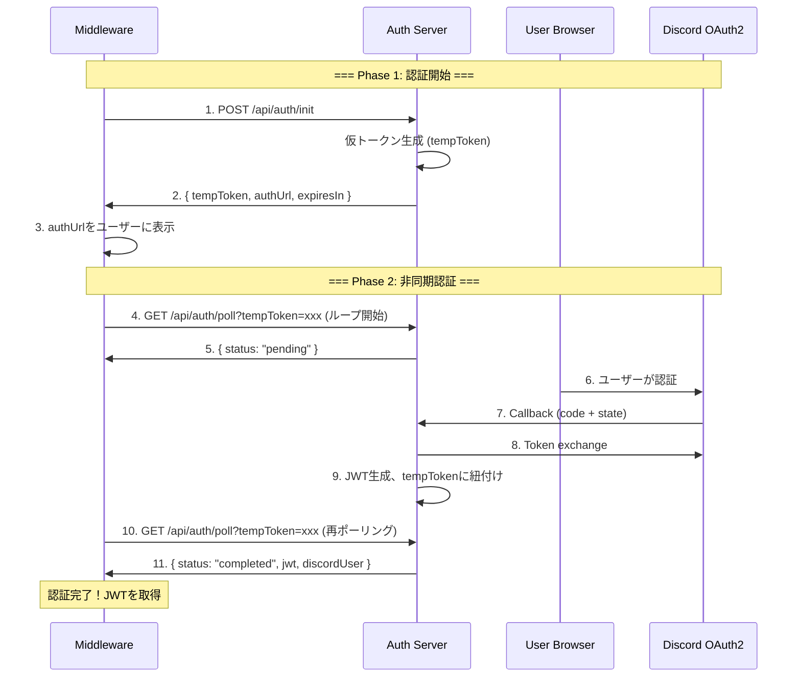

# ポーリングベース認証フロー設計書

**作成日:** 2025-12-02  
**バージョン:** 3.0.0 (Polling-based Authentication)

---

## 🚨 **現状の問題点**

### 問題 1: ブラウザからミドルウェアへの転送不可

**現在の実装 (Arctic v2.0):**
```
1. ミドルウェア → GET /api/auth/url → 認証URL取得
2. ユーザー → ブラウザで認証 → Discord callback
3. ❌ ブラウザに結果が表示されるが、ミドルウェアに戻せない
```

**問題の本質:**
- OAuth2はブラウザベースのフローが必須
- コールバックURLはブラウザにリダイレクトされる
- ブラウザからミドルウェア（CLIアプリ等）への自動転送は不可能
- クエリパラメータにJWTを載せても、ユーザーが手動でコピペする必要がある

### 問題 2: 非同期性の欠如

- ミドルウェアは認証完了を待機する手段がない
- ユーザーがいつ認証を完了するか不明
- タイムアウト管理が困難

### 問題 3: セッション管理の複雑さ

- 認証開始と完了が別々のリクエスト
- 両者を紐付ける仕組みが不足

---

## ✅ **提案: ポーリングベース認証フロー**

### 概要

**仮トークン + ポーリング方式**で、ミドルウェアが認証完了を非同期に待機できるようにする。

### 新しいフロー



### ステータス遷移

```
[初期状態]
    ↓ POST /api/auth/init
[pending] ← ポーリング中（GET /api/auth/poll → status: "pending"）
    ↓ ユーザーがブラウザで認証完了
[completed] → ポーリング成功（GET /api/auth/poll → status: "completed" + JWT）
    ↓ または
[expired] → タイムアウト（10分経過）
```

---

## 📊 **データ構造設計**

### 1. 仮トークンストア (In-Memory)

```typescript
interface PendingAuth {
  tempToken: string;          // 仮トークン (UUID)
  state: string;              // OAuth2 state (CSRF対策)
  status: "pending" | "completed" | "expired";
  authUrl: string;            // Discord認証URL
  jwt?: string;               // 認証完了後のJWT
  discordUser?: {
    id: string;
    username: string;
    avatar: string;
    discriminator: string;
  };
  fingerprint: string;        // クライアントFingerprint
  createdAt: Date;
  expiresAt: Date;            // 10分後
  completedAt?: Date;
}

// In-Memory Store
const pendingAuths = new Map<string, PendingAuth>();
```

---

## 🔌 **新しいAPIエンドポイント**

### 1. POST /api/auth/init - 認証開始

**リクエスト:**
```json
{
  "fingerprint": "client-fingerprint-hash"
}
```

**レスポンス:**
```json
{
  "tempToken": "550e8400-e29b-41d4-a716-446655440000",
  "authUrl": "https://discord.com/api/oauth2/authorize?...",
  "expiresIn": 600,
  "message": "Open authUrl in browser, then poll /api/auth/poll"
}
```

**処理:**
1. 仮トークン (UUID) を生成
2. OAuth2 state を生成
3. Discord認証URLを生成
4. `pendingAuths` に保存 (status: "pending", expiresAt: 10分後)
5. 仮トークンと認証URLを返却

---

### 2. GET /api/auth/poll - ポーリング

**クエリパラメータ:**
- `tempToken`: 仮トークン

**レスポンス (pending - 認証待機中):**
```json
{
  "status": "pending",
  "message": "Waiting for user authentication..."
}
```

**レスポンス (completed - 認証完了):**
```json
{
  "status": "completed",
  "jwt": "eyJhbGciOiJIUzI1NiIsInR5cCI6IkpXVCJ9...",
  "expiresAt": "2025-12-03T10:00:00Z",
  "discordUser": {
    "id": "123456789012345678",
    "username": "ExampleUser",
    "avatar": "a1b2c3d4e5f6",
    "discriminator": "1234"
  }
}
```

**レスポンス (expired - 期限切れ):**
```json
{
  "status": "expired",
  "message": "Authentication session expired. Please restart."
}
```

**処理:**
1. `tempToken` で `pendingAuths` を検索
2. 存在しない → 404エラー
3. `expiresAt` をチェック → 期限切れなら status: "expired"
4. status が "completed" なら JWT を返却
5. status が "pending" なら待機中を返却

---

### 3. GET /api/auth/callback - Discord コールバック

**クエリパラメータ:**
- `code`: Authorization code
- `state`: OAuth2 state

**処理:**
1. `state` で `pendingAuths` を検索
2. 存在しない → エラー
3. Discord Token Exchange
4. Discord User Info 取得
5. JWT 生成
6. `pendingAuths` の該当エントリを更新:
   - status: "completed"
   - jwt: 生成したJWT
   - discordUser: ユーザー情報
   - completedAt: 現在時刻
7. ブラウザに成功メッセージを表示

**レスポンス (HTML):**
```html
<!DOCTYPE html>
<html>
<head>
  <title>Authentication Successful</title>
</head>
<body>
  <h1>✅ Authentication Successful!</h1>
  <p>You can close this window and return to your application.</p>
</body>
</html>
```

---

## 🕐 **タイムアウト管理**

### クリーンアップロジック

```typescript
// 10分ごとにクリーンアップ
setInterval(() => {
  const now = Date.now();
  for (const [tempToken, auth] of pendingAuths.entries()) {
    if (now > auth.expiresAt.getTime()) {
      // 期限切れエントリを削除
      pendingAuths.delete(tempToken);
      console.log(`Cleaned up expired auth: ${tempToken}`);
    }
  }
}, 10 * 60 * 1000);
```

### 推奨ポーリング間隔

- **クライアント側**: 2秒間隔でポーリング
- **タイムアウト**: 10分 (600秒)
- **最大ポーリング回数**: 300回 (600秒 ÷ 2秒)

---

## 💡 **実装上の利点**

### 1. ミドルウェア完全対応
- CLIアプリ、デスクトップアプリから利用可能
- ブラウザからの転送問題を完全解決

### 2. 非同期処理のサポート
- ユーザーが認証を完了するまで適切に待機
- ポーリングでリアルタイムに状態を確認

### 3. セキュリティ向上
- 仮トークンは10分で自動期限切れ
- CSRF対策 (state パラメータ)
- Fingerprint による端末検証

### 4. スケーラブル
- In-Memory ストアは高速
- 将来的にRedisに移行可能

---

## 🧪 **テストシナリオ**

### シナリオ 1: 正常フロー

```bash
# Step 1: 認証開始
curl -X POST http://localhost:8080/api/auth/init \
  -H "Content-Type: application/json" \
  -d '{"fingerprint": "test-fp-123"}'

# レスポンス:
# {
#   "tempToken": "abc-123",
#   "authUrl": "https://discord.com/...",
#   "expiresIn": 600
# }

# Step 2: ポーリング開始 (status: pending)
curl "http://localhost:8080/api/auth/poll?tempToken=abc-123"

# レスポンス:
# { "status": "pending", "message": "Waiting..." }

# Step 3: ユーザーがブラウザで認証 (手動)

# Step 4: ポーリング継続 (status: completed)
curl "http://localhost:8080/api/auth/poll?tempToken=abc-123"

# レスポンス:
# {
#   "status": "completed",
#   "jwt": "eyJhbG...",
#   "discordUser": {...}
# }
```

### シナリオ 2: タイムアウト

```bash
# 10分間放置
sleep 600

# ポーリング
curl "http://localhost:8080/api/auth/poll?tempToken=abc-123"

# レスポンス:
# { "status": "expired", "message": "Authentication session expired" }
```

---

## 🔄 **Migration from Arctic v2.0**

### 廃止されるエンドポイント
- ❌ `GET /api/auth/url` (replaced by `POST /api/auth/init`)
- ❌ `POST /api/auth/token` (replaced by `GET /api/auth/poll`)

### 新規エンドポイント
- ✅ `POST /api/auth/init` - 認証開始 + 仮トークン発行
- ✅ `GET /api/auth/poll` - ポーリングで認証状態確認
- ✅ `GET /api/auth/callback` - Discord コールバック処理

### 継続使用
- ✅ `POST /api/verify-jwt` - JWT検証 (変更なし)

---

## 📚 **参考実装**

類似のフローを採用している例:
- **GitHub CLI (`gh auth login`)**: Device Flow with polling
- **Google Cloud SDK**: OAuth2 with local callback server
- **AWS CLI**: Browser-based auth with polling
- **Docker Desktop**: OAuth2 with polling mechanism

---

## 🚀 **次のステップ**

1. `pendingAuthManager` サービスの実装
2. API routes の更新 (`/api/auth/init`, `/api/auth/poll`, `/api/auth/callback`)
3. コールバックページ (HTML) の作成
4. ポーリングロジックのテスト
5. ミドルウェア統合サンプルコードの作成
6. ドキュメント更新

---

**この設計により、ミドルウェアから完全に非同期でDiscord OAuth2認証を実現できます！**

