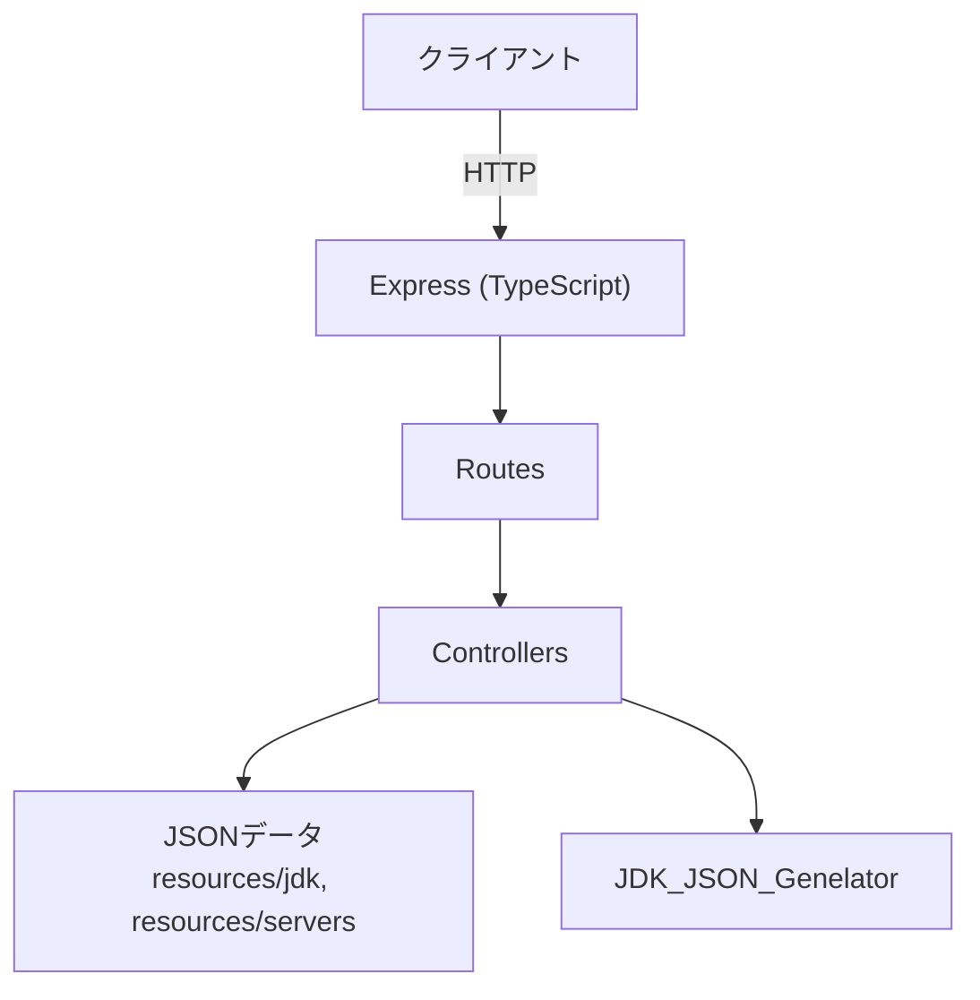

# Backend 運用マニュアル

このBackendは大きく2つの役割を持ちます。

- **Asset Server（REST API + アセット配信）**: Minecraftサーバーソフトウェア情報、JDK情報、配布物（JDK/サーバーJAR）を提供
- **FRP認証システム（Docker Compose）**: Discord OAuth2で認証したユーザーに対して、FRP（Fast Reverse Proxy）で利用可能なポート（権限）と同時接続数（制限）を管理

以降は「運用者がデプロイ/設定/権限管理/障害対応」を行うための手順をまとめます。

---

## Asset Server（REST API + アセット配信）

Minecraft サーバーソフトウェアの情報と JDK バイナリ配布リンクを提供する REST API バックエンドです。実装は Node.js + Express + TypeScript で構成され、`backend/Asset` ディレクトリがエントリーポイントとなります。



## 目的
- Minecraft サーバー配布物や対応 JDK 情報の REST API 提供
- Temurin（Eclipse Adoptium）由来の JDK バイナリリンクの配布
- ヘルスチェックとアセット配信を含むシンプルな API 提供

## プロジェクト構成
- ルート: [`backend/Asset`](./Asset)
- 主要言語/フレームワーク: Node.js, Express, TypeScript
- エントリーポイント: `server.ts`
- アプリ設定: `app.ts`（ルーティング統合）
- 代表的なディレクトリ:
  - `routes/` … API ルート (`health`, `servers`, `jdk`, `assets`)
  - `controllers/` … 各ルートの処理
  - `data/` … `servers.json`, `jdk.json` など公開情報
  - `resources/` … ダウンロード配布物 (JDK バイナリ、サーバー JAR)
  - `JDK_JSON_Genelator/` … GitHub API から最新 JDK 情報を取得
  - `docs/` … API/スキーマ仕様書

## npm スクリプト（`backend/Asset/package.json` より）
| スクリプト | 用途 |
| --- | --- |
| `npm start` | 本番モードでサーバー起動。既存データを利用。 |
| `npm run dev` | 開発モードで起動。JDK 情報の更新と不足バイナリの自動ダウンロードを実行。 |
| `npm run test` | テストモードで起動 (`--test`)。開発モードと同様に JDK 自動セットアップを実行。 |
| `npm run build` | TypeScript をビルド。 |
| `npm run watch` | TypeScript のウォッチビルド。 |

## 環境変数（重要）
`/api/v1/jdk` や `/api/v1/servers` が返す `downloadUrl` は、`BASE_URL` を元に生成されます。Nginx 等のリバースプロキシ配下で動かす場合は、外部公開URLを `BASE_URL` に設定してください。

### `backend/Asset`（単体起動/コンテナ共通）
- `BASE_URL`（推奨）: 例 `http://localhost:3000` / Nginx 経由なら `http://localhost:8080`
- `PORT`（任意）: デフォルト `3000`
- `NODE_ENV`（任意）: `development` のとき自動セットアップ有効（`npm run dev` は自動で設定）
- `FRP_VERSION`（任意）: FRP バイナリ配布API用（未指定なら `0.65.0`）

### `backend/Docker`（Docker Compose 用）
- `backend/Docker/.env.example` を `backend/Docker/.env` にコピーして設定（`docker compose` は同ディレクトリの `.env` を読み込みます）

## 起動手順（ローカル: Node.js）
### 前提
- Node.js `20` 以上（Dockerfile と合わせています）
- 開発/テストモードは外部へのアクセス（GitHub / PaperMC など）と、ファイル書き込み（`backend/Asset/resources`, `backend/Asset/data`）が発生します

### 1) 依存関係インストール
```bash
cd backend/Asset
npm ci
```

### 2) `BASE_URL` を設定（推奨）
`.env` またはシェル環境変数で指定します。

```bash
# 例: ローカル直叩き
export BASE_URL=http://localhost:3000
```

### 3) サーバー起動
- 本番（既存データのみ、ダウンロードなし）: `npm start`
- 開発（JDK/サーバー情報更新 + 不足バイナリ自動DL）: `npm run dev`
- テスト（開発同様 + `--test`）: `npm run test` または `npx ts-node server.ts --test`

### 4) 動作確認
```bash
curl http://localhost:3000/health
curl http://localhost:3000/api/v1/servers
curl http://localhost:3000/api/v1/jdk
```

## 起動手順（Docker Compose: Nginx 経由）
`backend/Docker` 配下には Nginx + Asset Server + FRP 認証系（Discord OAuth2 / JWT / ポート権限）をまとめた `docker-compose.yml` があります。

### 1) 環境変数を用意
```bash
cd backend/Docker
cp .env.example .env
```

#### 必須（運用前に必ず設定）
- `JWT_SECRET`: JWT署名鍵（例: `openssl rand -base64 32` で生成）
- `AUTH_DISCORD_ID`, `AUTH_DISCORD_SECRET`: Discord Developer Portalで作成したOAuth2アプリのClient ID/Secret
- `DISCORD_REDIRECT_URI`: Discord側に登録したRedirect URI（例: `http://localhost:8080/api/auth/callback`）
- `BASE_URL`: 外部公開URL（例: `http://localhost:8080` / 本番は `https://example.com`）

注意: `docker-compose.yml` は `.env` を「Composeの変数置換」に利用します。`SYNC_INTERVAL_MS` などをコンテナへ渡すには `docker-compose.yml` 側で参照されている必要があります（後述）。

### 2) 永続化ディレクトリ（ホスト側）を確認
`backend/Docker/docker-compose.yml` は以下をボリュームマウントします。
- `backend/Docker/AssetServ/Resource` → `/app/resources`
- `backend/Docker/AssetServ/Data` → `/app/data`
- `backend/Docker/frp-authjs/data` → `/app/data`（認証セッション永続化）
- `backend/Docker/frp-authz/data` → `/app/data`（権限/アクティブセッション永続化）

### 3) 起動
```bash
docker compose up --build
```

### 4) 動作確認（Nginx 経由）
- Asset Server
  - `GET http://localhost:8080/health`
  - `GET http://localhost:8080/api/v1/servers`
  - `GET http://localhost:8080/api/v1/jdk`
- FRP認証システム
  - `GET http://localhost:8080/api/frp/health`（= `frp-authjs` の `/api/health`）
  - `GET http://localhost:8080/api/assets/frp/info`（FRPバイナリ情報）

---

## FRP認証システム（Docker）運用

### 役割（何を守る仕組みか）
- **認証（frp-authjs）**: Discord OAuth2で本人確認し、FRP接続用のJWTを発行/検証
- **認可（frp-authz）**: `users.json` の設定に基づき、利用可能ポート（`allowedPorts`）と同時接続数（`maxSessions`）をチェック
- **FRP Server（frp-server）**: FRP本体（`frps.toml` のHTTP Pluginで `frp-authz` に問い合わせ）

### 外部公開ポート（デフォルト）
- `8080/tcp`: Nginx（APIゲートウェイ）
- `7000/tcp`: FRP接続ポート
- `7500/tcp`: FRP Dashboard（運用用途。必要がなければ外部公開しないことを推奨）

### 運用で触るファイル（重要）
- `backend/Docker/.env`: 外部URL・Discord・JWT秘密鍵など（漏洩注意）
- `backend/Docker/frp-authz/data/users.json`: Discord IDごとの許可ポート/上限（運用で頻繁に編集）
- `backend/Docker/frp-authz/data/active_sessions.json`: アクティブセッション（基本は手編集しない）
- `backend/Docker/frp-authjs/data/sessions.json`: 認証セッション/リフレッシュトークン（漏洩注意）
- `backend/Docker/frp-server/frps.toml`: FRP Dashboard認証やHTTP Plugin設定（変更時は要確認）

### ユーザー権限管理（`users.json`）
編集対象: `backend/Docker/frp-authz/data/users.json`

```json
{
  "users": [
    {
      "discordId": "123456789012345678",
      "allowedPorts": [25565, 22, 3000],
      "maxSessions": 3,
      "createdAt": "2025-12-04T00:00:00Z",
      "updatedAt": "2025-12-04T00:00:00Z"
    }
  ]
}
```

- `discordId`: DiscordユーザーID（開発者モード→IDをコピー）
- `allowedPorts`: 利用を許可するリモートポート（TCP）
- `maxSessions`: 同時に張れるトンネル数の上限

反映タイミング:
- `frp-authz` は `users.json` をファイル監視しており、更新は原則自動反映されます。
- 反映されない/不安な場合は `docker compose restart frp-authz` を実施してください。

### セッション管理（ゴーストセッション対策を含む）
- `frp-authz` は `active_sessions.json` を永続化します。
- 予期せぬ停止やCompose再起動で「実際には存在しないセッション（ゴースト）」が残る場合があります。
- `frp-authz` は FRP Dashboard API（`http://frp-server:7500/api/proxy/tcp`）を参照し、ゴーストセッションを削除します。

同期の挙動:
- 起動時に同期を実行
- 以降は `SYNC_INTERVAL_MS` 間隔で定期同期（デフォルト: 1000ms）
- Dashboardに接続できない場合はフォールバックし、既存の永続化状態で継続

### FRP Dashboard（`7500`）の認証情報
現在のデフォルトは `admin/admin` です（`backend/Docker/frp-server/frps.toml`）。

- 本番運用では変更推奨（Dashboardを外部公開する場合は特に必須）
- 変更する場合:
  1) `backend/Docker/frp-server/frps.toml` の `webServer.user/password` を変更
  2) `frp-authz` がDashboard同期に使う `FRP_DASHBOARD_USER/FRP_DASHBOARD_PASS` も一致させる

### よく使う運用コマンド
```bash
cd backend/Docker

# 起動/停止
docker compose up -d --build
docker compose down

# 状態/ログ
docker compose ps
docker compose logs -f nginx
docker compose logs -f frp-authjs
docker compose logs -f frp-authz
docker compose logs -f frp-server
```

### 代表的なトラブルシューティング
- Discord認証で `Invalid OAuth2 redirect URI`:
  - Discord Developer Portal のRedirect URIと、`.env` の `DISCORD_REDIRECT_URI` / `BASE_URL` の組み合わせが一致しているか確認
- `Port not allowed` / `Max sessions exceeded`:
  - `backend/Docker/frp-authz/data/users.json` の `allowedPorts` / `maxSessions` を確認
- ゴーストセッション疑い（再起動後に `Max sessions exceeded` が出る等）:
  - `frp-authz` のログで同期結果を確認（Dashboard接続失敗の場合はDashboard認証情報/到達性を確認）

## 主なエンドポイント
- `GET /health` … ヘルスチェック
- `GET /api/v1/servers` … サーバーソフトウェア一覧
- `GET /api/v1/jdk` … JDK 情報一覧
- `GET /api/assets/...` … 配布アセット (JDK/サーバー JAR) 取得

詳細な仕様は [`backend/Asset/docs`](./Asset/docs) 配下の各 Markdown を参照してください。

## ライセンスと配布物
本バックエンドは Temurin（Eclipse Adoptium）の JDK バイナリリンクを利用しています。`./Asset/resources/jdk` に含まれるリンクおよびバイナリのライセンス詳細は [Eclipse Adoptium 公式サイト](https://adoptium.net/) を参照してください。

---
関連資料:
- [`backend/Asset/README.md`](./Asset/README.md)
- [`backend/Asset/docs`](./Asset/docs)
- [`backend/Docker/README.md`](./Docker/README.md)
- [`backend/Docker/docs`](./Docker/docs)
