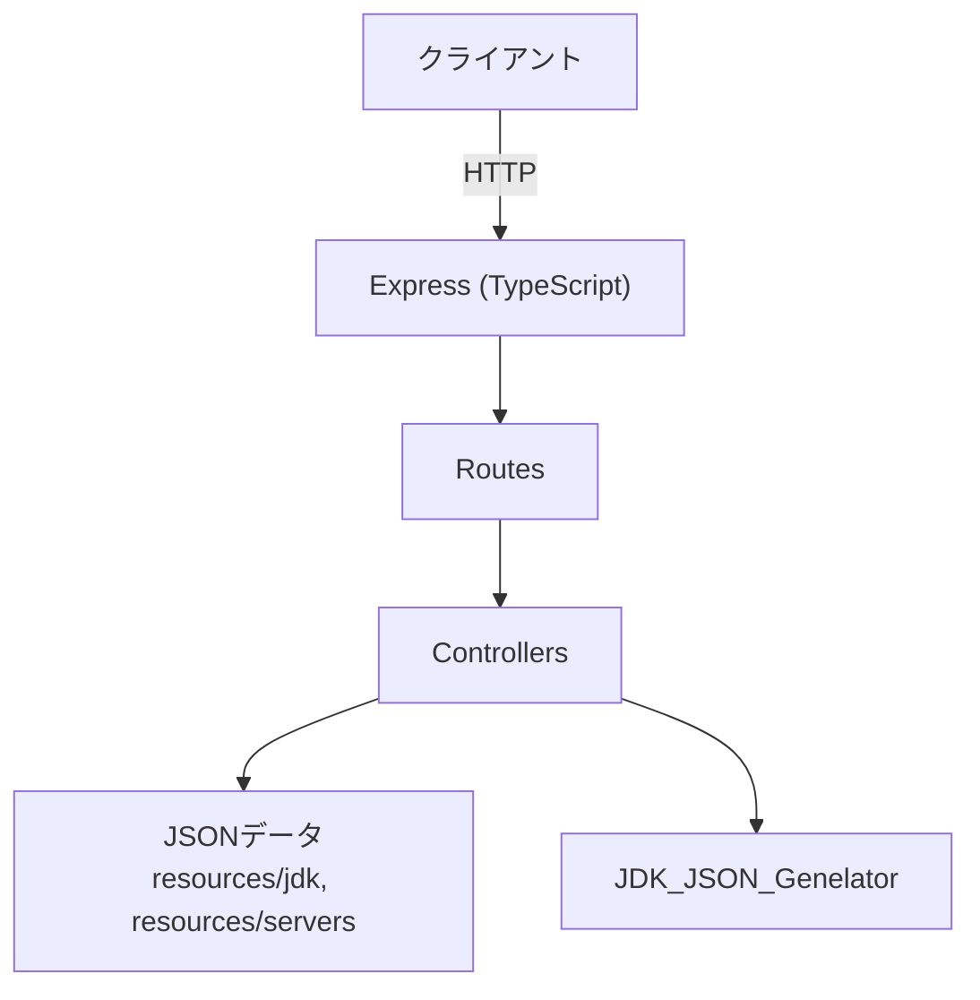

# Backend 概要

Minecraft サーバーソフトウェアの情報と JDK バイナリ配布リンクを提供する REST API バックエンドです。実装は Node.js + Express + TypeScript で構成され、`backend/Asset` ディレクトリがエントリーポイントとなります。



## 目的
- Minecraft サーバー配布物や対応 JDK 情報の REST API 提供
- Temurin（Eclipse Adoptium）由来の JDK バイナリリンクの配布
- ヘルスチェックとアセット配信を含むシンプルな API 提供

## プロジェクト構成
- ルート: [`backend/Asset`](./Asset)
- 主要言語/フレームワーク: Node.js, Express, TypeScript
- エントリーポイント: `server.ts`
- アプリ設定: `app.ts`（ルーティング統合）
- 代表的なディレクトリ:
  - `routes/` … API ルート (`health`, `servers`, `jdk`, `assets`)
  - `controllers/` … 各ルートの処理
  - `data/` … `servers.json`, `jdk.json` など公開情報
  - `resources/` … ダウンロード配布物 (JDK バイナリ、サーバー JAR)
  - `JDK_JSON_Genelator/` … GitHub API から最新 JDK 情報を取得
  - `docs/` … API/スキーマ仕様書

## npm スクリプト（`backend/Asset/package.json` より）
| スクリプト | 用途 |
| --- | --- |
| `npm start` | 本番モードでサーバー起動。既存データを利用。 |
| `npm run dev` | 開発モードで起動。JDK 情報の更新と不足バイナリの自動ダウンロードを実行。 |
| `npm run test` | テストモードで起動 (`--test`)。開発モードと同様に JDK 自動セットアップを実行。 |
| `npm run build` | TypeScript をビルド。 |
| `npm run watch` | TypeScript のウォッチビルド。 |

## 環境変数（重要）
`/api/v1/jdk` や `/api/v1/servers` が返す `downloadUrl` は、`BASE_URL` を元に生成されます。Nginx 等のリバースプロキシ配下で動かす場合は、外部公開URLを `BASE_URL` に設定してください。

### `backend/Asset`（単体起動/コンテナ共通）
- `BASE_URL`（推奨）: 例 `http://localhost:3000` / Nginx 経由なら `http://localhost:8080`
- `PORT`（任意）: デフォルト `3000`
- `NODE_ENV`（任意）: `development` のとき自動セットアップ有効（`npm run dev` は自動で設定）
- `FRP_VERSION`（任意）: FRP バイナリ配布API用（未指定なら `0.65.0`）

### `backend/Docker`（Docker Compose 用）
- `backend/Docker/.env.example` を `backend/Docker/.env` にコピーして設定（`docker compose` は同ディレクトリの `.env` を読み込みます）

## 起動手順（ローカル: Node.js）
### 前提
- Node.js `20` 以上（Dockerfile と合わせています）
- 開発/テストモードは外部へのアクセス（GitHub / PaperMC など）と、ファイル書き込み（`backend/Asset/resources`, `backend/Asset/data`）が発生します

### 1) 依存関係インストール
```bash
cd backend/Asset
npm ci
```

### 2) `BASE_URL` を設定（推奨）
`.env` またはシェル環境変数で指定します。

```bash
# 例: ローカル直叩き
export BASE_URL=http://localhost:3000
```

### 3) サーバー起動
- 本番（既存データのみ、ダウンロードなし）: `npm start`
- 開発（JDK/サーバー情報更新 + 不足バイナリ自動DL）: `npm run dev`
- テスト（開発同様 + `--test`）: `npm run test` または `npx ts-node server.ts --test`

### 4) 動作確認
```bash
curl http://localhost:3000/health
curl http://localhost:3000/api/v1/servers
curl http://localhost:3000/api/v1/jdk
```

## 起動手順（Docker Compose: Nginx 経由）
`backend/Docker` 配下には Nginx + Asset Server + FRP 認証系をまとめた `docker-compose.yml` があります。

### 1) 環境変数を用意
```bash
cd backend/Docker
cp .env.example .env
```
`backend/Docker/.env` の `BASE_URL` は、Nginx 公開先に合わせて `http://localhost:8080` のように設定します（`downloadUrl` の生成に使われます）。

### 2) 永続化ディレクトリ（ホスト側）を確認
`backend/Docker/docker-compose.yml` は以下をボリュームマウントします。
- `backend/Docker/AssetServ/Resource` → `/app/resources`
- `backend/Docker/AssetServ/Data` → `/app/data`

### 3) 起動
```bash
docker compose up --build
```

### 4) 動作確認（Nginx 経由）
- `GET http://localhost:8080/health`
- `GET http://localhost:8080/api/v1/servers`
- `GET http://localhost:8080/api/v1/jdk`

## 主なエンドポイント
- `GET /health` … ヘルスチェック
- `GET /api/v1/servers` … サーバーソフトウェア一覧
- `GET /api/v1/jdk` … JDK 情報一覧
- `GET /api/assets/...` … 配布アセット (JDK/サーバー JAR) 取得

詳細な仕様は [`backend/Asset/docs`](./Asset/docs) 配下の各 Markdown を参照してください。

## ライセンスと配布物
本バックエンドは Temurin（Eclipse Adoptium）の JDK バイナリリンクを利用しています。`./Asset/resources/jdk` に含まれるリンクおよびバイナリのライセンス詳細は [Eclipse Adoptium 公式サイト](https://adoptium.net/) を参照してください。

---
関連資料:
- [`backend/Asset/README.md`](./Asset/README.md)
- [`backend/Asset/docs`](./Asset/docs)
