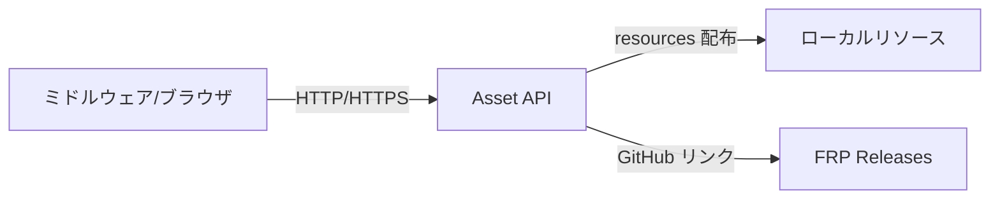

# Backend 概要
Node.js/Express + TypeScript で実装されたアセット配布 API サーバーです。JDK バイナリや Minecraft サーバーソフトウェア、FRP バイナリの配布を行い、フロントのミドルウェア (`frontend/middleware/main`) からプロキシされます。



## 構成
- `backend/Asset`: Express による配布 API 実装
  - `routes/`: JDK・サーバー・FRP 用のルーター
  - `resources/`: 配布対象ファイルの格納場所（JDK/servers）
  - `docs/`: API ドキュメント（`docs/ASSETS_API.md`）

## 主要機能
- JDK / Minecraft サーバーファイルのストリーミング配布と一覧取得
- FRP（Fast Reverse Proxy）バイナリの GitHub Releases からの配布リンク生成
- ダウンロード進捗管理用の API（ミドルウェア側が利用）

## セットアップ
1. 依存インストール
   ```bash
   cd backend/Asset
   npm install
   ```
2. 環境変数設定（必要に応じて）
   - `FRP_VERSION`: 配布する FRP バージョン（デフォルト: `0.65.0`）
3. 起動
   ```bash
   npm run dev   # ts-node で開発起動（ポートは server.ts の設定に従う）
   ```

## ライセンス・出典
- Temurin（Eclipse Adoptium）の JDK バイナリを利用しています。詳細は [こちら](https://adoptium.net/) を参照してください。
- その他依存パッケージのライセンスは `backend/Asset/package.json` を確認してください。

詳細なエンドポイント仕様は `backend/Asset/docs/ASSETS_API.md` を参照してください。
