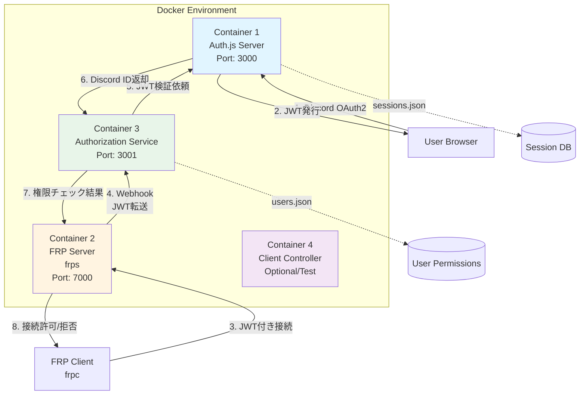
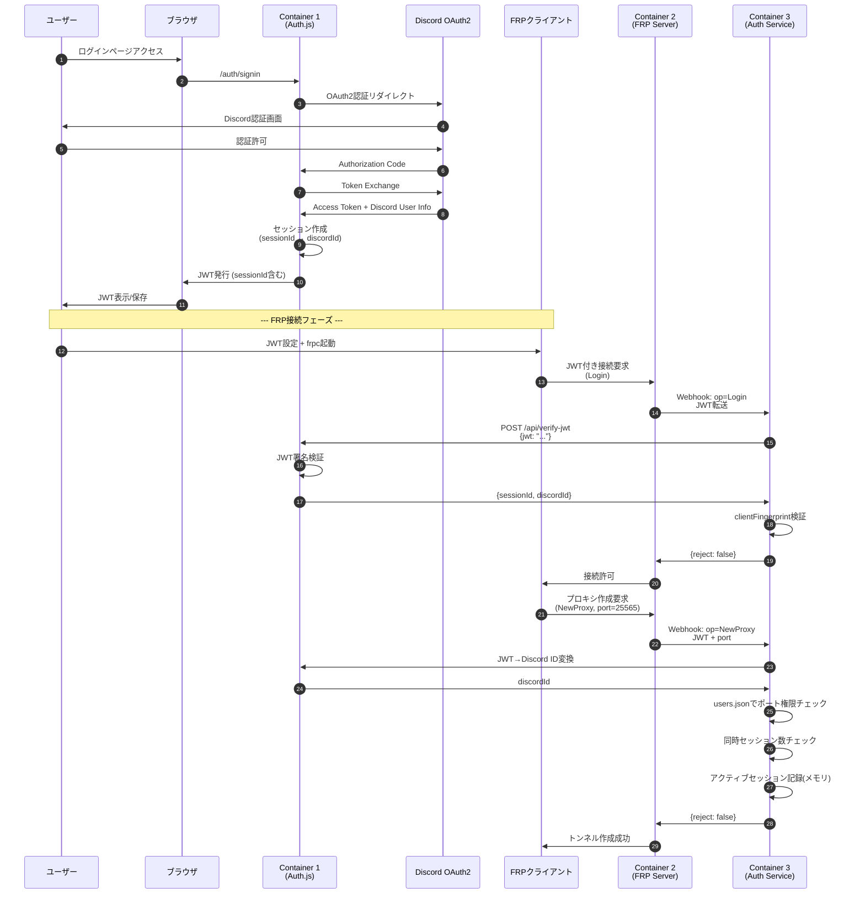
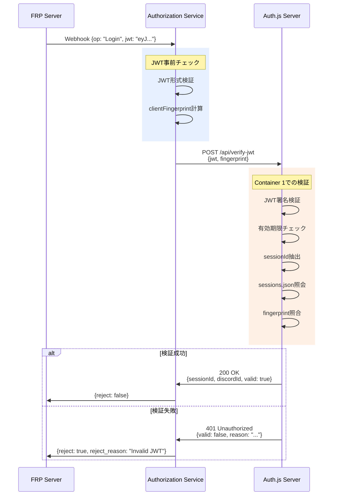
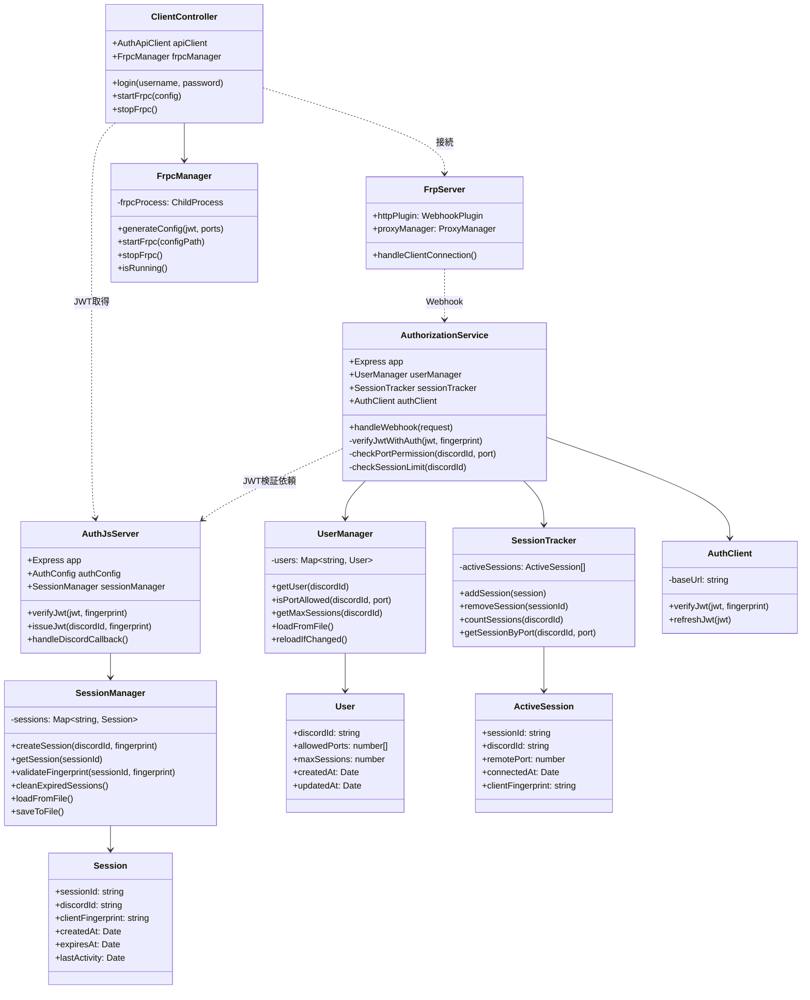

完璧です！では確定した仕様でドキュメントと図を作成します。

---

# **FRP認証システム設計書 (Discord OAuth2 + JWT + マイクロサービス構成)**

## **1. システム概要**

**目的:**
FRPサーバーに対してDiscord OAuth2ベースの認証・認可システムを統合し、Discord IDごとにポート使用許可と同時セッション数を管理する。

**主要機能:**
- Discord OAuth2によるユーザー認証
- JWT発行とセッション管理
- Discord IDベースのポート権限制御
- 同時接続セッション数の制限
- トークングラバー対策（クライアント認証）

**技術スタック:**
- Node.js + TypeScript
- Auth.js (Discord OAuth2)
- FRP (Fast Reverse Proxy)
- Docker (マイクロサービス構成)
- JSON ファイルベースのデータ永続化

---

## **2. システムアーキテクチャ**

### **2.1 コンテナ構成図**



### **2.2 コンテナ責務**

**Container 1: Auth.js Server**
- Discord OAuth2認証処理
- JWT発行・検証
- セッションID ⇔ Discord ID マッピング管理
- データ: `sessions.json`（永続化）

**Container 2: FRP Server (frps)**
- ポートフォワーディング実行
- HTTP Plugin経由でWebhook送信
- クライアント接続管理

**Container 3: Authorization Service**
- ポート権限チェック
- 同時セッション数管理
- クライアント認証検証（Fingerprint）
- データ: `users.json`（永続化）
- データ: アクティブセッション（メモリ上、揮発性）

**Container 4: Client Controller (Optional)**
- テスト用クライアント
- frpcプロセス管理（child_process/exec）
- JWT取得とクライアント設定生成

---

## **3. 認証フロー**

### **3.1 全体シーケンス図**



### **3.2 JWT検証フロー詳細**



---

## **4. データ構造設計**

### **4.1 Container 1: sessions.json**

```json
{
  "sessions": [
    {
      "sessionId": "550e8400-e29b-41d4-a716-446655440000",
      "discordId": "123456789012345678",
      "clientFingerprint": "sha256_hash_value",
      "createdAt": "2025-12-01T10:00:00Z",
      "expiresAt": "2025-12-02T10:00:00Z",
      "lastActivity": "2025-12-01T15:30:00Z"
    }
  ]
}
```

**フィールド説明:**
- `sessionId`: UUID v4、JWT ペイロードに含まれる
- `discordId`: Discord OAuth2から取得したユーザーID
- `clientFingerprint`: クライアント識別用ハッシュ
- `createdAt`: セッション作成日時
- `expiresAt`: セッション有効期限（24時間を想定）
- `lastActivity`: 最終アクティビティ日時（JWT更新時に更新）

### **4.2 Container 3: users.json**

```json
{
  "users": [
    {
      "discordId": "123456789012345678",
      "allowedPorts": [25565, 22, 3000, 8080],
      "maxSessions": 3,
      "createdAt": "2025-11-01T00:00:00Z",
      "updatedAt": "2025-12-01T10:00:00Z"
    },
    {
      "discordId": "987654321098765432",
      "allowedPorts": [3000],
      "maxSessions": 1,
      "createdAt": "2025-11-15T00:00:00Z",
      "updatedAt": "2025-11-15T00:00:00Z"
    }
  ]
}
```

**フィールド説明:**
- `discordId`: ユーザー識別子（一意）
- `allowedPorts`: 使用可能なリモートポート配列
- `maxSessions`: 同時接続可能なセッション数
- `createdAt/updatedAt`: 管理用タイムスタンプ

### **4.3 Container 3: アクティブセッション（メモリ）**

```typescript
interface ActiveSession {
  sessionId: string;
  discordId: string;
  remotePort: number;
  connectedAt: Date;
  clientFingerprint: string;
}

// メモリ上の配列
const activeSessions: ActiveSession[] = [];
```

**特徴:**
- 永続化しない（サーバー再起動でリセット）
- CloseProxy時に配列から削除
- 同時セッション数チェックに使用

---

## **5. API仕様**

### **5.1 Container 1 (Auth.js Server) API**

#### **POST /api/verify-jwt**
JWTを検証し、対応するDiscord IDを返却する。

**リクエスト:**
```typescript
{
  jwt: string;
  clientFingerprint: string;
}
```

**レスポンス（成功）:**
```typescript
{
  valid: true;
  sessionId: string;
  discordId: string;
  expiresAt: string; // ISO 8601
}
```

**レスポンス（失敗）:**
```typescript
{
  valid: false;
  reason: "Invalid signature" | "Expired" | "Fingerprint mismatch";
}
```

#### **POST /api/refresh-jwt**
JWTをリフレッシュする（将来拡張用）。

**リクエスト:**
```typescript
{
  jwt: string;
}
```

**レスポンス:**
```typescript
{
  newJwt: string;
  expiresAt: string;
}
```

### **5.2 Container 3 (Authorization Service) API**

#### **POST /webhook/handler**
FRP ServerからのWebhookを処理する。

**リクエスト（FRP Server → Container 3）:**
```typescript
interface FrpWebhookRequest {
  version: string;
  op: "Login" | "NewProxy" | "CloseProxy" | "Ping";
  content: {
    user?: {
      metas?: {
        token: string; // JWT
        fingerprint: string;
      };
    };
    proxy_name?: string;
    remote_port?: number;
  };
}
```

**レスポンス（Container 3 → FRP Server）:**
```typescript
interface FrpWebhookResponse {
  reject: boolean;
  reject_reason?: string;
  unchange: boolean;
}
```

**処理ロジック:**

**A. op: "Login"**
1. JWT とクライアントフィンgerprint を Container 1 に送信
2. Discord ID を取得
3. `reject: false` を返却

**B. op: "NewProxy"**
1. JWT から Discord ID を取得（Container 1経由）
2. `users.json` でポート権限チェック
3. アクティブセッション数チェック（`maxSessions`）
4. 問題なければアクティブセッションに追加
5. `reject: false` を返却

**C. op: "CloseProxy"**
1. セッションIDからアクティブセッションを検索
2. 配列から削除
3. `reject: false` を返却

---

## **6. JWT設計**

### **6.1 JWTペイロード**

```typescript
interface JwtPayload {
  sessionId: string;        // UUID v4
  clientFingerprint: string; // SHA256ハッシュ
  iat: number;              // 発行日時（UNIX timestamp）
  exp: number;              // 有効期限（UNIX timestamp）
}
```

**設計方針:**
- Discord IDは含めない（盗聴対策）
- セッションIDで間接的に紐付け
- 有効期限: **24時間**（接続毎にDiscord再認証は不要）

### **6.2 clientFingerprint 生成ロジック**

```typescript
function generateFingerprint(req: Request): string {
  const components = [
    req.ip,
    req.headers['user-agent'],
    // 将来的にハードウェアIDなども追加可能
  ];
  
  const raw = components.join('|');
  return crypto.createHash('sha256').update(raw).digest('hex');
}
```

**トークングラバー対策:**
- JWT単体では使用不可
- クライアント環境が一致しないと接続拒否
- 短命化（24時間）でリスク軽減

---

## **7. セキュリティ考慮事項**

### **7.1 実装済み対策**

| 対策 | 実装内容 |
|------|---------|
| JWT署名検証 | Container 1でHS256署名検証 |
| クライアント認証 | clientFingerprint照合 |
| Discord ID秘匿 | JWTにDiscord ID非含有 |
| セッション有効期限 | 24時間で自動失効 |
| 同時セッション制限 | maxSessions超過時に接続拒否 |

### **7.2 将来的な強化案**

- JWT暗号化（JWE）の導入
- Redis等への移行（スケールアウト対応）
- Rate Limiting実装
- 監査ログの記録
- TLS/SSL通信の強制

---

## **8. クラス図**



---

## **9. ディレクトリ構成**

```
frp-auth-system/
├── docker-compose.yml
├── config.json                    # FRPバイナリダウンロード設定
│
├── container1-authjs/             # Container 1
│   ├── Dockerfile
│   ├── src/
│   │   ├── index.ts
│   │   ├── config/
│   │   │   ├── auth.ts           # Auth.js設定
│   │   │   └── env.ts
│   │   ├── services/
│   │   │   └── sessionManager.ts
│   │   ├── routes/
│   │   │   ├── auth.ts           # Discord OAuth2
│   │   │   └── api.ts            # JWT検証API
│   │   └── types/
│   │       └── session.ts
│   ├── data/
│   │   └── sessions.json         # 永続化データ
│   ├── package.json
│   └── tsconfig.json
│
├── container2-frps/               # Container 2
│   ├── Dockerfile
│   ├── frps                       # バイナリ（自動DL）
│   └── frps.toml                  # FRP設定
│
├── container3-authz/              # Container 3
│   ├── Dockerfile
│   ├── src/
│   │   ├── index.ts
│   │   ├── services/
│   │   │   ├── userManager.ts
│   │   │   ├── sessionTracker.ts
│   │   │   └── authClient.ts
│   │   ├── routes/
│   │   │   └── webhook.ts        # FRP Webhook Handler
│   │   └── types/
│   │       └── frp.ts
│   ├── data/
│   │   └── users.json            # 永続化データ
│   ├── package.json
│   └── tsconfig.json
│
└── container4-client/             # Container 4 (Optional)
    ├── Dockerfile
    ├── src/
    │   ├── index.ts
    │   ├── api.ts                # Auth.js API通信
    │   └── frp.ts                # frpc管理
    ├── bin/
    │   └── frpc                  # バイナリ
    ├── package.json
    └── tsconfig.json
```

---

## **10. docker-compose.yml 設計**

```yaml
version: '3.8'

services:
  authjs:
    container_name: frp-authjs
    build: ./container1-authjs
    ports:
      - "3000:3000"
    environment:
      - AUTH_SECRET=${AUTH_SECRET}
      - AUTH_DISCORD_ID=${AUTH_DISCORD_ID}
      - AUTH_DISCORD_SECRET=${AUTH_DISCORD_SECRET}
      - BASE_URL=http://localhost:3000
    volumes:
      - ./container1-authjs/data:/app/data
    networks:
      - frp-network

  frps:
    container_name: frp-server
    build: ./container2-frps
    ports:
      - "7000:7000"
      - "7500:7500"
    depends_on:
      - authz
    networks:
      - frp-network

  authz:
    container_name: frp-authz
    build: ./container3-authz
    ports:
      - "3001:3001"
    environment:
      - AUTHJS_URL=http://authjs:3000
    volumes:
      - ./container3-authz/data:/app/data
    depends_on:
      - authjs
    networks:
      - frp-network

  # client:  # Optional - テスト用
  #   container_name: frp-client
  #   build: ./container4-client
  #   depends_on:
  #     - frps
  #     - authjs
  #   networks:
  #     - frp-network

networks:
  frp-network:
    driver: bridge
```

---

## **11. 実装タスクリスト**

### **Phase 1: Container 1 (Auth.js Server)**
- [ ] Discord OAuth2フロー実装
- [ ] JWT発行ロジック実装
- [ ] SessionManager実装（sessions.json管理）
- [ ] POST /api/verify-jwt 実装
- [ ] clientFingerprint生成・検証ロジック

### **Phase 2: Container 3 (Authorization Service)**
- [ ] UserManager実装（users.json管理、ファイル監視）
- [ ] SessionTracker実装（メモリ上のアクティブセッション管理）
- [ ] AuthClient実装（Container 1へのHTTP通信）
- [ ] Webhook Handler実装（Login/NewProxy/CloseProxy）
- [ ] ポート権限チェックロジック
- [ ] 同時セッション数チェックロジック

### **Phase 3: Container 2 (FRP Server)**
- [ ] frps.toml設定（httpPlugins → Container 3）
- [ ] バイナリ自動ダウンロードスクリプト

### **Phase 4: Container 4 (Client Controller)**
- [ ] Auth.js APIクライアント実装
- [ ] frpc設定生成（JWT埋め込み）
- [ ] frpcプロセス管理

### **Phase 5: 統合テスト**
- [ ] Docker Compose起動確認
- [ ] OAuth2ログインフロー確認
- [ ] JWT発行・検証確認
- [ ] ポート権限チェック確認
- [ ] 同時セッション数制限確認
- [ ] トークングラバー対策確認

---

## **12. テストシナリオ**

### **シナリオ1: 正常系 - 許可ポート接続**
1. ユーザーがDiscordでログイン
2. JWTを取得
3. frpcクライアント起動（ポート25565指定）
4. Container 3でポート権限確認 → 許可
5. トンネル作成成功

**期待結果:** 接続成功

### **シナリオ2: 異常系 - 未許可ポート**
1. ユーザーがログイン
2. JWTを取得
3. 未許可ポート（例: 9999）で接続試行
4. Container 3でポート権限確認 → 拒否

**期待結果:** `reject: true, reject_reason: "Port not allowed"`

### **シナリオ3: 異常系 - セッション数超過**
1. ユーザーがmaxSessions=2で設定
2. 2つの接続を確立
3. 3つ目の接続を試行
4. Container 3でセッション数確認 → 拒否

**期待結果:** `reject: true, reject_reason: "Max sessions exceeded"`

### **シナリオ4: セキュリティ - Fingerprint不一致**
1. 正規クライアントでJWT取得
2. 別の環境から同じJWTで接続試行
3. Container 1でFingerprint検証 → 不一致
4. Container 3へ検証失敗通知

**期待結果:** `reject: true, reject_reason: "Fingerprint mismatch"`

---

以上が完全な設計書です。実装を開始する準備ができましたら、各Phaseごとにサポートいたします！