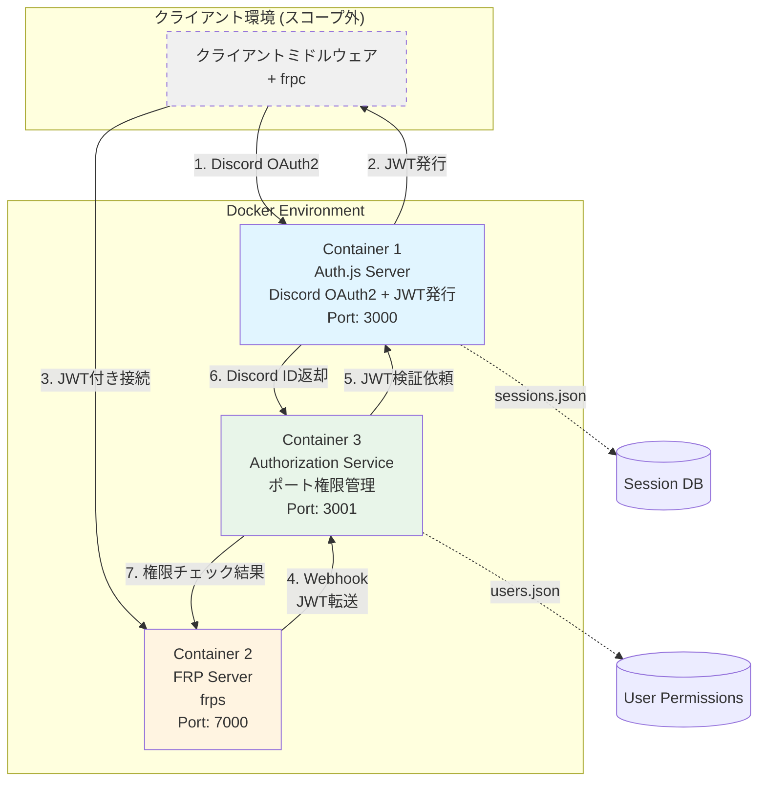
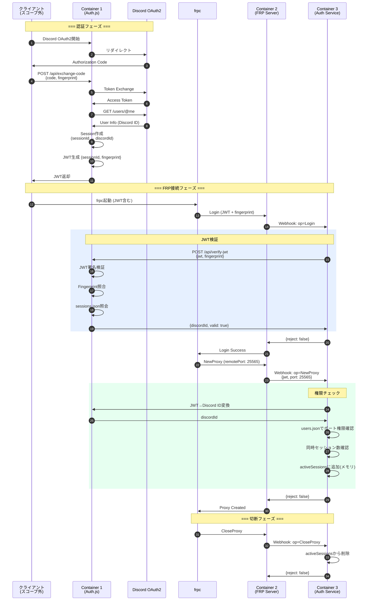
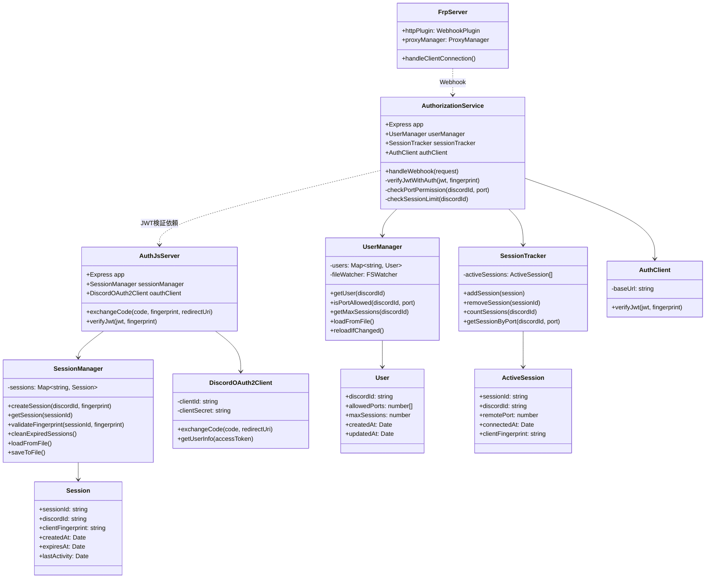

了解しました！それでは**サーバーサイド（Dockerコンテナ側）のみ**に焦点を当てた設計書を作成します。

---

# **FRP認証システム設計書 (サーバーサイド: Docker環境)**

**作成日:** 2025-12-01  
**対象:** Container 1 (Auth.js)、Container 2 (FRP Server)、Container 3 (Authorization Service)  
**スコープ:** Dockerコンテナ内のサーバーサイド実装のみ

---

## **1. システム概要**

Discord OAuth2ベースの認証システムをFRPサーバーに統合し、Discord IDごとにポート使用許可と同時セッション数を管理する。

**前提:**
- クライアント側（ミドルウェア）は別途実装
- クライアントはJWTとclientFingerprintを取得済み
- frpcバイナリが設定ファイルにJWTとFingerprintを含めて接続

---

## **2. システムアーキテクチャ**

### **2.1 コンテナ構成図**



### **2.2 コンテナ責務**

**Container 1: Auth.js Server**
- Discord OAuth2認証処理
- JWT発行・検証
- セッションID ⇔ Discord ID マッピング管理
- データ永続化: `sessions.json`

**Container 2: FRP Server (frps)**
- ポートフォワーディング実行
- HTTP Plugin経由でWebhook送信（Container 3へ）
- クライアント接続管理

**Container 3: Authorization Service**
- JWT検証（Container 1に委譲）
- Discord IDベースのポート権限チェック
- 同時セッション数管理
- データ永続化: `users.json`
- メモリ管理: アクティブセッション（揮発性）

---

## **3. 認証・認可フロー**

### **3.1 全体シーケンス図**



---

## **4. データ構造設計**

### **4.1 Container 1: sessions.json**

```json
{
  "sessions": [
    {
      "sessionId": "550e8400-e29b-41d4-a716-446655440000",
      "discordId": "123456789012345678",
      "clientFingerprint": "a1b2c3d4e5f6...",
      "createdAt": "2025-12-01T10:00:00Z",
      "expiresAt": "2025-12-02T10:00:00Z",
      "lastActivity": "2025-12-01T15:30:00Z"
    }
  ]
}
```

**フィールド:**
- `sessionId`: UUID v4（JWTペイロードに含む）
- `discordId`: Discord User ID
- `clientFingerprint`: クライアント識別用ハッシュ
- `createdAt`: セッション作成日時
- `expiresAt`: 有効期限（24時間）
- `lastActivity`: 最終アクティビティ

### **4.2 Container 3: users.json**

```json
{
  "users": [
    {
      "discordId": "123456789012345678",
      "allowedPorts": [25565, 22, 3000, 8080],
      "maxSessions": 3,
      "createdAt": "2025-11-01T00:00:00Z",
      "updatedAt": "2025-12-01T10:00:00Z"
    }
  ]
}
```

**フィールド:**
- `discordId`: ユーザー識別子
- `allowedPorts`: 使用可能なリモートポート配列
- `maxSessions`: 同時接続可能なセッション数

### **4.3 Container 3: アクティブセッション（メモリ）**

```typescript
interface ActiveSession {
  sessionId: string;
  discordId: string;
  remotePort: number;
  connectedAt: Date;
  clientFingerprint: string;
}

// メモリ上の配列（永続化しない）
const activeSessions: ActiveSession[] = [];
```

---

## **5. API仕様**

### **5.1 Container 1 (Auth.js Server) API**

#### **POST /api/exchange-code**
Authorization Codeを交換してJWTを発行する。

**リクエスト:**
```typescript
{
  code: string;                 // Discord Authorization Code
  fingerprint: string;          // クライアントFingerprint
  redirectUri: string;          // OAuth2 Redirect URI
}
```

**レスポンス（成功）:**
```typescript
{
  jwt: string;
  expiresAt: string;           // ISO 8601
  discordUser: {
    id: string;
    username: string;
    avatar: string;
    discriminator: string;
  };
}
```

**レスポンス（失敗）:**
```typescript
{
  error: string;
  message: string;
}
```

**処理フロー:**
1. Discord OAuth2 Token Exchange (`POST https://discord.com/api/oauth2/token`)
2. Discord User Info取得 (`GET https://discord.com/api/users/@me`)
3. Session作成（`sessionId` ⇔ `discordId`）
4. JWT生成（ペイロード: `{sessionId, fingerprint, iat, exp}`）
5. `sessions.json` に保存
6. JWT返却

---

#### **POST /api/verify-jwt**
JWTを検証し、対応するDiscord IDを返却する。

**リクエスト:**
```typescript
{
  jwt: string;
  fingerprint: string;
}
```

**レスポンス（成功）:**
```typescript
{
  valid: true;
  sessionId: string;
  discordId: string;
  expiresAt: string;
}
```

**レスポンス（失敗）:**
```typescript
{
  valid: false;
  reason: "Invalid signature" | "Expired" | "Fingerprint mismatch" | "Session not found";
}
```

**処理フロー:**
1. JWT署名検証（HS256）
2. 有効期限チェック
3. ペイロードから `sessionId` 抽出
4. `sessions.json` で該当セッション検索
5. `clientFingerprint` 照合
6. 全て成功なら `discordId` を返却

---

#### **GET /auth/signin**
Discord OAuth2認証を開始する（Auth.js標準エンドポイント）。

**処理:**
- Discord OAuth2フローを開始
- クライアントをDiscord認証画面にリダイレクト

#### **GET /auth/callback/discord**
Discord OAuth2のコールバック（Auth.js標準エンドポイント）。

**処理:**
- Authorization Codeを受け取り
- クライアントに処理を委譲

---

### **5.2 Container 3 (Authorization Service) API**

#### **POST /webhook/handler**
FRP ServerからのWebhookを処理する。

**リクエスト:**
```typescript
interface FrpWebhookRequest {
  version: string;
  op: "Login" | "NewProxy" | "CloseProxy" | "Ping";
  content: {
    user?: {
      metas?: {
        token: string;        // JWT
        fingerprint: string;
      };
    };
    proxy_name?: string;
    remote_port?: number;
  };
}
```

**レスポンス:**
```typescript
interface FrpWebhookResponse {
  reject: boolean;
  reject_reason?: string;
  unchange: boolean;
}
```

**処理ロジック:**

**A. op: "Login"**
1. `content.user.metas.token` からJWT取得
2. `content.user.metas.fingerprint` 取得
3. Container 1に `POST /api/verify-jwt` で検証依頼
4. 成功なら `{reject: false, unchange: true}`
5. 失敗なら `{reject: true, reject_reason: "..."}`

**B. op: "NewProxy"**
1. JWT から Discord ID 取得（Container 1経由）
2. `users.json` でポート権限確認
   - `allowedPorts` に `remote_port` が含まれるか
3. 同時セッション数確認
   - `activeSessions` で該当 Discord ID のセッション数を計数
   - `maxSessions` と比較
4. 全て成功なら：
   - `activeSessions` にセッション追加（メモリ）
   - `{reject: false, unchange: true}`
5. 失敗なら：
   - `{reject: true, reject_reason: "Port not allowed" | "Max sessions exceeded"}`

**C. op: "CloseProxy"**
1. セッションIDまたはポート番号から該当セッション検索
2. `activeSessions` から削除
3. `{reject: false, unchange: true}`

**D. op: "Ping"**
1. 単純な生存確認
2. `{reject: false, unchange: true}`

---

## **6. JWT設計**

### **6.1 JWTペイロード**

```typescript
interface JwtPayload {
  sessionId: string;        // UUID v4
  fingerprint: string;      // クライアントFingerprint (SHA256)
  iat: number;              // 発行日時（UNIX timestamp）
  exp: number;              // 有効期限（UNIX timestamp）
}
```

**設計方針:**
- Discord IDは含めない（盗聴対策）
- セッションIDで間接的に紐付け
- 有効期限: **24時間**
- 署名アルゴリズム: **HS256**

### **6.2 JWT生成例**

```typescript
import jwt from 'jsonwebtoken';

const payload: JwtPayload = {
  sessionId: '550e8400-e29b-41d4-a716-446655440000',
  fingerprint: 'a1b2c3d4e5f6...',
  iat: Math.floor(Date.now() / 1000),
  exp: Math.floor(Date.now() / 1000) + 86400, // 24時間後
};

const token = jwt.sign(payload, process.env.AUTH_SECRET);
```

### **6.3 JWT検証例**

```typescript
import jwt from 'jsonwebtoken';

try {
  const decoded = jwt.verify(token, process.env.AUTH_SECRET) as JwtPayload;
  
  // Fingerprint照合
  if (decoded.fingerprint !== requestFingerprint) {
    throw new Error('Fingerprint mismatch');
  }
  
  // Session照会
  const session = await getSession(decoded.sessionId);
  if (!session) {
    throw new Error('Session not found');
  }
  
  return { valid: true, discordId: session.discordId };
} catch (error) {
  return { valid: false, reason: error.message };
}
```

---

## **7. Container設定**

### **7.1 Container 2: frps.toml**

```toml
bindAddr = "0.0.0.0"
bindPort = 7000

# Authorization ServiceへのWebhook設定
[[httpPlugins]]
name = "auth-plugin"
addr = "authz:3001"              # Docker network内部アドレス
path = "/webhook/handler"
ops = ["Login", "NewProxy", "CloseProxy"]
```

### **7.2 docker-compose.yml**

```yaml
version: '3.8'

services:
  authjs:
    container_name: frp-authjs
    build: ./container1-authjs
    ports:
      - "3000:3000"
    environment:
      - AUTH_SECRET=${AUTH_SECRET}
      - AUTH_DISCORD_ID=${AUTH_DISCORD_ID}
      - AUTH_DISCORD_SECRET=${AUTH_DISCORD_SECRET}
      - BASE_URL=${BASE_URL}
    volumes:
      - ./container1-authjs/data:/app/data
    networks:
      - frp-network

  frps:
    container_name: frp-server
    build: ./container2-frps
    ports:
      - "7000:7000"
      - "7500:7500"
    depends_on:
      - authz
    networks:
      - frp-network

  authz:
    container_name: frp-authz
    build: ./container3-authz
    ports:
      - "3001:3001"
    environment:
      - AUTHJS_URL=http://authjs:3000
    volumes:
      - ./container3-authz/data:/app/data
    depends_on:
      - authjs
    networks:
      - frp-network

networks:
  frp-network:
    driver: bridge
```

---

## **8. クラス図**



---

## **9. ディレクトリ構成**

```
frp-auth-system/
├── docker-compose.yml
├── .env
│
├── container1-authjs/
│   ├── Dockerfile
│   ├── src/
│   │   ├── index.ts
│   │   ├── config/
│   │   │   ├── auth.ts           # Auth.js設定
│   │   │   └── env.ts
│   │   ├── services/
│   │   │   ├── sessionManager.ts
│   │   │   └── discordOAuth2.ts
│   │   ├── routes/
│   │   │   └── api.ts            # /api/exchange-code, /api/verify-jwt
│   │   └── types/
│   │       └── session.ts
│   ├── data/
│   │   └── sessions.json
│   ├── package.json
│   └── tsconfig.json
│
├── container2-frps/
│   ├── Dockerfile
│   ├── frps                      # バイナリ（自動DL）
│   └── frps.toml
│
└── container3-authz/
    ├── Dockerfile
    ├── src/
    │   ├── index.ts
    │   ├── services/
    │   │   ├── userManager.ts
    │   │   ├── sessionTracker.ts
    │   │   └── authClient.ts
    │   ├── routes/
    │   │   └── webhook.ts        # /webhook/handler
    │   └── types/
    │       └── frp.ts
    ├── data/
    │   └── users.json
    ├── package.json
    └── tsconfig.json
```

---

## **10. 実装タスクリスト**

### **Phase 1: Container 1 (Auth.js Server)**
- [ ] Discord OAuth2Client実装
- [ ] SessionManager実装（sessions.json管理）
- [ ] POST /api/exchange-code 実装
- [ ] POST /api/verify-jwt 実装
- [ ] JWT生成・検証ロジック
- [ ] Fingerprint照合ロジック

### **Phase 2: Container 3 (Authorization Service)**
- [ ] UserManager実装（users.json管理、ファイル監視）
- [ ] SessionTracker実装（メモリ上のアクティブセッション）
- [ ] AuthClient実装（Container 1へのHTTP通信）
- [ ] Webhook Handler実装（Login/NewProxy/CloseProxy）
- [ ] ポート権限チェックロジック
- [ ] 同時セッション数チェックロジック

### **Phase 3: Container 2 (FRP Server)**
- [ ] frps.toml設定
- [ ] バイナリ自動ダウンロードスクリプト

### **Phase 4: 統合テスト**
- [ ] Docker Compose起動確認
- [ ] OAuth2フロー確認
- [ ] JWT発行・検証確認
- [ ] ポート権限チェック確認
- [ ] 同時セッション数制限確認
- [ ] Fingerprint不一致時の拒否確認

---

以上が**サーバーサイドのみ**に焦点を当てた設計書です。実装を開始する準備ができましたら、各Phaseごとにサポートいたします！