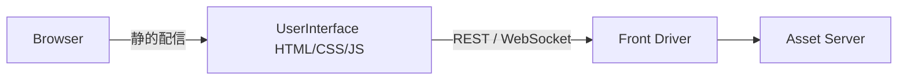

# User Interface プロトタイプ

このディレクトリには、ミドルウェア (`frontend/middleware/main`) に接続するための UI 試作が配置されています。認証フォームは Vue で、サーバー管理ダッシュボードは React コンポーネントのモックとして実装されています。

## ファイル構成
- `index.html` / `user_authenticationUI.html`: Vue 3 (CDN) で実装したログイン/サインアップ画面。`styles.css` を共有。
- `main_page.js`: React + Tailwind クラスを用いたサーバー管理ダッシュボードのモックコンポーネント。実際の API/状態管理と統合する際の雛形として利用できます。
- `styles.css`: 認証 UI 用のスタイル定義。

## 使い方
1. 静的ファイルサーバー（例: `python -m http.server 8081`）でこのディレクトリをホスト。
2. ブラウザで `http://localhost:8081/index.html` もしくは `user_authenticationUI.html` を開き、フォーム動作を確認。
3. React モックを確認する場合は、`main_page.js` を任意の React セットアップ（Vite など）に取り込み、API 呼び出し部をミドルウェアの `/api/*` や `/ws` と接続してください。

## 次のステップ
- 認証フォームの送信先を `frontend/middleware/main` の `/user/login` に接続する。
- サーバー管理ダッシュボードを `/api/mc` と `/ws/mcserver` から取得する実データで置き換える。
- ビルドツール（Vite など）を導入し、React/Vue コンポーネントを統合した単一フロントエンドにまとめる。
