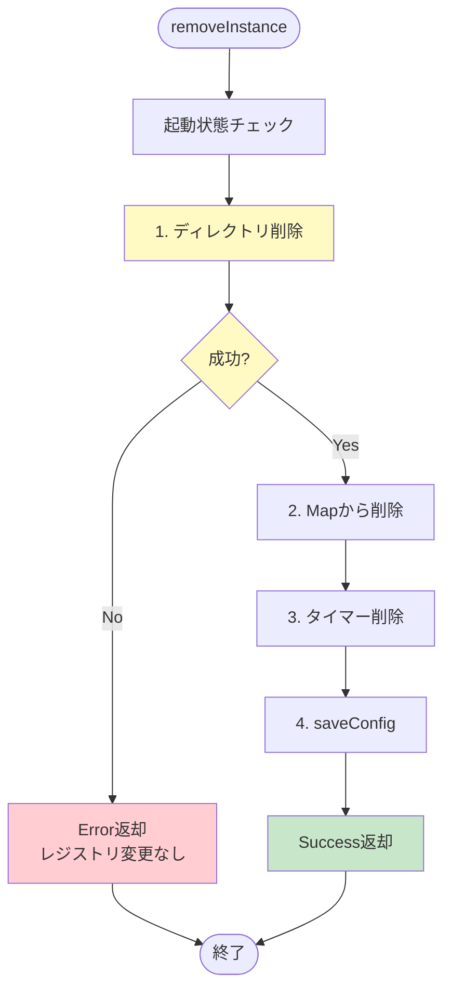
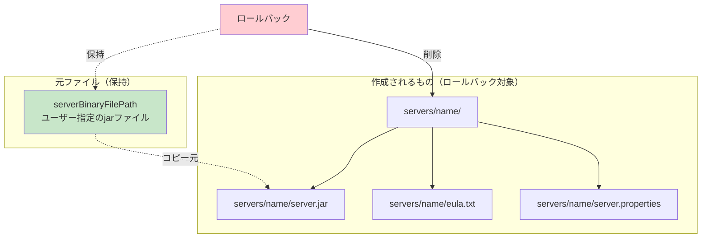
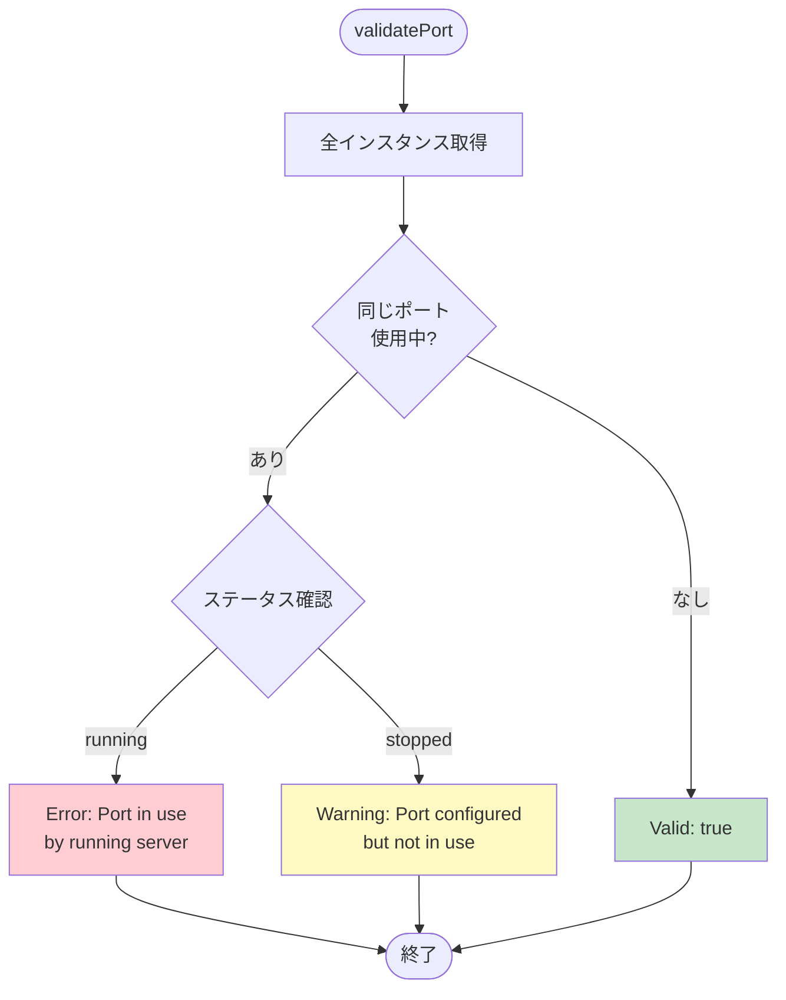
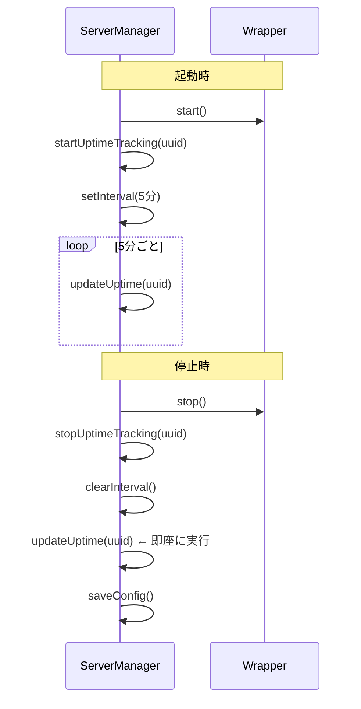
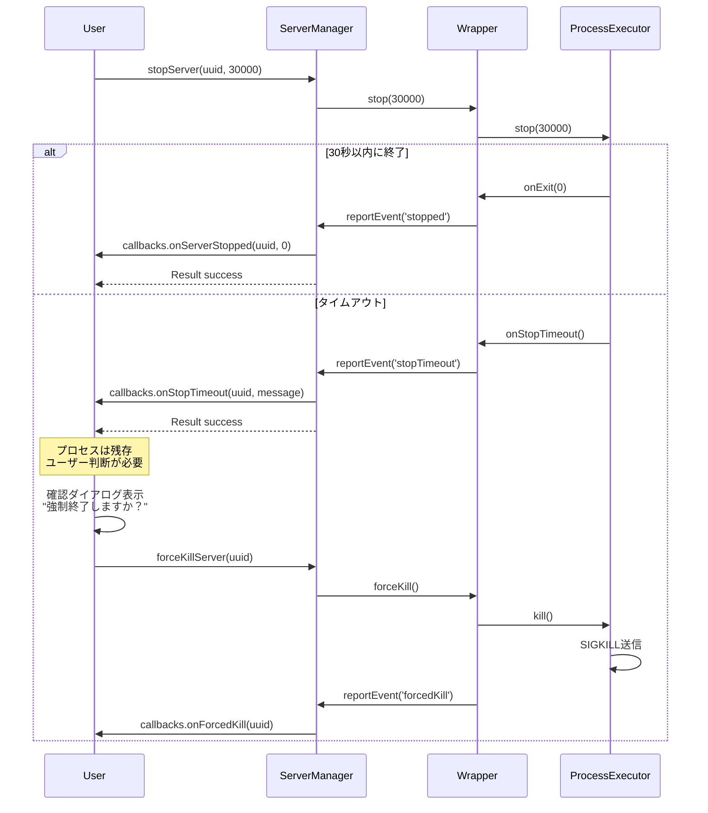
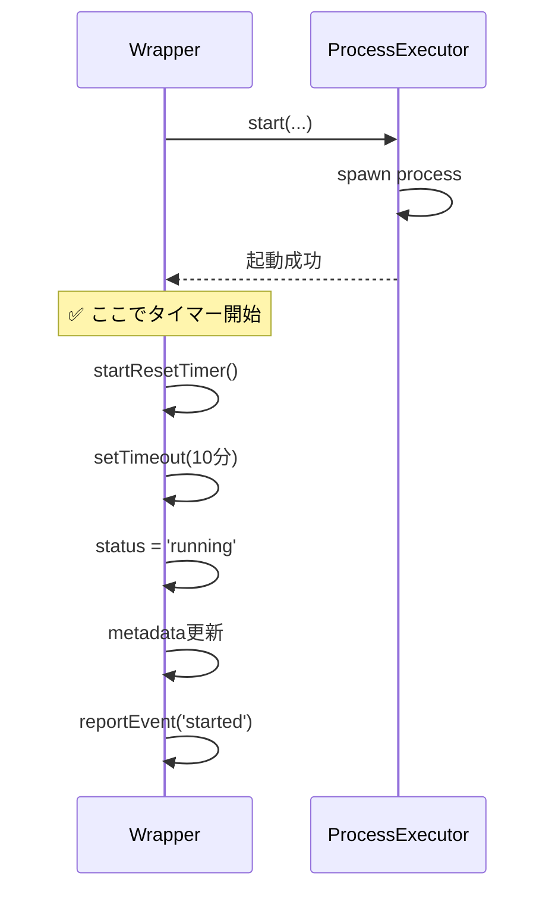
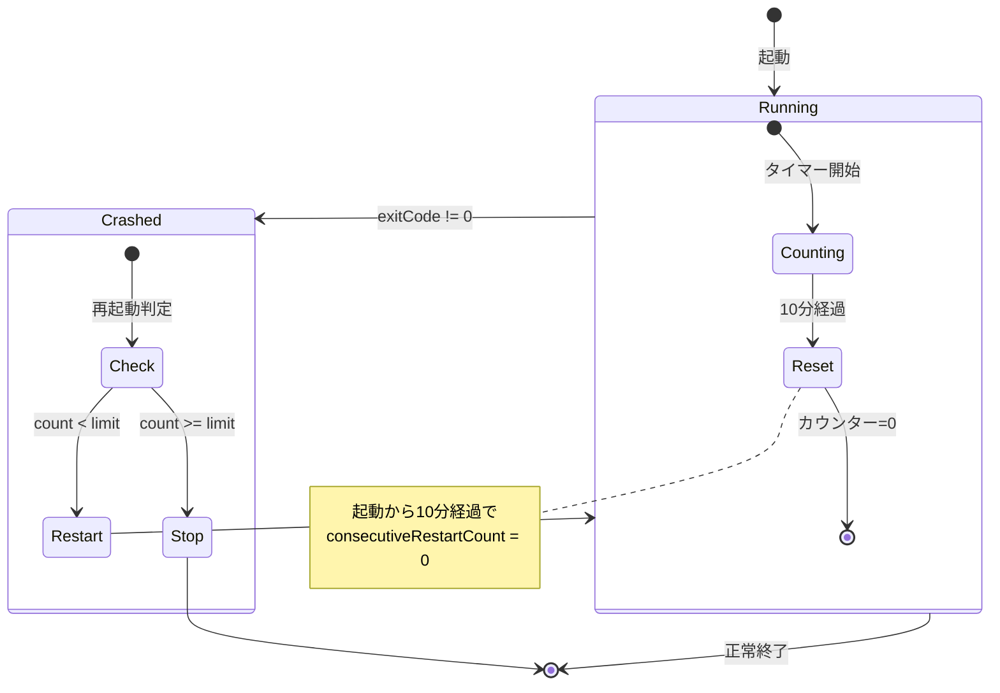
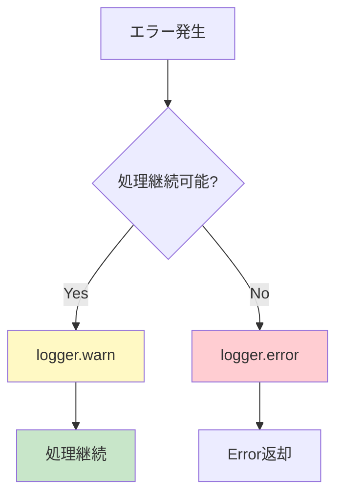

# 実装依頼書 - 追記事項（質問回答に基づく補足）

**作成日:** 2025-11-03  
**バージョン:** 1.0.2  
**変更理由:** 実装前の質問事項と回答を追加

---

## 📋 目次

1. [エラーハンドリングの詳細仕様](#1-エラーハンドリングの詳細仕様)
2. [バリデーションの詳細仕様](#2-バリデーションの詳細仕様)
3. [稼働時間管理の詳細仕様](#3-稼働時間管理の詳細仕様)
4. [型定義の補足](#4-型定義の補足)
5. [プロセス管理の詳細仕様](#5-プロセス管理の詳細仕様)
6. [自動再起動の詳細仕様](#6-自動再起動の詳細仕様)
7. [設定ファイル管理の詳細仕様](#7-設定ファイル管理の詳細仕様)
8. [テスト環境の詳細仕様](#8-テスト環境の詳細仕様)
9. [前提条件と責任範囲](#9-前提条件と責任範囲)
10. [実装前の質問事項と回答（追加）](#10-実装前の質問事項と回答追加)

---

## 1. エラーハンドリングの詳細仕様

### **1.1 removeInstance()のロールバック戦略**

**確定仕様:** ディレクトリ削除を先に実行し、成功した場合のみレジストリを更新



**処理順序:**

$$\text{処理順序} = \text{ディレクトリ削除} \rightarrow \text{レジストリ更新} \rightarrow \text{設定保存}$$

**実装例:**
```typescript
async removeInstance(uuid: string): Promise<VoidResult> {
  const instance = this.instances.get(uuid);
  if (!instance) {
    return { success: false, error: ServerManagerErrors.INSTANCE_NOT_FOUND };
  }
  
  // 起動状態チェック
  if (instance.isRunning()) {
    return { success: false, error: ServerManagerErrors.INSTANCE_RUNNING };
  }
  
  const serverDir = path.join(this.serversBasePath, instance.getData().name);
  
  // 1. ディレクトリ削除（先に実行）
  try {
    await fs.promises.rm(serverDir, { recursive: true, force: true });
    this.logger.info(`Deleted directory: ${serverDir}`);
  } catch (error) {
    this.logger.error(`Failed to delete directory: ${serverDir}`, error);
    // ❌ ディレクトリ削除失敗 → 全処理キャンセル
    return { 
      success: false, 
      error: `${ServerManagerErrors.DIRECTORY_DELETE_FAILED}: ${error.message}` 
    };
  }
  
  // 2. レジストリ更新（ディレクトリ削除成功後のみ）
  this.instances.delete(uuid);
  this.uptimeIntervals.delete(uuid);
  await this.saveConfig();
  
  return { success: true };
}
```

**理由:**
- データの整合性を保つ（ゴミファイルの蓄積を防ぐ）
- ユーザーが問題を解決してから再試行できる
- レジストリとファイルシステムの不一致を防ぐ

---

### **1.2 addInstance()のロールバック戦略**

**確定仕様:** server.properties作成失敗時、作成したディレクトリ全体を削除（元のjarファイルは保持）



**ロールバック対象:**
- ✅ 作成したディレクトリ全体（`servers/name/`）
- ✅ コピーしたjarファイル（`servers/name/server.jar`）
- ✅ 作成したeula.txt
- ✅ 作成したserver.properties
- ❌ 元のjarファイル（`serverBinaryFilePath`）は削除しない

**実装例:**
```typescript
async addInstance(params: AddInstanceParams): Promise<AddInstanceResult> {
  // ... バリデーション、ディレクトリ作成、jar移動、eula.txt作成
  
  // server.properties作成
  const propManager = this.getServerPropertiesManager(uuid);
  try {
    await propManager.create({
      'server-port': port.toString()
    });
  } catch (error) {
    this.logger.error('Failed to create server.properties', error);
    
    // ロールバック: ディレクトリごと削除
    await fs.promises.rm(serverDir, { recursive: true, force: true });
    
    // 元のjarファイルは削除しない
    
    return {
      success: false,
      error: 'Failed to create server.properties'
    };
  }
  
  // ... 以降の処理
}
```

**jarファイルの扱い:**

$$\text{jarファイル処理} = \text{コピー}(\text{serverBinaryFilePath} \rightarrow \text{servers/name/server.jar})$$

- `serverBinaryFilePath`から`servers/name/server.jar`に**コピー**
- 元のファイルは残す（ユーザーが指定したパス）
- ロールバック時も元のファイルは削除しない

---

## 2. バリデーションの詳細仕様

### **2.1 ポート重複チェックの詳細**

**確定仕様:** 全インスタンス（停止中も含む）をチェック、ただし稼働中はエラー、停止中は警告



**実装例:**
```typescript
validatePort(port: number, excludeUuid?: string): ValidationResult {
  const instances = this.manager.getAllInstances();
  const conflict = instances.find(inst => 
    inst.launchConfig.port === port && 
    inst.uuid !== excludeUuid
  );
  
  if (conflict) {
    if (conflict.status === 'running') {
      // 稼働中 → エラー
      return ValidationResultHelper.failure(
        `Port ${port} is already in use by running server "${conflict.name}"`
      );
    } else {
      // 停止中 → 警告
      return ValidationResultHelper.warning([
        `Port ${port} is configured for server "${conflict.name}" (currently stopped)`
      ]);
    }
  }
  
  return ValidationResultHelper.success();
}
```

**判定基準:**

| 状況 | 結果 | メッセージ |
|------|------|-----------|
| ポート重複なし | `valid: true` | なし |
| ポート重複（稼働中） | `valid: false` | `Port in use by running server` |
| ポート重複（停止中） | `valid: true, warnings: [...]` | `Port configured but not in use` |

**excludeUuidの用途:**
- `updateInstance()`で自分自身のポートを変更する際に使用
- 自分自身は除外してチェック（他のインスタンスとの重複のみ確認）

---

### **2.2 メモリバリデーションの詳細**

**確定仕様:** `os.totalmem()`の80%超過で警告、単一サーバーのメモリのみチェック

**計算式:**

$$\text{警告条件}_1 = \text{maxMemory} > \text{os.totalmem()} \times 0.8$$

$$\text{警告条件}_2 = \text{maxMemory} > \text{os.freemem()}$$

**実装例:**
```typescript
validateMemorySettings(minMemory: number, maxMemory: number): ValidationResult {
  const warnings: string[] = [];
  
  // 基本チェック
  if (minMemory < 512) {
    return ValidationResultHelper.failure(
      'Minimum memory must be at least 512MB'
    );
  }
  
  if (maxMemory < minMemory) {
    return ValidationResultHelper.failure(
      'Maximum memory must be greater than or equal to minimum memory'
    );
  }
  
  // システムメモリチェック
  const systemMemory = os.totalmem() / (1024 * 1024); // MB
  const availableMemory = os.freemem() / (1024 * 1024); // MB
  
  // totalmemの80%超過 → 警告
  if (maxMemory > systemMemory * 0.8) {
    warnings.push(
      `Maximum memory (${maxMemory}MB) is more than 80% of total system memory (${Math.round(systemMemory)}MB)`
    );
  }
  
  // freememを超過 → 警告
  if (maxMemory > availableMemory) {
    warnings.push(
      `Maximum memory (${maxMemory}MB) exceeds currently available memory (${Math.round(availableMemory)}MB)`
    );
  }
  
  return warnings.length > 0
    ? ValidationResultHelper.warning(warnings)
    : ValidationResultHelper.success();
}
```

**複数サーバーの合計メモリを考慮しない理由:**
- システム全体のメモリ管理はユーザーの責任
- 動的に変化するため正確な判定が困難
- 警告のみで十分（エラーにはしない）

---

## 3. 稼働時間管理の詳細仕様

### **3.1 稼働時間の計算方法**

**確定仕様:** 現在時刻 - 起動時刻

**計算式:**

$$\text{sessionUptime} = \text{Date.now()} - \text{currentSessionStartTime}$$

$$\text{totalUptime}_{\text{new}} = \text{totalUptime}_{\text{old}} + \lfloor \frac{\text{sessionUptime}}{1000} \rfloor$$

**実装例:**
```typescript
private updateUptime(uuid: string): void {
  const wrapper = this.instances.get(uuid);
  if (!wrapper) return;
  
  const runtimeState = wrapper.getRuntimeState();
  if (!runtimeState.currentSessionStartTime) return;
  
  // 現在時刻 - セッション開始時刻
  const sessionUptime = Date.now() - runtimeState.currentSessionStartTime;
  
  // 累計稼働時間に加算（秒単位）
  const data = wrapper.getData();
  data.metadata.totalUptime += Math.floor(sessionUptime / 1000);
  
  wrapper.updateData(data);
}
```

---

### **3.2 稼働時間の更新タイミング**

**確定仕様:** 5分ごと + 停止時に即座に実行



**実装例:**
```typescript
private startUptimeTracking(uuid: string): void {
  const timer = setInterval(() => {
    this.updateUptime(uuid);
  }, 5 * 60 * 1000); // 5分
  
  this.uptimeIntervals.set(uuid, timer);
}

private stopUptimeTracking(uuid: string): void {
  // タイマークリア
  const timer = this.uptimeIntervals.get(uuid);
  if (timer) {
    clearInterval(timer);
    this.uptimeIntervals.delete(uuid);
  }
  
  // 最終更新（即座に実行）
  this.updateUptime(uuid);
  
  // 設定保存
  await this.saveConfig();
}
```

**更新タイミング:**

| タイミング | 更新方法 | 備考 |
|----------|---------|------|
| 起動時 | タイマー開始 | 5分ごとに自動更新 |
| 稼働中（5分ごと） | `updateUptime()` | タイマー発火 |
| 停止時 | `updateUptime()` | 即座に実行（タイマーを待たない） |

---

## 4. 型定義の補足

### **4.1 AddInstanceResultの構造**

**確定仕様:** インターフェース形式

```typescript
export interface AddInstanceResult {
  success: boolean;
  uuid?: string;      // 成功時のみ存在
  error?: string;     // 失敗時のみ存在
}
```

**使用例:**
```typescript
const result = await manager.addInstance(params);

if (result.success) {
  console.log(`Created: ${result.uuid}`);
  // result.uuidは必ず存在する
} else {
  console.error(`Failed: ${result.error}`);
  // result.errorは必ず存在する
}
```

**理由:**
- 既存の設計書で使用している形式
- 実装がシンプル
- 型ガードが不要

---

### **4.2 VoidResultの一貫使用**

**確定仕様:** すべてのvoid返却メソッドで`VoidResult`を使用

```typescript
// ✅ 推奨
async removeInstance(uuid: string): Promise<VoidResult>
async updateInstance(params: UpdateInstanceParams): Promise<VoidResult>
async startServer(uuid: string): Promise<VoidResult>
async stopServer(uuid: string, timeout?: number): Promise<VoidResult>

// ❌ 非推奨
async removeInstance(uuid: string): Promise<ServerManagerResult<void>>
```

**理由:**
- 一貫性の向上
- コードの可読性向上
- タイプ量の削減

---

## 5. プロセス管理の詳細仕様

### **5.1 stopServer()のタイムアウト後の動作**

**確定仕様:** タイムアウト後、ユーザーが手動で`forceKillServer()`を呼び出す



**stopServer()の戻り値:**
- タイムアウトしても`success: true`を返す
- エラーではなく、正常な動作の一部

**実装例:**
```typescript
async stopServer(uuid: string, timeout: number = 30000): Promise<VoidResult> {
  const wrapper = this.instances.get(uuid);
  if (!wrapper) {
    return { success: false, error: ServerManagerErrors.INSTANCE_NOT_FOUND };
  }
  
  if (!wrapper.isRunning()) {
    return { success: false, error: ServerManagerErrors.INSTANCE_NOT_RUNNING };
  }
  
  await wrapper.stop(timeout);
  
  // タイムアウトしても success: true
  return { success: true };
}
```

**理由:**
- 強制終了はデータ破損のリスクがある
- ユーザーが明示的に判断すべき
- UIで確認ダイアログを表示する想定

---

### **5.2 forceKillServer()の実装**

**確定仕様:** 即座に成功を返す（プロセス終了は非同期）

```typescript
public forceKillServer(uuid: string): void {
  const wrapper = this.instances.get(uuid);
  if (!wrapper) {
    this.logger.warn('Instance not found for force kill', { uuid });
    return;
  }
  
  wrapper.forceKill();
  
  // 即座にreturn（プロセス終了は非同期）
  this.logger.info('Force kill requested', { uuid });
}
```

**動作:**
- `ProcessExecutor.kill()`を呼び出すのみ
- プロセス終了を待たない
- `onExit`コールバックで終了を通知

**理由:**
- プロセス終了は非同期
- 同期的に待つ必要なし
- ユーザーは`onForcedKill`コールバックで終了を確認

---

### **5.3 ProcessExecutor.stop()の戻り値（重要な変更）**

**確定仕様:** `Promise<boolean>`を返す

```typescript
/**
 * プロセスを停止
 * 
 * @param timeout - タイムアウト時間（ミリ秒）
 * @returns 正常に停止できた場合true、タイムアウトした場合false
 */
public async stop(timeout: number = 30000): Promise<boolean>
```

**戻り値の意味:**

| 戻り値 | 意味 | プロセスの状態 |
|--------|------|--------------|
| `true` | 正常にタイムアウト内で停止 | 終了済み |
| `false` | タイムアウトした | **まだ実行中** |

**実装例:**
```typescript
public async stop(timeout: number = 30000): Promise<boolean> {
  // 既に停止している場合
  if (!this.isRunningFlag || !this.process) {
    return true; // 既に停止しているのでtrue
  }
  
  this.logger.info('Stopping process', { timeout });
  
  // stopコマンド送信
  this.sendCommand('stop');
  
  // タイムアウト付きで終了待機
  const terminated = await this.waitForExit(timeout);
  
  if (terminated) {
    // 正常停止
    this.logger.info('Process stopped gracefully');
    return true;
  } else {
    // タイムアウト
    this.logger.warn('Process did not stop within timeout');
    
    // コールバック通知
    if (this.onStopTimeout) {
      this.onStopTimeout();
    }
    
    return false; // タイムアウトなのでfalse
  }
}
```

**ServerInstanceWrapperでの使用:**
```typescript
private async executeStop(timeout: number): Promise<void> {
  if (!this.process) {
    return;
  }
  
  const stopped = await this.process.stop(timeout);
  
  if (!stopped) {
    // タイムアウト（イベントは既に発火済み）
    this.logger.warn(`Server stop timed out: ${this.data.name}`);
    // ⚠️ プロセスはまだ実行中
    // ⚠️ forceKill()はユーザーが明示的に呼び出す必要がある
  } else {
    // 正常停止
    // ✅ プロセスは終了済み
    // ✅ cleanup()は onExit コールバックで自動実行される
  }
}
```

**なぜbooleanを返すのか:**
1. **状態の明示**: タイムアウトしたかどうかを呼び出し側が判断できる
2. **柔軟な対応**: 呼び出し側でタイムアウト時の処理を選択できる
3. **エラーではない**: タイムアウトは仕様上の正常な動作（エラーではない）

---

## 6. 自動再起動の詳細仕様

### **6.1 リセットタイマーの開始タイミング**

**確定仕様:** `start()`成功後（プロセス起動確認後）、具体的には`executeStart()`直後



**実装箇所:**
```typescript
public async start(): Promise<void> {
  // ... JDK取得、プロセス起動
  
  await this.executeStart(jdkEntry);
  
  // ✅ executeStart()直後にタイマー開始（ステータス更新前）
  this.startResetTimer();
  
  // ステータス更新
  this.data.status = 'running';
  this.data.metadata.lastStartedAt = new Date().toISOString();
  this.runtimeState.currentSessionStartTime = Date.now();
  
  // イベント報告
  this.reportEvent('started');
}
```

**理由:**
- プロセス起動した瞬間からカウント開始
- ステータス更新やイベント報告は関係ない
- プロセス起動 = 稼働開始のため

---

### **6.2 カウンターリセット条件**

**確定仕様:** 起動から10分後にカウンターリセット



**実装例:**
```typescript
private startResetTimer(): void {
  this.clearResetTimer();
  
  const { resetThresholdSeconds } = this.data.autoRestart;
  
  // 起動から10分後にリセット
  this.runtimeState.resetTimerId = setTimeout(() => {
    this.logger.info('Resetting restart counter', {
      uuid: this.data.uuid,
      previousCount: this.runtimeState.consecutiveRestartCount
    });
    this.resetRestartCounter();
  }, resetThresholdSeconds * 1000);
}
```

**シナリオ例:**

| 時刻 | イベント | count | 備考 |
|------|---------|-------|------|
| 0:00 | 起動 | 0 | タイマー開始（10分） |
| 0:05 | クラッシュ | 1 | 再起動 |
| 0:08 | クラッシュ | 2 | 再起動（まだ10分経過していない） |
| 0:23 | 15分稼働 | 0 | カウンターリセット |
| 0:25 | クラッシュ | 1 | 再起動（リセット済みなので1から） |

---

## 7. 設定ファイル管理の詳細仕様

### **7.1 設定ファイルのバージョン不一致時の動作**

**確定仕様:** 警告のみで処理続行（Zodバリデーションに任せる）

```typescript
private async loadAndValidateConfig(): Promise<void> {
  const raw = await fs.promises.readFile(this.configPath, 'utf-8');
  const parsed = JSON.parse(raw);
  
  // バージョンチェック（警告のみ）
  if (parsed.configVersion !== '1.0.0') {
    this.logger.warn('Config version mismatch', {
      expected: '1.0.0',
      actual: parsed.configVersion
    });
    // 処理は継続
  }
  
  // Zodバリデーション（エラー時は例外）
  this.config = ServerManagerConfigSchema.parse(parsed);
}
```

**理由:**
- Zodバリデーションで構造の正当性は保証される
- 将来的なマイグレーション機能の余地を残す

---

### **7.2 設定ファイルの親ディレクトリが存在しない場合**

**確定仕様:** `initialize()`時にエラー

```typescript
static async initialize(
  configPath: string,
  serversBasePath: string,
  logPath: string,
  jdkManager: JDKManager,
  callbacks?: ServerCallbacks
): Promise<ServerManager> {
  const manager = new ServerManager(
    configPath,
    serversBasePath,
    logPath,
    jdkManager,
    callbacks
  );
  
  // 設定ファイルの存在確認
  if (!fs.existsSync(manager.configPath)) {
    const dir = path.dirname(manager.configPath);
    
    // 親ディレクトリの存在確認
    if (!fs.existsSync(dir)) {
      throw new Error(`Config directory does not exist: ${dir}`);
    }
    
    // デフォルト設定で新規作成
    manager.config = manager.createDefaultConfig();
    await manager.saveConfig();
  } else {
    // 既存設定を読み込み
    await manager.loadAndValidateConfig();
  }
  
  // Wrapper生成
  manager.createWrappers();
  
  return manager;
}
```

**理由:**
- 早期エラー検出
- ユーザーが意図しない場所にファイルが作成されるのを防ぐ

---

## 8. テスト環境の詳細仕様

### **8.1 test.env.jsonのパス指定**

**確定仕様:** 相対パスも許容するが、実行時に絶対パスに変換

```json
{
  "jdkManager": {
    "configPath": "./tests/tmp/jdk-registry.json",
    "jdkArchives": {
      "jdk8": "./tests/fixtures/jdk8.zip",
      "jdk17": "./tests/fixtures/jdk17.zip",
      "jdk21": "./tests/fixtures/jdk21.zip"
    }
  },
  "minecraftServer": {
    "vanillaJar": "./tests/fixtures/server.jar",
    "paperJar": "./tests/fixtures/paper.jar"
  },
  "testPaths": {
    "configDir": "./tests/tmp/config",
    "serversDir": "./tests/tmp/servers",
    "logsDir": "./tests/tmp/logs"
  }
}
```

**読み込み時の処理:**
```typescript
export function loadTestEnv(): TestEnv {
  const envPath = path.join(__dirname, 'test.env.json');
  const content = fs.readFileSync(envPath, 'utf-8');
  const env = JSON.parse(content);
  
  // 相対パスを絶対パスに変換
  return {
    jdkManager: {
      configPath: path.resolve(env.jdkManager.configPath),
      jdkArchives: {
        jdk8: path.resolve(env.jdkManager.jdkArchives.jdk8),
        jdk17: path.resolve(env.jdkManager.jdkArchives.jdk17),
        jdk21: path.resolve(env.jdkManager.jdkArchives.jdk21)
      }
    },
    minecraftServer: {
      vanillaJar: path.resolve(env.minecraftServer.vanillaJar),
      paperJar: path.resolve(env.minecraftServer.paperJar)
    },
    testPaths: {
      configDir: path.resolve(env.testPaths.configDir),
      serversDir: path.resolve(env.testPaths.serversDir),
      logsDir: path.resolve(env.testPaths.logsDir)
    }
  };
}
```

**理由:**
- 相対パスの方がテスト環境の可搬性が高い
- 実行時に絶対パスに変換すれば問題なし

---

### **8.2 テスト用のMinecraft Server jar**

**確定仕様:** テスト種別ごとに使い分け

| テスト種別 | 使用するjar | 理由 |
|-----------|-----------|------|
| 単体テスト | モックjar（空ファイルでも可） | 動作確認が目的 |
| 統合テスト | モックjar（空ファイルでも可） | 実際のサーバー起動は不要 |
| E2Eテスト | 実際のjar（Paper推奨） | 実際の動作確認 |

**モックjarの作成例:**
```typescript
// tests/setup/createMockJar.ts
export async function createMockJar(outputPath: string): Promise<void> {
  // 空のzipファイルを作成（jarはzip形式）
  const content = Buffer.from([
    0x50, 0x4b, 0x05, 0x06, 0x00, 0x00, 0x00, 0x00,
    0x00, 0x00, 0x00, 0x00, 0x00, 0x00, 0x00, 0x00,
    0x00, 0x00, 0x00, 0x00, 0x00, 0x00
  ]);
  
  await fs.promises.writeFile(outputPath, content);
}
```

**理由:**
- 単体・統合テストは動作確認が目的（実際のサーバー起動は不要）
- E2Eテストのみ実際のサーバーを起動
- Paper Serverは軽量で起動が速い

---

## 9. 前提条件と責任範囲

### **9.1 JDKManagerの初期化状態**

**確定仕様:** ServerManagerに渡すJDKManagerは必ず初期化済み（チェックなし）

```typescript
// ✅ 正しい使用方法
const jdkManager = new JdkManager(path);
await jdkManager.Data.load(); // または init()

const serverManager = await ServerManager.initialize(
  configPath,
  serversBasePath,
  logPath,
  jdkManager,  // ← 初期化済み
  callbacks
);
```

```typescript
// ❌ 誤った使用方法
const jdkManager = new JdkManager(path);
// Data.load()を呼び出していない！

const serverManager = await ServerManager.initialize(
  configPath,
  serversBasePath,
  logPath,
  jdkManager,  // ← 未初期化
  callbacks
);
// → JDK取得時にエラーが発生する
```

**理由:**
- オーケストレーション層が責任を持つ
- ServerManagerの責任範囲を明確にする
- 初期化順序はドキュメントで明記

**ドキュメント記載必須:**
```markdown
## 前提条件

ServerManager.initialize()を呼び出す前に、以下を完了してください：

1. JDKManagerの初期化
   ```typescript
   const jdkManager = new JdkManager(path);
   await jdkManager.Data.load(); // または init()
   ```

2. ServerManagerの初期化
   ```typescript
   const manager = await ServerManager.initialize(..., jdkManager, ...);
   ```
```

---

### **9.2 JDKManager参照の保持方法**

**確定仕様:** readonly参照

```typescript
class ServerManager {
  constructor(
    private readonly configPath: string,
    private readonly serversBasePath: string,
    private readonly logPath: string,
    private readonly jdkManager: JDKManager,  // ← readonly
    private readonly callbacks?: ServerCallbacks
  ) {
    // ...
  }
}
```

**理由:**
- 不変性を保証
- 誤って再代入を防ぐ
- TypeScriptのベストプラクティス

---

## 10. 実装前の質問事項と回答（追加）

このセクションでは、実装開始前に確認された質問事項とその回答をまとめています。

### **10.1 JDKManagerとの連携に関する質問**

#### **Q10.1-1: JDKManager.Entrys.getByVersion()の戻り値の扱い**

**質問:**
JDKManagerのソースコードでは`Result<JDKEntry>`を返しますが、実装依頼書では「JDKEntry | null」と記載があります。どちらの形式で扱うべきでしょうか？

**回答:**
**パターンA（Result型）が正しいです。**

```typescript
// ✅ 正しい実装
const result = jdkManager.Entrys.getByVersion(jdkVersion);
if (!result.success) {
  return { success: false, error: result.error };
}
const jdkEntry = result.data;
```

**理由:**
- JDKManagerは独自のResult型を使用
- ServerManagerのResult型とは別物
- エラー情報を含むため、より詳細なエラーハンドリングが可能

---

#### **Q10.1-2: JDKEntry.getExecutableFilePath()の使用**

**質問:**
`getExecutableFilePath()`を`ProcessExecutor.start()`に渡すjavaPathとして使用する理解で正しいでしょうか？

**回答:**
**はい、その使用方法で正しいです。**

```typescript
// ✅ 正しい使用方法
const javaPath = jdkEntry.getExecutableFilePath();
// Windows: "C:\runtime\jdk-17-temurin\bin\java.exe"
// Unix: "/runtime/jdk-17-temurin/bin/java"

await this.processExecutor.start(javaPath, jarPath, args);
```

---

### **10.2 ProcessExecutorの実装に関する質問**

#### **Q10.2-1: waitForExit()の実装方法**

**質問:**
`stop()`メソッドでタイムアウト処理を実装する際、`waitForExit()`はどのように実装すべきでしょうか？

**回答:**
**パターンB（タイマーとフラグ）を推奨します。**

```typescript
// ✅ 推奨: パターンB
private async waitForExit(timeout: number): Promise<boolean> {
  if (!this.process) {
    return true;
  }
  
  return new Promise<boolean>((resolve) => {
    const timer = setTimeout(() => {
      resolve(false); // タイムアウト
    }, timeout);
    
    // 終了イベント監視（一度だけ）
    this.process!.once('exit', () => {
      clearTimeout(timer);
      resolve(true); // 正常終了
    });
  });
}
```

**理由:**
- シンプルで理解しやすい
- タイムアウト時もPromiseが正常に解決される
- `stop()`メソッドの戻り値（boolean）と整合性が取れる

---

#### **Q10.2-2: readline interfaceの設定**

**質問:**
実装依頼書では「`createInterface({ input: process.stdout })`」と記載されていますが、これは誤りではないでしょうか？

**回答:**
**はい、`this.process.stdout`が正しいです。実装依頼書に誤記がありました。**

```typescript
// ✅ 正しい実装
const stdoutReader = createInterface({
  input: this.process.stdout,  // ← child_processのstdout
  crlfDelay: Infinity
});

const stderrReader = createInterface({
  input: this.process.stderr,  // ← child_processのstderr
  crlfDelay: Infinity
});
```

**誤記箇所:**
- ❌ `process.stdout` → Node.jsのグローバルプロセス
- ✅ `this.process.stdout` → child_processのstdout

---

### **10.3 ServerPropertiesManagerの実装に関する質問**

#### **Q10.3-1: プロパティファイルのフォーマット**

**質問:**
server.propertiesファイルの形式について、以下の点を確認させてください：
- コメント行は `#` で始まる行のみですか？
- 空白行はスキップしますか？
- `key=value` の前後に空白がある場合、トリムしますか？
- 値に `=` が含まれる場合、どう扱いますか？

**回答:**
**以下の仕様で実装してください。**

| 項目 | 仕様 |
|------|------|
| コメント行 | `#`で始まる行のみ（`;`は使用しない） |
| 空白行 | スキップする |
| 前後の空白 | トリムする（`key = value` → `key=value`） |
| 値に`=`を含む場合 | 最初の`=`で分割（`motd=Welcome=to=Server` → key: `motd`, value: `Welcome=to=Server`） |

**実装例:**
```typescript
private parseContent(content: string): Map<string, string> {
  const properties = new Map<string, string>();
  const lines = content.split('\n');
  
  for (const line of lines) {
    const trimmed = line.trim();
    
    // 空行またはコメント行をスキップ
    if (!trimmed || trimmed.startsWith('#')) {
      continue;
    }
    
    // key=value形式をパース
    const equalIndex = trimmed.indexOf('=');
    if (equalIndex === -1) {
      continue; // '='がない行はスキップ
    }
    
    const key = trimmed.substring(0, equalIndex).trim();
    const value = trimmed.substring(equalIndex + 1).trim();
    
    properties.set(key, value);
  }
  
  return properties;
}
```

---

#### **Q10.3-2: update()メソッドの動作**

**質問:**
既存ファイルがある場合、該当行のみ置き換える実装で正しいでしょうか？

**回答:**
**はい、その方針で正しいです。ただし、若干の修正を推奨します。**

```typescript
// ✅ 推奨実装
async update(key: string, value: string): Promise<void> {
  let properties: Map<string, string>;
  
  if (this.exists()) {
    properties = await this.read();
  } else {
    properties = new Map();
  }
  
  // Map.set()で更新または追加
  properties.set(key, value);
  
  await this.write(properties);
  
  this.logger.info(`Updated property: ${key}=${value}`, {
    file: this.filePath
  });
}
```

**理由:**
- Mapの`set()`メソッドは、既存キーなら更新、なければ追加
- 行単位の処理より簡潔
- コメント行や空行も保持される（`write()`で再シリアライズ）

**注意:**
- この実装だとコメント行は失われます
- Minecraftのserver.propertiesではコメント行は重要でないため問題なし

---

### **10.4 ServerInstanceWrapperの実装に関する質問**

#### **Q10.4-1: リセットタイマーの開始タイミング**

**質問:**
実装依頼書では「start()成功後にタイマー開始」とありますが、以下のどのタイミングでしょうか？
- A. executeStart()直後
- B. ステータス更新後
- C. イベント報告後

**回答:**
**A. executeStart()直後（ステータス更新前）が正しいです。**

```typescript
public async start(): Promise<void> {
  // ... JDK取得、プロセス起動
  
  await this.executeStart(jdkEntry);
  
  // ✅ A. executeStart()直後にタイマー開始
  this.startResetTimer();
  
  // ステータス更新
  this.data.status = 'running';
  this.data.metadata.lastStartedAt = new Date().toISOString();
  this.runtimeState.currentSessionStartTime = Date.now();
  
  // イベント報告
  this.reportEvent('started');
}
```

**理由:**
- プロセスが起動した瞬間からカウント開始
- ステータス更新やイベント報告は関係ない
- プロセス起動 = 稼働開始のため

---

#### **Q10.4-2: RuntimeStateの初期化**

**質問:**
RuntimeStateの初期値は以下で正しいでしょうか？

**回答:**
**はい、その初期値で正しいです。**

```typescript
// ✅ 正しい初期化
private runtimeState: RuntimeState = {
  consecutiveRestartCount: 0,
  lastRestartTime: null,
  resetTimerId: null,
  currentSessionStartTime: null
};
```

---

### **10.5 ServerValidatorの実装に関する質問**

#### **Q10.5-1: ポート重複チェックの詳細**

**質問:**
`excludeUuid`は何のために使用しますか？updateInstance()で自分自身を除外するためでしょうか？

**回答:**
**はい、`excludeUuid`は自分自身を除外するためです。**

```typescript
validatePort(port: number, excludeUuid?: string): ValidationResult {
  const instances = this.manager.getAllInstances();
  const conflict = instances.find(inst => 
    inst.launchConfig.port === port && 
    inst.uuid !== excludeUuid  // ← 自分自身を除外
  );
  
  // ...
}
```

**使用例:**
```typescript
// addInstance時（新規追加）
const portResult = validator.validatePort(25565);
// ← excludeUuidなし（すべてのインスタンスをチェック）

// updateInstance時（既存更新）
const portResult = validator.validatePort(25565, 'some-uuid');
// ← excludeUuidあり（自分自身は除外）
```

---

#### **Q10.5-2: メモリバリデーションの警告条件**

**質問:**
両方の条件をチェックし、どちらかに該当すれば警告を出す、という理解で正しいでしょうか？

**回答:**
**はい、両方の条件をチェックし、該当すれば警告を追加します。**

```typescript
const warnings: string[] = [];

// 条件1: システムメモリの80%超過
if (maxMemory > systemMemory * 0.8) {
  warnings.push('...');
}

// 条件2: 利用可能メモリ超過
if (maxMemory > availableMemory) {
  warnings.push('...');
}

return warnings.length > 0
  ? ValidationResultHelper.warning(warnings)
  : ValidationResultHelper.success();
```

---

### **10.6 ServerManagerの実装に関する質問**

#### **Q10.6-1: updateInstance()のname変更とport変更の同時処理**

**質問:**
name変更とport変更を同時に行う場合、以下のような実装で正しいでしょうか？

**回答:**
**はい、その実装で正しいです。**

```typescript
// ✅ 正しい実装
let currentName = instance.getData().name;

// 1. name変更を先に実行
if (params.updates.name !== undefined) {
  const oldDir = path.join(this.serversBasePath, currentName);
  const newDir = path.join(this.serversBasePath, params.updates.name);
  await fs.promises.rename(oldDir, newDir);
  currentName = params.updates.name; // ← 重要: 現在の名前を更新
}

// 2. port変更は新しいディレクトリ名を使用
if (params.updates.port !== undefined) {
  const serverDir = path.join(this.serversBasePath, currentName); // ← 新しい名前
  const serverPropertiesPath = path.join(serverDir, 'server.properties');
  const propManager = new ServerPropertiesManager(serverPropertiesPath, this.logger);
  await propManager.updatePort(params.updates.port);
}
```

---

#### **Q10.6-2: addInstance()のロールバック範囲**

**質問:**
server.properties作成失敗時、どこまでロールバックしますか？

**回答:**
**A. serverDir全体を削除（1, 2, 3を削除）が正しいです。**

```typescript
// server.properties作成
try {
  await propManager.create({ 'server-port': port.toString() });
} catch (error) {
  this.logger.error('Failed to create server.properties', error);
  
  // ✅ ロールバック: ディレクトリごと削除
  await fs.promises.rm(serverDir, { recursive: true, force: true });
  
  return {
    success: false,
    error: 'Failed to create server.properties'
  };
}
```

**理由:**
- 部分的に作成されたディレクトリを残すと不整合が発生
- ユーザーが再試行する際に問題になる
- クリーンな状態から再実行できる

---

### **10.7 テストに関する質問**

#### **Q10.7-1: test.env.jsonのパス**

**質問:**
絶対パスに統一すべきでしょうか？それとも相対パスも許容されますか？

**回答:**
**相対パスも許容します。ただし、実行時に絶対パスに変換してください。**

（実装例は8.1参照）

---

#### **Q10.7-2: テスト用のMinecraft Server jar**

**質問:**
E2Eテストでは実際のjarを使用し、単体・統合テストではモックを使用する、という理解で正しいでしょうか？

**回答:**
**はい、その理解で正しいです。**

（詳細は8.2参照）

---

### **10.8 その他の質問**

#### **Q10.8-1: ログレベルの使い分け**

**質問:**
以下のような場合、どのレベルを使用すべきでしょうか？

**回答:**

**ケース1: バリデーションで警告が出た場合**
```typescript
// ✅ warn を使用
if (validation.warnings && validation.warnings.length > 0) {
  validation.warnings.forEach(warning => {
    this.logger.warn(warning);
  });
}
```

**ケース2: ディレクトリ削除失敗（全処理キャンセル）**
```typescript
// ✅ error を使用
try {
  await fs.promises.rm(serverDir, { recursive: true, force: true });
} catch (error) {
  this.logger.error(`Failed to delete directory: ${serverDir}`, error);
  return { success: false, error: '...' };
}
```

**ケース3: server.properties更新失敗（処理は継続）**
```typescript
// ✅ warn を使用
try {
  await propManager.updatePort(port);
} catch (error) {
  this.logger.warn('Failed to update server.properties', error);
  // 処理は継続
}
```

**原則:**
- 処理を継続できる → `warn` + 処理継続
- 処理を継続できない → `error` + エラー返却

---

#### **Q10.8-2: 設定ファイルのバージョン不一致時の動作**

**質問:**
警告のみで処理続行し、Zodバリデーションに任せる実装で正しいでしょうか？

**回答:**
**はい、その実装で正しいです。**

（実装例は7.1参照）

---

### **10.9 追加の補足事項**

#### **補足1: エラーハンドリングの統一方針**



---

#### **補足2: ディープコピーの必要性**

```typescript
// ❌ 間違い: 参照を返す
public getData(): ServerInstance {
  return this.data; // ← 外部から直接変更可能になる
}

// ✅ 正しい: ディープコピーを返す
public getData(): ServerInstance {
  return JSON.parse(JSON.stringify(this.data));
}
```

---

#### **補足3: タイマーのメモリリーク防止**

```typescript
// ✅ 正しい: タイマーを必ずクリア
private clearResetTimer(): void {
  if (this.runtimeState.resetTimerId) {
    clearTimeout(this.runtimeState.resetTimerId);
    this.runtimeState.resetTimerId = null; // ← 重要: nullに戻す
  }
}

// ServerManagerの uptimeIntervals も同様
private stopUptimeTracking(uuid: string): void {
  const timer = this.uptimeIntervals.get(uuid);
  if (timer) {
    clearInterval(timer);
    this.uptimeIntervals.delete(uuid); // ← 重要: Mapから削除
  }
}
```

---

## 📊 確定した仕様一覧表（更新版）

| 項目 | 採用案 | 優先度 | 追加日 |
|------|--------|--------|--------|
| removeInstanceのロールバック | ディレクトリ削除を先に実行 | 高 | v1.0.1 |
| addInstanceのロールバック | ディレクトリごと削除、元jarは保持 | 高 | v1.0.1 |
| stopServerタイムアウト後 | ユーザーが手動でforceKill | 高 | v1.0.1 |
| **ProcessExecutor.stop()の戻り値** | **Promise<boolean>** | **高** | **v1.0.2** |
| AddInstanceResult構造 | インターフェース形式 | 高 | v1.0.1 |
| **JDKManager.getByVersion()** | **Result<JDKEntry>型** | **高** | **v1.0.2** |
| **JDKEntry使用** | **getExecutableFilePath()** | **高** | **v1.0.2** |
| **waitForExit()実装** | **タイマーとフラグ方式** | **高** | **v1.0.2** |
| **readline interface** | **this.process.stdout** | **高** | **v1.0.2** |
| JDKManager初期化チェック | チェックなし（前提条件） | 中 | v1.0.1 |
| 稼働時間計算 | 現在時刻 - 起動時刻 | 中 | v1.0.1 |
| ポート重複チェック | 全インスタンス、稼働中はエラー | 中 | v1.0.1 |
| **excludeUuidの用途** | **自分自身を除外** | **中** | **v1.0.2** |
| メモリバリデーション | totalmemの80%、単一サーバーのみ | 中 | v1.0.1 |
| **メモリ警告条件** | **両方チェック** | **中** | **v1.0.2** |
| リセットタイマー開始 | start()成功後 | 中 | v1.0.1 |
| **リセットタイマー詳細** | **executeStart()直後** | **中** | **v1.0.2** |
| カウンターリセット条件 | 起動から10分後 | 中 | v1.0.1 |
| **プロパティファイル形式** | **#コメント、空行スキップ** | **中** | **v1.0.2** |
| **update()メソッド** | **Map.set()使用** | **中** | **v1.0.2** |
| **name+port同時変更** | **currentName追跡** | **中** | **v1.0.2** |
| JDKManager参照 | readonly | 低 | v1.0.1 |
| 停止時の稼働時間更新 | 即座に実行 | 低 | v1.0.1 |
| 設定バージョン不一致 | 警告のみ | 低 | v1.0.1 |
| 親ディレクトリなし | initialize()時にエラー | 低 | v1.0.1 |
| forceKillServer | 即座にreturn | 低 | v1.0.1 |
| VoidResult | 一貫して使用 | 低 | v1.0.1 |
| **test.env.json** | **相対パス許容、実行時変換** | **低** | **v1.0.2** |
| **テスト用jar** | **テスト種別で使い分け** | **低** | **v1.0.2** |
| **ログレベル** | **継続可能=warn、不可=error** | **低** | **v1.0.2** |
| FAQ記載範囲 | 実際の問題のみ | 低 | v1.0.1 |

---

## ✅ まとめ

### **v1.0.2での主な変更点**

1. **ProcessExecutor.stop()の戻り値を明確化**
   - `Promise<boolean>`を返す
   - `true` = 正常停止、`false` = タイムアウト

2. **JDKManagerとの連携を明確化**
   - `getByVersion()`は`Result<JDKEntry>`型
   - `getExecutableFilePath()`を使用

3. **実装の詳細を追加**
   - readline interfaceの正しい設定
   - waitForExit()の推奨実装方法
   - プロパティファイルのフォーマット仕様
   - update()メソッドの推奨実装

4. **テスト環境の柔軟性を向上**
   - test.env.jsonで相対パス許容
   - テスト種別ごとのjar使い分け

5. **ログレベルの使い分けを明確化**
   - 処理継続可能 → warn
   - 処理継続不可 → error

---

**このドキュメントは、実装依頼書の補足として、質問回答に基づく仕様の明確化を提供します。**

**バージョン:** 1.0.2  
**最終更新:** 2025-11-03

---

**🚀 実装を開始できます！**