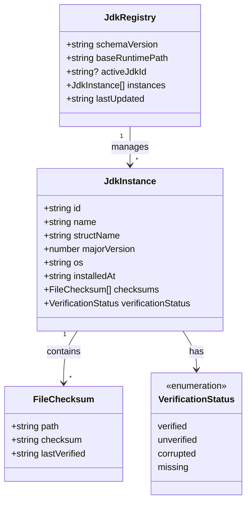
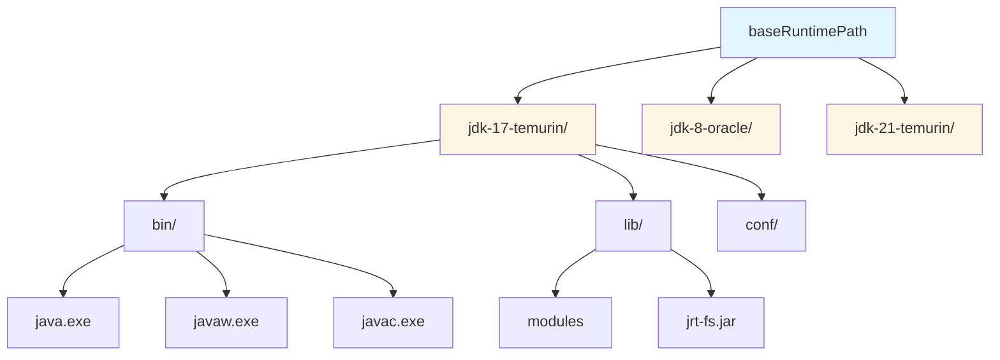
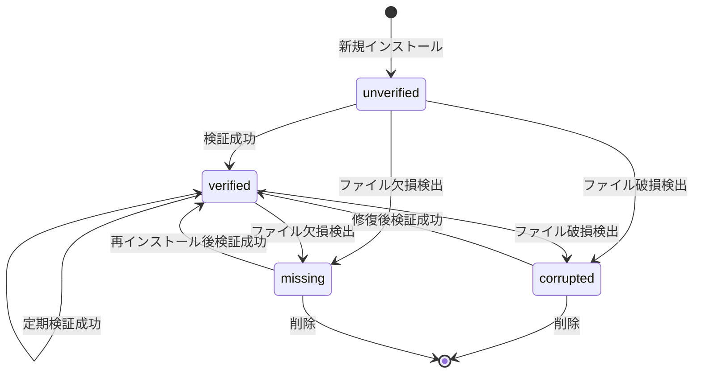

# JDKレジストリ スキーマ仕様書

**バージョン:** 1.0.0  
**最終更新:** 2025-10-21  
**用途:** Minecraft用Java実行環境管理

## 概要

このドキュメントは、Node.js + TypeScript環境でMinecraft用のJava開発環境（JDK）を管理するためのデータスキーマを定義します。本スキーマは、複数バージョンのJDKを一元管理し、ファイル整合性の検証を通じてアンチウイルスソフトによる誤削除を検出することを目的としています。

## データ構造全体図



## ディレクトリ構造

本システムでは、すべてのJDKインスタンスを単一のベースディレクトリ配下に配置します。



**パス構築ルール:**

$$\text{JDK Instance Path} = \text{baseRuntimePath} + / + \text{instance.id}$$

**例:**
- ベースパス: `C:\GameRuntimes\Java`
- インスタンスID: `jdk-17-temurin`
- 実際のパス: `C:\GameRuntimes\Java\jdk-17-temurin`

## 型定義詳細

### JdkRegistry

システム全体のJava実行環境を管理するルートデータ構造です。

| プロパティ | 型 | 必須 | 説明 |
|-----------|-----|------|------|
| `schemaVersion` | `string` | ✓ | データ構造のバージョン（例: "1.0.0"） |
| `baseRuntimePath` | `string` | ✓ | すべてのJDKを配置する親ディレクトリの絶対パス |
| `activeJdkId` | `string?` | - | デフォルトで使用されるJDKのID |
| `instances` | `JdkInstance[]` | ✓ | 管理下にあるすべてのJDKインスタンス |
| `lastUpdated` | `string` | ✓ | レジストリの最終更新日時（ISO 8601形式） |

**baseRuntimePathの役割**

このパスは、すべてのJDKインスタンスが配置される共通の親ディレクトリを指します。各JDKインスタンスは、このパス配下に`instance.id`をディレクトリ名として個別に保存されます。

**activeJdkIdの役割**

複数のJDKが登録されている場合、どのJDKをデフォルトで使用するかを示します。このフィールドは`instances`配列内のいずれかの`JdkInstance.id`と一致する必要があります。

### JdkInstance

個別のJava実行環境の完全な情報を保持します。

| プロパティ | 型 | 必須 | 説明 |
|-----------|-----|------|------|
| `id` | `string` | ✓ | 一意識別子（ディレクトリ名としても使用） |
| `name` | `string` | ✓ | ユーザー表示用の短い名前（例: "Java 17"） |
| `structName` | `string` | ✓ | 完全な正式名称（例: "Eclipse Temurin JDK 17.0.8+7"） |
| `majorVersion` | `number` | ✓ | メジャーバージョン番号（例: 8, 17, 21） |
| `os` | `string` | ✓ | OS種別（例: "windows", "linux", "darwin"） |
| `installedAt` | `string` | ✓ | インストール日時（ISO 8601形式） |
| `checksums` | `FileChecksum[]` | ✓ | ファイル整合性チェック情報 |
| `verificationStatus` | `VerificationStatus` | ✓ | 検証ステータス |

**idの命名規則**

推奨される命名規則は`jdk-{majorVersion}-{vendor}`です。例えば、`jdk-17-temurin`、`jdk-8-oracle`などです。この識別子はファイルシステム上のディレクトリ名として使用されるため、OSで有効なファイル名である必要があります。

**nameとstructNameの使い分け**

`name`はユーザーインターフェースでの表示用の短い名前です。一方、`structName`はベンダー名、詳細バージョン、ビルド番号などを含む完全な情報を保持します。ユーザーが詳細を確認したい場合に参照されます。

**majorVersionの用途**

このフィールドは、Minecraftの各バージョンが要求するJavaバージョンとの照合に使用されます。数値型であるため、プログラムでの比較や検索が容易です。

### FileChecksum

個別ファイルの整合性情報を保持します。

| プロパティ | 型 | 必須 | 説明 |
|-----------|-----|------|------|
| `path` | `string` | ✓ | ファイルの相対パス（JDKルートからの相対） |
| `checksum` | `string` | ✓ | SHA-256ハッシュ値 |
| `lastVerified` | `string` | ✓ | 最終検証日時（ISO 8601形式） |

**pathの形式**

JDKインスタンスのルートディレクトリからの相対パスで表現します。例えば、`bin/java.exe`、`lib/modules`などです。

**checksumの計算方法**

SHA-256アルゴリズムを使用してファイル内容のハッシュ値を計算します。このハッシュ値により、ファイルの改変や破損を検出できます。

**推奨チェックサム対象ファイル**

すべてのファイルをチェックサムする必要はありません。以下の重要なファイルのみを対象とすることを推奨します。

- `bin/java.exe` (Windows) / `bin/java` (Unix系)
- `bin/javaw.exe` (Windows)
- `bin/javac.exe` (Windows) / `bin/javac` (Unix系)
- `lib/modules`
- `lib/jrt-fs.jar`

### VerificationStatus

JDKインスタンスの整合性状態を示す列挙型です。



| 値 | 説明 |
|-----|------|
| `verified` | すべてのチェックサムが一致し、整合性が確認された状態 |
| `unverified` | 検証が未実行または最新でない状態 |
| `corrupted` | チェックサム不一致が検出され、ファイルが破損している状態 |
| `missing` | 必須ファイルが存在しない状態 |

**verified（検証済み）**

すべての登録済みファイルのチェックサムが一致し、ファイルの整合性が確認された状態です。このJDKインスタンスは安全に使用できます。

**unverified（未検証）**

インストール直後や、最後の検証から時間が経過している状態です。必ずしも問題があるわけではありませんが、使用前に検証を実行することを推奨します。

**corrupted（破損）**

一つ以上のファイルでチェックサムの不一致が検出された状態です。ファイルが改変または破損している可能性があります。再インストールまたは修復が必要です。

**missing（欠損）**

必須ファイルが存在しない状態です。アンチウイルスソフトによる誤削除や不完全なインストールが原因として考えられます。再インストールが必要です。

## データ例

### 最小構成

```json
{
  "schemaVersion": "1.0.0",
  "baseRuntimePath": "C:\\GameRuntimes\\Java",
  "instances": [],
  "lastUpdated": "2025-10-21T08:00:00Z"
}
```

### 単一JDKインスタンス

```json
{
  "schemaVersion": "1.0.0",
  "baseRuntimePath": "C:\\GameRuntimes\\Java",
  "activeJdkId": "jdk-17-temurin",
  "instances": [
    {
      "id": "jdk-17-temurin",
      "name": "Java 17",
      "structName": "Eclipse Temurin JDK 17.0.8+7",
      "majorVersion": 17,
      "os": "windows",
      "installedAt": "2024-03-15T10:30:00Z",
      "checksums": [
        {
          "path": "bin/java.exe",
          "checksum": "a3c5f1d8e9b2c4f6a8d7e3b1c9f5a2d4e6b8c1a3f5d7e9b2c4f6a8d7e3b1c9f5",
          "lastVerified": "2025-10-21T08:00:00Z"
        }
      ],
      "verificationStatus": "verified"
    }
  ],
  "lastUpdated": "2025-10-21T08:00:00Z"
}
```

### 複数JDKインスタンス

```json
{
  "schemaVersion": "1.0.0",
  "baseRuntimePath": "C:\\GameRuntimes\\Java",
  "activeJdkId": "jdk-17-temurin",
  "instances": [
    {
      "id": "jdk-17-temurin",
      "name": "Java 17",
      "structName": "Eclipse Temurin JDK 17.0.8+7",
      "majorVersion": 17,
      "os": "windows",
      "installedAt": "2024-03-15T10:30:00Z",
      "checksums": [
        {
          "path": "bin/java.exe",
          "checksum": "a3c5f1d8e9b2c4f6a8d7e3b1c9f5a2d4e6b8c1a3f5d7e9b2c4f6a8d7e3b1c9f5",
          "lastVerified": "2025-10-21T08:00:00Z"
        }
      ],
      "verificationStatus": "verified"
    },
    {
      "id": "jdk-8-oracle",
      "name": "Java 8",
      "structName": "Oracle JDK 8u381",
      "majorVersion": 8,
      "os": "windows",
      "installedAt": "2023-11-10T09:15:00Z",
      "checksums": [
        {
          "path": "bin/java.exe",
          "checksum": "d6f8a2c4e6b8d1a3f5e7c9b2d4f6a8e1c3d5f7a9b2c4e6f8a1d3e5f7c9b2d4f6",
          "lastVerified": "2025-10-15T12:00:00Z"
        }
      ],
      "verificationStatus": "verified"
    }
  ],
  "lastUpdated": "2025-10-21T08:45:00Z"
}
```

## 拡張性

本スキーマは将来的な拡張を考慮した設計となっています。

**スキーマバージョン管理**

`schemaVersion`フィールドにより、データ構造の変更時も後方互換性を維持できます。バージョン番号はセマンティックバージョニング（`major.minor.patch`）に従います。

**オプショナルフィールドの追加**

既存のインターフェースに新しいオプショナルフィールドを追加することで、既存データとの互換性を保ちながら機能拡張が可能です。
```

