//sonnet 4.5
# Minecraft Server Manager - 実装依頼書

**バージョン:** 1.0.0  
**作成日:** 2025-11-03  
**対象:** コーダー・実装担当者

---

## 📋 目次

1. [プロジェクト概要](#1-プロジェクト概要)
2. [環境セットアップ](#2-環境セットアップ)
3. [アーキテクチャ全体像](#3-アーキテクチャ全体像)
4. [型定義](#4-型定義)
5. [クラス実装仕様](#5-クラス実装仕様)
6. [エラーハンドリング指針](#6-エラーハンドリング指針)
7. [テスト仕様](#7-テスト仕様)
8. [ドキュメント作成指示](#8-ドキュメント作成指示)
9. [実装チェックリスト](#9-実装チェックリスト)

---

## 1. プロジェクト概要

### **目的**

Node.js + TypeScript環境で、複数のMinecraftサーバーインスタンスを統合管理するシステムを構築します。

### **主要機能**

```mermaid
mindmap
  root((Server Manager))
    インスタンス管理
      追加・削除・更新
      一覧取得
      データ永続化
    ライフサイクル制御
      起動・停止・再起動
      強制終了
      自動再起動
    入出力管理
      標準入出力監視
      コマンド送信
      制御文字対応
    設定管理
      server.properties編集
      ポート管理
      メモリ設定
    バリデーション
      名前重複チェック
      ポート競合チェック
      JDK存在確認
```

### **設計原則**

- ✅ **責任分離**: 各クラスが明確な責任を持つ
- ✅ **疎結合**: クラス間の依存を最小限に
- ✅ **拡張性**: 将来の機能追加を考慮
- ✅ **テスタビリティ**: 単体テスト可能な設計
- ✅ **可読性**: 初心者でも理解できるコード

---

## 2. 環境セットアップ

### **2.1 ディレクトリ構造**

```
project-root/
├── src/
│   ├── types/
│   │   ├── server-schema.ts           # データスキーマ定義
│   │   ├── validation.ts              # バリデーション型
│   │   └── callbacks.ts               # コールバック型
│   ├── classes/
│   │   ├── ServerManager.ts           # メインクラス
│   │   ├── ServerValidator.ts         # バリデーション
│   │   ├── ServerPropertiesManager.ts # server.properties管理
│   │   ├── ServerInstanceWrapper.ts   # インスタンス管理
│   │   └── ProcessExecutor.ts         # プロセス実行
│   ├── constants/
│   │   └── errors.ts                  # エラーメッセージ定数
│   └── index.ts                       # エントリポイント
├── config/
│   └── server-manager.json            # 設定ファイル（自動生成）
├── servers/                           # サーバーディレクトリ
├── logs/
│   └── manager.log                    # ログファイル
├── tests/
│   ├── setup/
│   │   └── test.env.json              # テスト用環境設定
│   ├── unit/                          # 単体テスト
│   ├── integration/                   # 統合テスト
│   └── e2e/                          # E2Eテスト
├── docs/
│   ├── test-cases.md                  # テスト項目一覧
│   ├── faq.md                        # FAQ（既知の問題）
│   └── api-usage.md                  # API使用例
├── package.json
├── tsconfig.json
└── README.md
```

### **2.2 依存パッケージ**

```json
{
  "name": "minecraft-server-manager",
  "version": "1.0.0",
  "dependencies": {
    "pino": "^8.16.0",
    "zod": "^3.22.0"
  },
  "devDependencies": {
    "@types/node": "^20.10.0",
    "typescript": "^5.3.0",
    "jest": "^29.7.0",
    "@types/jest": "^29.5.0",
    "ts-jest": "^29.1.0"
  }
}
```

### **2.3 TypeScript設定**

```json
{
  "compilerOptions": {
    "target": "ES2020",
    "module": "commonjs",
    "lib": ["ES2020"],
    "outDir": "./dist",
    "rootDir": "./src",
    "strict": true,
    "esModuleInterop": true,
    "skipLibCheck": true,
    "forceConsistentCasingInFileNames": true,
    "resolveJsonModule": true,
    "declaration": true,
    "declarationMap": true,
    "sourceMap": true
  },
  "include": ["src/**/*"],
  "exclude": ["node_modules", "dist", "tests"]
}
```

### **2.4 テスト環境設定**

`tests/setup/test.env.json`:
```json
{
  "jdkManager": {
    "configPath": "/path/to/jdk-registry.json",
    "jdkArchives": {
      "jdk8": "/path/to/jdk8.zip",
      "jdk17": "/path/to/jdk17.zip",
      "jdk21": "/path/to/jdk21.zip"
    }
  },
  "minecraftServer": {
    "vanillaJar": "/path/to/minecraft-server-1.20.1.jar",
    "paperJar": "/path/to/paper-1.20.1.jar"
  },
  "testPaths": {
    "configDir": "./tests/tmp/config",
    "serversDir": "./tests/tmp/servers",
    "logsDir": "./tests/tmp/logs"
  }
}
```

---

## 3. アーキテクチャ全体像

### **3.1 クラス関係図**

```mermaid
graph TB
    subgraph "外部システム"
        UI[UI/Orchestration Layer]
        JDK[JDKManager<br/>外部ライブラリ]
    end
    
    subgraph "Server Manager System"
        SM[ServerManager<br/>全体統括]
        SV[ServerValidator<br/>バリデーション]
        SPM[ServerPropertiesManager<br/>server.properties管理]
        
        subgraph "Instance Layer"
            W1[ServerInstanceWrapper 1]
            W2[ServerInstanceWrapper 2]
            WN[ServerInstanceWrapper N]
        end
        
        subgraph "Process Layer"
            PE1[ProcessExecutor 1]
            PE2[ProcessExecutor 2]
            PEN[ProcessExecutor N]
        end
    end
    
    subgraph "Data Layer"
        Config[(server-manager.json)]
        Props[(server.properties)]
        Logs[(manager.log)]
    end
    
    UI -->|initialize, method calls| SM
    SM -.->|callbacks| UI
    SM --> SV
    SM --> SPM
    SM --> JDK
    
    SM --> W1
    SM --> W2
    SM --> WN
    
    W1 --> PE1
    W2 --> PE2
    WN --> PEN
    
    W1 --> JDK
    W2 --> JDK
    WN --> JDK
    
    SM <-->|read/write| Config
    SPM <-->|read/write| Props
    SM -->|write| Logs
    
    style SM fill:#e1f5ff,stroke:#01579b,stroke-width:3px
    style SV fill:#fff3e0,stroke:#e65100,stroke-width:2px
    style SPM fill:#fff3e0,stroke:#e65100,stroke-width:2px
    style W1 fill:#fff4e1,stroke:#f57c00,stroke-width:2px
    style W2 fill:#fff4e1,stroke:#f57c00,stroke-width:2px
    style WN fill:#fff4e1,stroke:#f57c00,stroke-width:2px
    style PE1 fill:#e8f5e9,stroke:#1b5e20,stroke-width:2px
    style PE2 fill:#e8f5e9,stroke:#1b5e20,stroke-width:2px
    style PEN fill:#e8f5e9,stroke:#1b5e20,stroke-width:2px
```

### **3.2 責任分離マトリクス**

| クラス | 責任 | 依存先 | 依存元 |
|-------|------|--------|--------|
| **ServerManager** | 全体統括、設定管理、外部API | Validator, Wrapper, JDKManager | UI層 |
| **ServerValidator** | バリデーションロジック | Manager（読み取り）, JDKManager | Manager |
| **ServerPropertiesManager** | server.properties管理 | なし（完全独立） | Manager, Wrapper |
| **ServerInstanceWrapper** | 個別サーバー制御 | ProcessExecutor, JDKManager | Manager |
| **ProcessExecutor** | プロセス実行 | なし（完全独立） | Wrapper |

### **3.3 データフロー**

```mermaid
sequenceDiagram
    participant UI as UI Layer
    participant SM as ServerManager
    participant SV as ServerValidator
    participant W as ServerInstanceWrapper
    participant PE as ProcessExecutor
    participant MC as Minecraft Server
    
    rect rgb(225, 245, 254)
        Note over UI,SM: 初期化フェーズ
        UI->>SM: initialize(paths, jdkManager, callbacks)
        SM->>SM: loadConfig()
        SM->>SM: createWrappers()
        SM-->>UI: manager instance
    end
    
    rect rgb(255, 243, 224)
        Note over UI,MC: サーバー起動フェーズ
        UI->>SM: startServer(uuid)
        SM->>SV: validateServerStart(uuid)
        SV-->>SM: validation result
        SM->>W: start()
        W->>PE: new ProcessExecutor()
        W->>PE: start(javaPath, jarPath, args)
        PE->>MC: spawn process
        MC-->>PE: process started
        PE-->>W: started
        W->>SM: reportEvent('started')
        SM->>UI: callbacks.onServerStarted(uuid)
    end
    
    rect rgb(232, 245, 233)
        Note over UI,MC: 実行中フェーズ
        UI->>SM: sendCommand(uuid, 'say Hello')
        SM->>W: sendCommand('say Hello')
        W->>PE: sendCommand('say Hello')
        PE->>MC: stdin: 'say Hello\n'
        MC->>PE: stdout: '[Server] Hello'
        PE->>W: emit('stdout', line)
        W->>SM: (EventEmitter経由)
        SM->>UI: callbacks.onStdout(line)
    end
```

---

## 4. 型定義

### **4.1 データスキーマ（`types/server-schema.ts`）**

**重要ポイント:**
- Step1で確定したスキーマをそのまま使用
- Zodスキーマも併せて定義（バリデーション用）

```typescript
import { z } from 'zod';

// ========================================
// 基本型定義
// ========================================

export type ServerStatus = 'stopped' | 'running' | 'crashed';

export interface ServerSoftware {
  name: string;
  version: string;
}

export interface ServerLaunchConfig {
  jarPath: string;
  port: number;
  jdkVersion: number;  // ⚠️ number型（JDKManager仕様に合わせる）
  maxMemory: number;
  minMemory: number;
  jvmArguments: string[];
  serverArguments: string[];
}

export interface ServerMetadata {
  createdAt: string;
  updatedAt: string;
  lastStartedAt: string | null;
  totalUptime: number;
}

export interface AutoRestartConfig {
  enabled: boolean;
  maxConsecutiveRestarts: number;
  resetThresholdSeconds: number;
}

export interface ServerInstance {
  uuid: string;
  name: string;
  note: string;
  status: ServerStatus;
  software: ServerSoftware;
  launchConfig: ServerLaunchConfig;
  metadata: ServerMetadata;
  autoRestart: AutoRestartConfig;
}

export interface ServerManagerConfig {
  configVersion: string;
  instances: ServerInstance[];
  lastUpdated: string;
}

// ========================================
// 実行時専用型（非永続化）
// ========================================

export interface RuntimeState {
  consecutiveRestartCount: number;
  lastRestartTime: number | null;
  resetTimerId: NodeJS.Timeout | null;
  currentSessionStartTime: number | null;
}

// ========================================
// Zodスキーマ（バリデーション用）
// ========================================

export const ServerManagerConfigSchema = z.object({
  configVersion: z.string(),
  instances: z.array(z.any()), // 詳細は省略可
  lastUpdated: z.string()
});
```

### **4.2 バリデーション型（`types/validation.ts`）**

```typescript
export interface ValidationResult {
  valid: boolean;
  error?: string;
  warnings?: string[];
}

export class ValidationResultHelper {
  static success(warnings?: string[]): ValidationResult {
    return { valid: true, warnings };
  }
  
  static failure(error: string): ValidationResult {
    return { valid: false, error };
  }
  
  static warning(warnings: string[]): ValidationResult {
    return { valid: true, warnings };
  }
}
```

### **4.3 コールバック型（`types/callbacks.ts`）**

```typescript
export type InstanceEventType = 
  | 'started'
  | 'stopped'
  | 'crashed'
  | 'autoRestartLimitReached'
  | 'stopTimeout'
  | 'forcedKill';

export interface InstanceEvent {
  type: InstanceEventType;
  uuid: string;
  timestamp: number;
  data?: any;
}

export type NotifyFunction = (event: InstanceEvent) => void;

export interface ServerCallbacks {
  onServerStarted?: (uuid: string) => void;
  onServerStopped?: (uuid: string, exitCode: number) => void;
  onServerCrashed?: (uuid: string, error: Error) => void;
  onAutoRestartLimitReached?: (uuid: string) => void;
  onStopTimeout?: (uuid: string, message: string) => void;
  onForcedKill?: (uuid: string) => void;
}

export interface ProcessStdCallbacks {
  onStdout?: (line: string) => void;
  onStderr?: (line: string) => void;
}
```

### **4.4 エラーメッセージ定数（`constants/errors.ts`）**

```typescript
export const ServerManagerErrors = {
  // インスタンス管理
  INSTANCE_NOT_FOUND: 'Server instance not found',
  INSTANCE_NAME_DUPLICATE: 'Server name already exists',
  INSTANCE_RUNNING: 'Server is currently running',
  INSTANCE_NOT_RUNNING: 'Server is not running',
  
  // JDK関連
  JDK_NOT_FOUND: 'Required JDK version not found',
  JDK_VERSION_INVALID: 'Invalid JDK version',
  
  // ファイル操作
  FILE_NOT_FOUND: 'File not found',
  FILE_LOCKED: 'File is locked by another process',
  DIRECTORY_RENAME_FAILED: 'Failed to rename directory',
  DIRECTORY_DELETE_FAILED: 'Failed to delete directory',
  FILE_COPY_FAILED: 'Failed to copy file',
  
  // ポート
  PORT_IN_USE: 'Port is already in use by another server',
  PORT_INVALID: 'Invalid port number',
  
  // 設定
  CONFIG_LOAD_FAILED: 'Failed to load configuration',
  CONFIG_SAVE_FAILED: 'Failed to save configuration',
  CONFIG_INVALID: 'Invalid configuration data',
  
  // プロセス
  PROCESS_START_FAILED: 'Failed to start server process',
  PROCESS_STOP_TIMEOUT: 'Server did not stop within timeout period',
  
  // レジストリ
  REGISTRY_NOT_LOADED: 'Registry not loaded',
} as const;
```

---

## 5. クラス実装仕様

### **5.1 ServerManager**

#### **責任範囲**

```mermaid
graph TB
    SM[ServerManager]
    
    R1[全体統括]
    R2[設定ファイル管理]
    R3[インスタンス一覧管理]
    R4[バリデーション委譲]
    R5[イベント配信]
    R6[稼働時間追跡]
    
    SM --> R1
    SM --> R2
    SM --> R3
    SM --> R4
    SM --> R5
    SM --> R6
```

#### **主要メソッドとフロー**

**初期化:**


**addInstance:**


**startServer:**


#### **実装時の重要ポイント**

1. **初期化は必ず`static initialize()`経由**
   - コンストラクタはprivate
   - 非同期処理（ファイル読み込み等）を含むため

2. **すべてのバリデーションはValidatorに委譲**
   - Manager内に直接バリデーションロジックを書かない

3. **稼働時間追跡は5分ごと**
   - `setInterval`でタイマー管理
   - `uptimeIntervals: Map<string, NodeJS.Timeout>`に保存

4. **エラーハンドリング**
   - すべてのファイル操作はtry-catchで囲む
   - エラー時は詳細なログを記録
   - 適切なエラーメッセージを返却

---

### **5.2 ServerValidator**

#### **責任範囲**

```mermaid
graph TB
    SV[ServerValidator]
    
    R1[名前バリデーション]
    R2[ポートバリデーション]
    R3[JDKバージョン確認]
    R4[メモリ設定確認]
    R5[複合バリデーション]
    
    SV --> R1
    SV --> R2
    SV --> R3
    SV --> R4
    SV --> R5
```

#### **バリデーションフロー**


#### **実装時の重要ポイント**

1. **依存は読み取り専用**
   - ServerManagerのデータを変更しない
   - `getInstanceByName()`, `getAllInstances()`のみ使用

2. **警告とエラーの区別**
   - エラー: 処理を続行できない（`valid: false`）
   - 警告: 注意が必要だが続行可能（`valid: true, warnings: [...]`）

3. **JDK存在確認**
   - `jdkManager.Entrys.getByVersion()`の結果をチェック
   - 整合性ステータスも確認（missing/corrupted）

---

### **5.3 ServerPropertiesManager**

#### **責任範囲**

```mermaid
graph TB
    SPM[ServerPropertiesManager]
    
    R1[ファイル読み書き]
    R2[プロパティ解析]
    R3[ポート管理]
    R4[拡張可能なAPI]
    
    SPM --> R1
    SPM --> R2
    SPM --> R3
    SPM --> R4
```

#### **プロパティ更新フロー**


#### **実装時の重要ポイント**

1. **1インスタンス = 1ファイル**
   - 使い捨てインスタンス（呼び出しのたびに生成）
   - 内部のMapは1ファイル内のプロパティを表現

2. **既存データの保持**
   - `update()`時は他のプロパティを保持
   - 正規表現で該当行のみ置き換え

3. **拡張性**
   - `updatePort()`をテンプレートに他のプロパティ用メソッドを追加可能
   - コピペ+編集で簡単に拡張

---

### **5.4 ServerInstanceWrapper**

#### **責任範囲**

```mermaid
graph TB
    W[ServerInstanceWrapper]
    
    R1[個別サーバー制御]
    R2[プロセス管理]
    R3[JDKロック管理]
    R4[自動再起動判定]
    R5[標準入出力イベント]
    
    W --> R1
    W --> R2
    W --> R3
    W --> R4
    W --> R5
```

#### **起動フロー**

```mermaid
sequenceDiagram
    participant W as Wrapper
    participant JDK as JDKManager
    participant PE as ProcessExecutor
    
    W->>JDK: Entrys.getByVersion(jdkVersion)
    JDK-->>W: JDKEntry
    W->>JDK: useRuntime(purpose)
    JDK-->>W: lockId
    W->>PE: new ProcessExecutor(logger, workingDir)
    W->>PE: コールバック設定
    W->>PE: start(javaPath, jarPath, args)
    PE-->>W: 起動完了
    W->>W: status = 'running'
    W->>W: startResetTimer()
    W->>W: reportEvent('started')
```

#### **自動再起動フロー**

```mermaid
flowchart TD
    Exit([プロセス終了]) --> CheckCode{exitCode?}
    CheckCode -->|0| Normal[正常終了]
    CheckCode -->|!= 0| Crash[クラッシュ]
    
    Normal --> Cleanup[cleanup]
    Normal --> ReportStopped[reportEvent stopped]
    
    Crash --> CheckAuto{autoRestart<br/>enabled?}
    CheckAuto -->|No| Cleanup
    CheckAuto -->|Yes| CheckLimit{上限チェック}
    
    CheckLimit -->|超過| ReportLimit[reportEvent<br/>autoRestartLimitReached]
    CheckLimit -->|OK| Increment[count++]
    
    ReportLimit --> Cleanup
    Increment --> Restart[attemptAutoRestart]
```

#### **実装時の重要ポイント**

1. **EventEmitterの継承**
   - `extends EventEmitter`
   - 標準入出力用に`emit('stdout', line)`等を使用

2. **JDKロックの確実な解放**
   - 起動成功時、失敗時、停止時すべてで解放
   - `finally`ブロックの活用

3. **リセットタイマーの管理**
   - 起動時に開始（10分後にリセット）
   - 停止時にクリア
   - `clearTimeout()`を忘れずに

4. **自己完結的なパス管理**
   - `serversBasePath`を保持
   - `getWorkingDirectory()`で自分でパス構築

---

### **5.5 ProcessExecutor**

#### **責任範囲**

```mermaid
graph TB
    PE[ProcessExecutor]
    
    R1[プロセス起動・停止]
    R2[標準入出力管理]
    R3[制御文字対応]
    R4[タイムアウト処理]
    
    PE --> R1
    PE --> R2
    PE --> R3
    PE --> R4
```

#### **起動・停止フロー**

```mermaid
sequenceDiagram
    participant W as Wrapper
    participant PE as ProcessExecutor
    participant CP as child_process
    
    rect rgb(225, 245, 254)
        Note over W,CP: 起動
        W->>PE: start(javaPath, jarPath, args)
        PE->>CP: spawn(javaPath, args, options)
        CP-->>PE: ChildProcess
        PE->>PE: setupOutputHandlers()
        PE->>PE: イベント監視開始
        PE-->>W: 完了
    end
    
    rect rgb(255, 243, 224)
        Note over W,CP: 停止
        W->>PE: stop(timeout)
        PE->>CP: stdin.write('stop\n')
        PE->>PE: waitForExit(timeout)
        alt タイムアウト内に終了
            CP->>PE: exit event
            PE->>W: onExit(exitCode)
        else タイムアウト
            PE->>W: onStopTimeout()
        end
    end
```

#### **制御文字対応**

```typescript
enum ControlCharacter {
  ENTER = '\n',
  CTRL_C = '\x03',
  TAB = '\t'
}
```

```mermaid
graph LR
    Input[入力] --> Type{種別}
    Type -->|sendCommand| AddEnter[文字列 + Enter]
    Type -->|sendInput| Direct[そのまま]
    Type -->|sendControlCharacter| Convert[制御文字変換]
    
    AddEnter --> Write[stdin.write]
    Direct --> Write
    Convert --> Write
```

#### **実装時の重要ポイント**

1. **完全独立クラス**
   - ServerManager/Wrapperの概念に依存しない
   - 汎用的なプロセス実行クラス

2. **readline interfaceの使用**
   - 標準出力を行単位で処理
   - `createInterface({ input: process.stdout })`

3. **タイムアウトは通知のみ**
   - `stop()`でタイムアウトしても強制終了しない
   - `onStopTimeout`コールバックで通知
   - `kill()`はユーザーが明示的に呼び出す

4. **制御文字の実装**
   - `sendCommand()`: 既存互換（テキスト + Enter）
   - `sendInput()`: Enterなし
   - `sendControlCharacter()`: 制御文字送信

---

## 6. エラーハンドリング指針

### **6.1 基本方針**

```mermaid
graph TB
    Error[エラー発生] --> Catch[try-catchでキャッチ]
    Catch --> Log[詳細ログ記録]
    Log --> Return[適切なエラー返却]
    Return --> NoThrow[上位に投げない]
    
    style Error fill:#ffcdd2
    style Catch fill:#fff9c4
    style Log fill:#e1f5ff
    style Return fill:#c8e6c9
```

**原則:**
- ✅ すべてのファイル操作はtry-catchで囲む
- ✅ エラーは詳細にログ記録
- ✅ ユーザーに分かりやすいエラーメッセージ
- ✅ 例外を上位に投げず、Result型で返す
- ✅ クリティカルなエラーのみthrow

### **6.2 エラーハンドリングパターン**

#### **パターン1: ファイル操作**

```typescript
async removeInstance(uuid: string): Promise<VoidResult> {
  const instance = this.instances.get(uuid);
  if (!instance) {
    return { success: false, error: ServerManagerErrors.INSTANCE_NOT_FOUND };
  }
  
  const serverDir = path.join(this.serversBasePath, instance.getData().name);
  
  try {
    await fs.promises.rm(serverDir, { recursive: true, force: true });
    this.logger.info(`Deleted directory: ${serverDir}`);
  } catch (error) {
    this.logger.error(`Failed to delete directory: ${serverDir}`, error);
    // ❌ ディレクトリ削除失敗 → 全処理キャンセル
    return { 
      success: false, 
      error: `${ServerManagerErrors.DIRECTORY_DELETE_FAILED}: ${error.message}` 
    };
  }
  
  // ✅ ディレクトリ削除成功 → レジストリ更新
  this.instances.delete(uuid);
  await this.saveConfig();
  
  return { success: true };
}
```

#### **パターン2: 非クリティカルなエラー**

```typescript
async updateInstance(params: UpdateInstanceParams): Promise<VoidResult> {
  // ... 前処理
  
  // ポート変更（失敗しても処理継続）
  if (params.updates.port !== undefined) {
    try {
      const propManager = this.getServerPropertiesManager(params.uuid);
      await propManager.updatePort(params.updates.port);
      this.logger.info(`Updated port to ${params.updates.port}`);
    } catch (error) {
      // ⚠️ server.properties更新失敗 → 警告のみ
      this.logger.warn('Failed to update server.properties', error);
      this.logger.warn('Port updated in registry, but server.properties update failed');
      // 処理は継続
    }
  }
  
  // インスタンスデータ更新（必ず実行）
  instance.updateData(params.updates);
  await this.saveConfig();
  
  return { success: true };
}
```

#### **パターン3: バリデーションエラー**

```typescript
async addInstance(params: AddInstanceParams): Promise<AddInstanceResult> {
  // バリデーション
  const validation = await this.validator.validateAddInstance(params);
  if (!validation.valid) {
    // ❌ バリデーション失敗 → 即座に返却
    return { success: false, error: validation.error };
  }
  
  // ⚠️ 警告がある場合はログ記録
  if (validation.warnings && validation.warnings.length > 0) {
    validation.warnings.forEach(warning => {
      this.logger.warn(warning);
    });
  }
  
  // 処理継続...
}
```

### **6.3 ログレベルの使い分け**

| レベル | 用途 | 例 |
|--------|------|-----|
| `debug` | 詳細な処理内容 | メソッド呼び出し、変数の値 |
| `info` | 正常な処理 | サーバー起動成功、設定保存 |
| `warn` | 警告（処理は継続） | server.properties更新失敗、メモリ警告 |
| `error` | エラー（処理中断） | ディレクトリ削除失敗、JDK未発見 |

---

## 7. テスト仕様

### **7.1 テスト環境のセットアップ**

#### **test.env.json の使用**

```typescript
// tests/setup/loadTestEnv.ts
import * as fs from 'fs';
import * as path from 'path';

export interface TestEnv {
  jdkManager: {
    configPath: string;
    jdkArchives: {
      jdk8: string;
      jdk17: string;
      jdk21: string;
    };
  };
  minecraftServer: {
    vanillaJar: string;
    paperJar: string;
  };
  testPaths: {
    configDir: string;
    serversDir: string;
    logsDir: string;
  };
}

export function loadTestEnv(): TestEnv {
  const envPath = path.join(__dirname, 'test.env.json');
  const content = fs.readFileSync(envPath, 'utf-8');
  return JSON.parse(content);
}
```

### **7.2 テストの構成**

```mermaid
graph TB
    subgraph "テスト階層"
        Unit[単体テスト<br/>各クラス個別]
        Integration[統合テスト<br/>クラス間連携]
        E2E[E2Eテスト<br/>実際のサーバー起動]
    end
    
    subgraph "テストドキュメント"
        Cases[test-cases.md<br/>手動テスト項目一覧]
    end
    
    Unit --> Integration
    Integration --> E2E
    E2E --> Cases
    
    style Unit fill:#e8f5e9
    style Integration fill:#fff9c4
    style E2E fill:#ffcdd2
    style Cases fill:#e1f5ff
```

### **7.3 統合テストの例**

```typescript
// tests/integration/server-lifecycle.test.ts
import { ServerManager } from '../../src/classes/ServerManager';
import { JdkManager } from 'jdk-manager';
import { loadTestEnv } from '../setup/loadTestEnv';

describe('Server Lifecycle Integration Test', () => {
  let manager: ServerManager;
  let jdkManager: JdkManager;
  const testEnv = loadTestEnv();
  
  beforeAll(async () => {
    // JDKManager初期化
    jdkManager = new JdkManager(testEnv.jdkManager.configPath);
    await jdkManager.Data.load();
    
    // ServerManager初期化
    manager = await ServerManager.initialize(
      testEnv.testPaths.configDir + '/server-manager.json',
      testEnv.testPaths.serversDir,
      testEnv.testPaths.logsDir + '/manager.log',
      jdkManager
    );
  });
  
  test('サーバーの追加・起動・停止・削除', async () => {
    // 1. サーバー追加
    const addResult = await manager.addInstance({
      name: 'test-server',
      note: 'テスト用サーバー',
      software: { name: 'Vanilla', version: '1.20.1' },
      jdkVersion: 17,
      serverBinaryFilePath: testEnv.minecraftServer.vanillaJar
    });
    
    expect(addResult.success).toBe(true);
    const uuid = addResult.uuid!;
    
    // 2. サーバー起動
    const startResult = await manager.startServer(uuid);
    expect(startResult.success).toBe(true);
    
    // 3. ステータス確認
    const data = manager.getInstanceData(uuid);
    expect(data?.status).toBe('running');
    
    // 4. サーバー停止
    const stopResult = await manager.stopServer(uuid);
    expect(stopResult.success).toBe(true);
    
    // 5. サーバー削除
    const removeResult = await manager.removeInstance(uuid);
    expect(removeResult.success).toBe(true);
  });
});
```

### **7.4 E2Eテストの例**

```typescript
// tests/e2e/minecraft-server.test.ts
describe('Minecraft Server E2E Test', () => {
  test('実際にMinecraftサーバーが起動し、コマンドが実行できる', async () => {
    // ... 初期化
    
    const addResult = await manager.addInstance({
      name: 'e2e-server',
      note: 'E2Eテスト',
      software: { name: 'Vanilla', version: '1.20.1' },
      jdkVersion: 17,
      serverBinaryFilePath: testEnv.minecraftServer.vanillaJar
    });
    
    const uuid = addResult.uuid!;
    
    // 標準出力監視
    const outputs: string[] = [];
    manager.openProcessStd(uuid, {
      onStdout: (line) => outputs.push(line)
    });
    
    // 起動
    await manager.startServer(uuid);
    
    // サーバー起動完了を待機（"Done"メッセージ）
    await waitForServerReady(outputs, 60000);
    
    // コマンド送信
    manager.sendCommand(uuid, 'list');
    
    // 応答待機
    await new Promise(resolve => setTimeout(resolve, 1000));
    
    // 出力確認
    const hasListOutput = outputs.some(line => 
      line.includes('There are') && line.includes('players online')
    );
    expect(hasListOutput).toBe(true);
    
    // 停止
    await manager.stopServer(uuid, 30000);
    await manager.removeInstance(uuid);
  });
});
```

---

## 8. ドキュメント作成指示

### **8.1 テスト項目一覧（`docs/test-cases.md`）**

以下の形式でテストケースを記載してください：

```markdown
# テスト項目一覧

## 1. インスタンス管理

### 1.1 インスタンス追加

| ID | テスト項目 | 手順 | 期待結果 |
|----|----------|------|---------|
| TC-001 | 正常なインスタンス追加 | 1. 有効なパラメータでaddInstance呼び出し<br/>2. 結果確認 | success: true, uuidが返却される |
| TC-002 | 名前重複エラー | 1. 同じ名前で2回addInstance<br/>2. 2回目の結果確認 | success: false, error: "Name already exists" |
| TC-003 | 無効なJDKバージョン | 1. 存在しないJDKバージョンを指定<br/>2. 結果確認 | success: false, error: "JDK not found" |

## 2. サーバー起動・停止

### 2.1 起動

| ID | テスト項目 | 手順 | 期待結果 |
|----|----------|------|---------|
| TC-101 | 正常起動 | 1. stopServer呼び出し<br/>2. ステータス確認 | status: 'running' |
| TC-102 | 既に起動中のサーバー起動 | 1. 起動中のサーバーに対してstartServer<br/>2. 結果確認 | success: false, error: "Already running" |

...
```

### **8.2 FAQ（`docs/faq.md`）**

```markdown
# FAQ - 既知の問題と対処法

## ポート関連

### Q1: ポート重複チェックを通過したのに起動に失敗する

**原因:**
- 外部アプリケーションがポートを使用中
- OS側でポートがブロックされている
- ファイアウォールの設定

**対処法:**
1. `netstat -ano | findstr :{PORT}` (Windows) でポート使用状況確認
2. 他のアプリケーションを終了
3. ファイアウォール設定を確認

## クラッシュ判定

### Q2: 正常終了なのにクラッシュ扱いになる

**原因:**
- 一部のサーバーソフトウェアは正常終了でもexitCode != 0を返す場合がある

**対処法:**
- 現在の実装ではexitCode == 0のみを正常終了と判定
- 将来的にソフトウェアごとの判定ロジック追加を検討

...
```

### **8.3 API使用例（`docs/api-usage.md`）**

```markdown
# API使用例

## 基本的な使用方法

### 初期化

\`\`\`typescript
import { ServerManager } from './classes/ServerManager';
import { JdkManager } from 'jdk-manager';

// JDKManager初期化
const jdkManager = new JdkManager('./jdk-registry.json');
await jdkManager.Data.load();

// ServerManager初期化
const manager = await ServerManager.initialize(
  './config/server-manager.json',
  './servers',
  './logs/manager.log',
  jdkManager,
  {
    onServerStarted: (uuid) => console.log(`Started: ${uuid}`),
    onServerCrashed: (uuid, error) => console.error(`Crashed: ${uuid}`, error)
  }
);
\`\`\`

...
```

---

## 9. 実装チェックリスト

### **9.1 クラス実装**

#### **ServerManager**
- [ ] `static initialize()`の実装
- [ ] `addInstance()`の実装
- [ ] `removeInstance()`の実装（ディレクトリ削除失敗時は全キャンセル）
- [ ] `updateInstance()`の実装（noteのみ起動中更新可）
- [ ] `startServer()`の実装
- [ ] `stopServer()`の実装
- [ ] `restartServer()`の実装
- [ ] `forceKillServer()`の実装
- [ ] `getInstance()`の実装
- [ ] `getInstanceData()`の実装
- [ ] `getAllInstances()`の実装
- [ ] `getRunningInstances()`の実装
- [ ] `getValidator()`の実装
- [ ] `getServerPropertiesManager()`の実装
- [ ] `openProcessStd()`の実装
- [ ] `closeProcessStd()`の実装
- [ ] `sendCommand()`の実装
- [ ] 稼働時間追跡（5分ごと）の実装
- [ ] イベントハンドリングの実装

#### **ServerValidator**
- [ ] `validateName()`の実装
- [ ] `validatePort()`の実装（警告機能含む）
- [ ] `validateJdkVersion()`の実装
- [ ] `validateMemorySettings()`の実装
- [ ] `validateJvmArguments()`の実装
- [ ] `validateAddInstance()`の実装
- [ ] `validateUpdateInstance()`の実装
- [ ] `validateServerStart()`の実装

#### **ServerPropertiesManager**
- [ ] `create()`の実装
- [ ] `read()`の実装
- [ ] `write()`の実装
- [ ] `update()`の実装
- [ ] `updateMultiple()`の実装
- [ ] `get()`の実装
- [ ] `exists()`の実装
- [ ] `updatePort()`の実装
- [ ] `getPort()`の実装
- [ ] プロパティ解析ロジックの実装

#### **ServerInstanceWrapper**
- [ ] コンストラクタの実装
- [ ] `start()`の実装
- [ ] `stop()`の実装
- [ ] `restart()`の実装
- [ ] `forceKill()`の実装
- [ ] `sendCommand()`の実装
- [ ] `getData()`の実装（ディープコピー）
- [ ] `updateData()`の実装
- [ ] `getStatus()`の実装
- [ ] `isRunning()`の実装
- [ ] EventEmitter機能の実装
- [ ] JDKロック管理の実装
- [ ] 自動再起動ロジックの実装
- [ ] リセットタイマーの実装
- [ ] プロセス終了ハンドリングの実装

#### **ProcessExecutor**
- [ ] コンストラクタの実装
- [ ] `start()`の実装
- [ ] `stop()`の実装（タイムアウト処理）
- [ ] `kill()`の実装
- [ ] `sendCommand()`の実装
- [ ] `sendInput()`の実装
- [ ] `sendControlCharacter()`の実装
- [ ] `isRunning()`の実装
- [ ] `getPid()`の実装
- [ ] 標準出力ハンドラーの実装
- [ ] 標準エラー出力ハンドラーの実装
- [ ] `waitForExit()`の実装
- [ ] `cleanup()`の実装

### **9.2 エラーハンドリング**
- [ ] すべてのファイル操作にtry-catchを実装
- [ ] 適切なエラーメッセージの返却
- [ ] ログ記録の実装
- [ ] クリティカルエラーとそうでないエラーの区別

### **9.3 テスト**
- [ ] 統合テストの実装
- [ ] E2Eテストの実装
- [ ] テスト項目一覧ドキュメントの作成
- [ ] test.env.jsonの設定

### **9.4 ドキュメント**
- [ ] test-cases.mdの作成
- [ ] faq.mdの作成
- [ ] api-usage.mdの作成
- [ ] README.mdの作成

---

## 🎉 完了

この実装依頼書に従って実装を進めてください。

**不明点がある場合:**
1. 設計ドキュメント（Step1, Step2）を参照
2. JDKManagerのソースコードを参照
3. 質問リストを作成して確認

**実装のポイント:**
- ✅ 責任分離を意識
- ✅ エラーハンドリングを徹底
- ✅ ログを詳細に記録
- ✅ テストを書きながら実装
- ✅ ドキュメントを更新

**頑張ってください！🚀**
