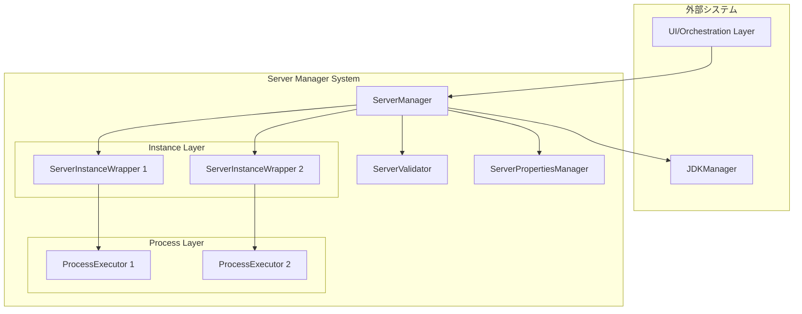

# Minecraft Server Manager

Node.js + TypeScript環境で、複数のMinecraftサーバーインスタンスを統合管理するシステム

## 📋 Features

- ✅ **マルチインスタンス管理**: 複数のMinecraftサーバーを一元管理
- ✅ **ライフサイクル制御**: 起動・停止・再起動・強制終了
- ✅ **自動再起動**: クラッシュ時の自動再起動機能
- ✅ **JDK管理連携**: JDKManagerとの統合
- ✅ **設定管理**: server.propertiesの自動管理
- ✅ **バリデーション**: 名前・ポート・メモリ・JDKの検証
- ✅ **イベントコールバック**: サーバー状態変更の通知
- ✅ **稼働時間追跡**: サーバーの累計稼働時間を記録

## 🚀 Quick Start

### Installation

```bash
npm install
npm run build
```

### Basic Usage

```typescript
import { ServerManager } from './src';
import { JdkManager } from '../jdk-manager';

// JDKManager初期化
const jdkManager = new JdkManager('./runtime');
await jdkManager.Data.load();

// ServerManager初期化
const manager = await ServerManager.initialize(
  './config/server-manager.json',
  './servers',
  './logs/manager.log',
  jdkManager,
  {
    onServerStarted: (uuid) => console.log(`Started: ${uuid}`),
    onServerStopped: (uuid, exitCode) => console.log(`Stopped: ${uuid}`),
    onServerCrashed: (uuid, error) => console.error(`Crashed: ${uuid}`, error)
  }
);

// サーバー追加
const result = await manager.addInstance({
  name: 'survival-server',
  note: 'メインのサバイバルサーバー',
  software: { name: 'Paper', version: '1.20.1' },
  jdkVersion: 17,
  serverBinaryFilePath: '/path/to/paper-1.20.1.jar',
  port: 25565,
  maxMemory: 4096,
  minMemory: 2048
});

if (result.success) {
  const uuid = result.uuid!;
  
  // サーバー起動
  await manager.startServer(uuid);
  
  // コマンド送信
  manager.sendCommand(uuid, 'say Hello World!');
  
  // サーバー停止
  await manager.stopServer(uuid);
}
```

## 📚 Documentation

詳細なドキュメントは以下を参照してください：

- [API Reference](./docs/api-reference.md) - 全メソッドの詳細仕様
- [Architecture](./docs/architecture.md) - システムアーキテクチャ
- [FAQ](./docs/faq.md) - よくある質問と既知の問題

## 🏗️ Architecture



## 📦 Project Structure

```
minecraft-server-manager/
├── src/
│   ├── types/              # 型定義
│   ├── classes/            # クラス実装
│   ├── constants/          # 定数
│   └── index.ts            # エントリーポイント
├── config/                 # 設定ファイル
├── servers/                # サーバーディレクトリ
├── logs/                   # ログファイル
├── tests/                  # テスト
├── docs/                   # ドキュメント
├── package.json
├── tsconfig.json
└── README.md
```

## 🔧 Configuration

設定ファイル (`server-manager.json`) は自動生成されます。

```json
{
  "configVersion": "1.0.0",
  "instances": [
    {
      "uuid": "550e8400-e29b-41d4-a716-446655440000",
      "name": "survival-server",
      "note": "メインのサバイバルサーバー",
      "status": "stopped",
      "software": {
        "name": "Paper",
        "version": "1.20.1"
      },
      "launchConfig": {
        "jarPath": "./servers/survival-server/server.jar",
        "port": 25565,
        "jdkVersion": 17,
        "maxMemory": 4096,
        "minMemory": 2048,
        "jvmArguments": [],
        "serverArguments": ["--nogui"]
      },
      "metadata": {
        "createdAt": "2025-11-03T09:00:00.000Z",
        "updatedAt": "2025-11-03T09:00:00.000Z",
        "lastStartedAt": null,
        "totalUptime": 0
      },
      "autoRestart": {
        "enabled": false,
        "maxConsecutiveRestarts": 3,
        "resetThresholdSeconds": 600
      }
    }
  ],
  "lastUpdated": "2025-11-03T09:00:00.000Z"
}
```

## 🧪 Testing

```bash
# すべてのテストを実行
npm test

# 単体テストのみ
npm run test:unit

# 統合テストのみ
npm run test:integration

# E2Eテストのみ
npm run test:e2e
```

## ⚠️ Prerequisites

- **Node.js**: 18.x 以上
- **JDKManager**: 初期化済みのJDKManagerインスタンスが必要
- **権限**: サーバーディレクトリへの読み書き権限

### JDKManager初期化の前提条件

ServerManager.initialize()を呼び出す前に、JDKManagerを初期化してください：

```typescript
const jdkManager = new JdkManager('./runtime');
await jdkManager.Data.load(); // または Data.init()
```

## 📝 License

MIT

## 🤝 Contributing

This project is currently in active development.

## 📧 Support

For issues and questions, please check the [FAQ](./docs/faq.md) first.
