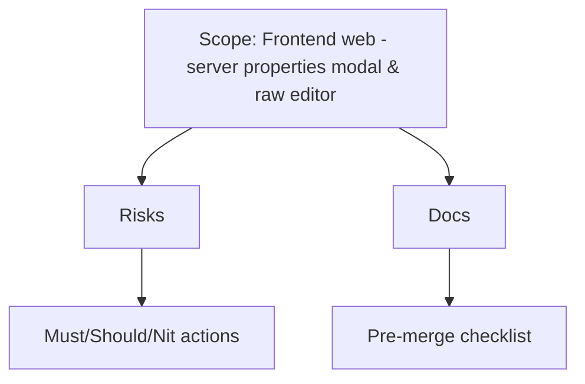

# PR #46 Review (0c61efd..HEAD) - Server Properties Setup



## 1) サマリー
- サーバープロパティ編集UIを新設し、Basic/Advanced/Developerモードとrawテキストエディタを追加。localStorageへの保存・API連携のフックを実装。
- プロパティスキーマをJSで定義し、モーダルをスキーマ駆動で描画。新規ドキュメントを多数追加。
- CDNのVue参照をunpkg最新版（非prodビルド）に変更しており、バンドル品質と将来互換にリスク。

## 2) 主要な変更点
- フロントエンドUI: `PropertiesModalTemplate.js`, `ServersTabTemplate.js`, `templates.js`, `app.js`でモーダルを統合。
- ロジック: `useProperties.js`でAPI連携・バリデーション・rawエディタ同期・localStorage保存を実装。
- スキーマ: `propertiesSchema.js`でBasic14/Advanced18/Dev20項目の定義を追加。
- スタイル: `properties-modal.css`を追加しメインCSSへ組み込み。
- ドキュメント: Quick Start/Refactoring Complete/System DocumentationのMarkdownを追加（内容に齟齬あり）。

## 3) テスト結果
- 未実行（npm依存のインストールとネットワーク許可が必要なため未着手）。  
  推奨コマンド: `cd frontend/middleware/main && npm ci && npm run lint && npm test && npx tsc -p tsconfig.json --noEmit`

## 4) セキュリティ・依存性
- `useProperties.js`がRCONパスワード等の機密をlocalStorageに平文で保存/再利用（`server-properties-{uuid}`）→ ブラウザ上で容易に読み取られるためMust fix。
- `index.html`でVueを`https://unpkg.com/vue@3/dist/vue.global.js`に変更し、最新devビルドをオンライン取得。署名/固定バージョンなしで供給元が変わると挙動が変化・XSSサプライチェーンリスクが増大（Should fix）。

## 5) バグ/ロジック問題
- Doc不整合（Must fix相当の混乱要因）:  
  - `PROPERTIES_SYSTEM_DOCUMENTATION.md`はAmateur/Advanced/Developerで7/15/23項目と記載し、モード継承ありと書かれているが、実装はBasic/Advanced/Developerで14/18/20項目・継承なし。利用者が検証手順や仕様を誤解する。  
- API I/Oリスク（Should fix）: rawエディタで未知プロパティも保存対象にするが、`savePropertiesToAPI`は全キーをそのままPOST（`{ data: ... }`）するため、バックエンドが未対応だと400/500が発生する可能性。インターフェースを明示/フィルタすべき。
- UX/安全性（Nit/Should）: `propertiesModal.getPropertyLabel`が説明文を日本語文でsplitしてラベル化しており、文言変更でラベルが壊れる。安定ラベルをスキーマに別フィールドで持つ方が安全。

## 6) API/スキーマ互換性
- スキーマはフロント限定で、新規API `/api/mc/Properties/{id}` GET/POST を呼び出すがバックエンド差分が無いため未実装の可能性大。互換性維持には「API未対応時はlocalStorageのみで動く」旨をドキュメント化し、APIレスポンス/リクエスト形を明示する必要あり。

## 7) パフォーマンス懸念
- Vue devビルドをCDN取得しているため初回ロードが重く、未固定バージョンで将来パフォーマンス悪化の恐れ。
- Rawエディタで`ResizeObserver`やDOM計測を多用。現状1モーダル内だが、長文/高速入力時のデバウンス(300ms)以上の負荷がないか要確認。自動テストなし。

## 8) ドキュメント修正
- 実装仕様に合わせてモード名/項目数/非継承化を`PROPERTIES_SYSTEM_DOCUMENTATION.md`に反映すること。
- Quick StartにBasic/Advanced/Developerの実際の項目と挙動（AdvancedがBasicを含まないこと、rawエディタ同期条件など）を追記。
- API未実装の場合の挙動（localStorageのみ）と、秘密情報の扱い方を注意書きする。

## 9) 改善提案（パッチ例含む）
- Must fix: 機密をlocalStorageへ保存しない or 少なくともRCON系は除外/マスクし、保存対象をスキーマで制御する。例:
```javascript
// useProperties.js (概念例)
const SENSITIVE_KEYS = new Set(['rcon.password']);
const filtered = Object.fromEntries(
  Object.entries(properties).filter(([k]) => !SENSITIVE_KEYS.has(k))
);
localStorage.setItem(storageKey, JSON.stringify({ version: 2, lastModified: new Date().toISOString(), properties: filtered }));
```
- Should fix: Vue CDNを固定prodビルドに戻し、SRIを設定する。
```html
<!-- index.html -->
<script src="https://cdnjs.cloudflare.com/ajax/libs/vue/3.3.4/vue.global.prod.js" integrity="sha512-V3r3svs...snip" crossorigin="anonymous"></script>
```
- Should fix: API送信前に未知プロパティを除外し、API契約をコメントまたはドキュメント化する。
```javascript
// before apiPost in saveProperties
const known = Object.keys(this.getDefaultProperties());
const sanitized = Object.fromEntries(
  Object.entries(this.propertiesModal.data).filter(([k]) => known.includes(k))
);
await this.savePropertiesToAPI(serverUuid, sanitized);
```
- Nit: スキーマに`label`フィールドを追加して`getPropertyLabel`で説明文splitに依存しないようにする。

## 10) マージ前チェックリスト
- [ ] frontend `npm ci && npm run lint && npm test && npx tsc -p tsconfig.json --noEmit` がグリーン
- [ ] Vue CDNを固定prodビルドへ差し戻し（SRI付与）
- [ ] localStorageに機密を残さない設計へ修正
- [ ] API要求/応答仕様を明文化し、未知キー送信を防止
- [ ] ドキュメント（特に`PROPERTIES_SYSTEM_DOCUMENTATION.md`, Quick Start）を実装仕様に同期

## 11) 総合評価
- 状態: **Needs changes**  
- 理由: Vue CDNの非固定devビルド採用、機密情報のlocalStorage保存、ドキュメントと実装の不整合、API契約不明確による失敗リスク。上記Must/Should修正が完了すれば機能追加自体は有用。

## Acceptance Criteria（提案）
- Basic/Advanced/Developerモードがスキーマどおりに描画され、rawエディタ⇔GUI同期が安定すること。
- API未実装環境でもlocalStorageのみで編集が完結し、機密情報を永続化しないこと。
- Vueライブラリを固定バージョン(prod)で配信し、フロントビルド/テストが成功すること。
