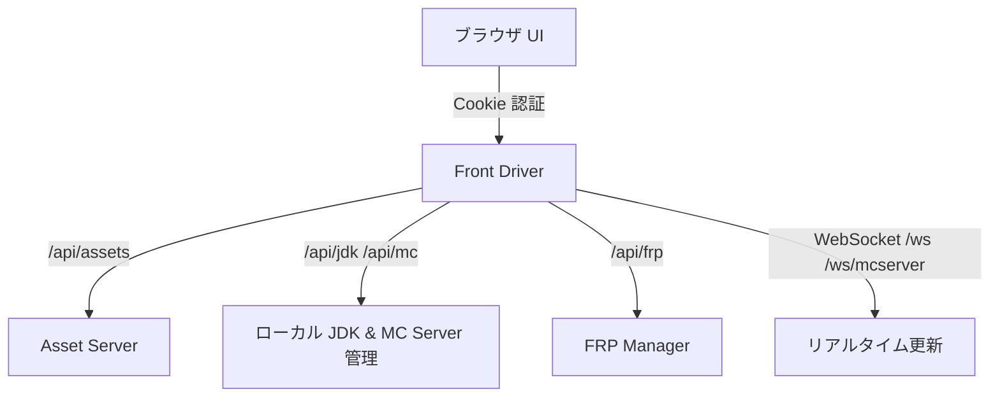

# Front Driver (Middleware) 概要

Front Driver は Express + TypeScript ベースの統合ミドルウェアです。認証済みのユーザーに対して、アセット配布 API のプロキシ、JDK/MC サーバー管理、FRP リモートアクセスの制御を一元化します。



## 主要機能
- **セッション管理**: `express-session` による HTTPOnly/SameSite Cookie 認証。MongoDB ストアにも対応（本番では有効化推奨）。
- **Asset プロキシ**: `/api/assets/*` でバックエンド配布 API へ転送し、ダウンロードキューと進捗 WebSocket (`/ws`) を提供。
- **JDK 管理**: `/api/jdk/*` で Temurin バイナリの取得・展開・キャッシュ管理を実行。
- **Minecraft サーバー管理**: `/api/mc/*` と `/ws/mcserver` でサーバー作成、起動/停止、ログ/状態配信を提供。
- **FRP 管理**: `/api/frp/*` で FRP バイナリ取得・トンネル設定・JWT リフレッシュを実装（`FRP_BINARY_BASE_URL` と連携）。
- **サンプル API**: `/api/sample/*` に最小構成の雛形 API を用意。

## セットアップ
1. **依存関係インストール**
   ```bash
   cd frontend/middleware/main
   npm install
   ```
2. **環境変数設定**: `.env` を `frontend/middleware/main` 直下に作成。
   - 最低限 `BACKEND_API_URL`（アセット配布サーバー）、`SESSION_SECRET` を設定。
   - HTTPS を有効化する場合は `SSL_ENABLED=true`（デフォルト）と証明書出力先を調整。
3. **ビルド/起動**
   ```bash
   # TypeScript ビルド（任意）
   npm run build
   # 開発起動（ts-node）
   npm run dev
   # 12800 番ポートで HTTPS/HTTP が立ち上がる
   ```

### 主な環境変数
| 変数 | 役割 | デフォルト |
| --- | --- | --- |
| `PORT` | リッスンポート | 12800 |
| `BACKEND_API_URL` | Asset 配布 API のベース URL | `http://localhost:8080` |
| `SESSION_SECRET` | セッション暗号鍵 | 自動生成 |
| `SSL_ENABLED` | 自己署名証明書で HTTPS を有効化 | `true` |
| `USERDATA_DIR` | ユーザーデータ基底ディレクトリ | `./userdata` |
| `DOWNLOAD_TEMP_PATH` | ダウンロード一時ディレクトリ | `./temp/download` |
| `FRP_BINARY_BASE_URL` | FRP バイナリ取得元 | `http://localhost:8080/api/assets/frp` |
| `FRP_AUTH_SERVER_URL` | FRP 認証サーバー URL | `http://localhost:8080` |

## エンドポイント概要
- 認証: `POST /user/login`, `GET /user/auth`, `POST /user/logout`
- アセット: `GET /api/assets/list/servers`, `GET /api/assets/list/jdk`, `GET /api/assets/health`, `GET /api/assets/downloads`
- ダウンロード: `GET /api/assets/download`（クエリ指定でキュー投入）、`GET /download/:taskId`（詳細は `methodclass/Asset_handler/src/app.ts`）
- JDK: `/api/jdk/*`（バージョン情報・インストール操作）
- Minecraft: `/api/mc/*`（作成/起動/停止/ログ取得）、`/ws/mcserver`（状態配信）
- FRP: `/api/frp/*`（バイナリ配布、クライアント設定、JWT リフレッシュ）
- サンプル: `/api/sample/public-info` ほか雛形 API

## ディレクトリ構成
```
frontend/middleware/main/
├── index.ts                 # エントリーポイント
├── lib/                     # 各種マネージャー/ルーター
│   ├── api-router.ts        # API ルーティング集約
│   ├── middleware/          # 認証・セキュリティミドルウェア
│   ├── frp-manager/         # FRP 管理ロジック
│   ├── jdk-manager/         # JDK 管理ロジック
│   └── minecraft-server-manager/ # MC サーバー管理
├── docs/                    # 設計/API ドキュメント
├── web/                     # ログイン/デモ用静的ページ
├── .env (手動作成)          # 環境変数定義
└── package.json             # スクリプト・依存関係
```

## 運用メモ
- 本番は **HTTPS + MongoDB セッションストア + 強化ヘッダー** を必須化してください。
- FRP クライアントは `userdata/frp` 以下に状態・ログを保存します。`FRP_*` 環境変数で公開ドメインやサーバー接続先を合わせてください。
- WebSocket (`/ws`, `/ws/mcserver`) を利用するフロントエンドは同一オリジンでアクセスすることを想定しています。
