# Designing a Minecraft Server Management Class

## User

nodejs+typescriptの環境で、Mincraftのサーバーインスタンスを管理するクラスを立てます。

以下の要件を理解してください。
1. クラスがデータを保持するスキーマを設計します
2. 実際にクラスに行わせたい・持たせたい要件を整理します
3. クラス・実装の設計書・仕様書・実装依頼書を書きます

この３つで構成したいと考えています。

#P.S
現時点で別のAIチャットセッションで、Step1(スキーマ設計)を
完了させました
本セッションではStep2から、つまり  "メソッド、動作定義・相談・検討"から始めることとします。
最初に、前回のセッションからの引き継ぎ資料をいかに提示します。
まずそれに関して理解できたら、大雑把でいいので内容を私に提示してください。矛盾や理解のズレがないかチェックします
この要件が理解できたら次のステップに進みましょう

```
# Minecraft Server Manager 開発プロジェクト - 引き継ぎドキュメント

## プロジェクト概要

Node.js + TypeScript環境で動作するMinecraftサーバー構築支援ソフトウェアの開発プロジェクトです。本ドキュメントは、サーバーインスタンス管理クラスの設計における、Step1（スキーマ設計）完了後の引き継ぎ資料です。

### **製品全体の位置づけ**

本製品はMinecraftサーバー構築の総括支援ソフトウェアであり、以下の機能を含みます：

- JDKのエントリ管理や自動更新
- ポートフォワード設定
- サーバーインスタンスの管理（本プロジェクトの対象）
- その他サーバー運用に必要な機能

本プロジェクトで設計する管理クラスは、製品の根幹部分を担当します。

### **クライアントサイド動作**

本ソフトウェアはクライアントサイドで稼働するため、重いユーティリティ（DB等）は採用せず、JSON形式でのデータ永続化を採用しています。

## 設計方針とアーキテクチャ

### **責任分離の原則**

本プロジェクトでは、クラスごとに最小限の機能を持たせ、責任範囲・スコープを最小限にすることを重視しています。これにより保守性とドキュメント整備性を向上させます。

### **クラス構成**

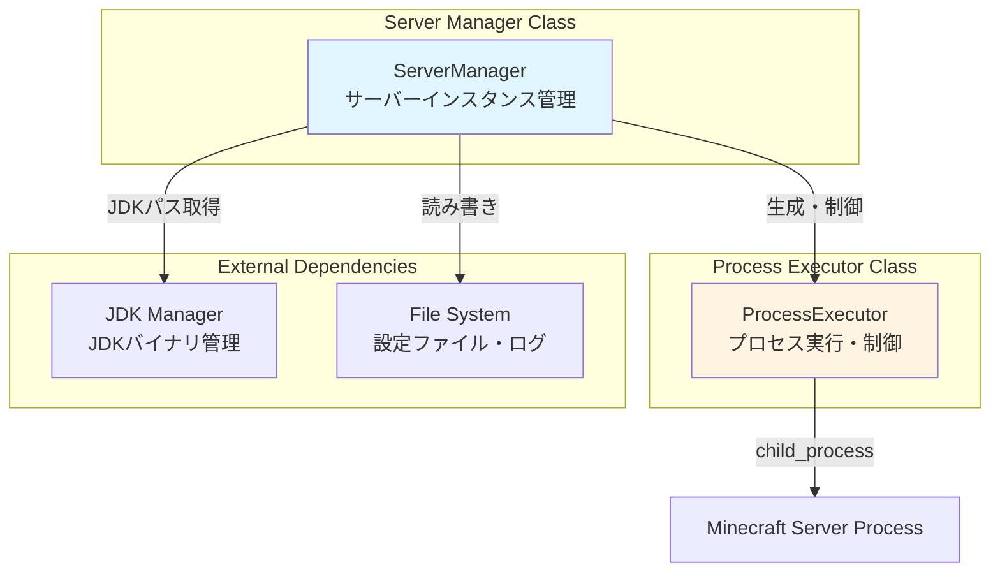
```mermaid
graph TB
    subgraph "Server Manager Class"
        A[ServerManager<br/>サーバーインスタンス管理]
    end
    
    subgraph "Process Executor Class"
        B[ProcessExecutor<br/>プロセス実行・制御]
    end
    
    subgraph "External Dependencies"
        C[JDK Manager<br/>JDKバイナリ管理]
        D[File System<br/>設定ファイル・ログ]
    end
    
    A -->|生成・制御| B
    A -->|JDKパス取得| C
    A -->|読み書き| D
    B -->|child_process| E[Minecraft Server Process]
    
    style A fill:#e1f5ff
    style B fill:#fff4e1
```

**ServerManager（本プロジェクトの対象）:**
- サーバーインスタンスの状態管理
- 設定の永続化・読み込み
- ライフサイクル管理
- 他クラスへのオペレーション発行

**ProcessExecutor（本プロジェクトで併せて設計）:**
- プロセスの直接的な起動・停止
- 標準入出力の管理
- child_processやexecを使用した実装
- ServerManagerから生成され、使い捨てで使用される

### **データの流れ**

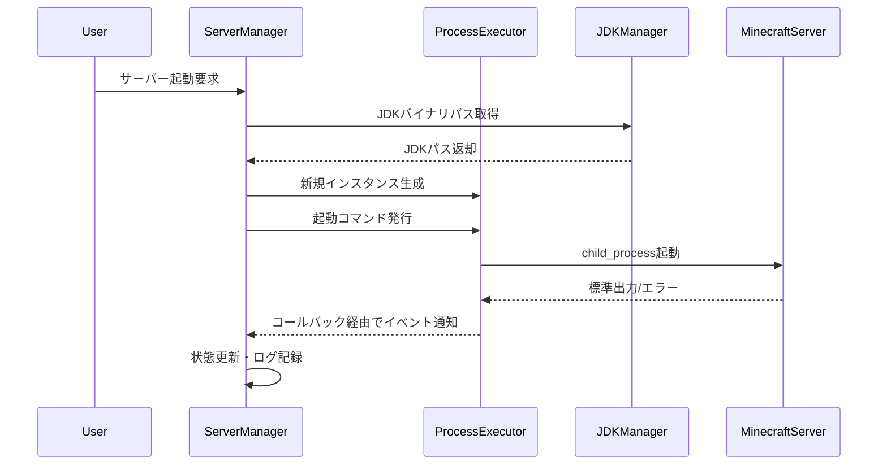
```mermaid
sequenceDiagram
    participant User
    participant ServerManager
    participant ProcessExecutor
    participant JDKManager
    participant MinecraftServer
    
    User->>ServerManager: サーバー起動要求
    ServerManager->>JDKManager: JDKバイナリパス取得
    JDKManager-->>ServerManager: JDKパス返却
    ServerManager->>ProcessExecutor: 新規インスタンス生成
    ServerManager->>ProcessExecutor: 起動コマンド発行
    ProcessExecutor->>MinecraftServer: child_process起動
    MinecraftServer-->>ProcessExecutor: 標準出力/エラー
    ProcessExecutor-->>ServerManager: コールバック経由でイベント通知
    ServerManager->>ServerManager: 状態更新・ログ記録
```

## Step1完了: スキーマ設計

### **完了事項**

データ永続化のためのスキーマ設計が完了しました。以下の型定義が確定しています。

### **データ構造全体図**

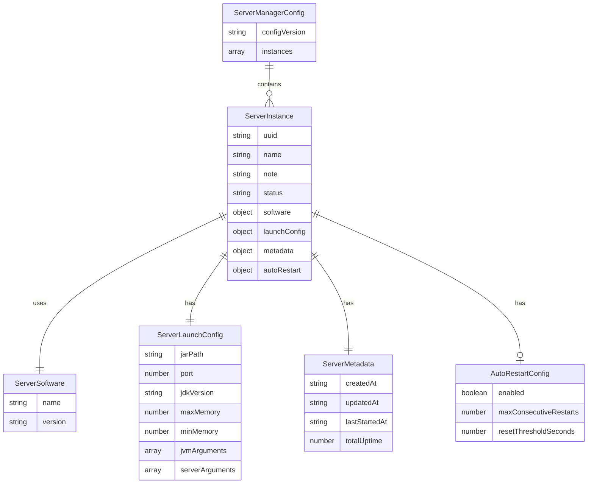
```mermaid
erDiagram
    ServerManagerConfig ||--o{ ServerInstance : contains
    ServerInstance ||--|| ServerSoftware : uses
    ServerInstance ||--|| ServerLaunchConfig : has
    ServerInstance ||--|| ServerMetadata : has
    ServerInstance ||--o| AutoRestartConfig : has

    ServerManagerConfig {
        string configVersion
        array instances
    }
    
    ServerInstance {
        string uuid
        string name
        string note
        string status
        object software
        object launchConfig
        object metadata
        object autoRestart
    }
    
    ServerSoftware {
        string name
        string version
    }
    
    ServerLaunchConfig {
        string jarPath
        number port
        string jdkVersion
        number maxMemory
        number minMemory
        array jvmArguments
        array serverArguments
    }
    
    ServerMetadata {
        string createdAt
        string updatedAt
        string lastStartedAt
        number totalUptime
    }
    
    AutoRestartConfig {
        boolean enabled
        number maxConsecutiveRestarts
        number resetThresholdSeconds
    }
```

### **確定した型定義**

```typescript
// types/server-schema.ts

/**
 * サーバーの状態を表す列挙型
 */
export type ServerStatus = 
  | 'stopped'    // 停止中（正常終了）
  | 'running'    // 起動中
  | 'crashed';   // クラッシュ状態

/**
 * Minecraft サーバーソフトウェア情報
 * ソフトウェアの識別情報のみを保持
 */
export interface ServerSoftware {
  /** サーバーソフトウェア名 (例: "Vanilla", "Forge", "Fabric", "Paper", "Spigot") */
  name: string;
  
  /** Minecraftのバージョン (例: "1.20.1", "1.19.4", "1.12.2") */
  version: string;
}

/**
 * サーバー起動に必要な設定情報
 * 起動時に使用されるすべてのパラメータを集約
 */
export interface ServerLaunchConfig {
  /** 
   * サーバーJarファイルの相対パス
   * servers/{name} ディレクトリからの相対パス
   * 例: "server.jar", "bin/paper-1.20.1.jar"
   */
  jarPath: string;
  
  /** サーバーが使用するポート番号 */
  port: number;
  
  /** 使用するJDKのメジャーバージョン (例: "8", "11", "17", "21") */
  jdkVersion: string;
  
  /** 最大メモリ割り当て (MB単位) - 重要なため独立して管理 */
  maxMemory: number;
  
  /** 最小メモリ割り当て (MB単位) */
  minMemory: number;
  
  /** 
   * JVM起動引数（メモリ設定を除く）
   * 例: ["-XX:+UseG1GC", "-XX:+ParallelRefProcEnabled", "-XX:MaxGCPauseMillis=200"]
   */
  jvmArguments: string[];
  
  /** 
   * Minecraftサーバー固有の起動引数
   * 例: ["--nogui", "--world", "world_name", "--port", "25565"]
   */
  serverArguments: string[];
}

/**
 * サーバーのメタデータ
 */
export interface ServerMetadata {
  /** インスタンス作成日時 (ISO 8601形式) */
  createdAt: string;
  
  /** 最終更新日時 (ISO 8601形式) */
  updatedAt: string;
  
  /** 最終起動日時 (ISO 8601形式、未起動の場合はnull) */
  lastStartedAt: string | null;
  
  /** 累計稼働時間 (秒単位) */
  totalUptime: number;
}

/**
 * 自動再起動の設定
 */
export interface AutoRestartConfig {
  /** 自動再起動を有効にするか */
  enabled: boolean;
  
  /** 許容する連続再起動回数の上限 */
  maxConsecutiveRestarts: number;
  
  /** 
   * 再起動カウンターのリセット時間 (秒単位)
   * デフォルト: 600秒 (10分)
   * この時間以上稼働した場合、連続再起動カウンターがリセットされる
   */
  resetThresholdSeconds: number;
}

/**
 * サーバーインスタンスの完全な定義
 */
export interface ServerInstance {
  /** インスタンスを一意に識別するUUID */
  uuid: string;
  
  /** ユーザーが設定する表示名（重複不可） */
  name: string;
  
  /** ユーザーが自由に記入できるメモ欄 */
  note: string;
  
  /** 現在のサーバー状態 */
  status: ServerStatus;
  
  /** 使用するサーバーソフトウェア情報 */
  software: ServerSoftware;
  
  /** 起動設定 */
  launchConfig: ServerLaunchConfig;
  
  /** メタデータ */
  metadata: ServerMetadata;
  
  /** 自動再起動設定 */
  autoRestart: AutoRestartConfig;
}

/**
 * マネージャー全体の設定ファイル構造
 */
export interface ServerManagerConfig {
  /** 設定ファイルのバージョン（将来的な互換性管理用） */
  configVersion: string;
  
  /** 管理下にある全サーバーインスタンス */
  instances: ServerInstance[];
}

/**
 * 実行時のみ使用する一時的な状態情報
 * （永続化されない、メモリ上でのみ管理）
 */
export interface RuntimeState {
  /** 現在の連続再起動回数 */
  consecutiveRestartCount: number;
  
  /** 最後に再起動した時刻 (Unix timestamp) */
  lastRestartTime: number | null;
  
  /** カウンターリセット用のタイマーID */
  resetTimerId: NodeJS.Timeout | null;
  
  /** 現在の起動開始時刻 (Unix timestamp、停止中はnull) */
  currentSessionStartTime: number | null;
}
```

## 重要な設計決定事項

### **1. データ永続化**

**形式:** JSON
**理由:** クライアントサイド動作のため軽量なデータ管理が必要

**設定ファイルパス:** コンストラクタから指定可能
**メリット:** 
- クラスインスタンスの分離が容易
- コンテキストの切り替えが可能
- テスト時の柔軟性向上

### **2. サーバーソフトウェア対応**

**対応範囲:** 全種対応（Vanilla、Forge、Fabric、Paper、Spigot等）
**拡張性:** `ServerSoftware`の`name`と`version`の組み合わせで柔軟に対応

### **3. インスタンス識別**

**内部識別子:** UUID（UUIDv4推奨）
**用途:** プロセス管理、タスク発行時の識別

**ユーザー識別子:** name（重複不可）
**用途:** ディレクトリ名、ユーザー表示

**ディレクトリ構造:** `servers/{name}/`

### **4. 複数サーバー稼働**

複数のサーバーインスタンスの同時稼働を想定しています。

### **5. JDK管理との連携**

**保持情報:** `ServerLaunchConfig.jdkVersion`にメジャーバージョンのみ保持
**バイナリパス解決:** JDK Managerから取得し、ProcessExecutorに渡す
**起動引数:** インスタンスごとに個別管理

### **6. ポート管理**

**保持:** `ServerLaunchConfig.port`
**用途:** ポート重複チェック、サーバー起動時の指定

### **7. プレイヤー情報・サーバープロパティ**

**責任範囲外:** ホワイトリスト、OP権限、server.propertiesの編集は本クラスの責任範囲外
**理由:** Minecraftサーバー側の設定ファイルに任せる

### **8. メタデータ管理**

**保持情報:**
- 作成日時
- 最終更新日時
- 最終起動日時
- 累計稼働時間

**時刻形式:** ISO 8601（例: `2025-10-23T15:30:00.000Z`）

### **9. 自動再起動機能**

**設定項目:**
- 有効/無効の切り替え
- 許容連続再起動回数
- カウンターリセット時間（デフォルト: 600秒）

**動作フロー:**

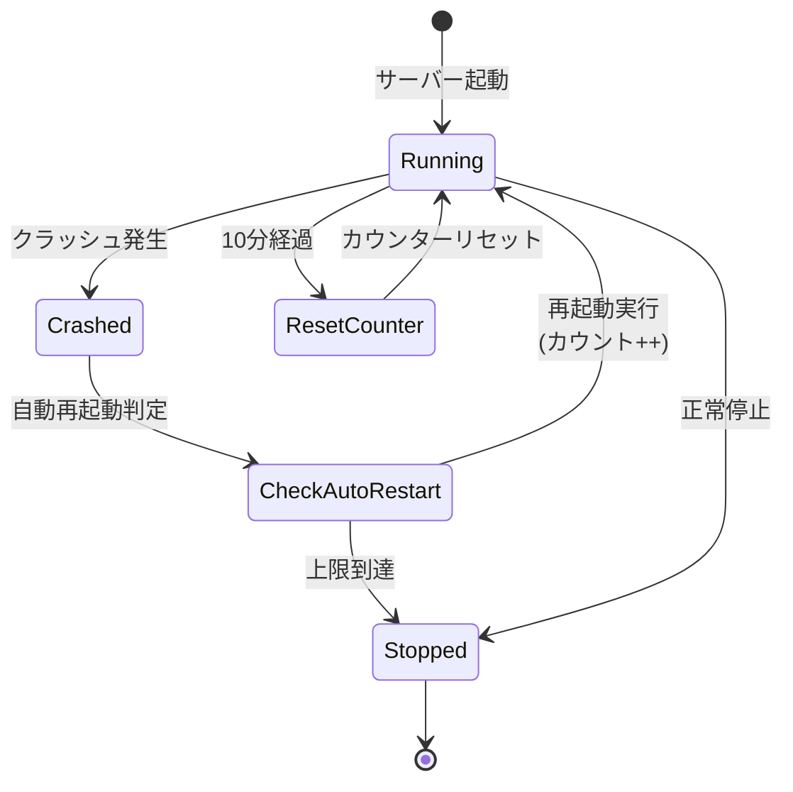
```mermaid
stateDiagram-v2
    [*] --> Running: サーバー起動
    Running --> Crashed: クラッシュ発生
    Crashed --> CheckAutoRestart: 自動再起動判定
    CheckAutoRestart --> Running: 再起動実行<br/>(カウント++)
    CheckAutoRestart --> Stopped: 上限到達
    Running --> ResetCounter: 10分経過
    ResetCounter --> Running: カウンターリセット
    Running --> Stopped: 正常停止
    Stopped --> [*]
```

**カウンター管理:**
- メモリ上でのみ管理（`RuntimeState`）
- マネージャー再起動時にリセット
- 10分以上稼働でカウンターリセット
- 10分以内のクラッシュでカウント増加

### **10. ログ管理**

**Minecraftサーバーログ:** 各インスタンスディレクトリに保存（サーバー側が管理）
**マネージャーログ:** 全体で1つのログファイル（`logs/manager.log`）
**ログレベル:** 可能であれば分離（INFO, WARN, ERROR等）

### **11. ProcessExecutorクラス**

**責任範囲:**
- プロセスの起動・停止
- 標準入出力の管理
- child_process/execの使用

**ライフサイクル:** 使い捨て（サーバー起動時に生成、停止時に破棄）

**コールバック設計:** 標準入出力イベントをコールバック経由でServerManagerに通知

## ディレクトリ構造

```
project-root/
├── config/
│   └── server-manager.json          # マネージャー設定ファイル（コンストラクタで指定可能）
├── servers/
│   ├── {server-name-1}/              # 各サーバーのディレクトリ
│   │   ├── server.jar                # jarPathのルートディレクトリ
│   │   ├── server.properties         # Minecraftサーバー設定（管理対象外）
│   │   ├── logs/                     # Minecraftサーバーのログ
│   │   ├── world/                    # ワールドデータ
│   │   └── ...
│   └── {server-name-2}/
│       └── ...
└── logs/
    └── manager.log                   # マネージャー自体のログ
```

## 設定ファイルの例

```json
{
  "configVersion": "1.0.0",
  "instances": [
    {
      "uuid": "550e8400-e29b-41d4-a716-446655440000",
      "name": "survival-server",
      "note": "メインのサバイバルサーバー。毎週日曜日にバックアップを取ること。",
      "status": "stopped",
      "software": {
        "name": "Paper",
        "version": "1.20.1"
      },
      "launchConfig": {
        "jarPath": "server.jar",
        "port": 25565,
        "jdkVersion": "17",
        "maxMemory": 4096,
        "minMemory": 1024,
        "jvmArguments": [
          "-XX:+UseG1GC",
          "-XX:+ParallelRefProcEnabled",
          "-XX:MaxGCPauseMillis=200"
        ],
        "serverArguments": ["--nogui"]
      },
      "metadata": {
        "createdAt": "2025-10-20T10:00:00.000Z",
        "updatedAt": "2025-10-23T15:30:00.000Z",
        "lastStartedAt": "2025-10-23T14:00:00.000Z",
        "totalUptime": 86400
      },
      "autoRestart": {
        "enabled": true,
        "maxConsecutiveRestarts": 3,
        "resetThresholdSeconds": 600
      }
    }
  ]
}
```

## Step2への作業指示

次のセッションでは、以下の作業を実施してください。

### **作業内容: クラス設計・メソッド要件の整理**

**目的:** ServerManagerクラスとProcessExecutorクラスの機能要件を明確化し、メソッド定義を行う

### **ServerManagerクラスで実装すべき機能（想定）**

以下は現時点で想定される機能です。ユーザーとの対話を通じて詳細化してください。

**インスタンス管理:**
- 新しいサーバーエントリの追加
- サーバーエントリの削除
- サーバーエントリの更新
- 全インスタンスの一覧取得
- 特定インスタンスの取得（UUIDまたはnameで検索）
- name重複チェック
- ポート重複チェック

**ライフサイクル管理:**
- サーバーの起動
- サーバーの停止
- サーバーの再起動
- 稼働中インスタンスの一覧取得
- サーバー状態の取得・更新

**設定管理:**
- 設定ファイルの読み込み
- 設定ファイルの保存
- 設定の検証（バリデーション）

**ログ管理:**
- マネージャーログの記録
- ログディレクトリの取得

**統計情報:**
- 稼働時間の更新・取得
- メタデータの更新

### **ProcessExecutorクラスで実装すべき機能（想定）**

**プロセス管理:**
- サーバープロセスの起動
- サーバープロセスの停止
- プロセス状態の監視

**入出力管理:**
- 標準入力へのコマンド送信
- 標準出力のキャプチャ
- 標準エラー出力のキャプチャ
- コールバック経由でのイベント通知

**終了コード処理:**
- 正常終了の判定
- クラッシュの判定
- 終了コードの取得

### **検討が必要な事項**

以下の点について、ユーザーと詳細を詰めてください。

**1. メソッドのインターフェース設計**
- 引数の形式（オブジェクト渡しか個別パラメータか）
- 戻り値の形式（Promise、同期、イベントエミッター等）
- エラーハンドリングの方法

**2. ProcessExecutorとの連携**
- インスタンスの生成タイミング
- インスタンスの保持方法（ServerManager内でMap管理等）
- コールバックの設計（標準出力、エラー、終了時等）

**3. 自動再起動の実装詳細**
- タイマー管理の具体的な実装方法
- カウンターの更新タイミング
- 上限到達時の動作

**4. 同期・非同期処理**
- どのメソッドを非同期にするか
- Promiseの使用方針
- エラー処理の統一方法

**5. イベント駆動設計**
- EventEmitterの使用有無
- どのようなイベントを発行するか
- リスナーの登録方法

**6. バリデーション**
- どの段階でバリデーションを行うか
- エラーメッセージの設計
- 不正なデータへの対処方法

### **成果物**

Step2完了時には、以下のドキュメントを作成してください。

**1. クラス設計書**
- ServerManagerクラスの詳細設計
- ProcessExecutorクラスの詳細設計
- クラス図（Mermaid）

**2. メソッド仕様書**
- 各メソッドのシグネチャ
- 引数・戻り値の詳細
- 処理フロー
- エラーハンドリング

**3. シーケンス図**
- 主要な処理フローのシーケンス図（Mermaid）
- 特にサーバー起動・停止・クラッシュ時の動作

**4. 実装依頼書**
- コーダーが実装に取り掛かれる詳細な指示書
- 実装時の注意点
- テストケースの概要

## 参考情報

### **起動コマンドの生成例**

```bash
{jdkPath}/java -Xms{minMemory}M -Xmx{maxMemory}M {jvmArguments...} -jar {jarPath} {serverArguments...}
```

### **自動再起動の動作例**

```
1. サーバー起動 → タイマー開始（10分）
2. 5分後にクラッシュ → カウント: 1, 再起動
3. 3分後にクラッシュ → カウント: 2, 再起動
4. 15分稼働 → カウントリセット
5. クラッシュ → カウント: 1, 再起動
```

### **型の使用例**

```typescript
import { ServerInstance } from './types/server-schema';
import { randomUUID } from 'crypto';

const newServer: ServerInstance = {
  uuid: randomUUID(),
  name: 'my-server',
  note: 'テストサーバー',
  status: 'stopped',
  software: {
    name: 'Vanilla',
    version: '1.20.1'
  },
  launchConfig: {
    jarPath: 'server.jar',
    port: 25565,
    jdkVersion: '17',
    maxMemory: 2048,
    minMemory: 1024,
    jvmArguments: ['-XX:+UseG1GC'],
    serverArguments: ['--nogui']
  },
  metadata: {
    createdAt: new Date().toISOString(),
    updatedAt: new Date().toISOString(),
    lastStartedAt: null,
    totalUptime: 0
  },
  autoRestart: {
    enabled: true,
    maxConsecutiveRestarts: 3,
    resetThresholdSeconds: 600
  }
};
```

## まとめ

**完了事項:**
- ✅ データスキーマの設計完了
- ✅ 型定義の確定
- ✅ 設計方針の明確化

**次のステップ:**
- ⏭️ ServerManagerクラスのメソッド定義
- ⏭️ ProcessExecutorクラスのメソッド定義
- ⏭️ クラス間の連携設計
- ⏭️ 実装依頼書の作成

このドキュメントを基に、ユーザーと対話しながらStep2の作業を進めてください。設計の一貫性を保ちつつ、実装者が迷わず開発できる詳細な仕様を作成することが目標です。
```


## Assistant

# 引き継ぎ内容の確認

前回のセッションで完了したStep1の内容を理解しました。以下、大まかな理解内容を提示します。

## **プロジェクト全体の理解**

Node.js + TypeScriptで動作する、Minecraftサーバー構築支援ソフトウェアの開発プロジェクトです。クライアントサイドで動作するため、データ永続化にはJSONを使用します。

## **アーキテクチャの理解**

責任分離の原則に基づき、2つのクラスで構成されます：

**ServerManagerクラス（メイン）：**
サーバーインスタンスの状態管理、設定の永続化、ライフサイクル管理を担当します。複数のサーバーインスタンスを同時に管理できます。

**ProcessExecutorクラス（補助）：**
実際のプロセス起動・停止、標準入出力管理を担当します。ServerManagerから生成され、使い捨てで使用されます。

## **完了したスキーマ設計**

以下のデータ構造が確定しています：

**ServerInstance（サーバーインスタンスの完全な定義）：**
- uuid（内部識別子）
- name（ユーザー識別子、ディレクトリ名に使用）
- status（stopped/running/crashed）
- software（サーバーソフトウェア名とバージョン）
- launchConfig（起動設定）
- metadata（作成日時、稼働時間など）
- autoRestart（自動再起動設定）

**RuntimeState（永続化されない実行時情報）：**
- 連続再起動カウント
- タイマー管理情報
- 現在のセッション開始時刻

## **重要な設計決定事項の理解**

1. 設定ファイルパスはコンストラクタで指定可能
2. 全種類のMinecraftサーバーソフトウェアに対応
3. UUIDで内部管理、nameでユーザー識別（重複不可）
4. JDKバイナリパスはJDK Managerから取得
5. プレイヤー情報やserver.propertiesは管理対象外
6. 自動再起動機能は10分稼働でカウンターリセット
7. マネージャーログは全体で1つ（`logs/manager.log`）

## **Step2で行うこと**

ServerManagerクラスとProcessExecutorクラスのメソッド定義と機能要件の明確化を行います。具体的には：

- 各クラスのメソッドシグネチャの決定
- 引数・戻り値の形式の決定
- エラーハンドリング方針の決定
- クラス間の連携方法の設計
- 非同期処理の方針決定

---

理解内容は以上です。特に以下の点が重要だと認識しています：

- 責任分離を徹底し、各クラスのスコープを最小限に保つ
- ProcessExecutorは使い捨てインスタンス
- 自動再起動のカウンター管理はメモリ上のみ
- 複数サーバーの同時稼働を想定

何か理解のズレや矛盾がありましたら、ご指摘ください。問題なければ、Step2のメソッド設計に進みましょう。

## User

ありがとうございます。
全体的な認識は問題なさそうで安心いたしました。
少なくともスキーマに関しての認識は問題なさそうです。

Step2に進む前に、Step1.5として
個々のメソッドではなく、全体の設計（主にコンストラクタで定義されるようなもの）に関する協議をしましょう。
私が思いつく限りの全体の未決定部分を提示します
- サーバー本体のディレクトリを置くパスの定義
- jdkmanager,他クラスのインスタンスをconstructorで受け取るのか、内部で生成するのか

他に今のうちに全体の挙動に関わる部分で今のうちに決めて置かなければ置かない点などあれば、今の段階で私に質問や提案を行ってください。

## Assistant

# Step1.5: 全体設計の協議

ご提示いただいた2点に加えて、いくつか重要な全体設計事項がありますので、順番に検討していきましょう。

## **1. ディレクトリ構造の管理方針**

### **サーバー本体のディレクトリを置くパスの定義**

以下の選択肢が考えられます：

**Option A: コンストラクタで受け取る（推奨）**
```typescript
constructor(configPath: string, serversBasePath: string)
```
- メリット: 柔軟性が高い、テスト時に任意のパスを指定可能
- デメリット: 呼び出し側で管理が必要

**Option B: configPathから相対的に決定**
```typescript
// configPath が "config/server-manager.json" なら
// serversBasePath は "servers/" に自動決定
```
- メリット: シンプル、設定ファイルとサーバーの位置関係が固定
- デメリット: 柔軟性が低い

**Option C: 設定ファイル内に記述**
```json
{
  "configVersion": "1.0.0",
  "serversBasePath": "./servers",
  "instances": [...]
}
```
- メリット: ユーザーが後から変更可能
- デメリット: 設定ファイルの責任範囲が広がる

**私の推奨: Option A**
テスト容易性と柔軟性を重視し、コンストラクタで明示的に受け取る方式が良いと考えます。

---

## **2. 外部依存クラスの管理**

### **JDKManagerや他クラスのインスタンス受け取り方針**

**Option A: Dependency Injection（推奨）**
```typescript
constructor(
  configPath: string,
  serversBasePath: string,
  jdkManager: JDKManager
)
```
- メリット: テスタビリティが高い、疎結合、モック化が容易
- デメリット: 呼び出し側での初期化が必要

**Option B: 内部で生成**
```typescript
constructor(configPath: string, serversBasePath: string) {
  this.jdkManager = new JDKManager();
}
```
- メリット: 使用側がシンプル
- デメリット: テストが困難、密結合

**私の推奨: Option A（Dependency Injection）**
保守性とテスト容易性を考慮すると、外部から注入する方式が適切です。

---

## **3. ログ管理の方針**

### **ロガーインスタンスの扱い**

現在、`logs/manager.log`に記録する想定ですが、ロガーの扱いについて決定が必要です。

**Option A: ロガーを外部から注入**
```typescript
constructor(
  configPath: string,
  serversBasePath: string,
  jdkManager: JDKManager,
  logger: Logger
)
```

**Option B: 内部で生成（ログパスをコンストラクタで受け取る）**
```typescript
constructor(
  configPath: string,
  serversBasePath: string,
  logPath: string,
  jdkManager: JDKManager
)
```

**Option C: 内部で固定パスに生成**
```typescript
// logs/manager.log に固定
```

**質問: ロガーの扱いについてどのように考えますか？**
- アプリケーション全体で共通のロガーを使用する予定はありますか？
- ログレベルの制御は必要ですか？（INFO, WARN, ERROR等）
- ログローテーションは考慮しますか？

---

## **4. ProcessExecutorインスタンスの管理**

### **複数サーバー稼働時のProcessExecutor管理**

**Option A: Map<uuid, ProcessExecutor>で管理**
```typescript
private processExecutors: Map<string, ProcessExecutor> = new Map();
```
- 起動時に生成、停止時に削除
- UUIDをキーにして管理

**Option B: ServerInstance内に参照を持たせる（非推奨）**
- RuntimeStateに含める
- メモリリークのリスク

**私の推奨: Option A**
ServerManagerクラス内でMapを使って管理するのが適切です。

---

## **5. 設定ファイルの読み書きタイミング**

### **設定の永続化戦略**

**Option A: 変更の都度自動保存**
```typescript
async addInstance(instance: ServerInstance): Promise<void> {
  this.config.instances.push(instance);
  await this.saveConfig(); // 自動保存
}
```

**Option B: 明示的な保存メソッド呼び出し**
```typescript
async addInstance(instance: ServerInstance): Promise<void> {
  this.config.instances.push(instance);
  // 保存は呼び出し側が明示的に実行
}

// 使用側
manager.addInstance(newInstance);
manager.updateInstance(uuid, changes);
await manager.saveConfig(); // まとめて保存
```

**Option C: トランザクション的な管理**
```typescript
const transaction = manager.beginTransaction();
transaction.addInstance(newInstance);
transaction.updateInstance(uuid, changes);
await transaction.commit(); // この時点で保存
```

**質問: どの戦略が望ましいですか？**
- データ整合性を重視するならOption A
- パフォーマンスを重視するならOption B
- 複雑な操作が多いならOption C

---

## **6. エラーハンドリング戦略**

### **エラーの扱い方針**

**質問事項:**
1. **カスタムエラークラスを定義しますか？**
   ```typescript
   class ServerManagerError extends Error {}
   class ServerNotFoundError extends ServerManagerError {}
   class DuplicateServerNameError extends ServerManagerError {}
   ```

2. **エラー時の戻り値の方針は？**
   - Option A: 例外をthrow
   - Option B: Result型（`{success: boolean, data?: T, error?: Error}`）
   - Option C: 例外とResult型の併用

---

## **7. イベント駆動設計の採用**

### **EventEmitterの使用有無**

ServerManagerをEventEmitterとして実装するか検討が必要です。

**採用する場合:**
```typescript
class ServerManager extends EventEmitter {
  // イベント発行例
  async startServer(uuid: string): Promise<void> {
    // ...
    this.emit('serverStarted', { uuid, timestamp: Date.now() });
  }
}

// 使用側
manager.on('serverStarted', (data) => {
  console.log(`Server ${data.uuid} started`);
});
```

**質問: イベント駆動設計を採用しますか？**
- メリット: 外部からの監視が容易、UIとの連携がスムーズ
- デメリット: 複雑性が増す

---

## **8. 初期化処理の方針**

### **コンストラクタでの処理範囲**

**Option A: コンストラクタで設定ファイル読み込み（同期）**
```typescript
constructor(configPath: string, ...) {
  this.config = this.loadConfigSync();
}
```

**Option B: 非同期初期化メソッド**
```typescript
constructor(configPath: string, ...) {
  // 設定は読み込まない
}

async initialize(): Promise<void> {
  this.config = await this.loadConfig();
}
```

**Option C: static factoryメソッド**
```typescript
static async create(configPath: string, ...): Promise<ServerManager> {
  const manager = new ServerManager(configPath, ...);
  await manager.loadConfig();
  return manager;
}
```

**質問: どの初期化パターンが望ましいですか？**
- 設定ファイルが存在しない場合の挙動も考慮が必要です

---

## **9. バリデーション層の設計**

### **データ検証のタイミングと方法**

**質問事項:**
1. **バリデーションライブラリを使用しますか？**（例: Zod, Joi, class-validator）
2. **バリデーションを行うタイミングは？**
   - 設定ファイル読み込み時
   - インスタンス追加・更新時
   - サーバー起動時
3. **不正なデータが見つかった場合の対処は？**

---

## **10. TypeScript設定との整合性**

### **strict modeの想定**

**質問: tsconfig.jsonのstrict設定を想定していますか？**
- `strict: true`を前提とした設計にするか
- null/undefinedの扱い方針

---

## **まとめ: 決定が必要な事項**

優先度順に整理します：

### **最優先（今決めるべき）:**
1. ディレクトリパスの管理方針（コンストラクタ引数推奨）
2. 外部依存の注入方針（DI推奨）
3. 設定ファイルの読み書きタイミング
4. 初期化処理の方針

### **高優先（Step2前半で決めるべき）:**
5. ロガーの扱い
6. エラーハンドリング戦略
7. イベント駆動設計の採用有無

### **中優先（Step2後半で決めても良い）:**
8. ProcessExecutorの管理方法（Map推奨）
9. バリデーション層の設計
10. TypeScript設定との整合性

---

これらの点について、ご意見や方針をお聞かせください。特に最優先の4項目については、この段階で決定しておきたいと考えています。

## User

質問に順に回答していきます。

1. ディレクトリ構造の管理方針
Option Aでいいかと
config依存も悪くはないですが
ほかもろもろ上にオーケストレーションクラスが居ることを考えると
コンストラクタのほうが柔軟性がありそうです

2. 外部依存クラスの管理
そうですね
jdkの保存パスなどを内包するわけにもいかないので
これに関してはOption Aで行きましょう

3. ログ管理の方針
共通ロガーでもいいんですが
jdk管理なども別のログクラスに一応書き出す方針ではあります

後々の仕様変更を一応想定し、Loggerを外部から入れることも可能にできればいいですね
（もちろんコンストラクタの定義等ソースは書き換えること前提で）

一旦はOption Bで実装しつつ、どこかでAに切り替える修正が容易になるよう実装できれば理想かと
強いて言うなら,Loggerに何を使うか検討したほうがいいですね
これに関していい案があれば教えていただきたい（pinoとかlog4jsとか）
ログローテーションは一旦抜きで大丈夫です
強いて言うなら、もしコンストラクタ等上からloggerを引っ張ってくる仕様にした際に
上でローテーション管理するかもしれませんが

4. ProcessExecutorインスタンスの管理
これにかんしてはstep2でお話するとしますが
クラスのメソッド/動的設計(前述のスキーマとは違い、非永続データ)に関してはあとで詳しく掘り下げますが
本クラスの中に、各instanceを格納しておく配列やmapなどを定義し
インスタンスごとの操作をそれに委託する（親クラスは外部からの呼び出しのラップを行ったり、子クラスのインスタンスを引き渡したりする）設計ではどうでしょう
この場合だと、例えば
Managerpairentclass.serverinstance[10].Processや
子クラス内なら直接this.Processで呼び出せると思います

１つのインスタンスに対して複数のプロセスを持つことは絶対にないので...
メモリリークに関しては危険なので、もしヤバそうなら私に一言言ってください
できる限りメモリリークのリスクは排除したいので


5. 設定ファイルの読み書きタイミング
Option Aでいいと思います
ただそうなってくるとmetadataの中のタイムスタンプ、特に
累計稼働時間等が厄介に絡んでくるかと
そこに関しては一定時間毎に書き込むか、トランザクションにするかってとこだと思いますね

6. エラーハンドリング戦略
んー悩まし
メソッド定義時にもっかいこの話を再提案できますか？
持たせたいメソッドが明確に見えてから考えましょう
半端な設計だと死ぬので...

7. イベント駆動設計の採用
うーん
ちょっと複雑すぎるかなって
今回結構ビギナーとかコーディング初心者も居るので
抽象的な表現は避けたい

たとえばstartserverとかなら
ServermanagerInstance.startServer(id:uuid);
とかやって
内部では該当インスタンスをfilter,
見つけたらインスタンスに対して
.startserverとかすればいいんじゃないですかね
実際のところは個別サーバーのインスタンスには
異常終了時などのコールバックを渡したりなにか処理をする必要があるかもしれません
別にユーザーが定期的に全体のインスタンスのstatusを取得する仕様でもいいんですが、
異常・正常かつUI側からは観測不可能（例えばmcサーバー内でstopコマンドが使われたなど）終了時の挙動をどうするかってのが肝です
いっそのことコンストラクタないし他の部分で上からコールバックを渡して、終了イベントが起きたら発火して落ちたサーバのuuidとエラー的なのを受け取る...でもいいのかもしれませんね

ここらへんに関してはちょっとあとでメソッド定義しないとマジのまじでめんどいので、細かい仕様はあとで話しますが

とりあえずイベント駆動はしなくていいかなぁ...ってのが主観です　コールバックさいきょう
逆にコールバックを採用したときのメリット・デメリットとイベント駆動のそれを比較して提示していただけばさらに検討をします


8. 初期化処理の方針
Option Aが一番簡単かと
そうですね、fsでチェックとかして
存在しない場合は作成してしまいますか
ただ生成先の親ディレクトリがない場合はちょっと八方塞がりなので、もう想定外ってことでエラー投げちゃいましょう

9. バリデーション層の設計
設定ファイルを一応zodでチェックするのは非常に有用可と思います
こうなってくると8も合わせ、初期化用の関数を用意し
そっちで初期化の成功/失敗を受け取るのが最適かもしれません
というか私ならこの規模になるのであればconstrcutorでまとめずにinit()メソッドを作ってしまいますね

バリデーションのタイミングは基本的に読み込み時でいいかと
さすがに自壊はしないでしょう...
インスタンス追加時もそもそも不正インスタンスなら外部からaddメソッドが叩かれた段階で止めます


10. TypeScript設定との整合性
うーん　悩ましい
明確な基準が存在しないのでちょっと頭抱えますが
structは入れちゃいますか
nullセーフ・undifindセーフは必要かと

現状で他に不明点や明確にしておくべき点が存在する場合、気軽に追加で質問や提案を
行ってください。
問題がなければその旨に加え、そこまでの事項を一旦まとめて私に提示し
私に次に進む提案をしてみてください
問題がなければ快諾します！
きみならきっとうまくやれる！！がんばれ！！！！

## Assistant

# Step1.5 決定事項のまとめ

ご回答ありがとうございます！各項目について明確になりました。いくつか追加の提案と確認をさせてください。

## **追加提案・確認事項**

### **1. ロガーの選定について**

ご質問いただいたロガーライブラリについて、以下を提案します：

**推奨: Pino**
```typescript
import pino from 'pino';

const logger = pino({
  level: 'info',
  transport: {
    target: 'pino-pretty', // 開発時は見やすく
    options: {
      colorize: true,
      translateTime: 'SYS:standard',
      ignore: 'pid,hostname'
    }
  }
});
```

**理由:**
- 非常に高速（log4jsより約5倍速い）
- JSON形式での出力が標準（パース・分析が容易）
- TypeScriptサポートが充実
- 軽量（依存関係が少ない）
- ファイル出力は`pino.destination()`で簡単に実現可能

**実装イメージ:**
```typescript
constructor(
  configPath: string,
  serversBasePath: string,
  logPath: string,
  jdkManager: JDKManager
) {
  this.logger = pino(pino.destination(logPath));
}
```

後でLogger注入に切り替える場合も、インターフェースを定義しておけば容易です：
```typescript
interface ILogger {
  info(msg: string, ...args: any[]): void;
  warn(msg: string, ...args: any[]): void;
  error(msg: string, ...args: any[]): void;
}
```

**この方針で問題ないでしょうか？**

---

### **2. サーバーインスタンスの管理設計について**

ご提案の設計を確認させてください：

```typescript
class ServerManager {
  private instances: Map<string, ServerInstanceWrapper>;
  
  async startServer(uuid: string): Promise<void> {
    const instance = this.instances.get(uuid);
    if (!instance) throw new Error('Server not found');
    await instance.start();
  }
}

class ServerInstanceWrapper {
  private data: ServerInstance; // 永続化データ
  private process: ProcessExecutor | null; // 実行時のみ存在
  private runtimeState: RuntimeState; // 実行時状態
  
  async start(): Promise<void> {
    this.process = new ProcessExecutor(/* ... */);
    await this.process.start();
  }
}
```

**この理解で正しいでしょうか？**

つまり：
- `ServerManager`が複数の`ServerInstanceWrapper`をMapで管理
- `ServerInstanceWrapper`が個別サーバーの状態とProcessExecutorを保持
- 外部からは`ServerManager`経由でuuidを指定して操作

この設計なら：
- メモリリークのリスクは低い（停止時に`process = null`で参照を切る）
- 各インスタンスが自身の状態を管理できる
- ServerManagerはラッパー層として機能

**懸念点:**
- `ServerInstanceWrapper`という新しいクラスが必要になりますが、これは想定内でしょうか？
- それとも`ServerManager`内でMapとProcessExecutorの対応を直接管理する方が良いでしょうか？

---

### **3. 稼働時間の更新戦略について**

`metadata.totalUptime`の更新について、以下を提案します：

**Option A: 定期的なバックグラウンド保存**
```typescript
private startUptimeTracking(uuid: string): void {
  const interval = setInterval(() => {
    this.updateUptime(uuid);
    this.saveConfig(); // 1分ごとなど
  }, 60000);
  
  this.uptimeIntervals.set(uuid, interval);
}
```

**Option B: 停止時のみ保存**
```typescript
async stopServer(uuid: string): Promise<void> {
  const uptime = Date.now() - this.startTimes.get(uuid);
  instance.metadata.totalUptime += uptime;
  await this.saveConfig(); // 停止時のみ
}
```

**Option C: ハイブリッド**
- 起動中は5分ごとに保存
- 停止時にも保存
- クラッシュ時も最後の保存から経過時間を推定

**推奨: Option C**
データ損失を最小限にしつつ、I/O負荷も抑えられます。

**この方針で問題ないでしょうか？**

---

### **4. コールバック vs イベント駆動の比較**

ご要望の通り、比較表を作成しました：

| 観点 | コールバック方式 | イベント駆動方式 |
|------|----------------|----------------|
| **学習コスト** | 低い（関数渡すだけ） | 中程度（EventEmitter理解が必要） |
| **コードの明示性** | 高い（呼び出し箇所が明確） | 中程度（リスナー登録箇所を探す必要） |
| **複数リスナー** | 困難（配列管理が必要） | 容易（自動的に複数登録可能） |
| **デバッグ性** | 高い（スタックトレースが追いやすい） | 低い（非同期イベントの追跡が困難） |
| **拡張性** | 低い（新しいイベント追加時に引数変更） | 高い（新しいイベント追加が容易） |
| **メモリ管理** | 容易（参照が明確） | 注意必要（リスナー削除忘れ） |

**コールバック実装例:**
```typescript
interface ServerCallbacks {
  onServerStopped?: (uuid: string, exitCode: number) => void;
  onServerCrashed?: (uuid: string, error: Error) => void;
  onServerOutput?: (uuid: string, line: string) => void;
}

constructor(
  configPath: string,
  serversBasePath: string,
  logPath: string,
  jdkManager: JDKManager,
  callbacks?: ServerCallbacks
) {
  this.callbacks = callbacks;
}

// 使用例
const manager = new ServerManager(
  './config.json',
  './servers',
  './logs/manager.log',
  jdkManager,
  {
    onServerCrashed: (uuid, error) => {
      console.log(`Server ${uuid} crashed:`, error);
      // UI更新など
    }
  }
);
```

**私の意見:**
初心者向けという観点と、デバッグのしやすさを考えると、**コールバック方式が適切**だと思います。ただし、将来的にイベント駆動に移行する可能性を考慮し、コールバックのインターフェースを明確に定義しておくことを推奨します。

---

### **5. 初期化処理の詳細設計**

Option Aベースで、以下の実装を提案します：

```typescript
class ServerManager {
  private constructor(
    private configPath: string,
    private serversBasePath: string,
    private logPath: string,
    private jdkManager: JDKManager,
    private callbacks?: ServerCallbacks
  ) {
    this.logger = pino(pino.destination(logPath));
  }
  
  static async initialize(
    configPath: string,
    serversBasePath: string,
    logPath: string,
    jdkManager: JDKManager,
    callbacks?: ServerCallbacks
  ): Promise<ServerManager> {
    const manager = new ServerManager(
      configPath,
      serversBasePath,
      logPath,
      jdkManager,
      callbacks
    );
    
    await manager.loadAndValidateConfig();
    return manager;
  }
  
  private async loadAndValidateConfig(): Promise<void> {
    // 1. 設定ファイルの存在確認
    if (!fs.existsSync(this.configPath)) {
      // 2. 親ディレクトリの存在確認
      const dir = path.dirname(this.configPath);
      if (!fs.existsSync(dir)) {
        throw new Error(`Config directory does not exist: ${dir}`);
      }
      // 3. デフォルト設定で新規作成
      this.config = this.createDefaultConfig();
      await this.saveConfig();
      this.logger.info('Created new config file');
    } else {
      // 4. 既存ファイルの読み込み
      const raw = await fs.promises.readFile(this.configPath, 'utf-8');
      const parsed = JSON.parse(raw);
      
      // 5. Zodでバリデーション
      this.config = ServerManagerConfigSchema.parse(parsed);
      this.logger.info('Loaded existing config file');
    }
  }
}

// 使用例
const manager = await ServerManager.initialize(
  './config/server-manager.json',
  './servers',
  './logs/manager.log',
  jdkManager,
  callbacks
);
```

**この設計のメリット:**
- コンストラクタは同期的でシンプル
- 非同期初期化は`initialize()`で明示的
- エラーハンドリングが容易
- テスト時にモックが作りやすい

**この方針で問題ないでしょうか？**

---

## **決定事項の総まとめ**

### **確定した設計方針:**

**1. ディレクトリ管理:**
- コンストラクタで`configPath`と`serversBasePath`を受け取る

**2. 依存性注入:**
- `JDKManager`は外部から注入（DI）

**3. ロガー:**
- 当面は`logPath`を受け取り内部でPinoインスタンス生成
- 将来的にLogger注入に切り替え可能な設計

**4. インスタンス管理:**
- Map<uuid, ServerInstanceWrapper>で管理（詳細は要確認）
- ProcessExecutorは各Wrapperが保持

**5. 設定ファイル永続化:**
- 変更の都度自動保存
- 稼働時間は定期保存（5分ごと）+ 停止時保存

**6. エラーハンドリング:**
- Step2のメソッド定義時に再検討

**7. イベント通知:**
- コールバック方式を採用
- コンストラクタで`ServerCallbacks`を受け取る

**8. 初期化:**
- `static initialize()`メソッドで非同期初期化
- Zodでバリデーション
- 設定ファイルが存在しない場合は新規作成

**9. バリデーション:**
- Zodを使用
- 設定ファイル読み込み時に実施

**10. TypeScript:**
- `strict: true`を前提とした設計

---

## **未確認事項（要回答）:**

1. **ロガーはPinoで良いか？**
2. **ServerInstanceWrapperクラスを新設するか、それともServerManager内で直接管理するか？**
3. **稼働時間の更新はOption C（ハイブリッド）で良いか？**
4. **初期化処理は`static initialize()`パターンで良いか？**

---

## **次のステップへの提案**

上記3点（または必要に応じて追加）についてご回答いただければ、**Step2: メソッド定義・動作設計**に進む準備が整います。

Step2では以下を行います：

1. ServerManagerクラスの全メソッドのシグネチャ定義
2. ServerInstanceWrapper（または相当するもの）の設計
3. ProcessExecutorクラスの詳細設計
4. エラーハンドリング戦略の確定
5. 主要な処理フローのシーケンス図作成

**Step2に進んで問題ないでしょうか？**

## User

質問に順に回答していきます。

1. ロガーの選定について
pinoいいね
採用です
Logger注入時の挙動がちょっと気になりますが
まぁ後述、最悪実装時にインターフェースだけちょっと追加とかでもいいっす
早い話、上でlog4js使ってて下ではpinoとかだと対応できないので
これを期にもうpinoで統一してしまいますね

2. サーバーインスタンスの管理設計について
map採用いいっすね
検索がarrayより爆速になるんだっけ
 async startServer(uuid: string): Promise<void> {
 ここに関してはこれで完璧です
 class ServerInstanceWrapperもいい感じですね
 
 最初の資料でも提示があった通り、今回の設計思想には
 "責任、スコープを最小限に"というものがあります
 保守性も上がるし
 ラッパーとメソッドで分けることでわかりやすくなりますからね
 オブジェクトを検索して生成、各オブジェクトはUUIDと連想配列、
 でもいいんですが
 どうせインスタンスごとに１つのデーターしかないようなものなので
 こっちのほうが"インスタンス自体の参照を持ってくる"という点でめっちゃわかりやすくなるかと
 そういう意味ではサブクラスに分けるのは大事かと思います
 

3. 稼働時間の更新戦略について
Option A: 定期的なバックグラウンド保存でいこうぜ
単純かつ楽　別に重要なデータでもないしね

4. コールバック vs イベント駆動の比較
なるほど　複数コールバック定義とか追加はめんどくさいですわね
うーーーん
悩ましい...
.......
実際に呼び出すメソッドが全部設計できたら改めて検討...かなぁ
基本的にはコールバックが楽ですからね
敷いて問題があるとすると
ProcessExecutorからもし標準入出力のイベントを受け取りたい、っってなった場合が非常に面倒ですね
例えば上のクラスからservmng.instance.getstdout((str)=>{...});
みたいな感じで定義したとして
これが不要になったらどう止めるかなぁ...とか
ちょっと問題はあります
流石にずっとポーリングするわけにもいかないので
ここらへんのリアルタイムで動かす必要がある部分は部分的にイベント採用とかありかもしれないっすね

ただやっぱ可読性がすこしめんどくさくなる以上、色々決まってから正式な導入検討を行うことにします

5. 初期化処理の詳細設計
    private callbacks?: ServerCallbacks
	これって必要？ってところ以外は問題ないかと
	なんのコールバックなんだろう
	上のクラスからこのコールバックが与えられるとかだとちょっとなんのことを指してるのかわかんないですね
	


未確認事項


現状で他に不明点や明確にしておくべき点が存在する場合、気軽に追加で質問や提案を
行ってください。
問題がなければその旨に加え、そこまでの事項を一旦まとめて私に提示し
私に次に進む提案をしてみてください
問題がなければ快諾します！


## Assistant

# Step1.5 最終確認と追加提案

ご回答ありがとうございます！ほぼ全ての方針が固まりました。いくつか補足と最終確認をさせてください。

## **補足説明: コールバックについて**

### **`callbacks`の用途について**

これは**ServerManagerから上位層（UIやオーケストレーションクラス）へのイベント通知**のためのものです。

**具体的なユースケース:**

```typescript
// オーケストレーションクラス側
const manager = await ServerManager.initialize(
  './config/server-manager.json',
  './servers',
  './logs/manager.log',
  jdkManager,
  {
    // サーバーがクラッシュした時、UIに通知したい
    onServerCrashed: (uuid, error) => {
      ui.showNotification(`Server ${uuid} crashed: ${error.message}`);
      ui.updateServerStatus(uuid, 'crashed');
    },
    
    // サーバーが正常停止した時
    onServerStopped: (uuid, exitCode) => {
      ui.updateServerStatus(uuid, 'stopped');
    },
    
    // 自動再起動の上限に達した時
    onAutoRestartLimitReached: (uuid) => {
      ui.showWarning(`Server ${uuid} crashed too many times`);
    }
  }
);
```

**なぜ必要か:**
- ServerManagerは「サーバーがクラッシュした」という事実を検知できる
- しかしServerManager自身はUIを持たないし、UIの更新方法も知らない
- 上位層に「何かが起きたよ」と通知する手段が必要

**代替案:**
もしこれが不要なら、上位層が定期的にポーリングする方式もあります：

```typescript
// ポーリング方式（コールバックなし）
setInterval(() => {
  const instances = manager.getAllInstances();
  instances.forEach(instance => {
    if (instance.status === 'crashed') {
      ui.updateServerStatus(instance.uuid, 'crashed');
    }
  });
}, 1000);
```

ただしこの方式だと：
- リアルタイム性が低い
- CPU負荷が高い
- 「いつクラッシュしたか」の正確な情報が取れない

**ご質問: コールバックは必要でしょうか？それとも不要でしょうか？**

---

## **追加提案: 標準入出力の扱いについて**

ご指摘の通り、標準入出力のリアルタイム取得は悩ましい問題です。

### **提案: ハイブリッドアプローチ**

```typescript
interface ServerCallbacks {
  // サーバー全体のライフサイクルイベント（コールバック）
  onServerStarted?: (uuid: string) => void;
  onServerStopped?: (uuid: string, exitCode: number) => void;
  onServerCrashed?: (uuid: string, error: Error) => void;
  onAutoRestartLimitReached?: (uuid: string) => void;
}

class ServerInstanceWrapper extends EventEmitter {
  // 標準入出力だけEventEmitter（高頻度・リアルタイム性重視）
  // 使用例:
  // instance.on('stdout', (line) => console.log(line));
  // instance.on('stderr', (line) => console.error(line));
  
  // 停止は簡単
  // instance.removeAllListeners('stdout');
}
```

**この設計のメリット:**
- ライフサイクルイベント（低頻度）: コールバック → シンプル
- 標準入出力（高頻度）: EventEmitter → リアルタイム性・柔軟性
- 必要な時だけリスナー登録、不要になったら削除が容易

**実装イメージ:**
```typescript
// UIでログを表示したい時
const instance = manager.getInstance(uuid);
instance.on('stdout', (line) => {
  ui.appendLog(uuid, line);
});

// ログ表示を止める時
instance.removeAllListeners('stdout');
```

**ご質問: この部分的なEventEmitter採用は良いアイデアでしょうか？**

---

## **追加確認: ProcessExecutorの責任範囲**

ProcessExecutorの設計について、以下の理解で正しいか確認させてください：

```typescript
class ProcessExecutor {
  private process: ChildProcess | null = null;
  
  // 起動
  async start(
    javaPath: string,
    jarPath: string,
    workingDir: string,
    args: string[]
  ): Promise<void>;
  
  // コマンド送信（標準入力）
  sendCommand(command: string): void;
  
  // 停止
  async stop(timeout?: number): Promise<void>;
  
  // 強制終了
  kill(): void;
  
  // プロセスIDの取得
  getPid(): number | undefined;
  
  // 実行中かどうか
  isRunning(): boolean;
}
```

**ProcessExecutorが持つべき責任:**
- child_processの生成・管理
- 標準入出力のストリーム管理
- プロセスの終了監視
- タイムアウト処理

**ProcessExecutorが持たない責任:**
- サーバー状態の管理（ServerInstanceWrapperの責任）
- 自動再起動の判断（ServerInstanceWrapperの責任）
- 設定の永続化（ServerManagerの責任）

**ご質問: この責任分離で問題ないでしょうか？**

---

## **Step1.5 最終決定事項まとめ**

### **確定した全体設計:**

**アーキテクチャ:**
```
ServerManager (全体管理・設定永続化)
  ├─ Map<uuid, ServerInstanceWrapper> (各サーバーの状態管理)
  │   └─ ProcessExecutor (プロセス実行)
  └─ JDKManager (外部依存・DI)
```

**クラス構成:**

**1. ServerManager（メインクラス）**
- 責任: 全インスタンスの管理、設定の永続化、外部からのAPI提供
- 保持: Map<uuid, ServerInstanceWrapper>、JDKManager参照、Logger
- 初期化: `static async initialize()`パターン

**2. ServerInstanceWrapper（サブクラス・新設）**
- 責任: 個別サーバーの状態管理、ライフサイクル制御、ProcessExecutor管理
- 保持: ServerInstance（永続データ）、RuntimeState、ProcessExecutor参照
- 継承: EventEmitter（標準入出力用）

**3. ProcessExecutor（実行クラス）**
- 責任: プロセスの直接制御、標準入出力管理
- 保持: ChildProcess参照
- ライフサイクル: 使い捨て（起動時生成、停止時破棄）

**技術スタック:**
- ロガー: Pino（全体で統一）
- バリデーション: Zod
- 設定永続化: JSON（自動保存）
- 稼働時間: 定期保存（5分ごと）
- TypeScript: strict mode

**イベント通知:**
- ライフサイクルイベント: コールバック方式（予定）
- 標準入出力: EventEmitter方式（検討中）

**初期化フロー:**
```
1. static initialize()呼び出し
2. コンストラクタで依存性設定
3. 設定ファイルの存在確認
4. 存在しない → デフォルト作成
5. 存在する → 読み込み & Zodバリデーション
6. ServerManager返却
```

---

## **未確認事項（要回答）:**

1. **コールバック（上位層への通知）は必要か？不要か？**
2. **標準入出力にEventEmitterを部分的に採用するのはどうか？**
3. **ProcessExecutorの責任範囲は上記で問題ないか？**

---

## **次のステップへ**

上記3点についてご回答いただければ、**Step2: メソッド定義・詳細設計**に進めます。

### **Step2で行うこと:**

**Phase 2-1: クラス構造の詳細化**
- ServerManagerの全メソッド定義
- ServerInstanceWrapperの全メソッド定義
- ProcessExecutorの全メソッド定義
- 各メソッドのシグネチャ、引数、戻り値、エラー処理

**Phase 2-2: 処理フローの設計**
- サーバー起動フロー
- サーバー停止フロー
- クラッシュ検知・自動再起動フロー
- 設定更新フロー
- シーケンス図の作成

**Phase 2-3: エラーハンドリング戦略**
- カスタムエラークラスの定義
- エラー処理の統一方針
- エラーメッセージの設計

**Phase 2-4: 実装依頼書の作成**
- コーダーが実装できる詳細な仕様書
- 実装時の注意点
- テストケースの概要

**準備完了です！Step2に進んで問題ないでしょうか？**

## User

質問に回答(ry

補足説明: コールバックについて
完全理解です
ドキュメントが揃っていればこの設計で問題なさそうね
ただ、強いて言うなら少し気になる点もあります
ServerManagerクラスが各インスタンスのイベントをすべて管轄する挙動になってしまいませんか？
もちろん実装的には問題ありません
各インスタンスの責任は各インスタンスが持つ、という原則と矛盾してしまうかという懸念です
ですが、私もこの処理を各インスタンスにバラけさせるよりも一括管理したほうが早いのも理解できます
ちょっとここらへん、コーディング規約とかベストプラクティスの方向からかんがえてみて


あ、ポーリングはなしです


追加提案: 標準入出力の扱いについて
提案: ハイブリッドアプローチ
うーーーーーーーん
そうだねぇ...
部分的に採用するか！！！
ドキュメントをちゃんと整備して可読性はカバーしましょ

追加確認: ProcessExecutorの責任範囲
そうですね
IDの取得、停止、終了、起動、そして
標準入出力の管理は最も大事な部分です
MCサーバーのコンソールを読まずにサーバーを運用するのは無理ゲーなので
コンソールに当たる部分、つまり標準入出力にアクセスできなくてはなりません

execとかchildprocessのラッパーみたいになる感じですね

そして、ここで私大事なことに気づいてしまいました

このクラス、ちょっと本クラスと密接に関わりすぎて外部で設計するのがちょっと無理ゲーになってますね

今回の設計書にこいつも含めてしまいましょう。
ただし、結合度は最低に（つまり、本クラス及びそのサブクラスのnamespace/context二依存せず、別のくらすとして宣言と利用ができるようにする　これにて他の部分でこれが使い回せます）

ProcessExecutorが持つべき責任:
そのとおりですね
強いて言うならタイムアウトって必要？？ってとこではある
ProcessExecutorが持たない責任:
そのとおりです
終了コードなどをServerInstanceWrappernに返す必要はあります
それを下にWrapper側でcrash/stopなどの判断をすることになるかと
自動再起も同様ですね


Step1.5 最終決定事項まとめ
その認識であってます

ただ最終とは書いてあるけど
他に質問があれば更に質問を
なければStep2に進む旨を一旦私に伝えてください
そのさい、現状のスキーマ構成とクラス図をmarkdown+mermaidでまとめていただきたいです
それを下に私が大雑把な設計を書きますので

## Assistant

# Step1.5 最終補足と確認

## **コールバック設計の検討**

ご指摘の通り、責任分離の観点から検討が必要ですね。以下、ベストプラクティスに基づいた提案をします。

### **現在の懸念点**

```typescript
// 懸念されるパターン
class ServerManager {
  constructor(callbacks: ServerCallbacks) {
    this.callbacks = callbacks;
  }
  
  // ServerManagerが全インスタンスのイベントを中継
  private handleInstanceCrash(uuid: string, error: Error) {
    this.callbacks.onServerCrashed?.(uuid, error);
  }
}
```

この設計だと、ServerManagerが「イベント中継センター」になってしまい、各インスタンスの責任が曖昧になります。

### **ベストプラクティスに基づく提案**

**Option A: 各インスタンスが独立してコールバックを持つ**

```typescript
class ServerInstanceWrapper extends EventEmitter {
  constructor(
    private data: ServerInstance,
    private callbacks: ServerInstanceCallbacks // 各インスタンス独自
  ) {
    super();
  }
  
  private handleCrash(error: Error) {
    this.data.status = 'crashed';
    this.callbacks.onCrashed?.(this.data.uuid, error); // 自分で通知
  }
}

class ServerManager {
  async addInstance(
    instanceData: ServerInstance,
    callbacks: ServerInstanceCallbacks // インスタンス追加時に指定
  ): Promise<void> {
    const wrapper = new ServerInstanceWrapper(instanceData, callbacks);
    this.instances.set(instanceData.uuid, wrapper);
  }
}
```

**メリット:**
- 各インスタンスが自分の責任でイベントを通知
- ServerManagerは中継しない（責任分離が明確）
- インスタンスごとに異なるコールバックを設定可能

**デメリット:**
- インスタンス追加時にコールバックを毎回指定する必要がある
- 同じコールバックを複数インスタンスに設定する場合、冗長

---

**Option B: ServerManager経由だが、責任を明確化**

```typescript
class ServerInstanceWrapper extends EventEmitter {
  constructor(
    private data: ServerInstance,
    private notifyManager: (event: InstanceEvent) => void // 通知用関数
  ) {
    super();
  }
  
  private handleCrash(error: Error) {
    this.data.status = 'crashed';
    // Managerに「こういうイベントが起きた」と報告
    this.notifyManager({
      type: 'crashed',
      uuid: this.data.uuid,
      error
    });
  }
}

class ServerManager {
  constructor(callbacks: ServerCallbacks) {
    this.callbacks = callbacks;
  }
  
  private handleInstanceEvent(event: InstanceEvent) {
    // イベントタイプに応じて適切なコールバックを呼ぶ
    switch (event.type) {
      case 'crashed':
        this.callbacks.onServerCrashed?.(event.uuid, event.error);
        break;
      // ...
    }
  }
  
  private createInstance(data: ServerInstance): ServerInstanceWrapper {
    return new ServerInstanceWrapper(
      data,
      (event) => this.handleInstanceEvent(event) // 通知関数を渡す
    );
  }
}
```

**メリット:**
- コールバックはServerManagerで一元管理（使用側がシンプル）
- 各インスタンスは「通知する」責任のみ（中継はしない）
- イベントを型安全に定義可能

**デメリット:**
- ServerManagerがイベントディスパッチャーの役割を持つ

---

**Option C: 完全分離（Observer パターン）**

```typescript
interface IServerObserver {
  onServerCrashed(uuid: string, error: Error): void;
  onServerStopped(uuid: string, exitCode: number): void;
  // ...
}

class ServerInstanceWrapper {
  private observers: Set<IServerObserver> = new Set();
  
  addObserver(observer: IServerObserver): void {
    this.observers.add(observer);
  }
  
  removeObserver(observer: IServerObserver): void {
    this.observers.delete(observer);
  }
  
  private notifyObservers(event: 'crashed', ...args: any[]) {
    this.observers.forEach(observer => {
      observer.onServerCrashed(this.data.uuid, args[0]);
    });
  }
}

// 使用側
const observer: IServerObserver = {
  onServerCrashed: (uuid, error) => {
    ui.showNotification(`Server ${uuid} crashed`);
  },
  onServerStopped: (uuid, exitCode) => {
    ui.updateStatus(uuid, 'stopped');
  }
};

const instance = manager.getInstance(uuid);
instance.addObserver(observer);
```

**メリット:**
- 完全な責任分離
- 複数のObserverを登録可能
- デザインパターンとして確立されている

**デメリット:**
- 実装が複雑
- 初心者には理解が難しい

---

### **私の推奨: Option B**

**理由:**
1. **責任分離が明確**: 各インスタンスは「イベントを通知する」責任のみ
2. **使用側がシンプル**: コールバックはServerManager初期化時に1回だけ設定
3. **拡張性**: イベントタイプを追加しやすい
4. **可読性**: イベントフローが追いやすい
5. **初心者フレンドリー**: Option Cより理解しやすい

**実装の明確化:**
```typescript
// イベント型定義
type InstanceEventType = 'started' | 'stopped' | 'crashed' | 'autoRestartLimitReached';

interface InstanceEvent {
  type: InstanceEventType;
  uuid: string;
  timestamp: number;
  data?: any; // イベント固有のデータ
}

// ServerInstanceWrapperは「報告」するだけ
class ServerInstanceWrapper extends EventEmitter {
  constructor(
    private data: ServerInstance,
    private notify: (event: InstanceEvent) => void
  ) {
    super();
  }
  
  private reportEvent(type: InstanceEventType, data?: any) {
    this.notify({
      type,
      uuid: this.data.uuid,
      timestamp: Date.now(),
      data
    });
  }
}

// ServerManagerは「配信」するだけ
class ServerManager {
  private handleInstanceEvent(event: InstanceEvent) {
    // 適切なコールバックに配信
    switch (event.type) {
      case 'crashed':
        this.callbacks.onServerCrashed?.(event.uuid, event.data);
        break;
      // ...
    }
    
    // ログにも記録
    this.logger.info(`Instance event: ${event.type}`, { uuid: event.uuid });
  }
}
```

**この設計で問題ないでしょうか？**

---

## **ProcessExecutorのタイムアウトについて**

ご指摘の通り、タイムアウトの必要性を検討します。

**タイムアウトが必要なケース:**
1. **停止コマンド送信後、プロセスが終了しない**
   ```
   stop() → 10秒待機 → 終了しない → kill()で強制終了
   ```

2. **起動コマンド実行後、プロセスが開始しない**
   ```
   start() → 30秒待機 → 起動しない → エラー
   ```

**結論:**
- 停止時のタイムアウトは**必要**（graceful shutdown → 強制終了）
- 起動時のタイムアウトは**不要**（起動失敗は即座にエラーになる）

**実装イメージ:**
```typescript
class ProcessExecutor {
  async stop(timeoutMs: number = 10000): Promise<void> {
    if (!this.isRunning()) return;
    
    // 1. stopコマンド送信
    this.sendCommand('stop');
    
    // 2. タイムアウト付きで終了待機
    const terminated = await this.waitForExit(timeoutMs);
    
    // 3. タイムアウトしたら強制終了
    if (!terminated) {
      this.logger.warn('Process did not stop gracefully, forcing kill');
      this.kill();
    }
  }
}
```

**この方針で問題ないでしょうか？**

---

## **ProcessExecutorの設計書への包含について**

完全に同意です。以下の方針で進めます：

**設計方針:**
- ProcessExecutorも本設計書に含める
- ただし**完全に独立したクラスとして設計**
- ServerManager/ServerInstanceWrapperのnamespaceに依存しない
- 他のプロジェクトでも再利用可能な汎用性を持たせる

**インターフェース例:**
```typescript
// 完全に独立したクラス
class ProcessExecutor {
  // ServerManager固有の概念に依存しない
  // 純粋にプロセス実行の責任のみ
}

// 使用側（ServerInstanceWrapper）
class ServerInstanceWrapper {
  private process: ProcessExecutor | null = null;
  
  async start() {
    this.process = new ProcessExecutor();
    
    // 終了時のコールバックを設定
    this.process.onExit = (exitCode) => {
      this.handleProcessExit(exitCode);
    };
    
    await this.process.start(/* ... */);
  }
  
  private handleProcessExit(exitCode: number) {
    // crashed/stoppedの判断はこちらで行う
    if (exitCode === 0) {
      this.data.status = 'stopped';
      this.reportEvent('stopped', { exitCode });
    } else {
      this.data.status = 'crashed';
      this.reportEvent('crashed', { exitCode });
    }
  }
}
```

---

## **他に検討すべき点**

最後に、いくつか確認したい点があります：

### **1. 設定ファイルのマイグレーション**

将来的に`configVersion`が変わった時の対応は？

**提案:**
```typescript
private async loadAndValidateConfig(): Promise<void> {
  const parsed = JSON.parse(raw);
  
  // バージョンチェック
  if (parsed.configVersion !== CURRENT_VERSION) {
    parsed = await this.migrateConfig(parsed);
  }
  
  this.config = ServerManagerConfigSchema.parse(parsed);
}
```

**今回は不要でも、将来的な拡張を考慮して設計に含めますか？**

---

### **2. サーバーディレクトリの自動作成**

新しいインスタンスを追加した時、`servers/{name}/`を自動作成しますか？

```typescript
async addInstance(instance: ServerInstance): Promise<void> {
  // ディレクトリ作成
  const serverDir = path.join(this.serversBasePath, instance.name);
  await fs.promises.mkdir(serverDir, { recursive: true });
  
  // インスタンス追加
  // ...
}
```

**この自動作成は必要でしょうか？**

---

### **3. ポート重複チェックのタイミング**

ポート重複チェックはいつ行いますか？

- インスタンス追加時？
- サーバー起動時？
- 両方？

**提案: 両方で実施**
- 追加時: 早期エラー検出
- 起動時: 他のインスタンスが起動した可能性を考慮

---

### **4. JDKバージョンの検証**

`jdkVersion`が実際に存在するかのチェックは？

```typescript
async startServer(uuid: string): Promise<void> {
  const instance = this.instances.get(uuid);
  
  // JDKの存在確認
  const jdkPath = this.jdkManager.getJdkPath(instance.data.launchConfig.jdkVersion);
  if (!jdkPath) {
    throw new Error(`JDK version ${instance.data.launchConfig.jdkVersion} not found`);
  }
  
  // 起動処理
  // ...
}
```

**この検証は必要でしょうか？**

---

## **Step2への移行準備完了確認**

上記の追加質問について回答いただければ、**Step2に進む準備が完了**します。

回答いただきたい項目：
1. **コールバック設計はOption Bで良いか？**
2. **ProcessExecutorのタイムアウトは停止時のみで良いか？**
3. **設定ファイルのマイグレーション機能は今回含めるか？**
4. **サーバーディレクトリの自動作成は必要か？**
5. **ポート重複チェックは追加時と起動時の両方で良いか？**
6. **JDKバージョンの存在確認は起動時に行うか？**

これらが確定すれば、次のメッセージで**現在のスキーマ構成とクラス図をMermaidでまとめて提示**し、Step2に進みます！

## User

質問(ry
コールバック設計の検討:
Option Bいいっすね
もしよかったら呼び出し元（上のクラス/コードがイベントを登録・受け取るときどのような呼び出し、受取になるか？）の挙動などをちょっと具体的に知りたいかと思います

ProcessExecutorのタイムアウトについて:
いえ、IOなどがロックしている危険性もあります
いきなりkillするのは危ないです
stop自体にタイムアウト判定を受け取るコールバックを仕込み、ユーザーに通知する方針はどうでしょう？
いずれにせよkillはユーザー/オペレータが自分の意志で行えることとします

ProcessExecutorの設計書への包含について
うんうん
いい感じです

1. 設定ファイルのマイグレーション
一応チェック入れときましょうか

2. サーバーディレクトリの自動作成
ごめんちょっとまって
今はまだstep1.5なので
そこはstep2でaddメソッドの定義を行うときに改めて説明します。


が、結論から言うと自動作成します。

3. ポート重複チェックのタイミング
それもstep2で解説...
理想は双方です
各インスタンスが使用しているポートを取得し、コンフリクトがないか調べてみるのがいいかもね


4. JDKバージョンの検証
step2(ry

はい、jdkmanagerからチェックを行います

jdkmanagerのどきゅめんとは後で渡しますね

他に質問があればよろしく！

## Assistant

# Step1.5 最終補足

## **コールバック設計の具体的な呼び出し例**

Option Bの実装における、上位クラスからの使用方法を詳しく説明します。

### **呼び出し元（オーケストレーションクラス/UI層）の実装例**

```typescript
// ===== 1. コールバック定義 =====
// 上位クラスでコールバック関数を定義
const serverCallbacks: ServerCallbacks = {
  onServerStarted: (uuid: string) => {
    console.log(`✅ Server ${uuid} started successfully`);
    ui.updateServerStatus(uuid, 'running');
    ui.showNotification('Server started', 'success');
  },
  
  onServerStopped: (uuid: string, exitCode: number) => {
    console.log(`🛑 Server ${uuid} stopped with exit code ${exitCode}`);
    ui.updateServerStatus(uuid, 'stopped');
    
    if (exitCode === 0) {
      ui.showNotification('Server stopped normally', 'info');
    } else {
      ui.showNotification('Server stopped with error', 'warning');
    }
  },
  
  onServerCrashed: (uuid: string, error: Error) => {
    console.error(`💥 Server ${uuid} crashed:`, error);
    ui.updateServerStatus(uuid, 'crashed');
    ui.showNotification(`Server crashed: ${error.message}`, 'error');
    
    // クラッシュログをファイルに保存
    crashLogger.log(uuid, error);
  },
  
  onAutoRestartLimitReached: (uuid: string) => {
    console.warn(`⚠️ Server ${uuid} reached auto-restart limit`);
    ui.showNotification(
      'Server crashed too many times and will not restart automatically',
      'error'
    );
    
    // 管理者に通知
    notificationService.alertAdmin(uuid);
  }
};

// ===== 2. ServerManager初期化 =====
const serverManager = await ServerManager.initialize(
  './config/server-manager.json',
  './servers',
  './logs/manager.log',
  jdkManager,
  serverCallbacks  // ← ここで1回だけ渡す
);

// ===== 3. 通常の操作 =====
// この後は普通にメソッドを呼ぶだけ
// コールバックは自動的に発火する

// サーバー起動
await serverManager.startServer('some-uuid-here');
// → 内部でインスタンスが起動成功
// → ServerInstanceWrapperがイベント報告
// → ServerManagerがonServerStartedを呼び出す
// → UIが更新される

// サーバー停止
await serverManager.stopServer('some-uuid-here');
// → 停止処理
// → onServerStoppedが呼ばれる

// クラッシュした場合（自動的に検知）
// → ProcessExecutorが異常終了を検知
// → ServerInstanceWrapperが判定
// → onServerCrashedが呼ばれる
// → 自動再起動の判定
// → 必要ならonAutoRestartLimitReachedも呼ばれる
```

### **内部の処理フロー（イベント伝播）**

```typescript
// ===== ServerInstanceWrapper内部 =====
class ServerInstanceWrapper extends EventEmitter {
  private async executeStart(): Promise<void> {
    try {
      // プロセス起動
      await this.process.start(/* ... */);
      
      // 起動成功したら報告
      this.data.status = 'running';
      this.reportEvent('started'); // ← ここで報告
      
    } catch (error) {
      this.reportEvent('crashed', { error });
    }
  }
  
  private reportEvent(type: InstanceEventType, data?: any) {
    // ServerManagerに通知
    this.notify({
      type,
      uuid: this.data.uuid,
      timestamp: Date.now(),
      data
    });
  }
}

// ===== ServerManager内部 =====
class ServerManager {
  private handleInstanceEvent(event: InstanceEvent) {
    // ログ記録
    this.logger.info(`Instance event: ${event.type}`, {
      uuid: event.uuid,
      timestamp: event.timestamp
    });
    
    // 適切なコールバックを呼び出す
    switch (event.type) {
      case 'started':
        this.callbacks.onServerStarted?.(event.uuid);
        break;
        
      case 'stopped':
        this.callbacks.onServerStopped?.(event.uuid, event.data.exitCode);
        break;
        
      case 'crashed':
        this.callbacks.onServerCrashed?.(event.uuid, event.data.error);
        break;
        
      case 'autoRestartLimitReached':
        this.callbacks.onAutoRestartLimitReached?.(event.uuid);
        break;
    }
  }
  
  private createInstance(data: ServerInstance): ServerInstanceWrapper {
    return new ServerInstanceWrapper(
      data,
      this.jdkManager,
      this.logger,
      (event) => this.handleInstanceEvent(event) // ← 通知関数を渡す
    );
  }
}
```

### **複数サーバーの同時管理例**

```typescript
// 複数サーバーを起動
const uuids = ['uuid-1', 'uuid-2', 'uuid-3'];

for (const uuid of uuids) {
  await serverManager.startServer(uuid);
  // 各サーバーの起動完了時に onServerStarted が呼ばれる
}

// それぞれのサーバーがクラッシュしても、
// 個別に onServerCrashed が呼ばれる
// uuidで識別できるので、どのサーバーか判別可能
```

### **コールバックの利点が活きる場面**

```typescript
// 例: UIのリアルタイム更新
const callbacks: ServerCallbacks = {
  onServerStarted: (uuid) => {
    // WebSocketでブラウザに通知
    websocket.broadcast({
      type: 'server_started',
      uuid,
      timestamp: Date.now()
    });
    
    // ダッシュボードの統計更新
    dashboard.incrementRunningServers();
  },
  
  onServerCrashed: (uuid, error) => {
    // Discordに通知
    discordBot.sendMessage(`🚨 Server ${uuid} crashed: ${error.message}`);
    
    // メール送信
    emailService.sendAlert(adminEmail, uuid, error);
    
    // 統計記録
    analytics.recordCrash(uuid, error);
  }
};
```

---

## **ProcessExecutorのタイムアウト処理の修正案**

ご指摘の通り、いきなりkillは危険ですね。以下の設計に変更します。

### **修正後の設計**

```typescript
class ProcessExecutor {
  // コールバック型定義
  onStopTimeout?: () => void;
  
  /**
   * サーバーを停止する
   * @param timeoutMs タイムアウト時間（ミリ秒）
   * @returns 正常に停止できたかどうか
   */
  async stop(timeoutMs: number = 30000): Promise<boolean> {
    if (!this.isRunning()) {
      return true;
    }
    
    // 1. stopコマンド送信
    this.sendCommand('stop');
    this.logger.info('Stop command sent, waiting for graceful shutdown...');
    
    // 2. タイムアウト付きで終了待機
    const terminated = await this.waitForExit(timeoutMs);
    
    if (terminated) {
      this.logger.info('Process stopped gracefully');
      return true;
    } else {
      // 3. タイムアウト発生 → コールバック呼び出し
      this.logger.warn('Process did not stop within timeout period');
      this.onStopTimeout?.();
      return false;
    }
  }
  
  /**
   * プロセスを強制終了する（ユーザー操作専用）
   */
  kill(): void {
    if (!this.isRunning()) {
      return;
    }
    
    this.logger.warn('Forcefully killing process');
    this.process.kill('SIGKILL');
  }
  
  private async waitForExit(timeoutMs: number): Promise<boolean> {
    return new Promise((resolve) => {
      const timeout = setTimeout(() => {
        resolve(false); // タイムアウト
      }, timeoutMs);
      
      this.process.once('exit', () => {
        clearTimeout(timeout);
        resolve(true); // 正常終了
      });
    });
  }
}
```

### **使用例（ServerInstanceWrapper側）**

```typescript
class ServerInstanceWrapper {
  async stop(): Promise<void> {
    if (!this.process || this.data.status !== 'running') {
      return;
    }
    
    // タイムアウトコールバックを設定
    this.process.onStopTimeout = () => {
      // ユーザーに通知（ServerManager経由で上位に伝える）
      this.reportEvent('stopTimeout', {
        message: 'Server did not stop gracefully. Manual kill required.'
      });
    };
    
    // 停止試行
    const stopped = await this.process.stop(30000);
    
    if (stopped) {
      this.data.status = 'stopped';
      this.process = null;
      this.reportEvent('stopped', { exitCode: 0 });
    } else {
      // タイムアウトした場合、プロセスはまだ動いている
      // ユーザーが手動でkillするまで待機
      this.logger.warn('Waiting for manual kill command');
    }
  }
  
  /**
   * 強制終了（ユーザーが明示的に呼び出す）
   */
  forceKill(): void {
    if (!this.process) {
      return;
    }
    
    this.process.kill();
    this.data.status = 'stopped';
    this.process = null;
    this.reportEvent('forcedKill');
  }
}
```

### **上位クラスでの対応**

```typescript
const callbacks: ServerCallbacks = {
  onStopTimeout: (uuid: string, message: string) => {
    // UIに警告表示
    ui.showWarning(
      `Server ${uuid} did not stop gracefully. ` +
      `Click "Force Kill" to terminate the process.`
    );
    
    // Force Killボタンを有効化
    ui.enableForceKillButton(uuid);
  },
  
  onForcedKill: (uuid: string) => {
    ui.showNotification('Server forcefully terminated', 'warning');
    ui.disableForceKillButton(uuid);
  }
};

// ユーザーがForce Killボタンをクリック
ui.onForceKillButtonClick = async (uuid: string) => {
  await serverManager.forceKillServer(uuid);
};
```

**この設計で問題ないでしょうか？**

---

## **その他の確認事項**

### **1. 設定ファイルのマイグレーション**
了解しました。バージョンチェックを含めます。

### **2-4. Step2で詳細検討する項目**
了解しました。以下はStep2で詳しく設計します：
- サーバーディレクトリの自動作成
- ポート重複チェック
- JDKバージョンの検証

### **JDKManagerのドキュメント**
後ほど提供いただけるとのこと、了解しました。

---

## **最終確認**

以下の点について確認させてください：

1. **コールバックの具体例は理解いただけましたか？**
2. **ProcessExecutorのタイムアウト処理（コールバック通知 + 手動kill）で問題ないでしょうか？**
3. **他に今の段階で決めておくべきことはありますか？**

問題なければ、次のメッセージで**スキーマ構成とクラス図をMermaidでまとめて提示**し、Step2に進みます！

## User

コールバックの具体例、めちゃんこ理解できました！
ProcessExecutorのタイムアウト処理も理想的な感じです

3.他に今の段階で決めておくべきことはありますか？
一旦これで行きましょう！
もしそちらで不安要素闇確定要素がある場合は追加で質問いただいても大丈夫です！
現状の設計とスキーマ等、情報の確認を行います！提示をお願いしますね！

## Assistant

# Step1.5 完了 - 設計確定とスキーマ総まとめ

すべての方針が確定しました！以下、現在の設計とスキーマを包括的にまとめます。

---

## **1. データスキーマ構成**

### **完全なデータ構造図**

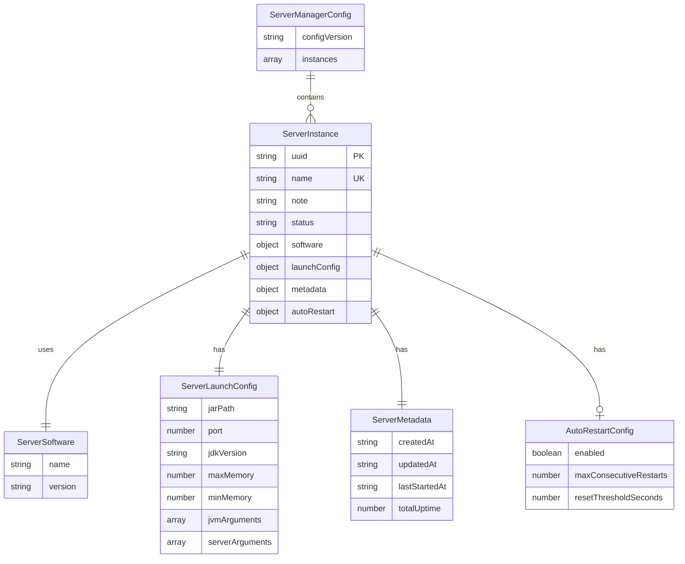
```mermaid
erDiagram
    ServerManagerConfig ||--o{ ServerInstance : contains
    ServerInstance ||--|| ServerSoftware : uses
    ServerInstance ||--|| ServerLaunchConfig : has
    ServerInstance ||--|| ServerMetadata : has
    ServerInstance ||--o| AutoRestartConfig : has

    ServerManagerConfig {
        string configVersion
        array instances
    }
    
    ServerInstance {
        string uuid PK
        string name UK
        string note
        string status
        object software
        object launchConfig
        object metadata
        object autoRestart
    }
    
    ServerSoftware {
        string name
        string version
    }
    
    ServerLaunchConfig {
        string jarPath
        number port
        string jdkVersion
        number maxMemory
        number minMemory
        array jvmArguments
        array serverArguments
    }
    
    ServerMetadata {
        string createdAt
        string updatedAt
        string lastStartedAt
        number totalUptime
    }
    
    AutoRestartConfig {
        boolean enabled
        number maxConsecutiveRestarts
        number resetThresholdSeconds
    }
```

### **実行時専用データ（非永続化）**

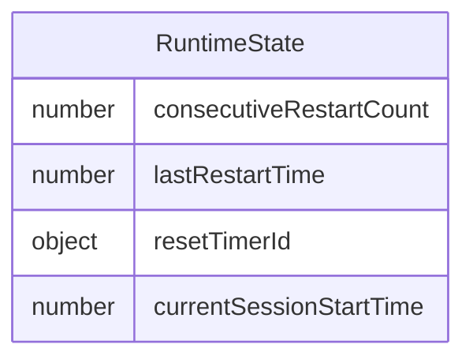
```mermaid
erDiagram
    RuntimeState {
        number consecutiveRestartCount
        number lastRestartTime
        object resetTimerId
        number currentSessionStartTime
    }
```

---

## **2. クラス構成とアーキテクチャ**

### **全体アーキテクチャ図**

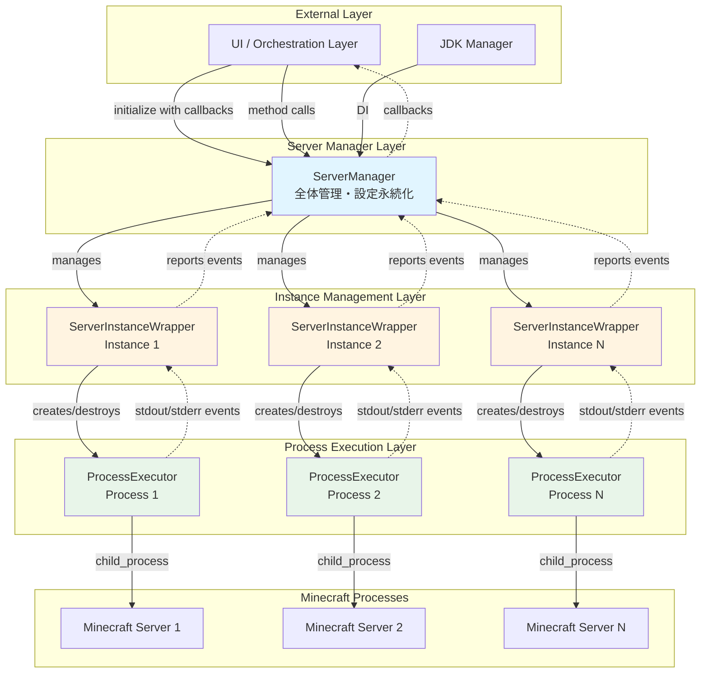
```mermaid
graph TB
    subgraph "External Layer"
        UI[UI / Orchestration Layer]
        JDK[JDK Manager]
    end
    
    subgraph "Server Manager Layer"
        SM[ServerManager<br/>全体管理・設定永続化]
    end
    
    subgraph "Instance Management Layer"
        SI1[ServerInstanceWrapper<br/>Instance 1]
        SI2[ServerInstanceWrapper<br/>Instance 2]
        SI3[ServerInstanceWrapper<br/>Instance N]
    end
    
    subgraph "Process Execution Layer"
        PE1[ProcessExecutor<br/>Process 1]
        PE2[ProcessExecutor<br/>Process 2]
        PE3[ProcessExecutor<br/>Process N]
    end
    
    subgraph "Minecraft Processes"
        MC1[Minecraft Server 1]
        MC2[Minecraft Server 2]
        MC3[Minecraft Server N]
    end
    
    UI -->|initialize with callbacks| SM
    UI -->|method calls| SM
    SM -.->|callbacks| UI
    
    JDK -->|DI| SM
    
    SM -->|manages| SI1
    SM -->|manages| SI2
    SM -->|manages| SI3
    
    SI1 -->|creates/destroys| PE1
    SI2 -->|creates/destroys| PE2
    SI3 -->|creates/destroys| PE3
    
    SI1 -.->|reports events| SM
    SI2 -.->|reports events| SM
    SI3 -.->|reports events| SM
    
    PE1 -->|child_process| MC1
    PE2 -->|child_process| MC2
    PE3 -->|child_process| MC3
    
    PE1 -.->|stdout/stderr events| SI1
    PE2 -.->|stdout/stderr events| SI2
    PE3 -.->|stdout/stderr events| SI3
    
    style SM fill:#e1f5ff
    style SI1 fill:#fff4e1
    style SI2 fill:#fff4e1
    style SI3 fill:#fff4e1
    style PE1 fill:#e8f5e9
    style PE2 fill:#e8f5e9
    style PE3 fill:#e8f5e9
```

### **クラス責任分離図**

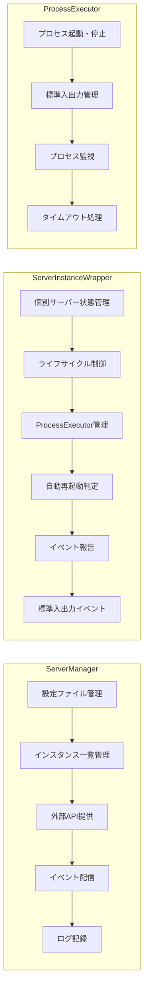
```mermaid
graph LR
    subgraph "ServerManager"
        SM1[設定ファイル管理]
        SM2[インスタンス一覧管理]
        SM3[外部API提供]
        SM4[イベント配信]
        SM5[ログ記録]
    end
    
    subgraph "ServerInstanceWrapper"
        SI1[個別サーバー状態管理]
        SI2[ライフサイクル制御]
        SI3[ProcessExecutor管理]
        SI4[自動再起動判定]
        SI5[イベント報告]
        SI6[標準入出力イベント]
    end
    
    subgraph "ProcessExecutor"
        PE1[プロセス起動・停止]
        PE2[標準入出力管理]
        PE3[プロセス監視]
        PE4[タイムアウト処理]
    end
    
    SM1 --> SM2
    SM2 --> SM3
    SM3 --> SM4
    SM4 --> SM5
    
    SI1 --> SI2
    SI2 --> SI3
    SI3 --> SI4
    SI4 --> SI5
    SI5 --> SI6
    
    PE1 --> PE2
    PE2 --> PE3
    PE3 --> PE4
```

---

## **3. クラス詳細設計**

### **ServerManager クラス**

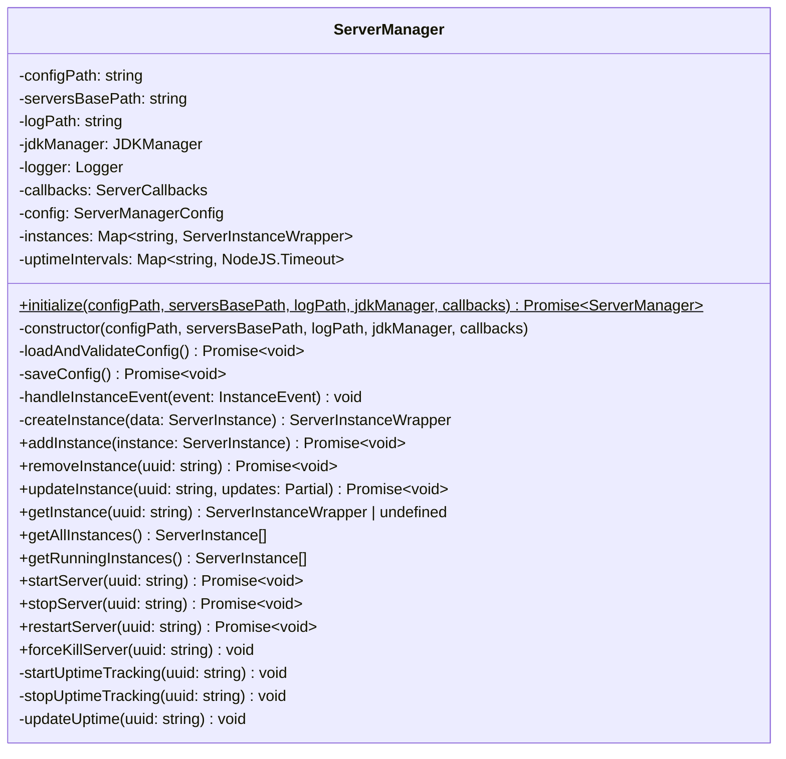
```mermaid
classDiagram
    class ServerManager {
        -configPath: string
        -serversBasePath: string
        -logPath: string
        -jdkManager: JDKManager
        -logger: Logger
        -callbacks: ServerCallbacks
        -config: ServerManagerConfig
        -instances: Map~string, ServerInstanceWrapper~
        -uptimeIntervals: Map~string, NodeJS.Timeout~
        
        +initialize(configPath, serversBasePath, logPath, jdkManager, callbacks)$ Promise~ServerManager~
        -constructor(configPath, serversBasePath, logPath, jdkManager, callbacks)
        -loadAndValidateConfig() Promise~void~
        -saveConfig() Promise~void~
        -handleInstanceEvent(event: InstanceEvent) void
        -createInstance(data: ServerInstance) ServerInstanceWrapper
        
        +addInstance(instance: ServerInstance) Promise~void~
        +removeInstance(uuid: string) Promise~void~
        +updateInstance(uuid: string, updates: Partial) Promise~void~
        +getInstance(uuid: string) ServerInstanceWrapper | undefined
        +getAllInstances() ServerInstance[]
        +getRunningInstances() ServerInstance[]
        
        +startServer(uuid: string) Promise~void~
        +stopServer(uuid: string) Promise~void~
        +restartServer(uuid: string) Promise~void~
        +forceKillServer(uuid: string) void
        
        -startUptimeTracking(uuid: string) void
        -stopUptimeTracking(uuid: string) void
        -updateUptime(uuid: string) void
    }
```

### **ServerInstanceWrapper クラス**

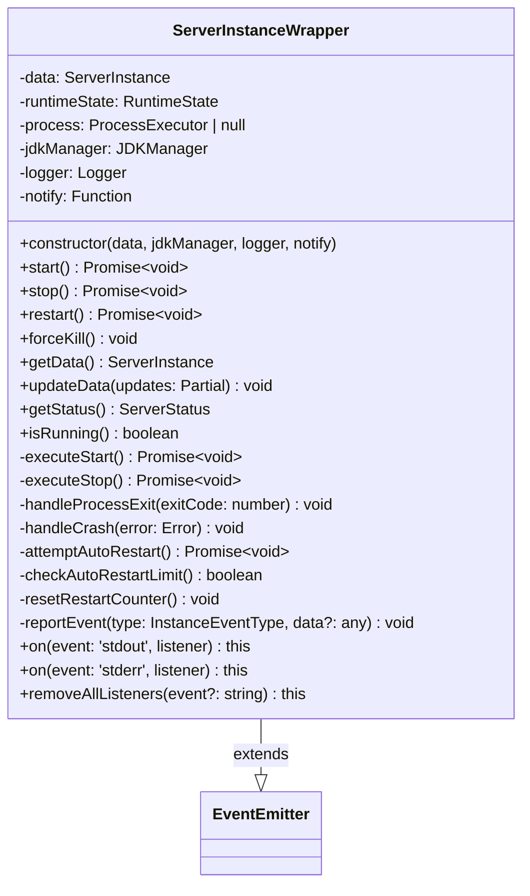
```mermaid
classDiagram
    class ServerInstanceWrapper {
        -data: ServerInstance
        -runtimeState: RuntimeState
        -process: ProcessExecutor | null
        -jdkManager: JDKManager
        -logger: Logger
        -notify: Function
        
        +constructor(data, jdkManager, logger, notify)
        
        +start() Promise~void~
        +stop() Promise~void~
        +restart() Promise~void~
        +forceKill() void
        
        +getData() ServerInstance
        +updateData(updates: Partial) void
        +getStatus() ServerStatus
        +isRunning() boolean
        
        -executeStart() Promise~void~
        -executeStop() Promise~void~
        -handleProcessExit(exitCode: number) void
        -handleCrash(error: Error) void
        -attemptAutoRestart() Promise~void~
        -checkAutoRestartLimit() boolean
        -resetRestartCounter() void
        
        -reportEvent(type: InstanceEventType, data?: any) void
        
        +on(event: 'stdout', listener) this
        +on(event: 'stderr', listener) this
        +removeAllListeners(event?: string) this
    }
    
    ServerInstanceWrapper --|> EventEmitter : extends
```

### **ProcessExecutor クラス**

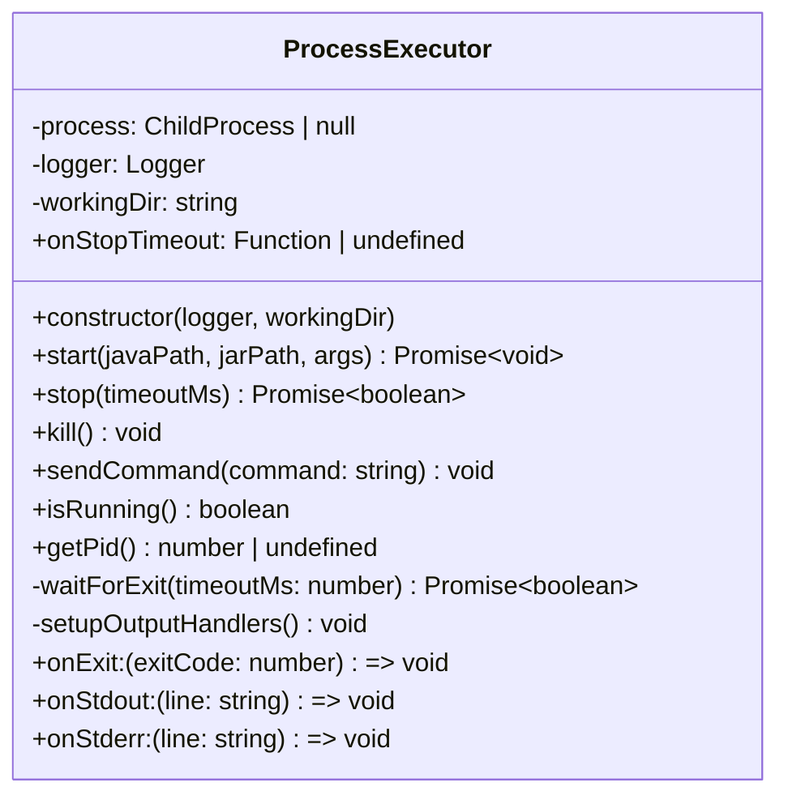
```mermaid
classDiagram
    class ProcessExecutor {
        -process: ChildProcess | null
        -logger: Logger
        -workingDir: string
        +onStopTimeout: Function | undefined
        
        +constructor(logger, workingDir)
        
        +start(javaPath, jarPath, args) Promise~void~
        +stop(timeoutMs) Promise~boolean~
        +kill() void
        
        +sendCommand(command: string) void
        +isRunning() boolean
        +getPid() number | undefined
        
        -waitForExit(timeoutMs: number) Promise~boolean~
        -setupOutputHandlers() void
        
        +onExit: (exitCode: number) => void
        +onStdout: (line: string) => void
        +onStderr: (line: string) => void
    }
```

---

## **4. データフロー図**

### **サーバー起動フロー**

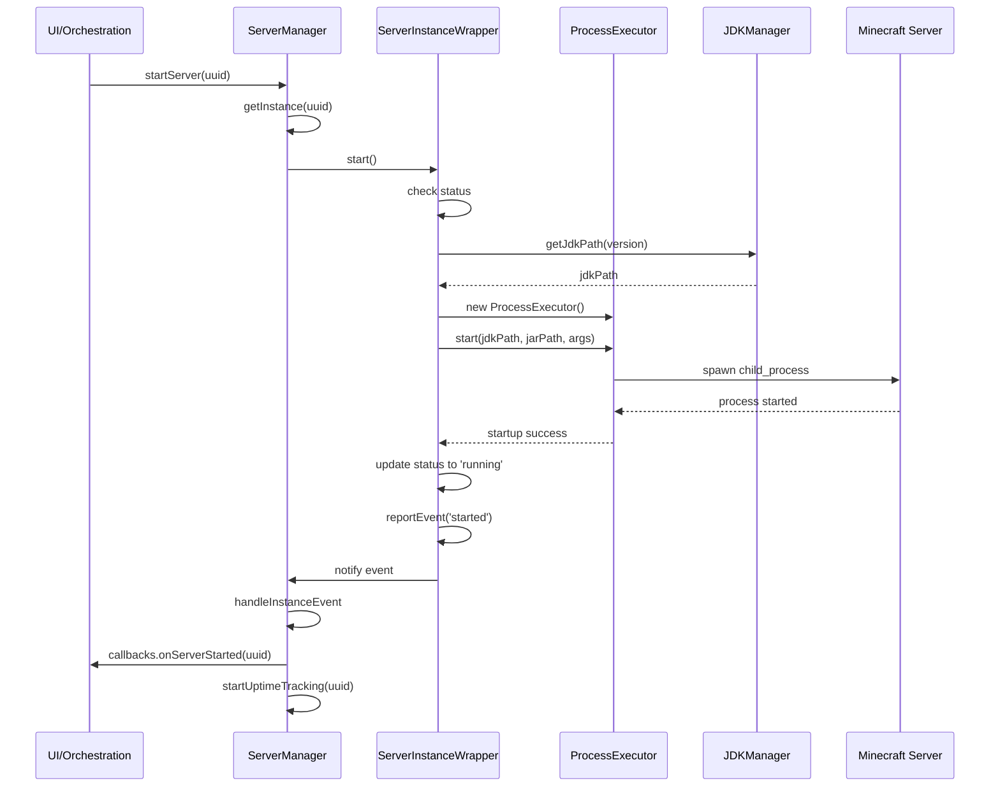
```mermaid
sequenceDiagram
    participant UI as UI/Orchestration
    participant SM as ServerManager
    participant SI as ServerInstanceWrapper
    participant PE as ProcessExecutor
    participant JDK as JDKManager
    participant MC as Minecraft Server
    
    UI->>SM: startServer(uuid)
    SM->>SM: getInstance(uuid)
    SM->>SI: start()
    
    SI->>SI: check status
    SI->>JDK: getJdkPath(version)
    JDK-->>SI: jdkPath
    
    SI->>PE: new ProcessExecutor()
    SI->>PE: start(jdkPath, jarPath, args)
    
    PE->>MC: spawn child_process
    MC-->>PE: process started
    
    PE-->>SI: startup success
    SI->>SI: update status to 'running'
    SI->>SI: reportEvent('started')
    SI->>SM: notify event
    SM->>SM: handleInstanceEvent
    SM->>UI: callbacks.onServerStarted(uuid)
    
    SM->>SM: startUptimeTracking(uuid)
```

### **サーバークラッシュ・自動再起動フロー**

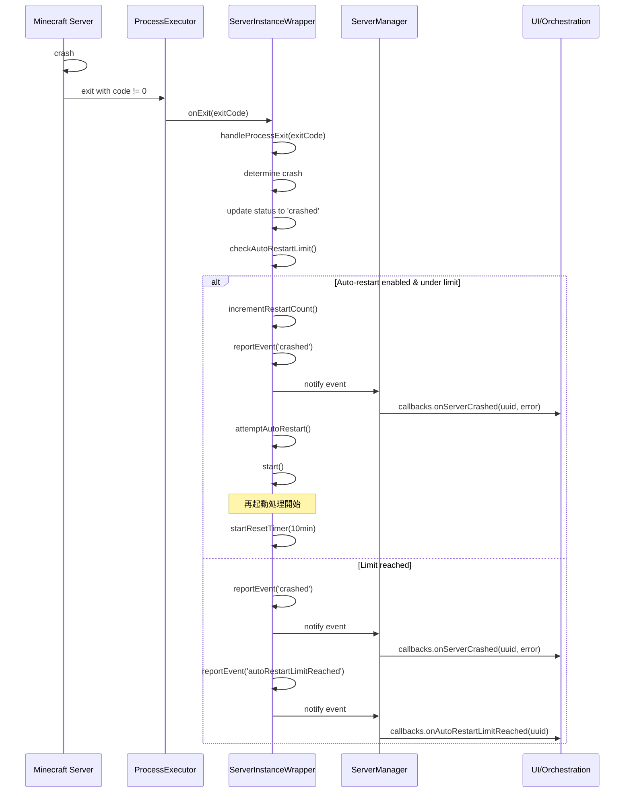
```mermaid
sequenceDiagram
    participant MC as Minecraft Server
    participant PE as ProcessExecutor
    participant SI as ServerInstanceWrapper
    participant SM as ServerManager
    participant UI as UI/Orchestration
    
    MC->>MC: crash
    MC->>PE: exit with code != 0
    
    PE->>SI: onExit(exitCode)
    SI->>SI: handleProcessExit(exitCode)
    SI->>SI: determine crash
    SI->>SI: update status to 'crashed'
    
    SI->>SI: checkAutoRestartLimit()
    
    alt Auto-restart enabled & under limit
        SI->>SI: incrementRestartCount()
        SI->>SI: reportEvent('crashed')
        SI->>SM: notify event
        SM->>UI: callbacks.onServerCrashed(uuid, error)
        
        SI->>SI: attemptAutoRestart()
        SI->>SI: start()
        Note over SI: 再起動処理開始
        
        SI->>SI: startResetTimer(10min)
        
    else Limit reached
        SI->>SI: reportEvent('crashed')
        SI->>SM: notify event
        SM->>UI: callbacks.onServerCrashed(uuid, error)
        
        SI->>SI: reportEvent('autoRestartLimitReached')
        SI->>SM: notify event
        SM->>UI: callbacks.onAutoRestartLimitReached(uuid)
    end
```

### **標準出力イベントフロー**

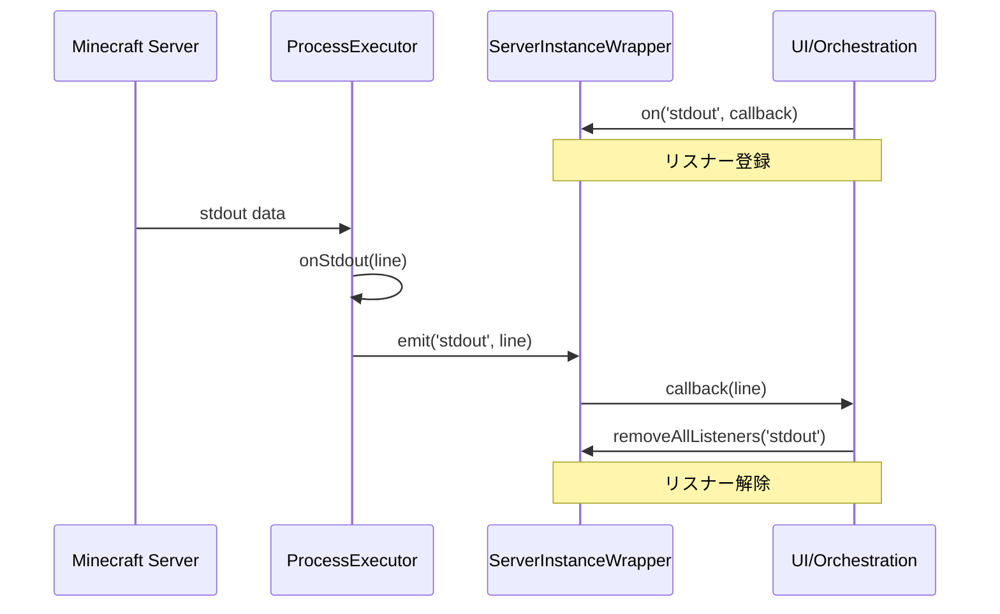
```mermaid
sequenceDiagram
    participant MC as Minecraft Server
    participant PE as ProcessExecutor
    participant SI as ServerInstanceWrapper
    participant UI as UI/Orchestration
    
    UI->>SI: on('stdout', callback)
    Note over UI,SI: リスナー登録
    
    MC->>PE: stdout data
    PE->>PE: onStdout(line)
    PE->>SI: emit('stdout', line)
    SI->>UI: callback(line)
    
    UI->>SI: removeAllListeners('stdout')
    Note over UI,SI: リスナー解除
```

---

## **5. イベント・コールバック設計**

### **イベントタイプ定義**

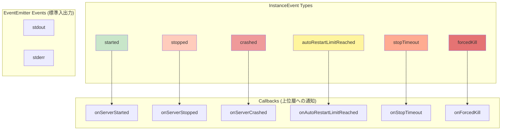
```mermaid
graph TB
    subgraph "InstanceEvent Types"
        E1[started]
        E2[stopped]
        E3[crashed]
        E4[autoRestartLimitReached]
        E5[stopTimeout]
        E6[forcedKill]
    end
    
    subgraph "EventEmitter Events (標準入出力)"
        EE1[stdout]
        EE2[stderr]
    end
    
    subgraph "Callbacks (上位層への通知)"
        CB1[onServerStarted]
        CB2[onServerStopped]
        CB3[onServerCrashed]
        CB4[onAutoRestartLimitReached]
        CB5[onStopTimeout]
        CB6[onForcedKill]
    end
    
    E1 --> CB1
    E2 --> CB2
    E3 --> CB3
    E4 --> CB4
    E5 --> CB5
    E6 --> CB6
    
    style E1 fill:#c8e6c9
    style E2 fill:#ffccbc
    style E3 fill:#ef9a9a
    style E4 fill:#fff59d
    style E5 fill:#ffab91
    style E6 fill:#e57373
```

### **TypeScript型定義**

```typescript
// イベント型
type InstanceEventType = 
  | 'started'
  | 'stopped'
  | 'crashed'
  | 'autoRestartLimitReached'
  | 'stopTimeout'
  | 'forcedKill';

interface InstanceEvent {
  type: InstanceEventType;
  uuid: string;
  timestamp: number;
  data?: any;
}

// コールバック型
interface ServerCallbacks {
  onServerStarted?: (uuid: string) => void;
  onServerStopped?: (uuid: string, exitCode: number) => void;
  onServerCrashed?: (uuid: string, error: Error) => void;
  onAutoRestartLimitReached?: (uuid: string) => void;
  onStopTimeout?: (uuid: string, message: string) => void;
  onForcedKill?: (uuid: string) => void;
}
```

---

## **6. ディレクトリ構造**

```
project-root/
├── src/
│   ├── types/
│   │   └── server-schema.ts          # スキーマ型定義
│   ├── classes/
│   │   ├── ServerManager.ts          # メインクラス
│   │   ├── ServerInstanceWrapper.ts  # インスタンス管理
│   │   └── ProcessExecutor.ts        # プロセス実行
│   └── index.ts
├── config/
│   └── server-manager.json           # 設定ファイル
├── servers/
│   ├── survival-server/              # 各サーバーディレクトリ
│   │   ├── server.jar
│   │   ├── server.properties
│   │   ├── logs/
│   │   └── world/
│   └── creative-server/
│       └── ...
└── logs/
    └── manager.log                   # マネージャーログ
```

---

## **7. 技術スタック確定**

| 項目 | 採用技術 | 理由 |
|------|---------|------|
| **言語** | TypeScript (strict mode) | 型安全性、null/undefinedセーフ |
| **ロガー** | Pino | 高速、JSON形式、軽量 |
| **バリデーション** | Zod | TypeScriptとの親和性、型推論 |
| **データ永続化** | JSON | クライアントサイド、軽量 |
| **プロセス管理** | child_process | Node.js標準、安定性 |
| **イベント管理** | EventEmitter (部分的) | 標準入出力のみ |
| **依存性注入** | Constructor Injection | テスタビリティ、疎結合 |

---

## **8. 設計原則まとめ**

### **責任分離の徹底**

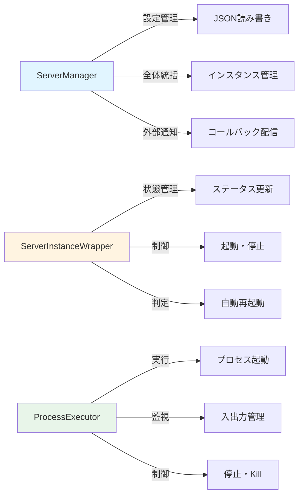
```mermaid
graph LR
    A[ServerManager] -->|設定管理| A1[JSON読み書き]
    A -->|全体統括| A2[インスタンス管理]
    A -->|外部通知| A3[コールバック配信]
    
    B[ServerInstanceWrapper] -->|状態管理| B1[ステータス更新]
    B -->|制御| B2[起動・停止]
    B -->|判定| B3[自動再起動]
    
    C[ProcessExecutor] -->|実行| C1[プロセス起動]
    C -->|監視| C2[入出力管理]
    C -->|制御| C3[停止・Kill]
    
    style A fill:#e1f5ff
    style B fill:#fff4e1
    style C fill:#e8f5e9
```

### **データの流れ**

```
永続データ (JSON)
    ↓ 読み込み
ServerManager (メモリ)
    ↓ 生成
ServerInstanceWrapper (メモリ + RuntimeState)
    ↓ 生成
ProcessExecutor (一時的)
    ↓ 起動
Minecraft Server Process
```

---

## **9. 確定した設計方針一覧**

✅ **アーキテクチャ:**
- 3層構造（Manager → Wrapper → Executor）
- 責任分離の徹底
- 疎結合設計

✅ **データ管理:**
- JSON形式で永続化
- 変更時自動保存
- 稼働時間は定期保存（5分ごと）
- Zodでバリデーション

✅ **依存性管理:**
- JDKManagerは外部注入（DI）
- Loggerは内部生成（Pino）
- 将来的にLogger注入も可能

✅ **イベント通知:**
- ライフサイクル: コールバック方式
- 標準入出力: EventEmitter方式
- 上位層への通知は一元管理

✅ **プロセス制御:**
- タイムアウト時はコールバック通知
- 強制終了はユーザー操作のみ
- 自動再起動機能あり

✅ **初期化:**
- static initialize()パターン
- 設定ファイル自動作成
- バージョンマイグレーション対応

---

## **Step2への移行**

**現在の状態:**
- ✅ データスキーマ完全確定
- ✅ クラス構成確定
- ✅ 責任分離明確化
- ✅ イベント・コールバック設計確定
- ✅ 技術スタック確定

**次のステップ: Step2 - メソッド定義・詳細設計**

以下の作業を行います：

1. **各クラスの全メソッドシグネチャ定義**
2. **各メソッドの詳細仕様書作成**
3. **エラーハンドリング戦略確定**
4. **実装依頼書作成**

---

**Step2に進んで問題ないでしょうか？**

準備万端です！あなたの大雑把な設計をお待ちしています！🚀

## User

ちょｗｗ
step2で各クラスの詳細設計しようと思ってたのに
めっちゃ細かく書くやんｗｗｗ

でもざっと見た感じ、かなり良さげですな
このままstep2行きますか
けどここまで来ると基本設計がほぼ完成しきってるので
私は補足程度にとどめます

一旦ほしいメソッドを思いつく限り書きます
先程のあなたの提案と被っている部分がかなり多く、ぶっちゃけ新規で追加したいと考えるメソッドはそんなにないです
なので一部挙動の補足やメソッド追加位で考えてね

#ServerManager クラス
constructorは既存の定義通りでいいかと思います
``addInstance(instance: ServerInstance)``
これの引数を定義しましょう
現状の見立てでは、以下のような入力があるはずです
//あくまで私が考える範囲で必要な要素です
//他に何かアレば何なりとお申し付けくださいな
{
name:string
note:string
Server:Serversoftware
jdkVersion:string
ServerBinaryfilePath:string
}
そしてこのメソッドではサーバ本体のjarファイルを用意したり、
名前の競合チェックなどいろいろ必要な機能が数多くあります
ServerBinaryfilePathとして定義したのでそこからmvしてサーバ本体のディレクトrに持っていき、使う形でいいかと思います
その際にはEULAの自動同意とかそもそもeula.txtの作成とかもほしいところですね
ここらへんの仕様はとにかく複雑なので、改めて個別二私に問い合わせてください

返り値はresultの型を制定するのがベストですが
{result:"ok",uuid?:uuid,err?:string}
みたいな感じがいいかも
launchconfig関連とかのオプションは一旦既定でおいておき、
updateメソッドで編集することにします
他メタデータなども動的生成し、restartに関しては
規定はオフ、同じくupdateで有効化できるような仕組みにします
そういう意味で、ここらへんpromiceのvoidでははなく、きちんとresultを返すようにしましょう

あと標準入力へのアクセス関係がないのが気になります
openProcessStd(uuid:string,callbacks)何かを定義して、標準入力からの受取と書き込みをできるようにスべきかと思いますね
あとupdateも入出力を整備しなくてはなりませんね
特に、nameの変更などはディレクトリ自体の名前の変更を伴うため、サーバ起動中は拒否するなど必要項目が多くあります

一旦updateメソッドで変更可能にしたいものをいかに提示します
name,note,maxmem,minmem,jvm/serverArgv,autorestart

このあたりはupdateで変更可能とし、
特にname変更などファイルの移動などに関わるものは状況によってはロックされていることもあるため、エラーハンドリングなどを厳重にする必要があります。
(つまりサーバー起動中は当然ながら名前の変更は不可にする)
これらの失敗に備え、update前のインスタンスデータはdeepcopyのbackupを残しておき、変更に失敗した場合はfallbackするなども必要かと

removeメソッドはサーバー本体の削除を伴います
ただし、何らかの理由によりサーバーのいずれかのファイルがロックされており、削除できない場合も十二分に考えられます。
そうなったときに問題をユーザーに通知するためのエラーハンドリングやResult定義が必要かと思いますね

全体に関する話にはなりますが、ちょっとめちゃ現時点のメソッド設計が完成されてて居るものを基準にして考えているゆえ不足が多くなるかもしれません
不明点は積極的に聞いて下さい

ServerManagernに関して気になるところは一旦こんな感じです

#ServerInstanceWrapper クラス
onメソッドがイベントを持っているんですね
これは外部からは
前述のServerManagerからuuidでアクセスする
という認識で間違いなければ問題ないかと
強いて言うなら
-executeStart()
などで適切にjvmのargvを渡せるようにしてください
maxmemとminmemは"-Xmx"と"-Xms"で表現します


うーん、あなたの設計がすごすぎてちょっと困ります）））
自分の頭の中にあった設計が上書きされたような...
まぁ完成されてるので問題ないです！
現状大事なポイントとしては
- サーバー本体のjarをどう持ってくるか
というところです

じつは呼び出し元クラスの機能として、httpで各ファイルをダウンロードする部分を実装済みです
なので、やはりaddinstanceの際に上からパスを与えられる構造が一番いいかもしれませんね

とりあえず、今の状況ではjdkmanagerが非常に不透明なので、一旦それに関するドキュメントをいかに添付しますね
またこれ以外で不明点や明らかにするべき詳細仕様などの項目等あれば先ほどと同じ用に質問を投げてください！
あなたの提示したステップに合わせて進めることを一旦前提で私は考えますので、次の段階に進むときはひと声かけてください！

```
This file is a merged representation of the entire codebase, combined into a single document by Repomix.

<file_summary>
This section contains a summary of this file.

<purpose>
This file contains a packed representation of the entire repository's contents.
It is designed to be easily consumable by AI systems for analysis, code review,
or other automated processes.
</purpose>

<file_format>
The content is organized as follows:
1. This summary section
2. Repository information
3. Directory structure
4. Repository files (if enabled)
5. Multiple file entries, each consisting of:
  - File path as an attribute
  - Full contents of the file
</file_format>

<usage_guidelines>
- This file should be treated as read-only. Any changes should be made to the
  original repository files, not this packed version.
- When processing this file, use the file path to distinguish
  between different files in the repository.
- Be aware that this file may contain sensitive information. Handle it with
  the same level of security as you would the original repository.
</usage_guidelines>

<notes>
- Some files may have been excluded based on .gitignore rules and Repomix's configuration
- Binary files are not included in this packed representation. Please refer to the Repository Structure section for a complete list of file paths, including binary files
- Files matching patterns in .gitignore are excluded
- Files matching default ignore patterns are excluded
- Files are sorted by Git change count (files with more changes are at the bottom)
</notes>

</file_summary>

<directory_structure>
api-reference.md
architecture.md
JDK-REGISTRY-SCHEMA.md
README.md
usage-examples.md
</directory_structure>

<files>
This section contains the contents of the repository's files.

<file path="api-reference.md">
# JDK Manager - API Reference (Mermaid Edition)

## API階層構造

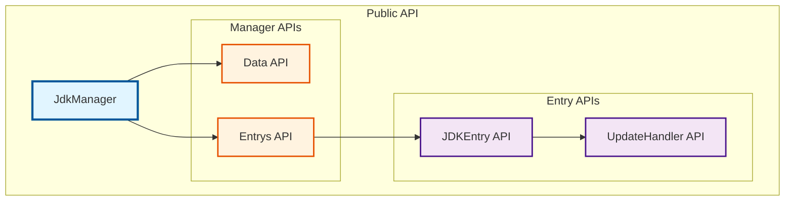
```mermaid
graph TB
    subgraph "Public API"
        JdkManager[JdkManager]
        
        subgraph "Manager APIs"
            DataAPI[Data API]
            EntrysAPI[Entrys API]
        end
        
        subgraph "Entry APIs"
            EntryAPI[JDKEntry API]
            UpdateAPI[UpdateHandler API]
        end
    end
    
    JdkManager --> DataAPI
    JdkManager --> EntrysAPI
    EntrysAPI --> EntryAPI
    EntryAPI --> UpdateAPI
    
    style JdkManager fill:#e1f5ff,stroke:#01579b,stroke-width:3px
    style DataAPI fill:#fff3e0,stroke:#e65100,stroke-width:2px
    style EntrysAPI fill:#fff3e0,stroke:#e65100,stroke-width:2px
    style EntryAPI fill:#f3e5f5,stroke:#4a148c,stroke-width:2px
    style UpdateAPI fill:#f3e5f5,stroke:#4a148c,stroke-width:2px
```

## JdkManager API

### コンストラクタ

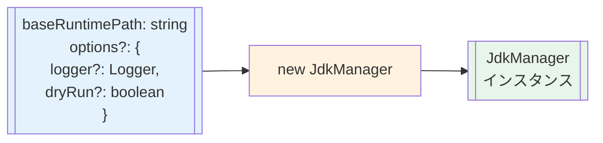
```mermaid
flowchart LR
    Input[["baseRuntimePath: string<br/>options?: {<br/>  logger?: Logger,<br/>  dryRun?: boolean<br/>}"]] --> Constructor[new JdkManager]
    Constructor --> Output[["JdkManager<br/>インスタンス"]]
    
    style Input fill:#e3f2fd
    style Constructor fill:#fff3e0
    style Output fill:#e8f5e9
```

### プロパティ

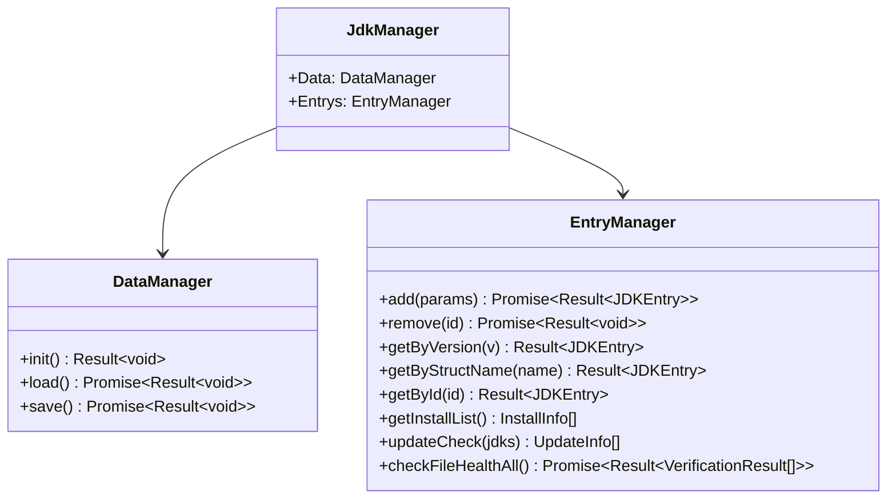
```mermaid
classDiagram
    class JdkManager {
        +Data: DataManager
        +Entrys: EntryManager
    }
    
    class DataManager {
        +init() Result~void~
        +load() Promise~Result~void~~
        +save() Promise~Result~void~~
    }
    
    class EntryManager {
        +add(params) Promise~Result~JDKEntry~~
        +remove(id) Promise~Result~void~~
        +getByVersion(v) Result~JDKEntry~
        +getByStructName(name) Result~JDKEntry~
        +getById(id) Result~JDKEntry~
        +getInstallList() InstallInfo[]
        +updateCheck(jdks) UpdateInfo[]
        +checkFileHealthAll() Promise~Result~VerificationResult[]~~
    }
    
    JdkManager --> DataManager
    JdkManager --> EntryManager
```

## Data API

### init() - レジストリ初期化

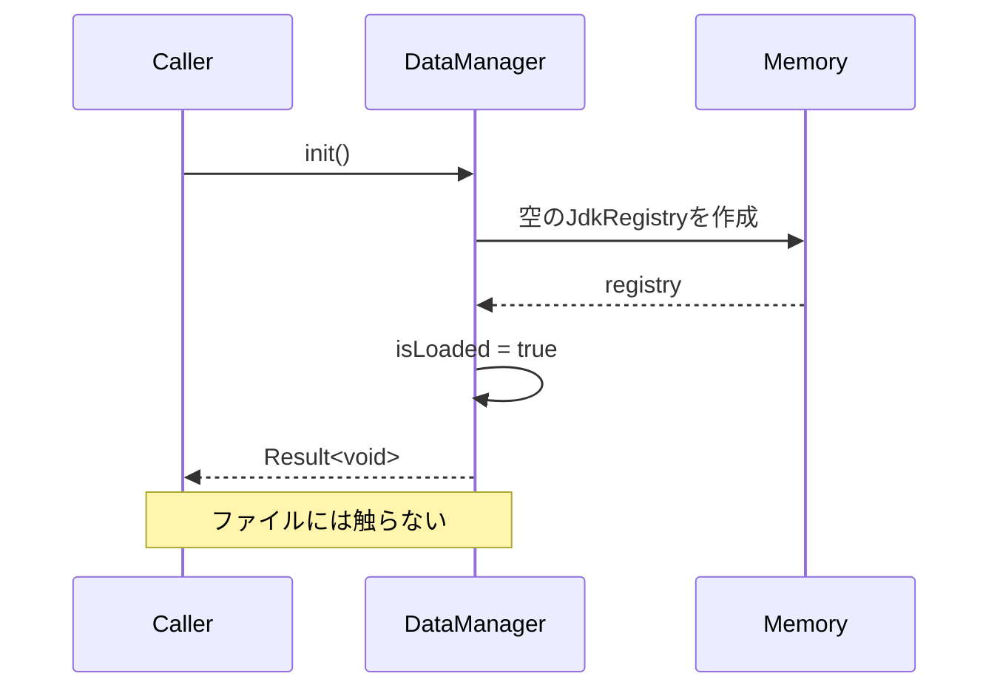
```mermaid
sequenceDiagram
    participant Caller
    participant Data as DataManager
    participant Memory as Memory
    
    Caller->>Data: init()
    Data->>Memory: 空のJdkRegistryを作成
    Memory-->>Data: registry
    Data->>Data: isLoaded = true
    Data-->>Caller: Result<void>
    
    Note over Caller,Data: ファイルには触らない
```

**戻り値:**
```typescript
Result<void>
```

### load() - レジストリ読み込み

```mermaid
flowchart TD
    Start([load呼び出し]) --> Check{jdk-registry.json<br/>存在確認}
    Check -->|なし| ErrorNotFound[Error: File not found]
    Check -->|あり| Read[ファイル読み込み]
    
    Read --> Parse[JSON解析]
    Parse --> Validate{schemaVersion<br/>検証}
    
    Validate -->|不正| ErrorSchema[Error: Incompatible schema]
    Validate -->|正常| SetRegistry[registryに格納]
    
    SetRegistry --> SetLoaded[isLoaded = true]
    SetLoaded --> Success[Result<void> success]
    
    ErrorNotFound --> End([終了])
    ErrorSchema --> End
    Success --> End
    
    style Success fill:#c8e6c9
    style ErrorNotFound fill:#ffcdd2
    style ErrorSchema fill:#ffcdd2
```

**戻り値:**
```typescript
Promise<Result<void>>
```

### save() - レジストリ保存

```mermaid
flowchart TD
    Start([save呼び出し]) --> CheckLoaded{isLoaded<br/>確認}
    CheckLoaded -->|false| ErrorNotLoaded[Error: Registry not loaded]
    CheckLoaded -->|true| UpdateTime[lastUpdated更新]
    
    UpdateTime --> Serialize[JSONシリアライズ]
    Serialize --> CheckDryRun{dryRun<br/>モード?}
    
    CheckDryRun -->|true| LogDryRun[ログ出力のみ]
    CheckDryRun -->|false| CreateDir[ディレクトリ作成]
    
    CreateDir --> Write[ファイル書き込み]
    Write --> Success[Result<void> success]
    LogDryRun --> Success
    
    ErrorNotLoaded --> End([終了])
    Success --> End
    
    style Success fill:#c8e6c9
    style ErrorNotLoaded fill:#ffcdd2
    style LogDryRun fill:#fff9c4
```

**戻り値:**
```typescript
Promise<Result<void>>
```

## Entrys API

### add() - JDKインストール

```mermaid
graph TD
    subgraph "Input Parameters"
        Params["AddJdkParams {<br/>archivePath: string<br/>majorVersion: number<br/>structName?: string<br/>name?: string<br/>}"]
    end
    
    subgraph "Validation"
        V1{installLock<br/>確認}
        V2{同一バージョン<br/>存在確認}
        V3{アーカイブファイル<br/>存在確認}
    end
    
    subgraph "Processing"
        P1[アーカイブ解凍]
        P2[ファイル移動]
        P3[バージョン確認]
        P4[チェックサム計算]
        P5[エントリ作成]
    end
    
    subgraph "Output"
        Success["Result<JDKEntry><br/>success: true<br/>data: JDKEntry"]
        Error["Result<JDKEntry><br/>success: false<br/>error: string"]
    end
    
    Params --> V1
    V1 -->|OK| V2
    V1 -->|NG| Error
    V2 -->|OK| V3
    V2 -->|NG| Error
    V3 -->|OK| P1
    V3 -->|NG| Error
    
    P1 --> P2
    P2 --> P3
    P3 --> P4
    P4 --> P5
    P5 --> Success
    
    style Params fill:#e3f2fd
    style Success fill:#c8e6c9
    style Error fill:#ffcdd2
```

**シグネチャ:**
```typescript
async add(params: AddJdkParams): Promise<Result<JDKEntry>>
```

### remove() - JDK削除

```mermaid
sequenceDiagram
    participant Caller
    participant EM as EntryManager
    participant Entry as JDKEntry
    participant FS as FileSystem
    participant DM as DataManager
    
    Caller->>EM: remove(id)
    EM->>EM: エントリ検索
    
    alt エントリなし
        EM-->>Caller: Error: Not found
    end
    
    EM->>Entry: isLocked()
    Entry-->>EM: boolean
    
    alt ロック中
        EM-->>Caller: Error: Locked
    end
    
    alt dryRunモード
        EM->>EM: ログ出力のみ
    else 通常モード
        EM->>FS: removeDirectory(jdkPath)
        FS-->>EM: 完了
    end
    
    EM->>EM: instances配列から削除
    EM->>EM: entryCacheから削除
    EM->>EM: activeJdkId更新
    
    EM->>DM: save()
    DM-->>EM: Result<void>
    
    EM-->>Caller: Result<void> success
```

**シグネチャ:**
```typescript
async remove(id: string): Promise<Result<void>>
```

### getByVersion() - バージョンで検索

```mermaid
flowchart LR
    Input["majorVersion: number"] --> Search[instances配列を検索]
    Search --> Found{見つかった?}
    Found -->|Yes| GetEntry[JDKEntry取得/作成]
    Found -->|No| Error["Result<JDKEntry><br/>success: false"]
    GetEntry --> Success["Result<JDKEntry><br/>success: true<br/>data: JDKEntry"]
    
    style Input fill:#e3f2fd
    style Success fill:#c8e6c9
    style Error fill:#ffcdd2
```

**シグネチャ:**
```typescript
getByVersion(majorVersion: number): Result<JDKEntry>
```

### getByStructName() - 正式名称で検索

```mermaid
flowchart LR
    Input["structName: string"] --> Search[instances配列を検索]
    Search --> Found{見つかった?}
    Found -->|Yes| GetEntry[JDKEntry取得/作成]
    Found -->|No| Error["Result<JDKEntry><br/>success: false"]
    GetEntry --> Success["Result<JDKEntry><br/>success: true<br/>data: JDKEntry"]
    
    style Input fill:#e3f2fd
    style Success fill:#c8e6c9
    style Error fill:#ffcdd2
```

**シグネチャ:**
```typescript
getByStructName(structName: string): Result<JDKEntry>
```

### getById() - IDで検索

```mermaid
flowchart LR
    Input["id: string"] --> Search[instances配列を検索]
    Search --> Found{見つかった?}
    Found -->|Yes| GetEntry[JDKEntry取得/作成]
    Found -->|No| Error["Result<JDKEntry><br/>success: false"]
    GetEntry --> Success["Result<JDKEntry><br/>success: true<br/>data: JDKEntry"]
    
    style Input fill:#e3f2fd
    style Success fill:#c8e6c9
    style Error fill:#ffcdd2
```

**シグネチャ:**
```typescript
getById(id: string): Result<JDKEntry>
```

### getInstallList() - インストール済みリスト取得

```mermaid
flowchart TD
    Start([getInstallList]) --> Loop{全instances<br/>処理完了?}
    Loop -->|No| Extract[必要な情報を抽出]
    Extract --> Create[InstallInfo作成]
    Create --> Add[配列に追加]
    Add --> Loop
    Loop -->|Yes| Return[InstallInfo[]返却]
    
    style Start fill:#e3f2fd
    style Return fill:#c8e6c9
```

**戻り値:**
```typescript
InstallInfo[] = {
  id: string;
  majorVersion: number;
  name: string;
  structName: string;
  verificationStatus: VerificationStatus;
}[]
```

### updateCheck() - アップデートチェック

```mermaid
graph TD
    Input["availableJdks:<br/>AvailableJdk[]"] --> GetOS[現在のOS判定]
    GetOS --> Init[updates配列初期化]
    
    Init --> Loop{全instances<br/>処理}
    
    Loop --> Find[availableJdksから<br/>同じバージョン検索]
    Find --> Match{マッチ?}
    
    Match -->|No| Loop
    Match -->|Yes| GetDL[OS対応<br/>ダウンロードURL取得]
    
    GetDL --> Exists{URL存在?}
    Exists -->|No| Loop
    Exists -->|Yes| Compare{structName<br/>比較}
    
    Compare -->|同じ| Loop
    Compare -->|異なる| AddUpdate[UpdateInfo作成<br/>配列に追加]
    
    AddUpdate --> Loop
    Loop --> Return[UpdateInfo[]返却]
    
    style Input fill:#e3f2fd
    style Return fill:#c8e6c9
```

**戻り値:**
```typescript
UpdateInfo[] = {
  id: string;
  currentStructName: string;
  availableStructName: string;
  downloadUrl: string;
  majorVersion: number;
}[]
```

### checkFileHealthAll() - 全JDKの整合性検証

```mermaid
sequenceDiagram
    participant Caller
    participant EM as EntryManager
    participant Entry as JDKEntry
    participant DM as DataManager
    
    Caller->>EM: checkFileHealthAll()
    
    loop 全instances
        EM->>Entry: checkFileHealth()
        Entry->>Entry: ファイル検証処理
        Entry-->>EM: Result<VerificationStatus>
        EM->>EM: VerificationResult作成
        EM->>EM: results配列に追加
    end
    
    EM->>DM: save()
    DM-->>EM: Result<void>
    
    EM-->>Caller: Result<VerificationResult[]>
```

**戻り値:**
```typescript
Promise<Result<VerificationResult[]>>

VerificationResult = {
  id: string;
  status: VerificationStatus;
  missingFiles?: string[];
  corruptedFiles?: string[];
}
```

## JDKEntry API

### メソッド一覧

```mermaid
classDiagram
    class JDKEntry {
        +useRuntime(purpose?) string
        +unUseRuntime(lockId) Result~void~
        +isLocked() boolean
        +checkFileHealth() Promise~Result~VerificationStatus~~
        +getUpdate(availableJdks, onSave) UpdateHandler | null
        
        +getId() string
        +getName() string
        +getStructName() string
        +getMajorVersion() number
        +getPath() string
        +getVerificationStatus() VerificationStatus
        +getOS() string
        +getInstalledAt() string
        +getChecksums() FileChecksum[]
        +getLocks() RuntimeLock[]
    }
```

### useRuntime() - ランタイムロック取得

```mermaid
flowchart TD
    Input["purpose?: string"] --> GenUUID[UUID生成]
    GenUUID --> CreateLock[RuntimeLockオブジェクト作成]
    CreateLock --> AddLock[locks配列に追加]
    AddLock --> Log[ログ出力]
    Log --> Return["lockId: string"]
    
    style Input fill:#e3f2fd
    style Return fill:#c8e6c9
```

**シグネチャ:**
```typescript
useRuntime(purpose?: string): string
```

### unUseRuntime() - ランタイムロック解放

```mermaid
flowchart TD
    Input["lockId: string"] --> Search{locks配列から<br/>検索}
    Search -->|見つからない| Error["Result<void><br/>success: false<br/>error: 'Lock not found'"]
    Search -->|見つかった| Remove[locks配列から削除]
    Remove --> Log[ログ出力]
    Log --> Success["Result<void><br/>success: true"]
    
    style Input fill:#e3f2fd
    style Success fill:#c8e6c9
    style Error fill:#ffcdd2
```

**シグネチャ:**
```typescript
unUseRuntime(lockId: string): Result<void>
```

### isLocked() - ロック状態確認

```mermaid
flowchart LR
    Call([isLocked]) --> Check{locks.length > 0}
    Check -->|Yes| True[return true]
    Check -->|No| False[return false]
    
    style Call fill:#e3f2fd
    style True fill:#c8e6c9
    style False fill:#c8e6c9
```

**シグネチャ:**
```typescript
isLocked(): boolean
```

### checkFileHealth() - ファイル整合性検証

```mermaid
graph TD
    Start([checkFileHealth]) --> Init[missingFiles/corruptedFiles初期化]
    
    Init --> Loop{全checksums<br/>処理完了?}
    
    Loop -->|No| CheckExists{ファイル存在?}
    CheckExists -->|No| AddMissing[missingFilesに追加]
    CheckExists -->|Yes| CalcHash[SHA-256計算]
    
    CalcHash --> Compare{チェックサム一致?}
    Compare -->|No| AddCorrupt[corruptedFilesに追加]
    Compare -->|Yes| UpdateTime[lastVerified更新]
    
    AddMissing --> Loop
    AddCorrupt --> Loop
    UpdateTime --> Loop
    
    Loop -->|Yes| Determine{ステータス判定}
    
    Determine -->|missing| SetMissing[status = 'missing']
    Determine -->|corrupted| SetCorrupt[status = 'corrupted']
    Determine -->|verified| SetVerified[status = 'verified']
    
    SetMissing --> Update[verificationStatus更新]
    SetCorrupt --> Update
    SetVerified --> Update
    
    Update --> Return["Result<VerificationStatus>"]
    
    style Start fill:#e3f2fd
    style Return fill:#c8e6c9
    style SetMissing fill:#ffcdd2
    style SetCorrupt fill:#fff9c4
    style SetVerified fill:#c8e6c9
```

**シグネチャ:**
```typescript
async checkFileHealth(): Promise<Result<VerificationStatus>>
```

### getUpdate() - アップデートハンドラ取得

```mermaid
flowchart TD
    Input["availableJdks: AvailableJdk[]<br/>onSave: Function"] --> GetOS[現在のOS取得]
    
    GetOS --> Find{同じmajorVersion<br/>のJDK検索}
    Find -->|なし| ReturnNull[return null]
    
    Find -->|あり| GetDL{OS対応<br/>ダウンロードあり?}
    GetDL -->|なし| ReturnNull
    
    GetDL -->|あり| Extract[URLから<br/>structName抽出]
    Extract --> Compare{structName<br/>比較}
    
    Compare -->|同じ| ReturnNull
    Compare -->|異なる| Create[UpdateHandler作成]
    Create --> ReturnHandler[return UpdateHandler]
    
    style Input fill:#e3f2fd
    style ReturnHandler fill:#c8e6c9
    style ReturnNull fill:#e0e0e0
```

**シグネチャ:**
```typescript
getUpdate(
  availableJdks: AvailableJdk[],
  onSaveRegistry: () => Promise<Result<void>>
): UpdateHandler | null
```

### ゲッターメソッド

```mermaid
graph LR
    subgraph "Getters"
        getId[getId]
        getName[getName]
        getStructName[getStructName]
        getMajorVersion[getMajorVersion]
        getPath[getPath]
        getVerificationStatus[getVerificationStatus]
        getOS[getOS]
        getInstalledAt[getInstalledAt]
        getChecksums[getChecksums]
        getLocks[getLocks]
    end
    
    subgraph "Internal Data"
        Instance[instance: JdkInstance]
        Locks[locks: RuntimeLock[]]
        BasePath[baseRuntimePath: string]
    end
    
    Instance --> getId
    Instance --> getName
    Instance --> getStructName
    Instance --> getMajorVersion
    Instance --> getVerificationStatus
    Instance --> getOS
    Instance --> getInstalledAt
    Instance --> getChecksums
    
    Locks --> getLocks
    BasePath --> getPath
    Instance --> getPath
    
    style Instance fill:#e3f2fd
    style Locks fill:#e3f2fd
    style BasePath fill:#e3f2fd
```

## UpdateHandler API

### install() - アップデート実行

```mermaid
sequenceDiagram
    participant Caller
    participant UH as UpdateHandler
    participant Entry as JDKEntry
    participant FS as FileSystem
    
    Caller->>UH: install(archivePath, dryRun?)
    
    UH->>Entry: isLocked()
    Entry-->>UH: boolean
    
    alt ロック中
        UH-->>Caller: Error: Locked
    end
    
    alt dryRunモード
        UH->>UH: ログ出力のみ
        UH-->>Caller: Success
    end
    
    UH->>UH: レジストリバックアップ
    UH->>FS: moveDirectory(jdk, backup)
    
    Note over UH,FS: 新バージョンインストール
    
    alt インストール失敗
        UH->>FS: ロールバック処理
        UH-->>Caller: Error
    end
    
    UH->>Entry: instance更新
    UH->>UH: onSaveRegistry()
    UH->>FS: クリーンアップ
    
    UH-->>Caller: Success
```

**シグネチャ:**
```typescript
async install(
  archivePath: string,
  dryRun?: boolean
): Promise<Result<void>>
```

### getNewVersionInfo() - 新バージョン情報取得

```mermaid
flowchart LR
    Call([getNewVersionInfo]) --> Return["return {<br/>structName: string<br/>downloadUrl: string<br/>version: string<br/>vendor?: string<br/>}"]
    
    style Call fill:#e3f2fd
    style Return fill:#c8e6c9
```

**シグネチャ:**
```typescript
getNewVersionInfo(): {
  structName: string;
  downloadUrl: string;
  version: string;
  vendor?: string;
}
```

## エラーハンドリング

### Result型のフロー

```mermaid
flowchart TD
    Start([API呼び出し]) --> Try[try-catchで実行]
    
    Try --> Success{成功?}
    Success -->|Yes| ReturnSuccess["return {<br/>success: true<br/>data: T<br/>}"]
    Success -->|No| CatchError[Errorをキャッチ]
    
    CatchError --> ReturnError["return {<br/>success: false<br/>error: string<br/>}"]
    
    style Start fill:#e3f2fd
    style ReturnSuccess fill:#c8e6c9
    style ReturnError fill:#ffcdd2
```

### エラーメッセージの例

```mermaid
mindmap
  root((Error Messages))
    Installation
      JDK with major version X already exists
      Installation is already in progress
      Archive file not found
      Failed to verify Java version
      Version mismatch
    Removal
      JDK not found
      Entry is locked and cannot be removed
      Failed to remove directory
    Verification
      Failed to calculate checksum
      Failed to read file
    Lock Management
      Lock not found
    Data Management
      Registry not loaded
      Registry file not found
      Incompatible schema version
      Failed to save registry
```

## 使用例フロー

### 基本的な使用例

```mermaid
sequenceDiagram
    actor User
    participant App
    participant Manager as JdkManager
    participant Entrys as EntryManager
    participant Entry as JDKEntry
    
    User->>App: JDK管理システム起動
    App->>Manager: new JdkManager(path, options)
    Manager-->>App: manager
    
    App->>Manager: Data.init()
    Manager-->>App: Result<void>
    
    User->>App: Java 17インストール要求
    App->>Entrys: add({archivePath, majorVersion: 17})
    Entrys->>Entrys: インストール処理
    Entrys-->>App: Result<JDKEntry>
    
    App->>Manager: Entrys.getInstallList()
    Manager-->>App: InstallInfo[]
    App-->>User: インストール済みリスト表示
    
    User->>App: Java 17使用開始
    App->>Entrys: getByVersion(17)
    Entrys-->>App: Result<JDKEntry>
    
    App->>Entry: useRuntime("Minecraft")
    Entry-->>App: lockId
    
    Note over App,Entry: Minecraftプレイ中...
    
    App->>Entry: unUseRuntime(lockId)
    Entry-->>App: Result<void>
    
    User->>App: 整合性チェック要求
    App->>Manager: Entrys.checkFileHealthAll()
    Manager-->>App: Result<VerificationResult[]>
    App-->>User: 検証結果表示
```

---

**このドキュメントは、JDK Manager APIの包括的なリファレンスをMermaid図で提供します。**
</file>

<file path="architecture.md">
# JDK Manager - Architecture Documentation

## システムアーキテクチャ概要

```mermaid
graph TB
    subgraph "External Systems"
        Orchestrator[上位オーケストレータ]
        Downloader[汎用ダウンロードクラス]
        JDKSource[JDK配布サーバー]
    end
    
    subgraph "JDK Manager System"
        JdkManager[JdkManager<br/>メインクラス]
        DataMgr[DataManager<br/>データ永続化]
        EntryMgr[EntryManager<br/>エントリ管理]
        
        subgraph "Entity Layer"
            JDKEntry[JDKEntry<br/>JDKインスタンス]
            UpdateHandler[UpdateHandler<br/>アップデート処理]
        end
        
        subgraph "Utility Layer"
            FileUtils[FileUtils<br/>ファイル操作]
        end
        
        subgraph "Data Layer"
            Registry[(jdk-registry.json<br/>レジストリファイル)]
            JDKFiles[(JDKファイル群)]
        end
    end
    
    Orchestrator -->|initialize| JdkManager
    Orchestrator -->|install request| EntryMgr
    Downloader -->|archive path| EntryMgr
    JDKSource -->|download| Downloader
    
    JdkManager --> DataMgr
    JdkManager --> EntryMgr
    
    EntryMgr -->|create/manage| JDKEntry
    EntryMgr -->|use| FileUtils
    
    JDKEntry -->|create| UpdateHandler
    UpdateHandler -->|use| FileUtils
    
    DataMgr <-->|read/write| Registry
    EntryMgr -->|install| JDKFiles
    FileUtils -->|verify| JDKFiles
    
    style JdkManager fill:#e1f5ff,stroke:#01579b,stroke-width:3px
    style DataMgr fill:#fff3e0,stroke:#e65100,stroke-width:2px
    style EntryMgr fill:#fff3e0,stroke:#e65100,stroke-width:2px
    style JDKEntry fill:#f3e5f5,stroke:#4a148c,stroke-width:2px
    style UpdateHandler fill:#f3e5f5,stroke:#4a148c,stroke-width:2px
    style FileUtils fill:#e8f5e9,stroke:#1b5e20,stroke-width:2px
    style Registry fill:#ffebee,stroke:#c62828,stroke-width:2px
    style JDKFiles fill:#ffebee,stroke:#c62828,stroke-width:2px
```

## クラス構造

```mermaid
classDiagram
    class JdkManager {
        -registry: JdkRegistry
        -isLoaded: boolean
        -baseRuntimePath: string
        -registryFilePath: string
        -entryCache: Map~string, JDKEntry~
        -logger?: Logger
        -installLock: boolean
        -dryRun: boolean
        
        +constructor(baseRuntimePath, options?)
        +Data: DataManager
        +Entrys: EntryManager
    }
    
    class DataManager {
        -manager: JdkManager
        
        +init() Result~void~
        +load() Promise~Result~void~~
        +save() Promise~Result~void~~
    }
    
    class EntryManager {
        -manager: JdkManager
        
        +checkFileHealthAll() Promise~Result~VerificationResult[]~~
        +getByStructName(structName) Result~JDKEntry~
        +getByVersion(majorVersion) Result~JDKEntry~
        +getById(id) Result~JDKEntry~
        +add(params) Promise~Result~JDKEntry~~
        +remove(id) Promise~Result~void~~
        +getInstallList() InstallInfo[]
        +updateCheck(availableJdks) UpdateInfo[]
    }
    
    class JDKEntry {
        -instance: JdkInstance
        -baseRuntimePath: string
        -locks: RuntimeLock[]
        -logger?: Logger
        
        +useRuntime(purpose?) string
        +unUseRuntime(lockId) Result~void~
        +isLocked() boolean
        +checkFileHealth() Promise~Result~VerificationStatus~~
        +getUpdate(availableJdks, onSave) UpdateHandler | null
        +getId() string
        +getName() string
        +getStructName() string
        +getMajorVersion() number
        +getPath() string
        +getVerificationStatus() VerificationStatus
    }
    
    class UpdateHandler {
        -entry: JDKEntry
        -newVersion: AvailableJdk
        -downloadUrl: string
        -newStructName: string
        -baseRuntimePath: string
        -onSaveRegistry: Function
        -logger?: Logger
        
        +install(archivePath, dryRun?) Promise~Result~void~~
        +getNewVersionInfo() object
    }
    
    class FileUtils {
        <<utility>>
        +getCurrentOS() string
        +calculateChecksum(filePath) Promise~string~
        +extractArchive(archivePath, destPath) Promise~Result~void~~
        +findFile(baseDir, fileName, maxDepth) Promise~string | null~
        +getJavaVersion(javaPath) Promise~Result~number~~
        +generateStructName(archivePath) string
        +generateId(majorVersion, structName) string
        +getRecommendedChecksumFiles(jdkPath, os) string[]
        +findJdkRoot(extractedPath) Promise~string~
    }
    
    JdkManager "1" *-- "1" DataManager : contains
    JdkManager "1" *-- "1" EntryManager : contains
    JdkManager "1" --> "*" JDKEntry : manages via cache
    EntryManager "1" --> "*" JDKEntry : creates/manages
    JDKEntry "1" --> "0..1" UpdateHandler : creates
    EntryManager ..> FileUtils : uses
    UpdateHandler ..> FileUtils : uses
    JDKEntry ..> FileUtils : uses
```

## データモデル

```mermaid
erDiagram
    JdkRegistry ||--o{ JdkInstance : contains
    JdkInstance ||--o{ FileChecksum : has
    
    JdkRegistry {
        string schemaVersion
        string baseRuntimePath
        string activeJdkId
        JdkInstance[] instances
        string lastUpdated
    }
    
    JdkInstance {
        string id
        string name
        string structName
        number majorVersion
        string os
        string installedAt
        FileChecksum[] checksums
        VerificationStatus verificationStatus
    }
    
    FileChecksum {
        string path
        string checksum
        string lastVerified
    }
    
    RuntimeLock {
        string lockId
        string lockedAt
        string purpose
    }
    
    JdkInstance ||--o{ RuntimeLock : has-runtime
```

## 状態遷移図

### JDKインスタンスのライフサイクル

```mermaid
stateDiagram-v2
    [*] --> NotInstalled: システム起動
    
    NotInstalled --> Installing: add() 呼び出し
    Installing --> Installed: インストール成功
    Installing --> NotInstalled: インストール失敗
    
    Installed --> Verifying: checkFileHealth()
    Verifying --> Verified: 整合性OK
    Verifying --> Corrupted: ファイル破損検出
    Verifying --> Missing: ファイル欠損検出
    
    Verified --> Locked: useRuntime()
    Locked --> Verified: unUseRuntime()
    
    Verified --> Updating: UpdateHandler.install()
    Corrupted --> Updating: 再インストール
    Missing --> Updating: 再インストール
    
    Updating --> Verified: アップデート成功
    Updating --> Verified: ロールバック
    
    Verified --> Removing: remove()
    Corrupted --> Removing: remove()
    Missing --> Removing: remove()
    Removing --> [*]: 削除完了
    
    note right of Locked
        ロック中は削除・
        アップデート不可
    end note
    
    note right of Updating
        失敗時は自動的に
        ロールバック実行
    end note
```

### 検証ステータスの遷移

```mermaid
stateDiagram-v2
    [*] --> unverified: インストール直後
    
    unverified --> verifying: checkFileHealth()
    verifying --> verified: すべてのファイルが正常
    verifying --> missing: ファイルが存在しない
    verifying --> corrupted: チェックサム不一致
    
    verified --> verifying: 再検証
    missing --> verifying: 再検証
    corrupted --> verifying: 再検証
    
    verified --> [*]: 削除
    missing --> [*]: 削除
    corrupted --> [*]: 削除
    
    note right of verified
        定期的な検証により
        AV誤削除を検出
    end note
```

## シーケンス図

### インストールフロー

```mermaid
sequenceDiagram
    actor User as 上位システム
    participant EM as EntryManager
    participant FS as FileSystem
    participant FU as FileUtils
    participant Proc as ChildProcess
    participant DM as DataManager
    participant Entry as JDKEntry
    
    User->>EM: add({archivePath, majorVersion})
    
    Note over EM: 前提条件チェック
    EM->>EM: installLockチェック
    EM->>EM: 同一バージョン存在確認
    
    EM->>EM: installLock = true
    EM->>EM: レジストリバックアップ
    
    Note over EM,FU: ファイル操作開始
    EM->>FU: extractArchive(archivePath, tempPath)
    FU->>FS: 解凍処理
    FS-->>FU: 完了
    FU-->>EM: Result<void>
    
    EM->>FU: findJdkRoot(tempPath)
    FU->>FS: bin/java を検索
    FS-->>FU: JDKルートパス
    FU-->>EM: jdkRoot
    
    EM->>FS: moveDirectory(jdkRoot, jdkPath)
    FS-->>EM: 完了
    
    Note over EM,Proc: バージョン確認
    EM->>FU: getJavaVersion(javaPath)
    FU->>Proc: java -version
    Proc-->>FU: バージョン出力
    FU->>FU: バージョン解析
    FU-->>EM: Result<number>
    
    alt バージョン不一致
        EM->>FS: ロールバック処理
        EM->>EM: installLock = false
        EM-->>User: Error: Version mismatch
    end
    
    Note over EM,FU: チェックサム計算
    loop 推奨ファイルごと
        EM->>FU: calculateChecksum(filePath)
        FU->>FS: SHA-256計算
        FS-->>FU: checksum
        FU-->>EM: checksum
        EM->>EM: checksums配列に追加
    end
    
    Note over EM,DM: レジストリ更新
    EM->>EM: JdkInstanceオブジェクト作成
    EM->>EM: instances配列に追加
    EM->>DM: save()
    DM->>FS: jdk-registry.jsonに書き込み
    FS-->>DM: 完了
    DM-->>EM: Result<void>
    
    EM->>FS: tempディレクトリ削除
    EM->>FS: アーカイブファイル削除
    EM->>EM: installLock = false
    
    EM->>Entry: new JDKEntry(instance)
    Entry-->>EM: entry
    EM->>EM: entryCache追加
    
    EM-->>User: Result<JDKEntry>
```

### アップデートフロー

```mermaid
sequenceDiagram
    actor User as 上位システム
    participant Entry as JDKEntry
    participant UH as UpdateHandler
    participant FS as FileSystem
    participant FU as FileUtils
    participant DM as DataManager
    
    User->>Entry: getUpdate(availableJdks, onSave)
    Entry->>Entry: 新バージョン検索
    
    alt 新バージョンあり
        Entry->>UH: new UpdateHandler(...)
        UH-->>Entry: updateHandler
        Entry-->>User: updateHandler
    else 新バージョンなし
        Entry-->>User: null
    end
    
    User->>UH: install(archivePath)
    
    Note over UH: 前提条件チェック
    UH->>Entry: isLocked()
    Entry-->>UH: false
    
    UH->>UH: installLockチェック
    UH->>UH: レジストリバックアップ
    
    Note over UH,FS: バックアップ作成
    UH->>FS: moveDirectory(jdkPath, backupPath)
    FS-->>UH: 完了
    
    Note over UH,FU: 新バージョンインストール
    UH->>FU: extractArchive(archivePath, tempPath)
    FU->>FS: 解凍
    FS-->>FU: 完了
    FU-->>UH: Result<void>
    
    UH->>FU: findJdkRoot(tempPath)
    FU-->>UH: jdkRoot
    
    UH->>FS: moveDirectory(jdkRoot, jdkPath)
    FS-->>UH: 完了
    
    UH->>FU: getJavaVersion(javaPath)
    FU-->>UH: Result<version>
    
    alt インストール失敗
        Note over UH,FS: ロールバック開始
        UH->>FS: removeDirectory(jdkPath)
        UH->>FS: moveDirectory(backupPath, jdkPath)
        UH->>UH: レジストリ復元
        UH->>DM: save()
        UH-->>User: Error: Rollback completed
    end
    
    Note over UH,FU: チェックサム再計算
    loop 推奨ファイルごと
        UH->>FU: calculateChecksum(filePath)
        FU-->>UH: checksum
    end
    
    Note over UH: エントリ更新
    UH->>Entry: getInstanceRef()
    Entry-->>UH: instance
    UH->>UH: instance.structName更新
    UH->>UH: instance.checksums更新
    UH->>UH: instance.verificationStatus = 'verified'
    
    UH->>DM: save()
    DM-->>UH: Result<void>
    
    Note over UH,FS: クリーンアップ
    UH->>FS: removeDirectory(tempPath)
    UH->>FS: removeDirectory(backupPath)
    UH->>FS: unlink(archivePath)
    
    UH-->>User: Result<void>
```

### ファイル整合性検証フロー

```mermaid
sequenceDiagram
    actor User as 上位システム
    participant Entry as JDKEntry
    participant FS as FileSystem
    participant FU as FileUtils
    
    User->>Entry: checkFileHealth()
    
    Note over Entry: 検証開始
    Entry->>Entry: missingFiles = []
    Entry->>Entry: corruptedFiles = []
    
    loop checksums配列の各ファイル
        Entry->>FS: fileExists(fullPath)
        
        alt ファイルが存在しない
            FS-->>Entry: false
            Entry->>Entry: missingFiles.push(path)
        else ファイルが存在
            FS-->>Entry: true
            Entry->>FU: calculateChecksum(fullPath)
            FU->>FS: SHA-256計算
            FS-->>FU: currentChecksum
            FU-->>Entry: currentChecksum
            
            Entry->>Entry: チェックサム比較
            
            alt チェックサム不一致
                Entry->>Entry: corruptedFiles.push(path)
            else チェックサム一致
                Entry->>Entry: lastVerified更新
            end
        end
    end
    
    Note over Entry: ステータス判定
    alt missingFiles.length > 0
        Entry->>Entry: status = 'missing'
    else corruptedFiles.length > 0
        Entry->>Entry: status = 'corrupted'
    else すべてOK
        Entry->>Entry: status = 'verified'
    end
    
    Entry->>Entry: verificationStatus更新
    Entry-->>User: Result<VerificationStatus>
```

### ランタイムロック管理

```mermaid
sequenceDiagram
    actor App as アプリケーション
    participant Entry as JDKEntry
    
    App->>Entry: useRuntime("Minecraft 1.20.1")
    Entry->>Entry: lockId = UUID生成
    Entry->>Entry: RuntimeLockオブジェクト作成
    Entry->>Entry: locks配列に追加
    Entry-->>App: lockId
    
    Note over App,Entry: JDKを使用中...
    
    App->>Entry: isLocked()
    Entry->>Entry: locks.length > 0
    Entry-->>App: true
    
    Note over App,Entry: 使用終了
    
    App->>Entry: unUseRuntime(lockId)
    Entry->>Entry: locks配列から検索
    
    alt lockIdが見つからない
        Entry-->>App: Error: Lock not found
    else lockIdが見つかった
        Entry->>Entry: locks配列から削除
        Entry-->>App: Result<void>
    end
    
    App->>Entry: isLocked()
    Entry->>Entry: locks.length > 0
    Entry-->>App: false
```

## 処理フローチャート

### インストール処理の詳細フロー

```mermaid
flowchart TD
    Start([add呼び出し]) --> CheckLock{installLock<br/>確認}
    CheckLock -->|ロック中| ErrorLocked[エラー: 処理中]
    CheckLock -->|利用可能| CheckVersion{同一バージョン<br/>存在確認}
    
    CheckVersion -->|存在する| ErrorExists[エラー: 既存]
    CheckVersion -->|存在しない| CheckFile{アーカイブ<br/>存在確認}
    
    CheckFile -->|存在しない| ErrorNoFile[エラー: ファイルなし]
    CheckFile -->|存在する| SetLock[installLock = true]
    
    SetLock --> Backup[レジストリバックアップ]
    Backup --> Extract[アーカイブ解凍]
    
    Extract --> FindRoot[JDKルート検索]
    FindRoot --> Move[ファイル移動]
    Move --> FindJava[java.exe検索]
    
    FindJava --> VerifyVer{バージョン<br/>確認}
    VerifyVer -->|不一致| Rollback[ロールバック]
    VerifyVer -->|一致| CalcChecksum[チェックサム計算]
    
    CalcChecksum --> CreateInstance[JdkInstance作成]
    CreateInstance --> UpdateRegistry[レジストリ更新]
    UpdateRegistry --> SaveRegistry[save呼び出し]
    
    SaveRegistry --> Cleanup[クリーンアップ]
    Cleanup --> ReleaseLock[installLock = false]
    ReleaseLock --> CreateEntry[JDKEntry作成]
    CreateEntry --> AddCache[キャッシュ追加]
    AddCache --> Success([成功])
    
    Rollback --> CleanupFail[失敗時クリーンアップ]
    CleanupFail --> ReleaseLockFail[installLock = false]
    ReleaseLockFail --> ErrorFail[エラー返却]
    
    ErrorLocked --> End([終了])
    ErrorExists --> End
    ErrorNoFile --> End
    ErrorFail --> End
    Success --> End
    
    style Start fill:#e1f5ff
    style Success fill:#c8e6c9
    style ErrorLocked fill:#ffcdd2
    style ErrorExists fill:#ffcdd2
    style ErrorNoFile fill:#ffcdd2
    style ErrorFail fill:#ffcdd2
    style Rollback fill:#fff9c4
    style End fill:#e0e0e0
```

### ファイル整合性検証フロー

```mermaid
flowchart TD
    Start([checkFileHealth<br/>呼び出し]) --> Init[リスト初期化]
    Init --> Loop{全ファイル<br/>チェック完了?}
    
    Loop -->|いいえ| GetNext[次のファイル取得]
    GetNext --> Exists{ファイル<br/>存在?}
    
    Exists -->|いいえ| AddMissing[missingFilesに追加]
    Exists -->|はい| CalcHash[SHA-256計算]
    
    CalcHash --> Compare{チェックサム<br/>一致?}
    Compare -->|いいえ| AddCorrupt[corruptedFilesに追加]
    Compare -->|はい| UpdateTime[lastVerified更新]
    
    AddMissing --> Loop
    AddCorrupt --> Loop
    UpdateTime --> Loop
    
    Loop -->|はい| CheckMissing{missing<br/>あり?}
    CheckMissing -->|はい| SetMissing[status = 'missing']
    CheckMissing -->|いいえ| CheckCorrupt{corrupted<br/>あり?}
    
    CheckCorrupt -->|はい| SetCorrupt[status = 'corrupted']
    CheckCorrupt -->|いいえ| SetVerified[status = 'verified']
    
    SetMissing --> UpdateStatus[verificationStatus更新]
    SetCorrupt --> UpdateStatus
    SetVerified --> UpdateStatus
    
    UpdateStatus --> Return([Result返却])
    
    style Start fill:#e1f5ff
    style SetVerified fill:#c8e6c9
    style SetMissing fill:#ffcdd2
    style SetCorrupt fill:#fff9c4
    style Return fill:#e0e0e0
```

### アップデートチェックフロー

```mermaid
flowchart TD
    Start([updateCheck<br/>呼び出し]) --> GetOS[現在のOS判定]
    GetOS --> InitList[updates配列初期化]
    
    InitList --> Loop{全インスタンス<br/>チェック完了?}
    
    Loop -->|いいえ| GetInstance[次のインスタンス]
    GetInstance --> FindAvail{availableJdksから<br/>同じバージョン検索}
    
    FindAvail -->|見つからない| Loop
    FindAvail -->|見つかった| GetDownload{現在のOS対応<br/>ダウンロードあり?}
    
    GetDownload -->|なし| Loop
    GetDownload -->|あり| ExtractName[URLからファイル名抽出]
    
    ExtractName --> GenStructName[structName生成]
    GenStructName --> CompareStruct{structName<br/>比較}
    
    CompareStruct -->|同じ| Loop
    CompareStruct -->|異なる| CreateUpdate[UpdateInfo作成]
    
    CreateUpdate --> AddUpdate[updates配列に追加]
    AddUpdate --> Loop
    
    Loop -->|はい| Return([updates配列返却])
    
    style Start fill:#e1f5ff
    style CreateUpdate fill:#fff9c4
    style Return fill:#c8e6c9
```

## コンポーネント間の依存関係

```mermaid
graph LR
    subgraph "External Dependencies"
        NodeFS[Node.js fs/promises]
        NodePath[Node.js path]
        NodeCrypto[Node.js crypto]
        NodeCP[Node.js child_process]
        UUID[uuid]
        AdmZip[adm-zip]
        Tar[tar]
        Axios[axios]
    end
    
    subgraph "Core Types"
        Types[jdk-registry.types.ts]
    end
    
    subgraph "Utilities"
        FileUtils[fileUtils.ts]
    end
    
    subgraph "Core Classes"
        JdkManager[JdkManager.ts]
        JDKEntry[JDKEntry.ts]
        UpdateHandler[UpdateHandler.ts]
    end
    
    subgraph "Tests"
        TestDriver[testDriver.ts]
        IntegrationTest[integrationTest.ts]
    end
    
    Types --> JdkManager
    Types --> JDKEntry
    Types --> UpdateHandler
    Types --> FileUtils
    
    FileUtils --> JdkManager
    FileUtils --> JDKEntry
    FileUtils --> UpdateHandler
    
    JDKEntry --> JdkManager
    UpdateHandler --> JdkManager
    UpdateHandler --> JDKEntry
    
    NodeFS --> FileUtils
    NodePath --> FileUtils
    NodeCrypto --> FileUtils
    NodeCP --> FileUtils
    UUID --> JDKEntry
    AdmZip --> FileUtils
    Tar --> FileUtils
    
    Axios --> IntegrationTest
    
    JdkManager --> TestDriver
    JdkManager --> IntegrationTest
    
    style Types fill:#e1f5ff,stroke:#01579b
    style FileUtils fill:#e8f5e9,stroke:#1b5e20
    style JdkManager fill:#fff3e0,stroke:#e65100
    style JDKEntry fill:#f3e5f5,stroke:#4a148c
    style UpdateHandler fill:#f3e5f5,stroke:#4a148c
```

## デプロイメント図

```mermaid
graph TB
    subgraph "File System"
        subgraph "Base Runtime Directory"
            Registry[jdk-registry.json]
            
            subgraph "JDK Instances"
                JDK8[jdk-8-temurin/]
                JDK17[jdk-17-openjdk/]
                JDK21[jdk-21-temurin/]
            end
            
            subgraph "Working Directories"
                Temp[temp/<br/>一時作業用]
                Backup[backup/<br/>アップデート時バックアップ]
            end
        end
        
        subgraph "Application"
            AppCode[アプリケーションコード]
            JDKMgr[JDK Manager<br/>ライブラリ]
        end
    end
    
    AppCode -->|import| JDKMgr
    JDKMgr -->|read/write| Registry
    JDKMgr -->|manage| JDK8
    JDKMgr -->|manage| JDK17
    JDKMgr -->|manage| JDK21
    JDKMgr -->|use| Temp
    JDKMgr -->|use| Backup
    
    style Registry fill:#ffebee,stroke:#c62828
    style JDK8 fill:#e8f5e9,stroke:#1b5e20
    style JDK17 fill:#e8f5e9,stroke:#1b5e20
    style JDK21 fill:#e8f5e9,stroke:#1b5e20
    style Temp fill:#fff9c4,stroke:#f57f17
    style Backup fill:#fff9c4,stroke:#f57f17
    style JDKMgr fill:#e1f5ff,stroke:#01579b
```

## タイミング図（ロック機構）

```mermaid
sequenceDiagram
    participant App1 as アプリ1
    participant App2 as アプリ2
    participant Entry as JDKEntry
    participant Admin as 管理者
    
    Note over App1,Entry: 正常なロック・アンロック
    App1->>Entry: useRuntime("App1")
    Entry-->>App1: lockId1
    
    App1->>Entry: useRuntime("App1-Task2")
    Entry-->>App1: lockId2
    
    Note over App1,Entry: 複数ロック保持中
    
    App1->>Entry: unUseRuntime(lockId1)
    Entry-->>App1: Success
    
    Note over Entry: まだlockId2が残っている
    
    App2->>Entry: useRuntime("App2")
    Entry-->>App2: lockId3
    
    Note over Entry: 複数アプリから同時ロック可能
    
    Admin->>Entry: remove(id)
    Entry-->>Admin: Error: Locked
    
    Note over Admin: ロック中は削除不可
    
    App1->>Entry: unUseRuntime(lockId2)
    Entry-->>App1: Success
    
    App2->>Entry: unUseRuntime(lockId3)
    Entry-->>App2: Success
    
    Note over Entry: すべてのロックが解放された
    
    Admin->>Entry: remove(id)
    Entry-->>Admin: Success
```

---

**このドキュメントは、JDK Managerシステムの包括的なアーキテクチャ説明を提供します。**
</file>

<file path="JDK-REGISTRY-SCHEMA.md">
# JDKレジストリ スキーマ仕様書

**バージョン:** 1.0.0  
**最終更新:** 2025-10-21  
**用途:** Minecraft用Java実行環境管理

## 概要

このドキュメントは、Node.js + TypeScript環境でMinecraft用のJava開発環境（JDK）を管理するためのデータスキーマを定義します。本スキーマは、複数バージョンのJDKを一元管理し、ファイル整合性の検証を通じてアンチウイルスソフトによる誤削除を検出することを目的としています。

## データ構造全体図

```mermaid
classDiagram
    class JdkRegistry {
        +string schemaVersion
        +string baseRuntimePath
        +string? activeJdkId
        +JdkInstance[] instances
        +string lastUpdated
    }
    
    class JdkInstance {
        +string id
        +string name
        +string structName
        +number majorVersion
        +string os
        +string installedAt
        +FileChecksum[] checksums
        +VerificationStatus verificationStatus
    }
    
    class FileChecksum {
        +string path
        +string checksum
        +string lastVerified
    }
    
    class VerificationStatus {
        <<enumeration>>
        verified
        unverified
        corrupted
        missing
    }
    
    JdkRegistry "1" --> "*" JdkInstance : manages
    JdkInstance "1" --> "*" FileChecksum : contains
    JdkInstance --> VerificationStatus : has
```

## ディレクトリ構造

本システムでは、すべてのJDKインスタンスを単一のベースディレクトリ配下に配置します。

```mermaid
graph TD
    A[baseRuntimePath] --> B[jdk-17-temurin/]
    A --> C[jdk-8-oracle/]
    A --> D[jdk-21-temurin/]
    
    B --> B1[bin/]
    B --> B2[lib/]
    B --> B3[conf/]
    
    B1 --> B1A[java.exe]
    B1 --> B1B[javaw.exe]
    B1 --> B1C[javac.exe]
    
    B2 --> B2A[modules]
    B2 --> B2B[jrt-fs.jar]
    
    style A fill:#e1f5ff
    style B fill:#fff4e1
    style C fill:#fff4e1
    style D fill:#fff4e1
```

**パス構築ルール:**

$$\text{JDK Instance Path} = \text{baseRuntimePath} + / + \text{instance.id}$$

**例:**
- ベースパス: `C:\GameRuntimes\Java`
- インスタンスID: `jdk-17-temurin`
- 実際のパス: `C:\GameRuntimes\Java\jdk-17-temurin`

## 型定義詳細

### JdkRegistry

システム全体のJava実行環境を管理するルートデータ構造です。

| プロパティ | 型 | 必須 | 説明 |
|-----------|-----|------|------|
| `schemaVersion` | `string` | ✓ | データ構造のバージョン（例: "1.0.0"） |
| `baseRuntimePath` | `string` | ✓ | すべてのJDKを配置する親ディレクトリの絶対パス |
| `activeJdkId` | `string?` | - | デフォルトで使用されるJDKのID |
| `instances` | `JdkInstance[]` | ✓ | 管理下にあるすべてのJDKインスタンス |
| `lastUpdated` | `string` | ✓ | レジストリの最終更新日時（ISO 8601形式） |

**baseRuntimePathの役割**

このパスは、すべてのJDKインスタンスが配置される共通の親ディレクトリを指します。各JDKインスタンスは、このパス配下に`instance.id`をディレクトリ名として個別に保存されます。

**activeJdkIdの役割**

複数のJDKが登録されている場合、どのJDKをデフォルトで使用するかを示します。このフィールドは`instances`配列内のいずれかの`JdkInstance.id`と一致する必要があります。

### JdkInstance

個別のJava実行環境の完全な情報を保持します。

| プロパティ | 型 | 必須 | 説明 |
|-----------|-----|------|------|
| `id` | `string` | ✓ | 一意識別子（ディレクトリ名としても使用） |
| `name` | `string` | ✓ | ユーザー表示用の短い名前（例: "Java 17"） |
| `structName` | `string` | ✓ | 完全な正式名称（例: "Eclipse Temurin JDK 17.0.8+7"） |
| `majorVersion` | `number` | ✓ | メジャーバージョン番号（例: 8, 17, 21） |
| `os` | `string` | ✓ | OS種別（例: "windows", "linux", "darwin"） |
| `installedAt` | `string` | ✓ | インストール日時（ISO 8601形式） |
| `checksums` | `FileChecksum[]` | ✓ | ファイル整合性チェック情報 |
| `verificationStatus` | `VerificationStatus` | ✓ | 検証ステータス |

**idの命名規則**

推奨される命名規則は`jdk-{majorVersion}-{vendor}`です。例えば、`jdk-17-temurin`、`jdk-8-oracle`などです。この識別子はファイルシステム上のディレクトリ名として使用されるため、OSで有効なファイル名である必要があります。

**nameとstructNameの使い分け**

`name`はユーザーインターフェースでの表示用の短い名前です。一方、`structName`はベンダー名、詳細バージョン、ビルド番号などを含む完全な情報を保持します。ユーザーが詳細を確認したい場合に参照されます。

**majorVersionの用途**

このフィールドは、Minecraftの各バージョンが要求するJavaバージョンとの照合に使用されます。数値型であるため、プログラムでの比較や検索が容易です。

### FileChecksum

個別ファイルの整合性情報を保持します。

| プロパティ | 型 | 必須 | 説明 |
|-----------|-----|------|------|
| `path` | `string` | ✓ | ファイルの相対パス（JDKルートからの相対） |
| `checksum` | `string` | ✓ | SHA-256ハッシュ値 |
| `lastVerified` | `string` | ✓ | 最終検証日時（ISO 8601形式） |

**pathの形式**

JDKインスタンスのルートディレクトリからの相対パスで表現します。例えば、`bin/java.exe`、`lib/modules`などです。

**checksumの計算方法**

SHA-256アルゴリズムを使用してファイル内容のハッシュ値を計算します。このハッシュ値により、ファイルの改変や破損を検出できます。

**推奨チェックサム対象ファイル**

すべてのファイルをチェックサムする必要はありません。以下の重要なファイルのみを対象とすることを推奨します。

- `bin/java.exe` (Windows) / `bin/java` (Unix系)
- `bin/javaw.exe` (Windows)
- `bin/javac.exe` (Windows) / `bin/javac` (Unix系)
- `lib/modules`
- `lib/jrt-fs.jar`

### VerificationStatus

JDKインスタンスの整合性状態を示す列挙型です。

```mermaid
stateDiagram-v2
    [*] --> unverified : 新規インストール
    unverified --> verified : 検証成功
    unverified --> corrupted : ファイル破損検出
    unverified --> missing : ファイル欠損検出
    
    verified --> verified : 定期検証成功
    verified --> corrupted : ファイル破損検出
    verified --> missing : ファイル欠損検出
    
    corrupted --> verified : 修復後検証成功
    missing --> verified : 再インストール後検証成功
    
    corrupted --> [*] : 削除
    missing --> [*] : 削除
```

| 値 | 説明 |
|-----|------|
| `verified` | すべてのチェックサムが一致し、整合性が確認された状態 |
| `unverified` | 検証が未実行または最新でない状態 |
| `corrupted` | チェックサム不一致が検出され、ファイルが破損している状態 |
| `missing` | 必須ファイルが存在しない状態 |

**verified（検証済み）**

すべての登録済みファイルのチェックサムが一致し、ファイルの整合性が確認された状態です。このJDKインスタンスは安全に使用できます。

**unverified（未検証）**

インストール直後や、最後の検証から時間が経過している状態です。必ずしも問題があるわけではありませんが、使用前に検証を実行することを推奨します。

**corrupted（破損）**

一つ以上のファイルでチェックサムの不一致が検出された状態です。ファイルが改変または破損している可能性があります。再インストールまたは修復が必要です。

**missing（欠損）**

必須ファイルが存在しない状態です。アンチウイルスソフトによる誤削除や不完全なインストールが原因として考えられます。再インストールが必要です。

## データ例

### 最小構成

```json
{
  "schemaVersion": "1.0.0",
  "baseRuntimePath": "C:\\GameRuntimes\\Java",
  "instances": [],
  "lastUpdated": "2025-10-21T08:00:00Z"
}
```

### 単一JDKインスタンス

```json
{
  "schemaVersion": "1.0.0",
  "baseRuntimePath": "C:\\GameRuntimes\\Java",
  "activeJdkId": "jdk-17-temurin",
  "instances": [
    {
      "id": "jdk-17-temurin",
      "name": "Java 17",
      "structName": "Eclipse Temurin JDK 17.0.8+7",
      "majorVersion": 17,
      "os": "windows",
      "installedAt": "2024-03-15T10:30:00Z",
      "checksums": [
        {
          "path": "bin/java.exe",
          "checksum": "a3c5f1d8e9b2c4f6a8d7e3b1c9f5a2d4e6b8c1a3f5d7e9b2c4f6a8d7e3b1c9f5",
          "lastVerified": "2025-10-21T08:00:00Z"
        }
      ],
      "verificationStatus": "verified"
    }
  ],
  "lastUpdated": "2025-10-21T08:00:00Z"
}
```

### 複数JDKインスタンス

```json
{
  "schemaVersion": "1.0.0",
  "baseRuntimePath": "C:\\GameRuntimes\\Java",
  "activeJdkId": "jdk-17-temurin",
  "instances": [
    {
      "id": "jdk-17-temurin",
      "name": "Java 17",
      "structName": "Eclipse Temurin JDK 17.0.8+7",
      "majorVersion": 17,
      "os": "windows",
      "installedAt": "2024-03-15T10:30:00Z",
      "checksums": [
        {
          "path": "bin/java.exe",
          "checksum": "a3c5f1d8e9b2c4f6a8d7e3b1c9f5a2d4e6b8c1a3f5d7e9b2c4f6a8d7e3b1c9f5",
          "lastVerified": "2025-10-21T08:00:00Z"
        }
      ],
      "verificationStatus": "verified"
    },
    {
      "id": "jdk-8-oracle",
      "name": "Java 8",
      "structName": "Oracle JDK 8u381",
      "majorVersion": 8,
      "os": "windows",
      "installedAt": "2023-11-10T09:15:00Z",
      "checksums": [
        {
          "path": "bin/java.exe",
          "checksum": "d6f8a2c4e6b8d1a3f5e7c9b2d4f6a8e1c3d5f7a9b2c4e6f8a1d3e5f7c9b2d4f6",
          "lastVerified": "2025-10-15T12:00:00Z"
        }
      ],
      "verificationStatus": "verified"
    }
  ],
  "lastUpdated": "2025-10-21T08:45:00Z"
}
```

## 拡張性

本スキーマは将来的な拡張を考慮した設計となっています。

**スキーマバージョン管理**

`schemaVersion`フィールドにより、データ構造の変更時も後方互換性を維持できます。バージョン番号はセマンティックバージョニング（`major.minor.patch`）に従います。

**オプショナルフィールドの追加**

既存のインターフェースに新しいオプショナルフィールドを追加することで、既存データとの互換性を保ちながら機能拡張が可能です。
```
</file>

<file path="README.md">
# JDK Manager - Documentation Index

## 📚 ドキュメント一覧

このディレクトリには、JDK Managerシステムの詳細なドキュメントが含まれています。すべてのドキュメントはMermaid図を使用して視覚的に説明されています。

### 📖 ドキュメント構成

```mermaid
mindmap
  root((JDK Manager<br/>Documentation))
    Architecture
      システムアーキテクチャ
      クラス構造
      データモデル
      状態遷移図
      シーケンス図
      処理フローチャート
      依存関係
      デプロイメント図
    API Reference
      JdkManager API
      Data API
      Entrys API
      JDKEntry API
      UpdateHandler API
      エラーハンドリング
      使用例フロー
    Usage Examples
      基本的な使用パターン
      インストールパターン
      ランタイムロック管理
      整合性検証
      アップデート管理
      エラーハンドリング
      実践的統合例
```

---

## 1️⃣ Architecture Documentation

**ファイル**: [architecture.md](./architecture.md)

システム全体のアーキテクチャを図解したドキュメント。

### 📋 内容

- **システムアーキテクチャ概要**
  - 外部システムとの連携
  - 内部コンポーネント構成
  
- **クラス構造**
  - 全クラスの関係図
  - プロパティとメソッド一覧
  
- **データモデル**
  - ERダイアグラム
  - レジストリ構造
  
- **状態遷移図**
  - JDKインスタンスのライフサイクル
  - 検証ステータスの遷移
  
- **シーケンス図**
  - インストールフロー
  - アップデートフロー
  - ファイル整合性検証フロー
  - ランタイムロック管理
  
- **処理フローチャート**
  - インストール処理の詳細
  - ファイル整合性検証
  - アップデートチェック
  
- **コンポーネント間の依存関係**
- **デプロイメント図**
- **タイミング図（ロック機構）**

### 🎯 対象読者

- システムアーキテクト
- 開発者（システム設計を理解したい人）
- 技術リーダー

---

## 2️⃣ API Reference

**ファイル**: [api-reference.md](./api-reference.md)

すべてのAPIの詳細な仕様をMermaid図で説明したリファレンス。

### 📋 内容

- **API階層構造**
  
- **JdkManager API**
  - コンストラクタ
  - プロパティ
  
- **Data API**
  - `init()` - レジストリ初期化
  - `load()` - レジストリ読み込み
  - `save()` - レジストリ保存
  
- **Entrys API**
  - `add()` - JDKインストール
  - `remove()` - JDK削除
  - `getByVersion()` - バージョンで検索
  - `getByStructName()` - 正式名称で検索
  - `getById()` - IDで検索
  - `getInstallList()` - インストール済みリスト取得
  - `updateCheck()` - アップデートチェック
  - `checkFileHealthAll()` - 全JDKの整合性検証
  
- **JDKEntry API**
  - `useRuntime()` - ランタイムロック取得
  - `unUseRuntime()` - ランタイムロック解放
  - `isLocked()` - ロック状態確認
  - `checkFileHealth()` - ファイル整合性検証
  - `getUpdate()` - アップデートハンドラ取得
  - 各種ゲッターメソッド
  
- **UpdateHandler API**
  - `install()` - アップデート実行
  - `getNewVersionInfo()` - 新バージョン情報取得
  
- **エラーハンドリング**
  - Result型のフロー
  - エラーメッセージ一覧
  
- **使用例フロー**

### 🎯 対象読者

- 開発者（API使用方法を知りたい人）
- API統合担当者
- テストエンジニア

---

## 3️⃣ Usage Examples

**ファイル**: [usage-examples.md](./usage-examples.md)

実践的な使用例とパターンをMermaid図で説明したガイド。

### 📋 内容

- **基本的な使用パターン**
  - 初回セットアップ
  - 既存レジストリの読み込み
  
- **JDKインストールのパターン**
  - シンプルなインストール
  - カスタム名称でのインストール
  - 複数バージョンのインストール
  
- **ランタイムロックのパターン**
  - 基本的なロック管理
  - 複数アプリケーションからの使用
  
- **ファイル整合性検証のパターン**
  - 起動時の一括検証
  - 個別JDKの検証
  - 定期的なバックグラウンド検証
  
- **アップデート管理のパターン**
  - アップデートチェックとインストール
  - 個別JDKのアップデート
  
- **エラーハンドリングのパターン**
  - Result型の使用例
  - エラーごとの対応フロー
  
- **実践的な統合例**
  - Minecraftランチャーとの統合
  - 自動メンテナンスシステム
  
- **ドライランモードの使用**

### 🎯 対象読者

- 開発者（実装例を知りたい人）
- アプリケーション統合担当者
- 初めてシステムを使う人

---

## 📊 ドキュメントの読み方

### 初めての方

1. **[Usage Examples](./usage-examples.md)** から始める
   - 基本的な使用パターンを理解
   - 簡単な統合例を確認

2. **[API Reference](./api-reference.md)** で詳細を確認
   - 必要なAPIの仕様を参照
   - パラメータと戻り値を確認

3. **[Architecture](./architecture.md)** で全体像を把握
   - システムの内部構造を理解
   - より高度な使い方を検討

### システム設計者の方

1. **[Architecture](./architecture.md)** から始める
   - システム全体の設計を理解
   - クラス構造と依存関係を確認

2. **[API Reference](./api-reference.md)** で詳細を確認
   - 各APIの責任範囲を理解
   - エラーハンドリング戦略を確認

3. **[Usage Examples](./usage-examples.md)** で実装例を参照
   - 推奨パターンを確認
   - 統合ポイントを検討

### 既存コードを保守する方

1. **[Architecture](./architecture.md)** でシステムを理解
   - 処理フローを確認
   - 各コンポーネントの役割を把握

2. **[API Reference](./api-reference.md)** で仕様を確認
   - 変更が必要な部分のAPIを理解
   - 影響範囲を確認

3. **[Usage Examples](./usage-examples.md)** でパターンを確認
   - 既存の使用例と比較
   - ベストプラクティスを適用

---

## 🔗 関連リンク

- [README.md](../README.md) - プロジェクト概要と基本的な使い方
- [仕様書.md](../仕様書.md) - 詳細な設計仕様書（テキスト形式）
- [GitHub Repository](https://github.com/suke0930/sotuken)

---

## 📝 ドキュメントの表記について

### Mermaid図の凡例

#### フローチャート
- 🔵 青色: 開始・入力
- 🟢 緑色: 成功・完了
- 🔴 赤色: エラー・失敗
- 🟡 黄色: 警告・特殊処理

#### シーケンス図
- `participant`: システムコンポーネント
- `Note over`: 処理の説明
- `alt/else`: 条件分岐
- `loop`: 繰り返し処理
- `rect`: グループ化

#### クラス図
- `+`: public メソッド/プロパティ
- `-`: private メソッド/プロパティ
- `*--`: 合成関係
- `-->`: 依存関係
- `..>`: 使用関係

---

**最終更新**: 2025-10-21  
**バージョン**: 1.0.0
</file>

<file path="usage-examples.md">
# JDK Manager - Usage Examples (Mermaid Edition)

## 基本的な使用パターン

### パターン1: 初回セットアップ

```mermaid
sequenceDiagram
    participant App as アプリケーション
    participant Manager as JdkManager
    participant Data
    participant Entrys
    
    Note over App: アプリケーション起動時
    
    App->>Manager: new JdkManager('/path/to/runtime')
    Manager-->>App: manager
    
    App->>Data: init()
    Note over Data: 空のレジストリを作成
    Data-->>App: Result<void> success
    
    App->>Data: save()
    Note over Data: jdk-registry.json作成
    Data-->>App: Result<void> success
    
    App->>Entrys: getInstallList()
    Entrys-->>App: [] (空配列)
    
    Note over App: セットアップ完了
```

### パターン2: 既存レジストリの読み込み

```mermaid
sequenceDiagram
    participant App as アプリケーション
    participant Manager as JdkManager
    participant Data
    participant Entrys
    
    Note over App: アプリケーション起動時
    
    App->>Manager: new JdkManager('/path/to/runtime')
    Manager-->>App: manager
    
    App->>Data: load()
    Note over Data: jdk-registry.json読み込み
    Data-->>App: Result<void> success
    
    App->>Entrys: getInstallList()
    Entrys-->>App: InstallInfo[] (既存JDK一覧)
    
    Note over App: 既存データ読み込み完了
```

## JDKインストールのパターン

### シンプルなインストール

```mermaid
flowchart TD
    Start([JDKインストール開始]) --> Download[JDKダウンロード]
    
    Download --> Prepare["params準備<br/>{<br/>archivePath: '/path/to/jdk.zip'<br/>majorVersion: 17<br/>}"]
    
    Prepare --> Call[manager.Entrys.add]
    
    Call --> Process[インストール処理]
    
    Process --> Result{成功?}
    
    Result -->|Yes| Success["JDKEntry取得<br/>ID: jdk-17-openjdk<br/>Path: /runtime/jdk-17-openjdk"]
    Result -->|No| Error["エラーハンドリング<br/>ログ出力<br/>ユーザー通知"]
    
    Success --> UseJDK[JDK使用可能]
    
    style Start fill:#e3f2fd
    style Success fill:#c8e6c9
    style Error fill:#ffcdd2
    style UseJDK fill:#e8f5e9
```

### カスタム名称でのインストール

```mermaid
sequenceDiagram
    participant App
    participant Entrys
    participant Entry
    
    Note over App: カスタム設定でインストール
    
    App->>Entrys: add({<br/>archivePath: '/downloads/jdk17.zip',<br/>majorVersion: 17,<br/>name: 'Minecraft用 Java 17',<br/>structName: 'custom-jdk-17'<br/>})
    
    Entrys->>Entrys: インストール処理
    Entrys->>Entry: new JDKEntry(instance)
    Entry-->>Entrys: entry
    Entrys-->>App: Result<JDKEntry> success
    
    App->>Entry: getName()
    Entry-->>App: 'Minecraft用 Java 17'
    
    App->>Entry: getStructName()
    Entry-->>App: 'custom-jdk-17'
```

## 複数バージョンのインストール

```mermaid
sequenceDiagram
    participant App
    participant Entrys
    
    Note over App: 複数バージョンを順次インストール
    
    rect rgb(225, 245, 254)
        Note over App,Entrys: Java 8インストール
        App->>Entrys: add({archivePath: 'jdk8.zip', majorVersion: 8})
        Entrys-->>App: Result<JDKEntry> (Java 8)
    end
    
    rect rgb(227, 242, 253)
        Note over App,Entrys: Java 17インストール
        App->>Entrys: add({archivePath: 'jdk17.zip', majorVersion: 17})
        Entrys-->>App: Result<JDKEntry> (Java 17)
    end
    
    rect rgb(225, 245, 254)
        Note over App,Entrys: Java 21インストール
        App->>Entrys: add({archivePath: 'jdk21.zip', majorVersion: 21})
        Entrys-->>App: Result<JDKEntry> (Java 21)
    end
    
    App->>Entrys: getInstallList()
    Entrys-->>App: [Java 8, Java 17, Java 21]
```

## ランタイムロックのパターン

### 基本的なロック管理

```mermaid
stateDiagram-v2
    [*] --> Available: JDKインストール済み
    
    Available --> Locked: useRuntime("Minecraft 1.20.1")
    
    state Locked {
        [*] --> InUse
        InUse --> InUse: 継続使用中
    }
    
    Locked --> Available: unUseRuntime(lockId)
    
    Available --> [*]: remove()
    
    Locked --> Locked: remove()試行<br/>→ Error
    
    note right of Locked
        ロック中は削除・
        アップデート不可
    end note
```

### 複数アプリケーションからの使用

```mermaid
sequenceDiagram
    participant App1 as アプリ1
    participant App2 as アプリ2
    participant Entry as JDKEntry
    
    App1->>Entry: useRuntime("App1-Process1")
    Entry-->>App1: lockId1
    
    Note over Entry: locks.length = 1
    
    App2->>Entry: useRuntime("App2-Task")
    Entry-->>App2: lockId2
    
    Note over Entry: locks.length = 2<br/>両アプリが同時使用可能
    
    App1->>Entry: useRuntime("App1-Process2")
    Entry-->>App1: lockId3
    
    Note over Entry: locks.length = 3
    
    App1->>Entry: unUseRuntime(lockId1)
    Entry-->>App1: Success
    
    Note over Entry: locks.length = 2
    
    App2->>Entry: unUseRuntime(lockId2)
    Entry-->>App2: Success
    
    Note over Entry: locks.length = 1
    
    App1->>Entry: unUseRuntime(lockId3)
    Entry-->>App1: Success
    
    Note over Entry: locks.length = 0<br/>完全にフリーになった
```

## ファイル整合性検証のパターン

### 起動時の一括検証

```mermaid
flowchart TD
    Start([アプリケーション起動]) --> Load[レジストリ読み込み]
    
    Load --> CheckAll[Entrys.checkFileHealthAll]
    
    CheckAll --> Process[全JDKを検証]
    
    Process --> Analyze{検証結果分析}
    
    Analyze -->|すべてverified| Normal[正常起動]
    Analyze -->|一部missing/corrupted| Warning[警告表示]
    
    Warning --> Prompt{ユーザー選択}
    Prompt -->|再インストール| Reinstall[該当JDKを再インストール]
    Prompt -->|無視| ContinueWarning[警告付きで起動]
    Prompt -->|終了| Exit[アプリケーション終了]
    
    Reinstall --> Normal
    ContinueWarning --> Normal
    
    Normal --> Ready[アプリケーション準備完了]
    
    style Start fill:#e3f2fd
    style Normal fill:#c8e6c9
    style Warning fill:#fff9c4
    style Exit fill:#ffcdd2
    style Ready fill:#e8f5e9
```

### 個別JDKの検証

```mermaid
sequenceDiagram
    participant App
    participant Entry as JDKEntry
    
    Note over App: Minecraft起動前チェック
    
    App->>Entry: checkFileHealth()
    Entry->>Entry: ファイル検証処理
    Entry-->>App: Result<VerificationStatus>
    
    alt status === 'verified'
        App->>App: Minecraft起動
    else status === 'missing'
        App->>App: エラー表示: "JDKファイルが不足しています"
        App->>App: 再インストール提案
    else status === 'corrupted'
        App->>App: エラー表示: "JDKファイルが破損しています"
        App->>App: 再インストール提案
    end
```

### 定期的なバックグラウンド検証

```mermaid
sequenceDiagram
    participant Timer as タイマー
    participant BG as バックグラウンドタスク
    participant Manager as JdkManager
    participant UI as ユーザーインターフェース
    
    loop 1時間ごと
        Timer->>BG: 定期検証トリガー
        BG->>Manager: Entrys.checkFileHealthAll()
        Manager-->>BG: Result<VerificationResult[]>
        
        alt すべて正常
            BG->>BG: ログ記録のみ
        else 問題検出
            BG->>UI: 通知表示
            UI->>UI: トースト通知
            UI->>UI: "JDK整合性に問題が検出されました"
        end
    end
```

## アップデート管理のパターン

### アップデートチェックとインストール

```mermaid
flowchart TD
    Start([アップデートチェック]) --> GetAvailable[利用可能なJDK情報取得]
    
    GetAvailable --> Check[manager.Entrys.updateCheck]
    
    Check --> HasUpdates{アップデートあり?}
    
    HasUpdates -->|No| NoUpdate[最新状態を通知]
    HasUpdates -->|Yes| ShowList[アップデート可能リスト表示]
    
    ShowList --> UserChoice{ユーザー選択}
    
    UserChoice -->|キャンセル| End([終了])
    UserChoice -->|個別選択| SelectItems[対象JDK選択]
    UserChoice -->|全て| SelectAll[全JDK選択]
    
    SelectItems --> Download[JDKダウンロード]
    SelectAll --> Download
    
    Download --> GetHandler[entry.getUpdate]
    GetHandler --> Install[updateHandler.install]
    
    Install --> Result{成功?}
    
    Result -->|Yes| Success[アップデート完了通知]
    Result -->|No| Rollback[自動ロールバック完了]
    
    Rollback --> Error[エラー通知]
    
    Success --> End
    NoUpdate --> End
    Error --> End
    
    style Start fill:#e3f2fd
    style Success fill:#c8e6c9
    style Error fill:#ffcdd2
    style Rollback fill:#fff9c4
```

### 個別JDKのアップデート

```mermaid
sequenceDiagram
    participant User
    participant App
    participant Entry
    participant Handler as UpdateHandler
    participant Download as ダウンロード
    
    User->>App: Java 17のアップデート要求
    
    App->>App: 利用可能なJDKリスト取得
    App->>Entry: getUpdate(availableJdks, onSave)
    Entry-->>App: UpdateHandler
    
    alt UpdateHandler === null
        App-->>User: "既に最新版です"
    else UpdateHandler !== null
        App->>Handler: getNewVersionInfo()
        Handler-->>App: {structName, downloadUrl, version}
        
        App-->>User: "新バージョンあり: {version}"
        User->>App: アップデート承認
        
        App->>Download: download(downloadUrl)
        Download-->>App: archivePath
        
        App->>Handler: install(archivePath)
        Handler->>Handler: バックアップ→インストール
        Handler-->>App: Result<void> success
        
        App-->>User: "アップデート完了"
    end
```

## エラーハンドリングのパターン

### Result型の使用例

```mermaid
flowchart TD
    Call[API呼び出し] --> Check{result.success}
    
    Check -->|true| Success[result.data使用]
    Check -->|false| Error[result.errorを処理]
    
    Success --> Log1[成功ログ記録]
    Error --> Log2[エラーログ記録]
    
    Error --> UserNotify[ユーザー通知]
    Error --> Retry{リトライ可能?}
    
    Retry -->|Yes| Prompt[リトライ提案]
    Retry -->|No| Fallback[代替処理]
    
    Log1 --> Continue[処理継続]
    Prompt --> Continue
    Fallback --> Continue
    
    style Call fill:#e3f2fd
    style Success fill:#c8e6c9
    style Error fill:#ffcdd2
```

### エラーごとの対応フロー

```mermaid
graph TD
    Error([エラー発生]) --> Type{エラー種別}
    
    Type -->|Installation in progress| Wait[別の処理完了を待つ]
    Type -->|Already exists| Skip[スキップまたは削除後再試行]
    Type -->|File not found| Redownload[再ダウンロード]
    Type -->|Version mismatch| CorrectDownload[正しいバージョンをダウンロード]
    Type -->|Locked| WaitUnlock[ロック解放を待つ]
    Type -->|Corrupted| Reinstall[再インストール]
    Type -->|Missing| Reinstall
    
    Wait --> Retry[リトライ]
    Skip --> Retry
    Redownload --> Retry
    CorrectDownload --> Retry
    WaitUnlock --> Retry
    Reinstall --> Retry
    
    Retry --> Success{成功?}
    Success -->|Yes| Complete([完了])
    Success -->|No| LogError[エラーログ記録]
    
    LogError --> UserReport[ユーザーに報告]
    
    style Error fill:#ffcdd2
    style Complete fill:#c8e6c9
```

## 実践的な統合例

### Minecraftランチャーとの統合

```mermaid
sequenceDiagram
    participant User
    participant Launcher as Minecraftランチャー
    participant Manager as JdkManager
    participant Entry as JDKEntry
    participant MC as Minecraftプロセス
    
    User->>Launcher: Minecraft 1.20.1起動
    Launcher->>Launcher: 必要なJavaバージョン判定<br/>(Java 17)
    
    Launcher->>Manager: Entrys.getByVersion(17)
    Manager-->>Launcher: Result<JDKEntry>
    
    alt JDK未インストール
        Launcher->>User: "Java 17が必要です"
        User->>Launcher: インストール承認
        Launcher->>Launcher: Java 17ダウンロード
        Launcher->>Manager: Entrys.add({...})
        Manager-->>Launcher: Result<JDKEntry>
    end
    
    Launcher->>Entry: checkFileHealth()
    Entry-->>Launcher: Result<'verified'>
    
    alt 整合性エラー
        Launcher->>User: "JDKに問題があります"
        User->>Launcher: 修復承認
        Launcher->>Manager: 再インストール処理
    end
    
    Launcher->>Entry: useRuntime("Minecraft 1.20.1")
    Entry-->>Launcher: lockId
    
    Launcher->>Entry: getPath()
    Entry-->>Launcher: jdkPath
    
    Launcher->>MC: spawn({<br/>command: jdkPath + '/bin/java',<br/>args: [...minecraftArgs]<br/>})
    
    Note over MC: Minecraftプレイ中...
    
    User->>Launcher: Minecraft終了
    MC->>Launcher: プロセス終了通知
    
    Launcher->>Entry: unUseRuntime(lockId)
    Entry-->>Launcher: Result<void>
```

### 自動メンテナンスシステム

```mermaid
flowchart TD
    Start([定期メンテナンス起動]) --> Check[整合性チェック]
    
    Check --> Verify[checkFileHealthAll]
    Verify --> Analyze{問題検出}
    
    Analyze -->|なし| UpdateCheck[アップデートチェック]
    Analyze -->|あり| Fix{自動修復?}
    
    Fix -->|Yes| Reinstall[自動再インストール]
    Fix -->|No| Notify1[管理者通知]
    
    Reinstall --> Verify2[再検証]
    Verify2 --> UpdateCheck
    Notify1 --> UpdateCheck
    
    UpdateCheck --> Updates{更新あり?}
    
    Updates -->|なし| Cleanup[クリーンアップ]
    Updates -->|あり| AutoUpdate{自動更新?}
    
    AutoUpdate -->|Yes| Download[ダウンロード&インストール]
    AutoUpdate -->|No| Notify2[管理者通知]
    
    Download --> Cleanup
    Notify2 --> Cleanup
    
    Cleanup --> Log[メンテナンスログ記録]
    Log --> Report[レポート生成]
    
    Report --> End([完了])
    
    style Start fill:#e3f2fd
    style End fill:#c8e6c9
    style Notify1 fill:#fff9c4
    style Notify2 fill:#fff9c4
```

## ドライランモードの使用

```mermaid
sequenceDiagram
    participant Admin as 管理者
    participant App
    participant Manager as JdkManager<br/>(dryRun: true)
    
    Admin->>App: テストモードで起動
    App->>Manager: new JdkManager(path, {dryRun: true})
    Manager-->>App: manager
    
    Admin->>App: Java 17インストールテスト
    App->>Manager: Entrys.add({...})
    
    Note over Manager: 実際のファイル操作なし<br/>ログ出力のみ
    
    Manager-->>App: Result<JDKEntry> success<br/>(ダミーエントリ)
    
    App-->>Admin: "インストール成功(テスト)"
    
    Admin->>App: レジストリ保存テスト
    App->>Manager: Data.save()
    
    Note over Manager: ファイル書き込みなし<br/>ログ出力のみ
    
    Manager-->>App: Result<void> success
    
    App-->>Admin: "保存成功(テスト)"
    
    Admin->>Admin: ログを確認して<br/>実際の動作を検証
```

---

**このドキュメントは、JDK Managerの実践的な使用例をMermaid図で提供します。**
</file>

</files>

```


## Assistant

# Step2への移行確認と追加質問

ありがとうございます！JDK Managerのドキュメントを確認しました。非常に詳細で素晴らしい設計ですね。

Step2に進む前に、いくつか重要な確認と質問をさせてください。

---

## **JDK Managerの理解確認**

### **基本的な使用フロー**

```typescript
// 1. 初期化
const jdkManager = new JdkManager('/path/to/runtime');
await jdkManager.Data.load(); // または init()

// 2. JDK取得
const result = jdkManager.Entrys.getByVersion(17);
if (result.success) {
  const jdkEntry = result.data;
  const jdkPath = jdkEntry.getPath(); // 実行ファイルのパス取得
}

// 3. ランタイムロック
const lockId = jdkEntry.useRuntime("Minecraft Server");
// ... サーバー使用中 ...
jdkEntry.unUseRuntime(lockId);
```

**この理解で正しいでしょうか？**

---

## **重要な確認事項**

### **1. ServerManager初期化時のJDKManager連携**

```typescript
// ServerManager初期化
const serverManager = await ServerManager.initialize(
  './config/server-manager.json',
  './servers',
  './logs/manager.log',
  jdkManager,  // ← JDKManagerインスタンスを渡す
  callbacks
);
```

**質問:**
- JDKManagerは既に初期化済み（`Data.load()`済み）の状態で渡されると想定して良いですか？
- それともServerManager内で`jdkManager.Data.load()`を呼ぶ必要がありますか？

---

### **2. JDKパスの取得方法**

```typescript
// ServerInstanceWrapper内でJDKパスを取得する場合
const jdkResult = this.jdkManager.Entrys.getByVersion(
  this.data.launchConfig.jdkVersion
);

if (!jdkResult.success) {
  throw new Error(`JDK version ${this.data.launchConfig.jdkVersion} not found`);
}

const jdkEntry = jdkResult.data;
const jdkPath = jdkEntry.getPath(); // 例: "C:\GameRuntimes\Java\jdk-17-temurin"
const javaExecutable = path.join(jdkPath, 'bin', 'java.exe'); // Windows
// または
const javaExecutable = path.join(jdkPath, 'bin', 'java'); // Unix
```

**質問:**
- `jdkEntry.getPath()`は JDKのルートディレクトリを返す認識で正しいですか？
- `bin/java`や`bin/java.exe`は自分で構築する必要がありますか？
- それともJDKManagerに実行ファイルパスを直接返すメソッドがありますか？

---

### **3. ランタイムロックの管理**

```typescript
class ServerInstanceWrapper {
  private jdkLockId: string | null = null;
  
  async start(): Promise<void> {
    // JDK取得
    const jdkResult = this.jdkManager.Entrys.getByVersion(
      this.data.launchConfig.jdkVersion
    );
    const jdkEntry = jdkResult.data;
    
    // ロック取得
    this.jdkLockId = jdkEntry.useRuntime(
      `Minecraft Server: ${this.data.name}`
    );
    
    // プロセス起動
    // ...
  }
  
  async stop(): Promise<void> {
    // プロセス停止
    // ...
    
    // ロック解放
    if (this.jdkLockId) {
      const jdkResult = this.jdkManager.Entrys.getByVersion(
        this.data.launchConfig.jdkVersion
      );
      if (jdkResult.success) {
        jdkResult.data.unUseRuntime(this.jdkLockId);
      }
      this.jdkLockId = null;
    }
  }
}
```

**この実装で問題ないでしょうか？**

---

### **4. JDKバージョンの型**

現在のスキーマでは：
```typescript
interface ServerLaunchConfig {
  jdkVersion: string; // "8", "17", "21" など
}
```

JDKManagerでは：
```typescript
jdkManager.Entrys.getByVersion(majorVersion: number)
```

**質問:**
- `jdkVersion`を`string`から`number`に変更すべきでしょうか？
- それとも呼び出し時に`parseInt()`で変換すれば良いでしょうか？

**提案:**
```typescript
interface ServerLaunchConfig {
  jdkVersion: number; // 8, 17, 21 など（数値型に変更）
}
```

---

### **5. addInstanceメソッドの詳細仕様**

ご提示いただいた要件を整理します：

```typescript
interface AddInstanceParams {
  name: string;
  note: string;
  software: ServerSoftware; // { name: string, version: string }
  jdkVersion: number; // 修正提案: stringからnumberへ
  serverBinaryFilePath: string; // ダウンロード済みのjarファイルパス
}

interface AddInstanceResult {
  success: boolean;
  uuid?: string;
  error?: string;
}
```

**処理フロー:**
1. 名前の重複チェック
2. JDKバージョンの存在確認
3. サーバーディレクトリ作成（`servers/{name}/`）
4. jarファイルを移動/コピー
5. `eula.txt`作成（`eula=true`）
6. デフォルトの`server.properties`作成（オプション）
7. メタデータ生成
8. レジストリ保存
9. ServerInstanceWrapper作成

**質問:**
- `server.properties`も自動生成すべきでしょうか？
- それともMinecraftサーバーの初回起動時に自動生成されるものに任せますか？
- ポート番号はどのタイミングで決定しますか？（デフォルト25565？ユーザー指定？）

---

### **6. updateInstanceメソッドの詳細**

```typescript
interface UpdateInstanceParams {
  uuid: string;
  updates: {
    name?: string;
    note?: string;
    maxMemory?: number;
    minMemory?: number;
    jvmArguments?: string[];
    serverArguments?: string[];
    autoRestart?: AutoRestartConfig;
  };
}
```

**name変更時の処理:**
1. サーバーが停止中であることを確認
2. 新しい名前の重複チェック
3. インスタンスデータのバックアップ
4. ディレクトリ名変更（`servers/{oldName}` → `servers/{newName}`）
5. インスタンスデータ更新
6. レジストリ保存
7. 失敗時はロールバック

**質問:**
- ディレクトリ名変更が失敗した場合、どのようなエラーメッセージを返すべきでしょうか？
- ロールバックが必要なのは`name`変更時のみで良いでしょうか？

---

### **7. 標準入出力へのアクセス**

```typescript
// 提案: ServerManagerに以下のメソッドを追加
class ServerManager {
  /**
   * 標準入出力へのアクセスを開始
   * @param uuid サーバーインスタンスのUUID
   * @param callbacks 標準入出力のコールバック
   */
  openProcessStd(
    uuid: string,
    callbacks: {
      onStdout?: (line: string) => void;
      onStderr?: (line: string) => void;
    }
  ): Result<void> {
    const instance = this.instances.get(uuid);
    if (!instance) {
      return { success: false, error: 'Instance not found' };
    }
    
    if (callbacks.onStdout) {
      instance.on('stdout', callbacks.onStdout);
    }
    if (callbacks.onStderr) {
      instance.on('stderr', callbacks.onStderr);
    }
    
    return { success: true };
  }
  
  /**
   * 標準入出力へのアクセスを終了
   */
  closeProcessStd(uuid: string): Result<void> {
    const instance = this.instances.get(uuid);
    if (!instance) {
      return { success: false, error: 'Instance not found' };
    }
    
    instance.removeAllListeners('stdout');
    instance.removeAllListeners('stderr');
    
    return { success: true };
  }
  
  /**
   * 標準入力にコマンドを送信
   */
  sendCommand(uuid: string, command: string): Result<void> {
    const instance = this.instances.get(uuid);
    if (!instance) {
      return { success: false, error: 'Instance not found' };
    }
    
    // ServerInstanceWrapper経由でProcessExecutorに送信
    instance.sendCommand(command);
    
    return { success: true };
  }
}
```

**この設計で問題ないでしょうか？**

---

### **8. Result型の統一**

JDKManagerでは`Result<T>`型を使用していますが、ServerManagerでも統一すべきでしょうか？

```typescript
// 共通のResult型定義
type Result<T> = 
  | { success: true; data: T }
  | { success: false; error: string };

// 使用例
async addInstance(params: AddInstanceParams): Promise<Result<string>> {
  // uuid を返す
  return { success: true, data: uuid };
}

async removeInstance(uuid: string): Promise<Result<void>> {
  return { success: true };
}
```

**この方針で良いでしょうか？**

---

## **次のステップへの提案**

上記の質問にご回答いただければ、以下の順序でStep2を進めます：

### **Phase 2-1: 共通定義の確定**
- Result型の定義
- エラーメッセージの定義
- 共通インターフェースの定義

### **Phase 2-2: ServerManagerクラスの詳細設計**
- 全メソッドのシグネチャ確定
- 各メソッドの詳細仕様書作成
- エラーハンドリング戦略

### **Phase 2-3: ServerInstanceWrapperクラスの詳細設計**
- 全メソッドのシグネチャ確定
- JDKManager連携の詳細
- ProcessExecutor管理

### **Phase 2-4: ProcessExecutorクラスの詳細設計**
- 完全に独立したクラスとして設計
- 標準入出力管理の詳細
- タイムアウト処理

### **Phase 2-5: 実装依頼書の作成**
- コーダー向けの詳細な実装指示
- テストケースの概要

---

**上記の質問にご回答いただければ、すぐにStep2の詳細設計に入れます！**

## User

順に回答します

1.JDK Managerの理解確認
まず初期化に関しては上の階層で行うので考えなくていいです（本クラスにはコンストラクタで渡すので）
まぁそれはそれとして、その認識で正しいかと

2.JDK取得
テストしたところバグがあったので
メソッドをgetExecutableFilePath()に変更しました。
詳しくは以下に添付するドキュメントを参照願います。

3. ランタイムロック
その認識であってます
しいていうなら名前被りがない方が良いのかも？
UUID管理なので対して問題ない気もしますが

重要な確認事項
1. ServerManager初期化時のJDKManager連携
そうですね
Loadもしくはinit状態で渡されるという認識で間違いないです

2. JDKパスの取得方法
>>それともJDKManagerに実行ファイルパスを直接返すメソッドがありますか？
そうですね
以下のドキュメントを参照していただければと思います
3. ランタイムロックの管理
うーん
それでもいいんだけどそうなってくると
起動時にJDKが存在するかチェックする必要が出てくると思います
起動前にJDKが存在するかチェックするセクションを追加して下さい

4. JDKバージョンの型
あちゃー
jdkVersionの型をstringからnumにしましょう

5. addInstanceメソッドの詳細仕様
処理フローはそれで大丈夫です
server.propertiesの生成、ポートの決定は後々で大丈夫です
ただし、後でポートが被って起動できなくなる可能性が高いため、そこに関しては後で検討しましょう
server.propitesに関してはMCのバージョンに合わせ多少の変動があるため、こっちで生成は基本的に行わない方針のほうが良いかと

6. updateInstanceメソッドの詳細
おおかたそのフローで問題ありませんが
5.インスタンスデータ更新,および7,失敗時はロールバック
に関しては、レジストリデータのみですね？
サーバー本体はディレクトリ名変更のみなので
データ本体のバックアップを行う必要はないかと

7. 標準入出力へのアクセス
そうですね
受取及び送信はその設計でいいかと

8. Result型の統一
ここは統一しなくてもいいよ～
オーケストレーションとはいえど
JDKmanagerをライブラリとして使い、多少の結合度はあれど
あくまで別のクラスとしての扱いなので
型に関しては統一する必要はないかと


以下が上記で触れたドキュメントに加え、JDKmanagerの型定義を貼ります
他に必要なものがあれば質問等してください。
```
# JDKEntry クラス - 詳細APIドキュメント

## 概要

`JDKEntry`クラスは、個別のJDKインスタンスに対する操作を提供します。各JDKインスタンスは以下の機能を持ちます：

- ランタイムロック管理
- ファイル整合性検証
- アップデートチェック
- メタデータアクセス

## クラス図

```mermaid
classDiagram
    class JDKEntry {
        -instance: JdkInstance
        -baseRuntimePath: string
        -locks: RuntimeLock[]
        -logger?: Logger
        
        +useRuntime(purpose?) string
        +unUseRuntime(lockId) Result~void~
        +isLocked() boolean
        +checkFileHealth() Promise~Result~VerificationStatus~~
        +getUpdate(availableJdks, onSave) UpdateHandler | null
        
        +getId() string
        +getName() string
        +getStructName() string
        +getMajorVersion() number
        +getRuntimePath() string
        +getExecutableFilePath() string
        +getVerificationStatus() VerificationStatus
        +getOS() string
        +getInstalledAt() string
        +getChecksums() FileChecksum[]
        +getLocks() RuntimeLock[]
    }
    
    JDKEntry --> UpdateHandler : creates
    JDKEntry --> RuntimeLock : manages
```

---

## メソッド詳細

### ランタイムロック管理

#### `useRuntime(purpose?: string): string`

ランタイムの使用をロックし、lockIdを返します。

**パラメータ:**
- `purpose` (string, optional): ロックの目的（例: "Minecraft 1.20.1"）

**戻り値:**
- `string`: lockId（UUID形式）。ロック解除時に使用します。

**動作:**
```mermaid
sequenceDiagram
    participant App as アプリケーション
    participant Entry as JDKEntry
    
    App->>Entry: useRuntime("Minecraft 1.20.1")
    Entry->>Entry: UUID生成
    Entry->>Entry: RuntimeLockオブジェクト作成
    Entry->>Entry: locks配列に追加
    Entry->>Entry: ログ出力
    Entry-->>App: lockId返却
    
    Note over Entry: ロック中は削除・アップデート不可
```

**使用例:**
```typescript
const entry = manager.Entrys.getByVersion(17).data;

// ランタイムをロック
const lockId = entry.useRuntime('Minecraft 1.20.1');

// Javaプロセスを起動
const javaPath = entry.getExecutableFilePath();
const minecraft = spawn(javaPath, ['-Xmx2G', '-jar', 'server.jar']);

// プロセス終了時にロック解除
minecraft.on('close', () => {
  entry.unUseRuntime(lockId);
});
```

**注意点:**
- 複数のロックを同時に保持できます（参照カウント方式）
- ロック中のJDKは削除やアップデートができません
- lockIdは必ず保存してください（解放時に必要）

---

#### `unUseRuntime(lockId: string): Result<void>`

ランタイムのロックを解除します。

**パラメータ:**
- `lockId` (string): `useRuntime()`で取得したロックID

**戻り値:**
- `Result<void>`: 成功時は`success: true`、失敗時はエラーメッセージ

**エラーケース:**
```mermaid
flowchart TD
    Start[unUseRuntime呼び出し] --> Find{lockIdが<br/>存在する?}
    Find -->|Yes| Remove[locks配列から削除]
    Find -->|No| Error[Error: Lock not found]
    Remove --> Log[ログ出力]
    Log --> Success[Result success: true]
    
    style Success fill:#c8e6c9
    style Error fill:#ffcdd2
```

**使用例:**
```typescript
const result = entry.unUseRuntime(lockId);

if (!result.success) {
  console.error('Failed to unlock:', result.error);
  // lockIdが無効または既に解放済み
}
```

---

#### `isLocked(): boolean`

ランタイムがロックされているか確認します。

**戻り値:**
- `boolean`: ロックされている場合`true`

**使用例:**
```typescript
if (entry.isLocked()) {
  console.log('Runtime is currently in use');
  console.log('Active locks:', entry.getLocks().length);
} else {
  // 削除やアップデートが可能
  await manager.Entrys.remove(entry.getId());
}
```

**ロック状態の確認フロー:**
```mermaid
stateDiagram-v2
    [*] --> Unlocked: 初期状態
    Unlocked --> Locked: useRuntime()
    Locked --> Locked: 追加でuseRuntime()
    Locked --> Unlocked: すべてunUseRuntime()
    
    note right of Locked
        isLocked() === true
        削除・アップデート不可
    end note
    
    note right of Unlocked
        isLocked() === false
        削除・アップデート可能
    end note
```

---

### ファイル整合性検証

#### `checkFileHealth(): Promise<Result<VerificationStatus>>`

ファイルの整合性を検証します。

**戻り値:**
- `Promise<Result<VerificationStatus>>`: 検証結果
  - `'verified'`: すべてのファイルが正常
  - `'missing'`: ファイルが欠損している
  - `'corrupted'`: ファイルが破損している

**検証対象ファイル:**
- `bin/java.exe` (Windows) / `bin/java` (Unix)
- `bin/javaw.exe` (Windows)
- `bin/javac.exe` (Windows) / `bin/javac` (Unix)
- `lib/modules`
- `lib/jrt-fs.jar`

**検証フロー:**
```mermaid
flowchart TD
    Start[checkFileHealth開始] --> Init[リスト初期化]
    Init --> Loop{全ファイル<br/>チェック完了?}
    
    Loop -->|No| GetFile[次のファイル]
    GetFile --> Exists{ファイル<br/>存在?}
    
    Exists -->|No| AddMissing[missingFilesに追加]
    Exists -->|Yes| CalcHash[SHA-256計算]
    
    CalcHash --> Compare{チェックサム<br/>一致?}
    Compare -->|No| AddCorrupt[corruptedFilesに追加]
    Compare -->|Yes| UpdateTime[lastVerified更新]
    
    AddMissing --> Loop
    AddCorrupt --> Loop
    UpdateTime --> Loop
    
    Loop -->|Yes| Judge{ステータス判定}
    Judge -->|missing| SetMissing[status = 'missing']
    Judge -->|corrupted| SetCorrupt[status = 'corrupted']
    Judge -->|all OK| SetVerified[status = 'verified']
    
    SetMissing --> Update[verificationStatus更新]
    SetCorrupt --> Update
    SetVerified --> Update
    Update --> Return[Result返却]
    
    style SetVerified fill:#c8e6c9
    style SetMissing fill:#ffcdd2
    style SetCorrupt fill:#fff9c4
```

**使用例:**
```typescript
// アプリケーション起動時の検証
const result = await entry.checkFileHealth();

if (result.success) {
  switch (result.data) {
    case 'verified':
      console.log('✅ All files are intact');
      break;
    
    case 'missing':
      console.error('❌ Some files are missing');
      console.error('Possible antivirus deletion detected');
      // 再インストールを促す
      break;
    
    case 'corrupted':
      console.error('⚠️ Some files are corrupted');
      console.error('File integrity compromised');
      // 再インストールを促す
      break;
  }
} else {
  console.error('Failed to check health:', result.error);
}
```

**推奨運用:**
```typescript
// 1. アプリケーション起動時
await manager.Entrys.checkFileHealthAll();

// 2. Minecraft起動前
const entry = manager.Entrys.getByVersion(17).data;
const healthResult = await entry.checkFileHealth();

if (healthResult.data !== 'verified') {
  throw new Error('JDK integrity check failed');
}

// 3. 定期的なバックグラウンド検証
setInterval(async () => {
  const results = await manager.Entrys.checkFileHealthAll();
  // 問題があれば通知
}, 3600000); // 1時間ごと
```

---

### アップデート管理

#### `getUpdate(availableJdks: AvailableJdk[], onSaveRegistry: () => Promise<Result<void>>): UpdateHandler | null`

アップデート可能かを確認し、可能な場合はUpdateHandlerを返します。

**パラメータ:**
- `availableJdks`: 利用可能なJDKのリスト
- `onSaveRegistry`: レジストリ保存用のコールバック関数

**戻り値:**
- `UpdateHandler | null`: アップデート可能な場合はハンドラ、不可能な場合は`null`

**処理フロー:**
```mermaid
flowchart TD
    Start[getUpdate呼び出し] --> GetOS[現在のOS判定]
    GetOS --> Find{同じmajorVersion<br/>のJDK検索}
    
    Find -->|なし| ReturnNull[return null]
    Find -->|あり| GetDL{OS対応<br/>ダウンロードあり?}
    
    GetDL -->|なし| ReturnNull
    GetDL -->|あり| Extract[URLからstructName抽出]
    
    Extract --> Compare{structName<br/>比較}
    Compare -->|同じ| ReturnNull[既に最新]
    Compare -->|異なる| Create[UpdateHandler作成]
    
    Create --> Return[UpdateHandler返却]
    
    style Return fill:#c8e6c9
    style ReturnNull fill:#e0e0e0
```

**使用例:**
```typescript
// 利用可能なJDKリストを取得（外部API経由など）
const availableJdks: AvailableJdk[] = [
  {
    version: '17',
    downloads: [
      {
        os: 'windows',
        downloadUrl: 'https://example.com/jdk-17-new.zip'
      },
      {
        os: 'linux',
        downloadUrl: 'https://example.com/jdk-17-new.tar.gz'
      }
    ],
    vendor: 'OpenJDK',
    isLTS: true
  }
];

// アップデートチェック
const entry = manager.Entrys.getByVersion(17).data;
const updateHandler = entry.getUpdate(
  availableJdks,
  () => manager.Data.save()
);

if (updateHandler) {
  const info = updateHandler.getNewVersionInfo();
  console.log('Update available!');
  console.log('Current:', entry.getStructName());
  console.log('New:', info.structName);
  
  // ユーザーに確認
  if (await confirmUpdate()) {
    // ダウンロード
    const archivePath = await downloadJdk(info.downloadUrl);
    
    // インストール
    const result = await updateHandler.install(archivePath);
    
    if (result.success) {
      console.log('✅ Update completed successfully');
    } else {
      console.error('❌ Update failed:', result.error);
      console.log('Original version restored (rollback)');
    }
  }
} else {
  console.log('Already up to date');
}
```

---

## ゲッターメソッド

### 基本情報

#### `getId(): string`

JDKインスタンスの一意識別子を取得します。

**戻り値:** `string` - インスタンスID（例: `"jdk-17-temurin"`）

**使用例:**
```typescript
const id = entry.getId(); // "jdk-17-temurin"
```

---

#### `getName(): string`

JDKインスタンスの簡易名称を取得します。

**戻り値:** `string` - 簡易名称（例: `"Java 17"`）

**使用例:**
```typescript
const name = entry.getName(); // "Java 17"
console.log(`Using ${name}`);
```

---

#### `getStructName(): string`

JDKインスタンスの正式名称を取得します。

**戻り値:** `string` - 正式名称（アーカイブファイル名ベース）

**使用例:**
```typescript
const structName = entry.getStructName();
// "OpenJDK17U-jdk_x64_windows_hotspot_17.0.8_7"
```

---

#### `getMajorVersion(): number`

JDKのメジャーバージョンを取得します。

**戻り値:** `number` - メジャーバージョン（例: `17`）

**使用例:**
```typescript
const version = entry.getMajorVersion(); // 17

if (version >= 17) {
  console.log('Modern Java version');
}
```

---

### パス情報

#### `getRuntimePath(): string`

JDKランタイムのルートディレクトリパスを取得します。

**戻り値:** `string` - ランタイムのルートディレクトリパス（絶対パス）

**使用例:**
```typescript
const runtimePath = entry.getRuntimePath();
// Windows: "C:\\runtime\\jdk-17-temurin"
// Linux: "/home/user/runtime/jdk-17-temurin"

// ライブラリパスを構築
const libPath = path.join(runtimePath, 'lib');
```

---

#### `getExecutableFilePath(): string` ⭐ 推奨

Java実行ファイル（java.exe / java）のフルパスを取得します。

**このメソッドは child_process.spawn() や exec() などでJavaランタイムを直接実行する際に使用します。**

**戻り値:** `string` - java実行ファイルのフルパス（絶対パス）
- Windows: `"C:\\runtime\\jdk-17-temurin\\bin\\java.exe"`
- Unix/Linux/macOS: `"/runtime/jdk-17-temurin/bin/java"`

**使用例:**

```typescript
import { spawn } from 'child_process';

// Minecraftサーバー起動
const javaPath = entry.getExecutableFilePath();
const minecraft = spawn(javaPath, [
  '-Xmx2G',
  '-Xms1G',
  '-jar',
  'minecraft_server.jar',
  'nogui'
]);

minecraft.stdout.on('data', (data) => {
  console.log(data.toString());
});

minecraft.on('close', (code) => {
  console.log(`Server stopped with code ${code}`);
});
```

```typescript
import { exec } from 'child_process';
import { promisify } from 'util';

const execAsync = promisify(exec);

// Javaバージョン確認
const javaPath = entry.getExecutableFilePath();
const { stdout } = await execAsync(`"${javaPath}" -version`);
console.log(stdout);
```

```typescript
// Minecraftクライアント起動（複雑な引数）
const javaPath = entry.getExecutableFilePath();

const args = [
  '-Xmx4G',
  '-XX:+UseG1GC',
  '-XX:+UnlockExperimentalVMOptions',
  '-XX:G1NewSizePercent=20',
  `-Djava.library.path=${nativesPath}`,
  '-cp', classpathString,
  'net.minecraft.client.main.Main',
  '--username', playerName,
  '--version', '1.20.1',
  '--gameDir', gameDirectory,
  '--assetsDir', assetsDirectory
];

const minecraft = spawn(javaPath, args);
```

**パス比較:**
```typescript
// ❌ 誤った使い方
const runtimePath = entry.getRuntimePath();
// "/path/to/jdk-17-temurin"
// このまま実行できない！

// ✅ 正しい使い方
const javaPath = entry.getExecutableFilePath();
// "/path/to/jdk-17-temurin/bin/java"
// 直接実行可能！

const process = spawn(javaPath, ['-version']);
```

---

### ステータス情報

#### `getVerificationStatus(): VerificationStatus`

検証ステータスを取得します。

**戻り値:** `VerificationStatus`
- `'verified'`: 検証済み・正常
- `'unverified'`: 未検証
- `'corrupted'`: 破損検出
- `'missing'`: ファイル欠損

**使用例:**
```typescript
const status = entry.getVerificationStatus();

switch (status) {
  case 'verified':
    console.log('✅ JDK is healthy');
    break;
  case 'unverified':
    console.log('⚠️ JDK not yet verified');
    await entry.checkFileHealth();
    break;
  case 'missing':
    console.error('❌ JDK files missing');
    break;
  case 'corrupted':
    console.error('❌ JDK files corrupted');
    break;
}
```

---

#### `getOS(): string`

JDKのOS種別を取得します。

**戻り値:** `string` - OS種別（`"windows"`, `"linux"`, `"macos"`）

---

#### `getInstalledAt(): string`

JDKのインストール日時を取得します。

**戻り値:** `string` - インストール日時（ISO 8601形式）

**使用例:**
```typescript
const installedAt = entry.getInstalledAt();
// "2024-03-15T10:30:00Z"

const date = new Date(installedAt);
console.log(`Installed: ${date.toLocaleDateString()}`);
```

---

#### `getChecksums(): FileChecksum[]`

ファイルチェックサム情報を取得します。

**戻り値:** `FileChecksum[]` - チェックサム情報の配列（コピー）

**使用例:**
```typescript
const checksums = entry.getChecksums();

checksums.forEach(cs => {
  console.log(`${cs.path}:`);
  console.log(`  Checksum: ${cs.checksum}`);
  console.log(`  Last verified: ${cs.lastVerified}`);
});
```

---

#### `getLocks(): RuntimeLock[]`

現在のランタイムロック情報を取得します。

**戻り値:** `RuntimeLock[]` - ロック情報の配列（コピー）

**使用例:**
```typescript
const locks = entry.getLocks();

if (locks.length > 0) {
  console.log(`Active locks: ${locks.length}`);
  locks.forEach(lock => {
    console.log(`- ${lock.purpose || 'N/A'}`);
    console.log(`  Lock ID: ${lock.lockId}`);
    console.log(`  Locked at: ${lock.lockedAt}`);
  });
} else {
  console.log('No active locks');
}
```

---

## 非推奨メソッド

### `getPath(): string` ⚠️ 非推奨

**このメソッドは非推奨です。** 代わりに以下を使用してください：
- `getRuntimePath()` - ランタイムルートディレクトリパスが必要な場合
- `getExecutableFilePath()` - java実行ファイルのフルパスが必要な場合（推奨）

---

## 実践的な使用例

### 完全なMinecraftサーバー起動フロー

```typescript
async function launchMinecraftServer(
  manager: JdkManager,
  javaVersion: number,
  serverJarPath: string
) {
  // 1. JDKエントリを取得
  const entryResult = manager.Entrys.getByVersion(javaVersion);
  if (!entryResult.success) {
    throw new Error(`Java ${javaVersion} not found`);
  }
  const entry = entryResult.data;

  // 2. ファイル整合性チェック
  const healthResult = await entry.checkFileHealth();
  if (!healthResult.success || healthResult.data !== 'verified') {
    throw new Error('JDK integrity check failed');
  }

  // 3. ランタイムロック
  const lockId = entry.useRuntime(`Minecraft Server`);

  try {
    // 4. Java実行ファイルパスを取得
    const javaPath = entry.getExecutableFilePath();

    // 5. サーバー起動
    const server = spawn(javaPath, [
      '-Xmx2G',
      '-Xms1G',
      '-jar',
      serverJarPath,
      'nogui'
    ], {
      cwd: path.dirname(serverJarPath)
    });

    server.stdout.on('data', (data) => {
      console.log(data.toString());
    });

    server.stderr.on('data', (data) => {
      console.error(data.toString());
    });

    server.on('close', (code) => {
      console.log(`Server stopped with code ${code}`);
      // 6. ランタイムロック解除
      entry.unUseRuntime(lockId);
    });

    return server;
  } catch (error) {
    // エラー時もロック解除
    entry.unUseRuntime(lockId);
    throw error;
  }
}
```

---

**バージョン**: 1.0.0  
**最終更新**: 2025-10-21

```

```
/**
 * JDKレジストリ管理システムの型定義
 * 
 * @module jdk-registry.types
 * @description Minecraft用Java実行環境を管理するためのデータスキーマ定義
 */

/**
 * ファイルのチェックサム情報
 * 
 * @description アンチウイルスソフトによる誤削除や
 * ファイル破損を検出するための整合性情報
 */
export interface FileChecksum {
    /** 
     * ファイルの相対パス
     * @example "bin/java.exe"
     * @example "lib/modules"
     */
    path: string;

    /** 
     * SHA-256ハッシュ値
     * @description ファイルの整合性を検証するためのチェックサム
     */
    checksum: string;

    /** 
     * 最終確認日時
     * @format ISO 8601
     * @example "2025-10-21T08:00:00Z"
     */
    lastVerified: string;
}

/**
 * 検証ステータス
 * 
 * @description JDKインスタンスのファイル整合性状態
 */
export type VerificationStatus =
    | 'verified'    // 検証済み・正常
    | 'unverified'  // 未検証
    | 'corrupted'   // 破損検出
    | 'missing';    // ファイル欠損

/**
 * JDKインスタンスの情報
 * 
 * @description 個別のJava実行環境の完全な情報を保持
 */
export interface JdkInstance {
    /** 
     * 一意識別子
     * @description ディレクトリ名としても使用される
     * @example "jdk-17-temurin"
     * @example "jdk-8-oracle"
     */
    id: string;

    /** 
     * 簡易名称
     * @description ユーザーに表示する短い名前
     * @example "Java 17"
     * @example "Java 8"
     */
    name: string;

    /** 
     * 正式名称
     * @description ベンダー、バージョン、ビルド番号を含む完全な名称
     * @example "Eclipse Temurin JDK 17.0.8+7"
     * @example "Oracle JDK 8u381"
     */
    structName: string;

    /** 
     * メジャーバージョン
     * @description プログラムで使用する数値バージョン
     * @example 8, 17, 21
     */
    majorVersion: number;

    /** 
     * OS種別
     * @example "windows", "linux", "darwin"
     */
    os: string;

    /** 
     * インストール日時
     * @format ISO 8601
     * @example "2024-03-15T10:30:00Z"
     */
    installedAt: string;

    /** 
     * ファイル整合性チェック情報
     * @description 重要なファイル（java.exe, javaw.exe, lib/modulesなど）のチェックサム
     */
    checksums: FileChecksum[];

    /** 
     * 検証ステータス
     * @description 最後の検証結果
     */
    verificationStatus: VerificationStatus;
}

/**
 * グローバルJDK管理データ
 * 
 * @description システム全体のJava実行環境を管理するルートデータ構造
 */
export interface JdkRegistry {
    /** 
     * スキーマバージョン
     * @description データ構造のバージョン管理用
     * @example "1.0.0"
     */
    schemaVersion: string;

    /** 
     * Javaランタイム全体を保存するベースディレクトリ
     * @description すべてのJDKインスタンスがこのディレクトリ配下に配置される
     * @example "C:\\GameRuntimes\\Java"
     * @example "/opt/game-runtimes/java"
     */
    baseRuntimePath: string;

    /** 
     * 現在アクティブなJDKのID
     * @description デフォルトで使用されるJDKインスタンスの識別子
     * @example "jdk-17-temurin"
     */
    activeJdkId?: string;

    /** 
     * 登録されているすべてのJDKインスタンス
     * @description 管理下にあるすべてのJava実行環境
     */
    instances: JdkInstance[];

    /** 
     * レジストリの最終更新日時
     * @format ISO 8601
     * @example "2025-10-21T08:45:00Z"
     */
    lastUpdated: string;
}

```

## Assistant

# Step2 開始 - 詳細設計フェーズ

すべての確認事項について理解しました！それでは、Step2の詳細設計を開始します。

---

## **Phase 2-1: 共通定義の確定**

### **Result型の定義**

ServerManager独自のResult型を定義します（JDKManagerとは別）。

```typescript
/**
 * ServerManager専用のResult型
 * 処理の成功・失敗を表現
 */
export type ServerManagerResult<T = void> = 
  | { success: true; data: T }
  | { success: false; error: string };

/**
 * 簡易的なvoid Result
 */
export type VoidResult = ServerManagerResult<void>;
```

---

### **エラーメッセージ定義**

```typescript
/**
 * ServerManagerのエラーメッセージ定数
 */
export const ServerManagerErrors = {
  // インスタンス管理
  INSTANCE_NOT_FOUND: 'Server instance not found',
  INSTANCE_NAME_DUPLICATE: 'Server name already exists',
  INSTANCE_RUNNING: 'Server is currently running',
  INSTANCE_NOT_RUNNING: 'Server is not running',
  
  // JDK関連
  JDK_NOT_FOUND: 'Required JDK version not found',
  JDK_VERSION_INVALID: 'Invalid JDK version',
  
  // ファイル操作
  FILE_NOT_FOUND: 'File not found',
  FILE_LOCKED: 'File is locked by another process',
  DIRECTORY_RENAME_FAILED: 'Failed to rename directory',
  DIRECTORY_DELETE_FAILED: 'Failed to delete directory',
  FILE_COPY_FAILED: 'Failed to copy file',
  
  // ポート
  PORT_IN_USE: 'Port is already in use by another server',
  PORT_INVALID: 'Invalid port number',
  
  // 設定
  CONFIG_LOAD_FAILED: 'Failed to load configuration',
  CONFIG_SAVE_FAILED: 'Failed to save configuration',
  CONFIG_INVALID: 'Invalid configuration data',
  
  // プロセス
  PROCESS_START_FAILED: 'Failed to start server process',
  PROCESS_STOP_TIMEOUT: 'Server did not stop within timeout period',
  
  // レジストリ
  REGISTRY_NOT_LOADED: 'Registry not loaded',
} as const;
```

---

### **共通インターフェース定義**

```typescript
/**
 * addInstance用のパラメータ
 */
export interface AddInstanceParams {
  /** サーバー名（重複不可） */
  name: string;
  
  /** メモ欄 */
  note: string;
  
  /** サーバーソフトウェア情報 */
  software: ServerSoftware;
  
  /** 使用するJDKのメジャーバージョン */
  jdkVersion: number;
  
  /** ダウンロード済みのサーバーjarファイルパス */
  serverBinaryFilePath: string;
  
  /** 初期ポート番号（オプション、デフォルト: 25565） */
  port?: number;
  
  /** 最大メモリ（MB、オプション、デフォルト: 2048） */
  maxMemory?: number;
  
  /** 最小メモリ（MB、オプション、デフォルト: 1024） */
  minMemory?: number;
}

/**
 * addInstance用の戻り値
 */
export interface AddInstanceResult {
  /** 成功フラグ */
  success: boolean;
  
  /** 生成されたUUID（成功時のみ） */
  uuid?: string;
  
  /** エラーメッセージ（失敗時のみ） */
  error?: string;
}

/**
 * updateInstance用のパラメータ
 */
export interface UpdateInstanceParams {
  /** 更新対象のUUID */
  uuid: string;
  
  /** 更新内容 */
  updates: {
    /** サーバー名 */
    name?: string;
    
    /** メモ欄 */
    note?: string;
    
    /** 最大メモリ（MB） */
    maxMemory?: number;
    
    /** 最小メモリ（MB） */
    minMemory?: number;
    
    /** JVM引数 */
    jvmArguments?: string[];
    
    /** サーバー引数 */
    serverArguments?: string[];
    
    /** 自動再起動設定 */
    autoRestart?: AutoRestartConfig;
    
    /** ポート番号 */
    port?: number;
  };
}

/**
 * 標準入出力コールバック
 */
export interface ProcessStdCallbacks {
  /** 標準出力受信時 */
  onStdout?: (line: string) => void;
  
  /** 標準エラー出力受信時 */
  onStderr?: (line: string) => void;
}
```

---

## **Phase 2-2: ServerManagerクラスの詳細設計**

### **クラス全体構造**

```typescript
import { JdkManager } from 'jdk-manager'; // 外部依存
import pino from 'pino';
import { EventEmitter } from 'events';

/**
 * Minecraftサーバーインスタンスの統合管理クラス
 * 
 * @description
 * 複数のMinecraftサーバーインスタンスを管理し、
 * 設定の永続化、ライフサイクル制御、外部APIを提供します。
 * 
 * @example
 * ```typescript
 * const manager = await ServerManager.initialize(
 *   './config/server-manager.json',
 *   './servers',
 *   './logs/manager.log',
 *   jdkManager,
 *   callbacks
 * );
 * 
 * const result = await manager.addInstance({
 *   name: 'survival-server',
 *   note: 'メインサーバー',
 *   software: { name: 'Paper', version: '1.20.1' },
 *   jdkVersion: 17,
 *   serverBinaryFilePath: './downloads/paper-1.20.1.jar'
 * });
 * 
 * if (result.success) {
 *   await manager.startServer(result.uuid!);
 * }
 * ```
 */
export class ServerManager {
  // ===== プライベートプロパティ =====
  
  /** 設定ファイルのパス */
  private readonly configPath: string;
  
  /** サーバーディレクトリのベースパス */
  private readonly serversBasePath: string;
  
  /** ログファイルのパス */
  private readonly logPath: string;
  
  /** JDK管理インスタンス */
  private readonly jdkManager: JdkManager;
  
  /** ロガーインスタンス */
  private readonly logger: pino.Logger;
  
  /** 上位層へのコールバック */
  private readonly callbacks?: ServerCallbacks;
  
  /** 設定データ（メモリ上） */
  private config: ServerManagerConfig;
  
  /** サーバーインスタンスのMap（UUID → Wrapper） */
  private instances: Map<string, ServerInstanceWrapper>;
  
  /** 稼働時間追跡用タイマー（UUID → Timer） */
  private uptimeIntervals: Map<string, NodeJS.Timeout>;
  
  // ===== コンストラクタ（private） =====
  
  /**
   * @private
   * コンストラクタは直接呼び出さず、initialize()を使用してください
   */
  private constructor(
    configPath: string,
    serversBasePath: string,
    logPath: string,
    jdkManager: JdkManager,
    callbacks?: ServerCallbacks
  ) {
    this.configPath = configPath;
    this.serversBasePath = serversBasePath;
    this.logPath = logPath;
    this.jdkManager = jdkManager;
    this.callbacks = callbacks;
    
    // Pinoロガー初期化
    this.logger = pino(pino.destination(logPath));
    
    // 初期化
    this.instances = new Map();
    this.uptimeIntervals = new Map();
  }
  
  // ===== 静的初期化メソッド =====
  
  /**
   * ServerManagerインスタンスを初期化
   * 
   * @param configPath - 設定ファイルのパス
   * @param serversBasePath - サーバーディレクトリのベースパス
   * @param logPath - ログファイルのパス
   * @param jdkManager - JDK管理インスタンス（初期化済み）
   * @param callbacks - 上位層へのコールバック（オプション）
   * @returns 初期化済みServerManagerインスタンス
   * 
   * @throws {Error} 設定ファイルの親ディレクトリが存在しない場合
   * @throws {Error} 設定ファイルのバリデーションに失敗した場合
   * 
   * @example
   * ```typescript
   * const manager = await ServerManager.initialize(
   *   './config/server-manager.json',
   *   './servers',
   *   './logs/manager.log',
   *   jdkManager,
   *   {
   *     onServerStarted: (uuid) => console.log(`Started: ${uuid}`),
   *     onServerCrashed: (uuid, error) => console.error(`Crashed: ${uuid}`, error)
   *   }
   * );
   * ```
   */
  public static async initialize(
    configPath: string,
    serversBasePath: string,
    logPath: string,
    jdkManager: JdkManager,
    callbacks?: ServerCallbacks
  ): Promise<ServerManager>;
  
  // ===== インスタンス管理メソッド =====
  
  /**
   * 新しいサーバーインスタンスを追加
   * 
   * @param params - インスタンス追加パラメータ
   * @returns 追加結果（成功時はUUIDを含む）
   * 
   * @description
   * 以下の処理を実行します：
   * 1. 名前の重複チェック
   * 2. JDKバージョンの存在確認
   * 3. ポート重複チェック（指定時）
   * 4. サーバーディレクトリ作成
   * 5. jarファイルの移動
   * 6. eula.txt作成（eula=true）
   * 7. デフォルト設定でインスタンス作成
   * 8. レジストリ保存
   * 
   * @example
   * ```typescript
   * const result = await manager.addInstance({
   *   name: 'survival-server',
   *   note: 'メインのサバイバルサーバー',
   *   software: { name: 'Paper', version: '1.20.1' },
   *   jdkVersion: 17,
   *   serverBinaryFilePath: './downloads/paper.jar',
   *   port: 25565,
   *   maxMemory: 4096,
   *   minMemory: 2048
   * });
   * 
   * if (result.success) {
   *   console.log(`Created server: ${result.uuid}`);
   * } else {
   *   console.error(`Failed: ${result.error}`);
   * }
   * ```
   */
  public async addInstance(params: AddInstanceParams): Promise<AddInstanceResult>;
  
  /**
   * サーバーインスタンスを削除
   * 
   * @param uuid - 削除対象のUUID
   * @returns 削除結果
   * 
   * @description
   * 以下の処理を実行します：
   * 1. インスタンスの存在確認
   * 2. 起動状態のチェック（起動中は削除不可）
   * 3. サーバーディレクトリの削除
   * 4. インスタンスデータの削除
   * 5. レジストリ保存
   * 
   * ファイルロックなどでディレクトリ削除に失敗した場合、
   * エラーを返しますが、レジストリからは削除されます。
   * 
   * @example
   * ```typescript
   * const result = await manager.removeInstance(uuid);
   * 
   * if (!result.success) {
   *   if (result.error === ServerManagerErrors.INSTANCE_RUNNING) {
   *     console.log('サーバーを停止してから削除してください');
   *   } else if (result.error === ServerManagerErrors.DIRECTORY_DELETE_FAILED) {
   *     console.log('ファイルが使用中です。手動で削除してください');
   *   }
   * }
   * ```
   */
  public async removeInstance(uuid: string): Promise<VoidResult>;
  
  /**
   * サーバーインスタンスの設定を更新
   * 
   * @param params - 更新パラメータ
   * @returns 更新結果
   * 
   * @description
   * 以下の項目を更新できます：
   * - name: サーバー名（ディレクトリ名も変更、停止中のみ）
   * - note: メモ欄
   * - maxMemory / minMemory: メモリ設定
   * - jvmArguments / serverArguments: 起動引数
   * - autoRestart: 自動再起動設定
   * - port: ポート番号（重複チェックあり）
   * 
   * name変更時の処理：
   * 1. サーバーが停止中であることを確認
   * 2. 新しい名前の重複チェック
   * 3. インスタンスデータのバックアップ
   * 4. ディレクトリ名変更
   * 5. インスタンスデータ更新
   * 6. レジストリ保存
   * 7. 失敗時はロールバック
   * 
   * @example
   * ```typescript
   * const result = await manager.updateInstance({
   *   uuid: 'some-uuid',
   *   updates: {
   *     name: 'new-server-name',
   *     maxMemory: 8192,
   *     autoRestart: {
   *       enabled: true,
   *       maxConsecutiveRestarts: 5,
   *       resetThresholdSeconds: 600
   *     }
   *   }
   * });
   * ```
   */
  public async updateInstance(params: UpdateInstanceParams): Promise<VoidResult>;
  
  /**
   * UUIDでインスタンスを取得
   * 
   * @param uuid - 取得対象のUUID
   * @returns ServerInstanceWrapperまたはundefined
   * 
   * @example
   * ```typescript
   * const instance = manager.getInstance(uuid);
   * if (instance) {
   *   console.log(instance.getData().name);
   * }
   * ```
   */
  public getInstance(uuid: string): ServerInstanceWrapper | undefined;
  
  /**
   * 名前でインスタンスを取得
   * 
   * @param name - 取得対象の名前
   * @returns ServerInstanceWrapperまたはundefined
   */
  public getInstanceByName(name: string): ServerInstanceWrapper | undefined;
  
  /**
   * 全インスタンスのデータを取得
   * 
   * @returns ServerInstance配列
   * 
   * @example
   * ```typescript
   * const instances = manager.getAllInstances();
   * instances.forEach(inst => {
   *   console.log(`${inst.name}: ${inst.status}`);
   * });
   * ```
   */
  public getAllInstances(): ServerInstance[];
  
  /**
   * 稼働中のインスタンスのデータを取得
   * 
   * @returns 稼働中のServerInstance配列
   */
  public getRunningInstances(): ServerInstance[];
  
  // ===== ライフサイクル管理メソッド =====
  
  /**
   * サーバーを起動
   * 
   * @param uuid - 起動対象のUUID
   * @returns 起動結果
   * 
   * @description
   * 以下の処理を実行します：
   * 1. インスタンスの存在確認
   * 2. 起動状態のチェック（既に起動中は失敗）
   * 3. JDKバージョンの存在確認
   * 4. ポート重複チェック
   * 5. ServerInstanceWrapper.start()呼び出し
   * 6. 稼働時間追跡開始
   * 
   * @example
   * ```typescript
   * const result = await manager.startServer(uuid);
   * 
   * if (result.success) {
   *   console.log('Server started successfully');
   * } else {
   *   console.error(`Failed to start: ${result.error}`);
   * }
   * ```
   */
  public async startServer(uuid: string): Promise<VoidResult>;
  
  /**
   * サーバーを停止
   * 
   * @param uuid - 停止対象のUUID
   * @param timeout - タイムアウト時間（ミリ秒、デフォルト: 30000）
   * @returns 停止結果
   * 
   * @description
   * graceful shutdownを試み、タイムアウト時はコールバックで通知します。
   * 強制終了はユーザーが明示的にforceKillServer()を呼び出す必要があります。
   * 
   * @example
   * ```typescript
   * const result = await manager.stopServer(uuid, 30000);
   * 
   * if (!result.success) {
   *   // タイムアウトの場合、onStopTimeoutコールバックが呼ばれる
   *   console.log('Server did not stop gracefully');
   * }
   * ```
   */
  public async stopServer(uuid: string, timeout?: number): Promise<VoidResult>;
  
  /**
   * サーバーを再起動
   * 
   * @param uuid - 再起動対象のUUID
   * @returns 再起動結果
   * 
   * @description
   * stopServer() → startServer()を順次実行します。
   * 
   * @example
   * ```typescript
   * await manager.restartServer(uuid);
   * ```
   */
  public async restartServer(uuid: string): Promise<VoidResult>;
  
  /**
   * サーバーを強制終了
   * 
   * @param uuid - 強制終了対象のUUID
   * @returns 強制終了結果
   * 
   * @description
   * ユーザーが明示的に呼び出す専用メソッドです。
   * stopServer()がタイムアウトした場合に使用します。
   * 
   * @example
   * ```typescript
   * manager.forceKillServer(uuid);
   * ```
   */
  public forceKillServer(uuid: string): void;
  
  // ===== 標準入出力管理メソッド =====
  
  /**
   * 標準入出力へのアクセスを開始
   * 
   * @param uuid - 対象のUUID
   * @param callbacks - 標準入出力コールバック
   * @returns 結果
   * 
   * @description
   * ServerInstanceWrapperのEventEmitterにリスナーを登録します。
   * 
   * @example
   * ```typescript
   * const result = manager.openProcessStd(uuid, {
   *   onStdout: (line) => console.log(`[OUT] ${line}`),
   *   onStderr: (line) => console.error(`[ERR] ${line}`)
   * });
   * ```
   */
  public openProcessStd(uuid: string, callbacks: ProcessStdCallbacks): VoidResult;
  
  /**
   * 標準入出力へのアクセスを終了
   * 
   * @param uuid - 対象のUUID
   * @returns 結果
   * 
   * @description
   * 登録されたすべてのリスナーを削除します。
   * 
   * @example
   * ```typescript
   * manager.closeProcessStd(uuid);
   * ```
   */
  public closeProcessStd(uuid: string): VoidResult;
  
  /**
   * 標準入力にコマンドを送信
   * 
   * @param uuid - 対象のUUID
   * @param command - 送信するコマンド
   * @returns 結果
   * 
   * @description
   * ServerInstanceWrapper経由でProcessExecutorにコマンドを送信します。
   * 
   * @example
   * ```typescript
   * manager.sendCommand(uuid, 'say Hello, players!');
   * manager.sendCommand(uuid, 'stop');
   * ```
   */
  public sendCommand(uuid: string, command: string): VoidResult;
  
  // ===== プライベートメソッド =====
  
  /**
   * 設定ファイルの読み込みとバリデーション
   * @private
   */
  private async loadAndValidateConfig(): Promise<void>;
  
  /**
   * 設定ファイルの保存
   * @private
   */
  private async saveConfig(): Promise<void>;
  
  /**
   * デフォルト設定の作成
   * @private
   */
  private createDefaultConfig(): ServerManagerConfig;
  
  /**
   * インスタンスイベントのハンドリング
   * @private
   */
  private handleInstanceEvent(event: InstanceEvent): void;
  
  /**
   * ServerInstanceWrapperの生成
   * @private
   */
  private createInstanceWrapper(data: ServerInstance): ServerInstanceWrapper;
  
  /**
   * 稼働時間追跡の開始
   * @private
   */
  private startUptimeTracking(uuid: string): void;
  
  /**
   * 稼働時間追跡の停止
   * @private
   */
  private stopUptimeTracking(uuid: string): void;
  
  /**
   * 稼働時間の更新
   * @private
   */
  private updateUptime(uuid: string): void;
  
  /**
   * 名前の重複チェック
   * @private
   */
  private checkNameDuplicate(name: string, excludeUuid?: string): boolean;
  
  /**
   * ポートの重複チェック
   * @private
   */
  private checkPortConflict(port: number, excludeUuid?: string): boolean;
  
  /**
   * JDKバージョンの存在確認
   * @private
   */
  private async checkJdkVersion(version: number): Promise<boolean>;
}
```

---

**次のメッセージで、ServerInstanceWrapperクラスとProcessExecutorクラスの詳細設計を提示します。**

現時点で質問や修正点があればお知らせください！

## User

あちゃー
ごめんなさい
ガチコードだとめちゃくちゃ追うのが大変なので
一旦markdownやmermaidを使って、ドキュメント形式で今の実装や設計を出力できますか？

## Assistant

# ServerManager クラス - 詳細設計ドキュメント

すみません！では、わかりやすくドキュメント形式で提示し直します。

---

## クラス概要

```mermaid
graph TB
    subgraph "ServerManager"
        SM[ServerManager<br/>メインクラス]
        
        subgraph "責任範囲"
            R1[設定ファイル管理]
            R2[インスタンス一覧管理]
            R3[外部API提供]
            R4[イベント配信]
            R5[ログ記録]
        end
        
        SM --> R1
        SM --> R2
        SM --> R3
        SM --> R4
        SM --> R5
    end
    
    subgraph "外部依存"
        JDK[JDKManager]
        FS[FileSystem]
        Logger[Pino Logger]
    end
    
    subgraph "管理対象"
        Wrapper1[ServerInstanceWrapper 1]
        Wrapper2[ServerInstanceWrapper 2]
        WrapperN[ServerInstanceWrapper N]
    end
    
    SM --> JDK
    SM --> FS
    SM --> Logger
    SM --> Wrapper1
    SM --> Wrapper2
    SM --> WrapperN
    
    style SM fill:#e1f5ff,stroke:#01579b,stroke-width:3px
```

---

## プロパティ一覧

### **設定関連**

| プロパティ | 型 | 説明 |
|-----------|-----|------|
| `configPath` | `string` | 設定ファイルのパス（例: `./config/server-manager.json`） |
| `serversBasePath` | `string` | サーバーディレクトリのベースパス（例: `./servers`） |
| `logPath` | `string` | ログファイルのパス（例: `./logs/manager.log`） |
| `config` | `ServerManagerConfig` | メモリ上の設定データ |

### **外部依存**

| プロパティ | 型 | 説明 |
|-----------|-----|------|
| `jdkManager` | `JDKManager` | JDK管理インスタンス（初期化済み） |
| `logger` | `pino.Logger` | Pinoロガーインスタンス |
| `callbacks` | `ServerCallbacks?` | 上位層へのコールバック（オプション） |

### **内部管理**

| プロパティ | 型 | 説明 |
|-----------|-----|------|
| `instances` | `Map<string, ServerInstanceWrapper>` | UUIDをキーとしたインスタンスMap |
| `uptimeIntervals` | `Map<string, NodeJS.Timeout>` | 稼働時間追跡用タイマー |

---

## メソッド一覧

### **初期化**

```mermaid
sequenceDiagram
    participant User as 上位システム
    participant SM as ServerManager
    participant FS as FileSystem
    participant Zod as Zod Validator
    
    User->>SM: initialize(paths, jdkManager, callbacks)
    SM->>SM: new ServerManager (private constructor)
    SM->>SM: logger初期化
    
    SM->>FS: configPath存在確認
    
    alt 設定ファイルなし
        SM->>FS: 親ディレクトリ確認
        alt 親ディレクトリなし
            SM-->>User: Error: Directory not exist
        end
        SM->>SM: createDefaultConfig()
        SM->>FS: 設定ファイル作成
    else 設定ファイルあり
        SM->>FS: ファイル読み込み
        SM->>Zod: バリデーション
        alt バリデーション失敗
            SM-->>User: Error: Invalid config
        end
    end
    
    SM->>SM: ServerInstanceWrapper生成
    SM-->>User: ServerManager instance
```

#### **`static async initialize()`**

**シグネチャ:**
```typescript
static async initialize(
  configPath: string,
  serversBasePath: string,
  logPath: string,
  jdkManager: JdkManager,
  callbacks?: ServerCallbacks
): Promise<ServerManager>
```

**パラメータ:**
- `configPath`: 設定ファイルのパス
- `serversBasePath`: サーバーディレクトリのベースパス
- `logPath`: ログファイルのパス
- `jdkManager`: JDK管理インスタンス（**初期化済み**）
- `callbacks`: 上位層へのコールバック（オプション）

**処理フロー:**
1. コンストラクタ呼び出し（private）
2. Pinoロガー初期化
3. 設定ファイルの存在確認
   - 存在しない → デフォルト設定で新規作成
   - 存在する → 読み込み & Zodバリデーション
4. 各インスタンスのServerInstanceWrapper生成
5. ServerManagerインスタンス返却

**エラーケース:**
- 設定ファイルの親ディレクトリが存在しない
- 設定ファイルのバリデーションに失敗

---

### **インスタンス管理**

#### **`async addInstance()`**

新しいサーバーインスタンスを追加します。

```mermaid
flowchart TD
    Start([addInstance呼び出し]) --> CheckName{名前重複<br/>チェック}
    CheckName -->|重複あり| ErrorName[Error: Name duplicate]
    CheckName -->|OK| CheckJDK{JDK存在<br/>確認}
    
    CheckJDK -->|なし| ErrorJDK[Error: JDK not found]
    CheckJDK -->|OK| CheckPort{ポート重複<br/>チェック}
    
    CheckPort -->|重複あり| ErrorPort[Error: Port in use]
    CheckPort -->|OK| CreateDir[サーバーディレクトリ作成<br/>servers/name/]
    
    CreateDir --> CopyJar[jarファイル移動<br/>→ servers/name/server.jar]
    CopyJar --> CreateEula[eula.txt作成<br/>eula=true]
    
    CreateEula --> GenMeta[メタデータ生成<br/>UUID, timestamps等]
    GenMeta --> CreateInstance[ServerInstanceオブジェクト作成]
    
    CreateInstance --> SaveConfig[設定ファイル保存]
    SaveConfig --> CreateWrapper[ServerInstanceWrapper生成]
    
    CreateWrapper --> AddMap[instancesマップに追加]
    AddMap --> Success[Result success<br/>uuid返却]
    
    ErrorName --> End([終了])
    ErrorJDK --> End
    ErrorPort --> End
    Success --> End
    
    style Start fill:#e3f2fd
    style Success fill:#c8e6c9
    style ErrorName fill:#ffcdd2
    style ErrorJDK fill:#ffcdd2
    style ErrorPort fill:#ffcdd2
```

**シグネチャ:**
```typescript
async addInstance(params: AddInstanceParams): Promise<AddInstanceResult>
```

**パラメータ:**
```typescript
interface AddInstanceParams {
  name: string;                    // サーバー名（重複不可）
  note: string;                    // メモ欄
  software: ServerSoftware;        // サーバーソフトウェア情報
  jdkVersion: number;              // JDKメジャーバージョン
  serverBinaryFilePath: string;    // ダウンロード済みjarファイルパス
  port?: number;                   // ポート番号（デフォルト: 25565）
  maxMemory?: number;              // 最大メモリMB（デフォルト: 2048）
  minMemory?: number;              // 最小メモリMB（デフォルト: 1024）
}
```

**戻り値:**
```typescript
interface AddInstanceResult {
  success: boolean;
  uuid?: string;      // 成功時のみ
  error?: string;     // 失敗時のみ
}
```

**処理内容:**

| ステップ | 処理 | エラー時 |
|---------|------|---------|
| 1 | 名前の重複チェック | `INSTANCE_NAME_DUPLICATE` |
| 2 | JDKバージョンの存在確認 | `JDK_NOT_FOUND` |
| 3 | ポート重複チェック（指定時） | `PORT_IN_USE` |
| 4 | サーバーディレクトリ作成 | `DIRECTORY_CREATE_FAILED` |
| 5 | jarファイル移動 | `FILE_COPY_FAILED` |
| 6 | `eula.txt`作成（`eula=true`） | - |
| 7 | メタデータ生成 | - |
| 8 | ServerInstanceオブジェクト作成 | - |
| 9 | 設定ファイル保存 | `CONFIG_SAVE_FAILED` |
| 10 | ServerInstanceWrapper生成・追加 | - |

**生成されるファイル:**
```
servers/{name}/
  ├── server.jar          (移動されたjarファイル)
  └── eula.txt            (eula=true)
```

**デフォルト値:**

| 項目 | デフォルト値 |
|------|------------|
| `port` | 25565 |
| `maxMemory` | 2048 MB |
| `minMemory` | 1024 MB |
| `jvmArguments` | `[]` |
| `serverArguments` | `["--nogui"]` |
| `autoRestart.enabled` | `false` |
| `status` | `"stopped"` |
| `verificationStatus` | `"unverified"` |

---

#### **`async removeInstance()`**

サーバーインスタンスを削除します。

```mermaid
flowchart TD
    Start([removeInstance呼び出し]) --> Find{インスタンス<br/>存在確認}
    Find -->|なし| ErrorNotFound[Error: Not found]
    Find -->|あり| CheckRunning{起動中?}
    
    CheckRunning -->|Yes| ErrorRunning[Error: Instance running]
    CheckRunning -->|No| RemoveDir[サーバーディレクトリ削除]
    
    RemoveDir --> DirSuccess{削除成功?}
    DirSuccess -->|No| WarnLocked[Warning: Directory locked<br/>レジストリからは削除]
    
    DirSuccess -->|Yes| RemoveData[instancesマップから削除]
    WarnLocked --> RemoveData
    
    RemoveData --> SaveConfig[設定ファイル保存]
    SaveConfig --> Success[Result success]
    
    ErrorNotFound --> End([終了])
    ErrorRunning --> End
    Success --> End
    
    style Start fill:#e3f2fd
    style Success fill:#c8e6c9
    style ErrorNotFound fill:#ffcdd2
    style ErrorRunning fill:#ffcdd2
    style WarnLocked fill:#fff9c4
```

**シグネチャ:**
```typescript
async removeInstance(uuid: string): Promise<VoidResult>
```

**処理内容:**
1. インスタンスの存在確認
2. 起動状態のチェック（起動中は削除不可）
3. サーバーディレクトリの削除試行
4. instancesマップから削除
5. 設定ファイル保存

**重要な挙動:**
- ディレクトリ削除に失敗しても、レジストリからは削除されます
- ファイルロックなどで削除できない場合、警告を返します
- ユーザーに手動削除を促すメッセージを含めます

---

#### **`async updateInstance()`**

サーバーインスタンスの設定を更新します。

```mermaid
flowchart TD
    Start([updateInstance呼び出し]) --> Find{インスタンス<br/>存在確認}
    Find -->|なし| ErrorNotFound[Error: Not found]
    Find -->|あり| CheckName{name変更?}
    
    CheckName -->|No| UpdateOther[その他の項目更新]
    CheckName -->|Yes| CheckRunning{起動中?}
    
    CheckRunning -->|Yes| ErrorRunning[Error: Instance running]
    CheckRunning -->|No| CheckDup{新名前<br/>重複?}
    
    CheckDup -->|Yes| ErrorDup[Error: Name duplicate]
    CheckDup -->|No| Backup[インスタンスデータバックアップ]
    
    Backup --> Rename[ディレクトリ名変更]
    Rename --> RenameOK{成功?}
    
    RenameOK -->|No| Rollback[ロールバック]
    RenameOK -->|Yes| UpdateData[インスタンスデータ更新]
    
    Rollback --> ErrorRename[Error: Rename failed]
    
    UpdateData --> SaveConfig[設定ファイル保存]
    UpdateOther --> SaveConfig
    SaveConfig --> Success[Result success]
    
    ErrorNotFound --> End([終了])
    ErrorRunning --> End
    ErrorDup --> End
    ErrorRename --> End
    Success --> End
    
    style Start fill:#e3f2fd
    style Success fill:#c8e6c9
    style ErrorNotFound fill:#ffcdd2
    style ErrorRunning fill:#ffcdd2
    style ErrorDup fill:#ffcdd2
    style ErrorRename fill:#ffcdd2
    style Rollback fill:#fff9c4
```

**シグネチャ:**
```typescript
async updateInstance(params: UpdateInstanceParams): Promise<VoidResult>
```

**パラメータ:**
```typescript
interface UpdateInstanceParams {
  uuid: string;
  updates: {
    name?: string;
    note?: string;
    maxMemory?: number;
    minMemory?: number;
    jvmArguments?: string[];
    serverArguments?: string[];
    autoRestart?: AutoRestartConfig;
    port?: number;
  };
}
```

**更新可能な項目:**

| 項目 | 制約 | 備考 |
|------|------|------|
| `name` | 停止中のみ、重複不可 | ディレクトリ名も変更 |
| `note` | なし | - |
| `maxMemory` | なし | - |
| `minMemory` | なし | - |
| `jvmArguments` | なし | - |
| `serverArguments` | なし | - |
| `autoRestart` | なし | - |
| `port` | 重複不可 | - |

**name変更時の特別処理:**
1. サーバーが停止中であることを確認
2. 新しい名前の重複チェック
3. インスタンスデータのバックアップ（メモリ上）
4. ディレクトリ名変更（`servers/{oldName}` → `servers/{newName}`）
5. インスタンスデータ更新
6. 設定ファイル保存
7. 失敗時はロールバック（インスタンスデータのみ）

**ロールバック対象:**
- レジストリデータのみ
- ディレクトリは元に戻さない（失敗したため変更されていない）

---

#### **検索・取得メソッド**

```mermaid
graph LR
    subgraph "検索メソッド"
        M1[getInstance<br/>UUID検索]
        M2[getInstanceByName<br/>名前検索]
        M3[getAllInstances<br/>全取得]
        M4[getRunningInstances<br/>稼働中取得]
    end
    
    subgraph "内部データ"
        Map[instances Map]
    end
    
    M1 --> Map
    M2 --> Map
    M3 --> Map
    M4 --> Map
```

**メソッド一覧:**

| メソッド | シグネチャ | 説明 |
|---------|-----------|------|
| `getInstance` | `(uuid: string) => ServerInstanceWrapper \| undefined` | UUIDで検索 |
| `getInstanceByName` | `(name: string) => ServerInstanceWrapper \| undefined` | 名前で検索 |
| `getAllInstances` | `() => ServerInstance[]` | 全インスタンスのデータ取得 |
| `getRunningInstances` | `() => ServerInstance[]` | 稼働中インスタンスのデータ取得 |

---

### **ライフサイクル管理**

#### **`async startServer()`**

サーバーを起動します。

```mermaid
sequenceDiagram
    participant User
    participant SM as ServerManager
    participant Wrapper as ServerInstanceWrapper
    participant JDK as JDKManager
    participant PE as ProcessExecutor
    
    User->>SM: startServer(uuid)
    SM->>SM: getInstance(uuid)
    
    alt インスタンスなし
        SM-->>User: Error: Not found
    end
    
    SM->>Wrapper: getStatus()
    
    alt 既に起動中
        SM-->>User: Error: Already running
    end
    
    SM->>JDK: Entrys.getByVersion(jdkVersion)
    
    alt JDKなし
        SM-->>User: Error: JDK not found
    end
    
    SM->>SM: checkPortConflict(port)
    
    alt ポート使用中
        SM-->>User: Error: Port in use
    end
    
    SM->>Wrapper: start()
    Wrapper->>PE: 起動処理
    PE-->>Wrapper: 起動成功
    Wrapper->>SM: reportEvent('started')
    SM->>SM: handleInstanceEvent
    SM->>SM: startUptimeTracking(uuid)
    SM->>User: callbacks.onServerStarted(uuid)
    
    SM-->>User: Result success
```

**シグネチャ:**
```typescript
async startServer(uuid: string): Promise<VoidResult>
```

**処理フロー:**
1. インスタンスの存在確認
2. 起動状態のチェック（既に起動中は失敗）
3. **JDKバージョンの存在確認** ← 追加
4. ポート重複チェック
5. ServerInstanceWrapper.start()呼び出し
6. 稼働時間追跡開始

**エラーケース:**
- `INSTANCE_NOT_FOUND`: インスタンスが存在しない
- `INSTANCE_RUNNING`: 既に起動中
- `JDK_NOT_FOUND`: 必要なJDKが見つからない
- `PORT_IN_USE`: ポートが使用中

---

#### **`async stopServer()`**

サーバーを停止します。

```mermaid
sequenceDiagram
    participant User
    participant SM as ServerManager
    participant Wrapper as ServerInstanceWrapper
    participant PE as ProcessExecutor
    
    User->>SM: stopServer(uuid, timeout)
    SM->>SM: getInstance(uuid)
    
    alt インスタンスなし
        SM-->>User: Error: Not found
    end
    
    SM->>Wrapper: getStatus()
    
    alt 停止中
        SM-->>User: Error: Not running
    end
    
    SM->>Wrapper: stop(timeout)
    Wrapper->>PE: stop(timeout)
    
    alt タイムアウト
        PE->>Wrapper: onStopTimeout()
        Wrapper->>SM: reportEvent('stopTimeout')
        SM->>User: callbacks.onStopTimeout(uuid)
        Note over User: ユーザーに通知<br/>forceKillが必要
    else 正常停止
        PE->>Wrapper: onExit(0)
        Wrapper->>SM: reportEvent('stopped')
        SM->>SM: stopUptimeTracking(uuid)
        SM->>User: callbacks.onServerStopped(uuid, 0)
    end
    
    SM-->>User: Result
```

**シグネチャ:**
```typescript
async stopServer(uuid: string, timeout?: number): Promise<VoidResult>
```

**パラメータ:**
- `uuid`: 停止対象のUUID
- `timeout`: タイムアウト時間（ミリ秒、デフォルト: 30000）

**処理フロー:**
1. インスタンスの存在確認
2. 起動状態のチェック
3. ServerInstanceWrapper.stop()呼び出し
4. タイムアウト時はコールバックで通知
5. 正常停止時は稼働時間追跡停止

**タイムアウト時の挙動:**
- `onStopTimeout`コールバックが呼ばれる
- プロセスは停止していない状態
- ユーザーが`forceKillServer()`を呼び出す必要がある

---

#### **`async restartServer()`**

サーバーを再起動します。

```mermaid
flowchart LR
    Start([restartServer]) --> Stop[stopServer]
    Stop --> Wait[停止完了待機]
    Wait --> Start2[startServer]
    Start2 --> End([完了])
    
    style Start fill:#e3f2fd
    style End fill:#c8e6c9
```

**シグネチャ:**
```typescript
async restartServer(uuid: string): Promise<VoidResult>
```

**処理:**
単純に`stopServer()` → `startServer()`を順次実行します。

---

#### **`forceKillServer()`**

サーバーを強制終了します。

**シグネチャ:**
```typescript
forceKillServer(uuid: string): void
```

**用途:**
- `stopServer()`がタイムアウトした場合
- ユーザーが明示的に強制終了を選択した場合

**処理:**
1. ServerInstanceWrapper.forceKill()呼び出し
2. `onForcedKill`コールバック発火

---

### **標準入出力管理**

```mermaid
graph TB
    subgraph "ServerManager"
        Open[openProcessStd]
        Close[closeProcessStd]
        Send[sendCommand]
    end
    
    subgraph "ServerInstanceWrapper"
        Emit[EventEmitter]
        Stdin[標準入力]
    end
    
    subgraph "ProcessExecutor"
        Stdout[標準出力]
        Stderr[標準エラー出力]
    end
    
    Open -->|リスナー登録| Emit
    Close -->|リスナー削除| Emit
    Send -->|コマンド送信| Stdin
    
    Stdout --> Emit
    Stderr --> Emit
    
    style Open fill:#e3f2fd
    style Close fill:#e3f2fd
    style Send fill:#e3f2fd
```

#### **`openProcessStd()`**

標準入出力へのアクセスを開始します。

**シグネチャ:**
```typescript
openProcessStd(
  uuid: string,
  callbacks: ProcessStdCallbacks
): VoidResult
```

**パラメータ:**
```typescript
interface ProcessStdCallbacks {
  onStdout?: (line: string) => void;
  onStderr?: (line: string) => void;
}
```

**処理:**
1. インスタンスの存在確認
2. ServerInstanceWrapperのEventEmitterにリスナー登録
   - `callbacks.onStdout` → `instance.on('stdout', ...)`
   - `callbacks.onStderr` → `instance.on('stderr', ...)`

---

#### **`closeProcessStd()`**

標準入出力へのアクセスを終了します。

**シグネチャ:**
```typescript
closeProcessStd(uuid: string): VoidResult
```

**処理:**
1. インスタンスの存在確認
2. すべてのリスナーを削除
   - `instance.removeAllListeners('stdout')`
   - `instance.removeAllListeners('stderr')`

---

#### **`sendCommand()`**

標準入力にコマンドを送信します。

**シグネチャ:**
```typescript
sendCommand(uuid: string, command: string): VoidResult
```

**処理:**
1. インスタンスの存在確認
2. ServerInstanceWrapper.sendCommand()呼び出し
3. 内部でProcessExecutorに転送

---

### **稼働時間管理**

```mermaid
sequenceDiagram
    participant SM as ServerManager
    participant Timer as setInterval
    participant Wrapper as ServerInstanceWrapper
    participant Config as 設定ファイル
    
    Note over SM: サーバー起動時
    SM->>Timer: startUptimeTracking(uuid)
    Timer->>Timer: 5分ごとにタイマー発火
    
    loop 5分ごと
        Timer->>SM: タイマー発火
        SM->>Wrapper: 現在の稼働時間計算
        SM->>Wrapper: metadata.totalUptime更新
        SM->>Config: saveConfig()
    end
    
    Note over SM: サーバー停止時
    SM->>Timer: stopUptimeTracking(uuid)
    Timer->>Timer: タイマークリア
    SM->>Wrapper: 最終稼働時間更新
    SM->>Config: saveConfig()
```

#### **稼働時間追跡の仕組み**

**開始: `startUptimeTracking(uuid)`**
1. 現在時刻を記録（セッション開始時刻）
2. 5分ごとのタイマーを設定
3. uptimeIntervalsマップに保存

**更新: `updateUptime(uuid)`（5分ごと）**
1. 現在時刻 - セッション開始時刻 = 経過時間
2. `metadata.totalUptime` += 経過時間
3. 設定ファイル保存

**停止: `stopUptimeTracking(uuid)`**
1. タイマークリア
2. 最終稼働時間更新
3. 設定ファイル保存

---

## イベントシステム

### **イベントフロー**

```mermaid
sequenceDiagram
    participant Wrapper as ServerInstanceWrapper
    participant SM as ServerManager
    participant Callback as 上位層コールバック
    
    Note over Wrapper: 何らかのイベント発生
    Wrapper->>Wrapper: reportEvent(type, data)
    Wrapper->>SM: notify(InstanceEvent)
    SM->>SM: handleInstanceEvent(event)
    
    SM->>SM: ログ記録
    
    alt event.type === 'started'
        SM->>Callback: onServerStarted(uuid)
    else event.type === 'stopped'
        SM->>Callback: onServerStopped(uuid, exitCode)
    else event.type === 'crashed'
        SM->>Callback: onServerCrashed(uuid, error)
    else event.type === 'autoRestartLimitReached'
        SM->>Callback: onAutoRestartLimitReached(uuid)
    else event.type === 'stopTimeout'
        SM->>Callback: onStopTimeout(uuid, message)
    else event.type === 'forcedKill'
        SM->>Callback: onForcedKill(uuid)
    end
```

### **イベントタイプ定義**

```typescript
type InstanceEventType = 
  | 'started'
  | 'stopped'
  | 'crashed'
  | 'autoRestartLimitReached'
  | 'stopTimeout'
  | 'forcedKill';

interface InstanceEvent {
  type: InstanceEventType;
  uuid: string;
  timestamp: number;
  data?: any;
}
```

### **コールバック定義**

```typescript
interface ServerCallbacks {
  onServerStarted?: (uuid: string) => void;
  onServerStopped?: (uuid: string, exitCode: number) => void;
  onServerCrashed?: (uuid: string, error: Error) => void;
  onAutoRestartLimitReached?: (uuid: string) => void;
  onStopTimeout?: (uuid: string, message: string) => void;
  onForcedKill?: (uuid: string) => void;
}
```

---

## プライベートメソッド

### **設定管理**

| メソッド | 説明 |
|---------|------|
| `loadAndValidateConfig()` | 設定ファイル読み込み & Zodバリデーション |
| `saveConfig()` | 設定ファイル保存 |
| `createDefaultConfig()` | デフォルト設定生成 |

### **バリデーション**

| メソッド | 説明 |
|---------|------|
| `checkNameDuplicate()` | 名前重複チェック |
| `checkPortConflict()` | ポート重複チェック |
| `checkJdkVersion()` | JDKバージョン存在確認 |

### **内部処理**

| メソッド | 説明 |
|---------|------|
| `handleInstanceEvent()` | インスタンスイベントのハンドリング |
| `createInstanceWrapper()` | ServerInstanceWrapper生成 |

---

**次のメッセージで、ServerInstanceWrapperクラスの詳細設計を提示します！**

このドキュメント形式で問題ないでしょうか？

## User

ありがとうございます。
いくつかの設計について、ちょっと明確に欲しい仕様があったので
そこだけ少し触れますね


1.updateメソッドの挙動について
既存では、サーバー稼働時のupdateは原則不可という仕様ですが
"Notes"の更新のみは起動時でも可能にしてください。
それ以外の更新はすべて拒否で大丈夫です
noteだけですね

2.async removeInstance()の挙動
何らかのエラーで削除できなかったときの挙動として、レジストリからのみ削除がありますが
何らかの問題によりこれが続いた場合、ユーザーが意図せずゴミファイルを残すことになり
ストレージを無駄に潰すかもしれません
なので、この場合レジストリ上ふくめ
すべての削除をキャンセル、もしくは削除前にフォールバックを行ってください。

ここまでの事項で生まれた不都合や不明点等あればまた質問や提示をお願いします！
もし問題等がなければこれらの問題の修正を加えてドキュメントを修正してください！

## Assistant

# ServerManager クラス - 詳細設計ドキュメント（修正版）

ご指摘ありがとうございます！修正内容を反映したドキュメントを提示します。

---

## 修正内容の確認

### **修正1: updateInstance()の挙動変更**

**変更内容:**
- `note`フィールドのみ、サーバー起動中でも更新可能
- その他のフィールドは起動中の更新を拒否

**理由:**
- メモ欄はサーバー動作に影響しない
- ユーザーが起動中にメモを追加したい場合がある

---

### **修正2: removeInstance()の挙動変更**

**変更内容:**
- ディレクトリ削除に失敗した場合、レジストリからも削除しない
- すべての削除をキャンセルし、エラーを返す

**理由:**
- ゴミファイルの蓄積を防ぐ
- データの整合性を保つ
- ユーザーが問題を認識・解決してから再試行できる

---

## 修正版メソッド詳細

### **`async updateInstance()` - 修正版**

```mermaid
flowchart TD
    Start([updateInstance呼び出し]) --> Find{インスタンス<br/>存在確認}
    Find -->|なし| ErrorNotFound[Error: Not found]
    Find -->|あり| CheckFields{更新内容<br/>確認}
    
    CheckFields -->|noteのみ| UpdateNote[note更新]
    CheckFields -->|その他含む| CheckRunning{起動中?}
    
    CheckRunning -->|Yes| ErrorRunning[Error: Instance running<br/>起動中はnoteのみ更新可能]
    CheckRunning -->|No| CheckName{name変更?}
    
    CheckName -->|No| UpdateOther[その他の項目更新]
    CheckName -->|Yes| CheckDup{新名前<br/>重複?}
    
    CheckDup -->|Yes| ErrorDup[Error: Name duplicate]
    CheckDup -->|No| Backup[インスタンスデータバックアップ]
    
    Backup --> Rename[ディレクトリ名変更]
    Rename --> RenameOK{成功?}
    
    RenameOK -->|No| Rollback[ロールバック]
    RenameOK -->|Yes| UpdateData[インスタンスデータ更新]
    
    Rollback --> ErrorRename[Error: Rename failed]
    
    UpdateData --> SaveConfig[設定ファイル保存]
    UpdateOther --> SaveConfig
    UpdateNote --> SaveConfig
    SaveConfig --> Success[Result success]
    
    ErrorNotFound --> End([終了])
    ErrorRunning --> End
    ErrorDup --> End
    ErrorRename --> End
    Success --> End
    
    style Start fill:#e3f2fd
    style Success fill:#c8e6c9
    style UpdateNote fill:#c8e6c9
    style ErrorNotFound fill:#ffcdd2
    style ErrorRunning fill:#ffcdd2
    style ErrorDup fill:#ffcdd2
    style ErrorRename fill:#ffcdd2
    style Rollback fill:#fff9c4
```

**シグネチャ:**
```typescript
async updateInstance(params: UpdateInstanceParams): Promise<VoidResult>
```

**パラメータ:**
```typescript
interface UpdateInstanceParams {
  uuid: string;
  updates: {
    name?: string;
    note?: string;
    maxMemory?: number;
    minMemory?: number;
    jvmArguments?: string[];
    serverArguments?: string[];
    autoRestart?: AutoRestartConfig;
    port?: number;
  };
}
```

**更新可能な項目（修正版）:**

| 項目 | 起動中の更新 | 制約 | 備考 |
|------|------------|------|------|
| `note` | ✅ **可能** | なし | いつでも更新可能 |
| `name` | ❌ 不可 | 停止中のみ、重複不可 | ディレクトリ名も変更 |
| `maxMemory` | ❌ 不可 | 停止中のみ | - |
| `minMemory` | ❌ 不可 | 停止中のみ | - |
| `jvmArguments` | ❌ 不可 | 停止中のみ | - |
| `serverArguments` | ❌ 不可 | 停止中のみ | - |
| `autoRestart` | ❌ 不可 | 停止中のみ | - |
| `port` | ❌ 不可 | 停止中のみ、重複不可 | - |

**処理ロジック:**

```typescript
async updateInstance(params: UpdateInstanceParams): Promise<VoidResult> {
  // 1. インスタンス取得
  const instance = this.instances.get(params.uuid);
  if (!instance) {
    return { success: false, error: ServerManagerErrors.INSTANCE_NOT_FOUND };
  }
  
  // 2. 更新内容の確認
  const { note, ...otherUpdates } = params.updates;
  const hasOtherUpdates = Object.keys(otherUpdates).length > 0;
  
  // 3. noteのみの更新か？
  if (!hasOtherUpdates && note !== undefined) {
    // noteのみ → 起動中でも更新可能
    instance.updateData({ note });
    await this.saveConfig();
    this.logger.info(`Updated note for instance ${params.uuid}`);
    return { success: true };
  }
  
  // 4. その他の項目を含む場合、起動中はエラー
  if (instance.isRunning()) {
    return { 
      success: false, 
      error: 'Cannot update instance while running (only note can be updated)' 
    };
  }
  
  // 5. 停止中の場合、通常の更新処理
  // ... (name変更処理、その他の更新処理)
}
```

**使用例:**

```typescript
// ✅ 起動中でもOK（noteのみ）
await manager.updateInstance({
  uuid: 'some-uuid',
  updates: {
    note: '新しいメモ内容'
  }
});

// ❌ 起動中はエラー（その他の項目を含む）
await manager.updateInstance({
  uuid: 'some-uuid',
  updates: {
    note: '新しいメモ',
    maxMemory: 4096  // ← これがあるためエラー
  }
});

// ✅ 停止中ならすべて更新可能
await manager.stopServer(uuid);
await manager.updateInstance({
  uuid: 'some-uuid',
  updates: {
    name: 'new-name',
    maxMemory: 4096,
    note: '新しいメモ'
  }
});
```

---

### **`async removeInstance()` - 修正版**

```mermaid
flowchart TD
    Start([removeInstance呼び出し]) --> Find{インスタンス<br/>存在確認}
    Find -->|なし| ErrorNotFound[Error: Not found]
    Find -->|あり| CheckRunning{起動中?}
    
    CheckRunning -->|Yes| ErrorRunning[Error: Instance running]
    CheckRunning -->|No| RemoveDir[サーバーディレクトリ削除]
    
    RemoveDir --> DirSuccess{削除成功?}
    
    DirSuccess -->|No| ErrorLocked[Error: Directory locked<br/>削除を完全にキャンセル<br/>レジストリも変更しない]
    
    DirSuccess -->|Yes| RemoveData[instancesマップから削除]
    RemoveData --> RemoveTimer[uptimeIntervalsから削除]
    RemoveTimer --> SaveConfig[設定ファイル保存]
    SaveConfig --> Success[Result success]
    
    ErrorNotFound --> End([終了])
    ErrorRunning --> End
    ErrorLocked --> End
    Success --> End
    
    style Start fill:#e3f2fd
    style Success fill:#c8e6c9
    style ErrorNotFound fill:#ffcdd2
    style ErrorRunning fill:#ffcdd2
    style ErrorLocked fill:#ffcdd2
```

**シグネチャ:**
```typescript
async removeInstance(uuid: string): Promise<VoidResult>
```

**処理内容（修正版）:**

| ステップ | 処理 | 失敗時の動作 |
|---------|------|------------|
| 1 | インスタンスの存在確認 | エラー返却 |
| 2 | 起動状態のチェック | エラー返却（起動中は削除不可） |
| 3 | サーバーディレクトリの削除 | **エラー返却・処理中断** |
| 4 | instancesマップから削除 | （ステップ3成功時のみ実行） |
| 5 | uptimeIntervalsから削除 | （ステップ3成功時のみ実行） |
| 6 | 設定ファイル保存 | （ステップ3成功時のみ実行） |

**重要な変更点:**

**旧仕様:**
- ディレクトリ削除失敗 → レジストリからは削除 → ゴミファイル残留

**新仕様:**
- ディレクトリ削除失敗 → **全処理キャンセル** → データ整合性保持

**処理ロジック:**

```typescript
async removeInstance(uuid: string): Promise<VoidResult> {
  // 1. インスタンス取得
  const instance = this.instances.get(uuid);
  if (!instance) {
    return { success: false, error: ServerManagerErrors.INSTANCE_NOT_FOUND };
  }
  
  // 2. 起動状態チェック
  if (instance.isRunning()) {
    return { success: false, error: ServerManagerErrors.INSTANCE_RUNNING };
  }
  
  // 3. サーバーディレクトリ削除
  const serverDir = path.join(this.serversBasePath, instance.getData().name);
  
  try {
    await fs.promises.rm(serverDir, { recursive: true, force: true });
    this.logger.info(`Deleted server directory: ${serverDir}`);
  } catch (error) {
    // ディレクトリ削除失敗 → 全処理キャンセル
    this.logger.error(`Failed to delete directory: ${serverDir}`, error);
    return { 
      success: false, 
      error: `${ServerManagerErrors.DIRECTORY_DELETE_FAILED}: ${error.message}` 
    };
  }
  
  // 4. レジストリから削除（ディレクトリ削除成功時のみ）
  this.instances.delete(uuid);
  this.uptimeIntervals.delete(uuid);
  
  // 5. 設定ファイル保存
  await this.saveConfig();
  
  this.logger.info(`Removed instance: ${uuid}`);
  return { success: true };
}
```

**エラーハンドリング:**

```typescript
// 使用例
const result = await manager.removeInstance(uuid);

if (!result.success) {
  if (result.error === ServerManagerErrors.INSTANCE_RUNNING) {
    console.error('サーバーを停止してから削除してください');
  } else if (result.error.includes(ServerManagerErrors.DIRECTORY_DELETE_FAILED)) {
    console.error('ファイルが使用中です');
    console.error('以下を確認してください：');
    console.error('1. サーバープロセスが完全に終了しているか');
    console.error('2. ファイルエクスプローラーで開いていないか');
    console.error('3. 他のプログラムがファイルを使用していないか');
    console.error('');
    console.error('問題解決後、再度削除を試行してください');
  }
}
```

**ディレクトリ削除失敗の主な原因:**

```mermaid
mindmap
  root((削除失敗の原因))
    プロセス関連
      サーバープロセスが残存
      子プロセスが残存
      ログファイルがロック中
    ファイルシステム関連
      ファイルエクスプローラーで開いている
      エディタでファイルを開いている
      アンチウイルスがスキャン中
    権限関連
      管理者権限が必要
      ファイルが読み取り専用
```

**ユーザー向けのエラーメッセージ例:**

```typescript
// エラーメッセージの詳細化
const ERROR_MESSAGES = {
  EBUSY: 'ファイルが使用中です。サーバーを完全に停止してから再試行してください',
  EACCES: '権限が不足しています。管理者権限で実行してください',
  EPERM: 'ファイルの削除が許可されていません',
  ENOTEMPTY: 'ディレクトリが空ではありません。手動で確認してください'
};

// エラーコードに応じたメッセージ
if (error.code && ERROR_MESSAGES[error.code]) {
  return { 
    success: false, 
    error: ERROR_MESSAGES[error.code] 
  };
}
```

---

## 修正による影響の確認

### **1. updateInstance()の修正による影響**

**メリット:**
- ✅ ユーザーが起動中にメモを追加できる
- ✅ 柔軟性が向上

**デメリット:**
- なし（noteは動作に影響しないため）

**実装上の注意点:**
- `updates`オブジェクトを分解し、`note`とその他を分離
- `note`のみの場合は起動状態チェックをスキップ

---

### **2. removeInstance()の修正による影響**

**メリット:**
- ✅ ゴミファイルの蓄積を防ぐ
- ✅ データの整合性を保つ
- ✅ ユーザーが問題を認識・解決できる

**デメリット:**
- ファイルロック時、削除が完了しない（意図的な挙動）

**実装上の注意点:**
- ディレクトリ削除を先に実行
- 削除成功後にのみレジストリを更新
- エラーメッセージを詳細化し、ユーザーに原因と対処法を提示

---

## 追加の確認事項

### **質問1: ディレクトリ削除のリトライ機構**

ディレクトリ削除失敗時、自動的にリトライする機能は必要でしょうか？

**Option A: リトライなし（現在の設計）**
- ユーザーが問題を解決してから再試行

**Option B: 自動リトライあり**
```typescript
async removeInstanceWithRetry(uuid: string, maxRetries = 3): Promise<VoidResult> {
  for (let i = 0; i < maxRetries; i++) {
    const result = await this.removeInstance(uuid);
    if (result.success) return result;
    
    // 1秒待機してリトライ
    await new Promise(resolve => setTimeout(resolve, 1000));
  }
  
  return { success: false, error: 'Failed after retries' };
}
```

**推奨: Option A（リトライなし）**
- ファイルロックは通常すぐには解除されない
- ユーザーが原因を理解・解決する方が確実

---

### **質問2: 部分削除の記録**

削除失敗時、どこまで削除が進んだかをログに記録しますか？

**Option A: 詳細ログあり**
```typescript
try {
  this.logger.info(`Starting deletion of ${serverDir}`);
  await fs.promises.rm(serverDir, { recursive: true, force: true });
  this.logger.info(`Successfully deleted ${serverDir}`);
} catch (error) {
  this.logger.error(`Failed to delete ${serverDir}`, {
    error: error.message,
    code: error.code,
    path: serverDir
  });
  // ...
}
```

**推奨: Option A（詳細ログあり）**
- トラブルシューティングに有用

---

### **質問3: 削除前の確認ダイアログ**

`removeInstance()`メソッド自体に確認機能は含めますか？

**Option A: 含めない（現在の設計）**
- UI層で確認ダイアログを表示
- ServerManagerは純粋にロジックのみ

**Option B: 含める**
```typescript
async removeInstance(
  uuid: string, 
  options?: { force?: boolean }
): Promise<VoidResult>
```

**推奨: Option A（含めない）**
- 責任分離の原則に従う
- UI層が確認を担当

---

## 修正版の完全なフロー図

### **updateInstance() - 完全フロー**

```mermaid
flowchart TD
    Start([updateInstance呼び出し]) --> Parse[updates分解<br/>note / その他]
    
    Parse --> HasOther{その他の<br/>更新あり?}
    
    HasOther -->|なし<br/>noteのみ| DirectUpdate[note更新<br/>起動状態無視]
    HasOther -->|あり| CheckRunning{起動中?}
    
    CheckRunning -->|Yes| ErrorRunning[Error: Running<br/>noteのみ更新可能]
    CheckRunning -->|No| ProcessUpdates[更新処理開始]
    
    ProcessUpdates --> CheckName{name変更?}
    CheckName -->|Yes| NameFlow[name変更フロー]
    CheckName -->|No| OtherFlow[その他更新フロー]
    
    NameFlow --> Validate[重複チェック]
    Validate --> ValidOK{OK?}
    ValidOK -->|No| ErrorDup[Error: Duplicate]
    ValidOK -->|Yes| Backup[データバックアップ]
    Backup --> Rename[ディレクトリ名変更]
    Rename --> RenameOK{成功?}
    RenameOK -->|No| Rollback[ロールバック]
    Rollback --> ErrorRename[Error: Rename failed]
    RenameOK -->|Yes| UpdateAll[全データ更新]
    
    OtherFlow --> UpdateAll
    DirectUpdate --> Save[設定保存]
    UpdateAll --> Save
    Save --> Success[Result success]
    
    ErrorRunning --> End([終了])
    ErrorDup --> End
    ErrorRename --> End
    Success --> End
    
    style Start fill:#e3f2fd
    style Success fill:#c8e6c9
    style DirectUpdate fill:#c8e6c9
```

### **removeInstance() - 完全フロー**

```mermaid
flowchart TD
    Start([removeInstance呼び出し]) --> GetInstance[インスタンス取得]
    
    GetInstance --> Exists{存在?}
    Exists -->|No| ErrorNotFound[Error: Not found]
    Exists -->|Yes| CheckStatus{起動中?}
    
    CheckStatus -->|Yes| ErrorRunning[Error: Running]
    CheckStatus -->|No| DeleteDir[ディレクトリ削除試行]
    
    DeleteDir --> DeleteOK{削除成功?}
    
    DeleteOK -->|No| LogError[詳細ログ記録]
    LogError --> ErrorLocked[Error: Delete failed<br/>全処理キャンセル<br/>レジストリ変更なし]
    
    DeleteOK -->|Yes| RemoveMap[Mapから削除]
    RemoveMap --> RemoveTimer[タイマー削除]
    RemoveTimer --> SaveConfig[設定保存]
    SaveConfig --> LogSuccess[成功ログ記録]
    LogSuccess --> Success[Result success]
    
    ErrorNotFound --> End([終了])
    ErrorRunning --> End
    ErrorLocked --> End
    Success --> End
    
    style Start fill:#e3f2fd
    style Success fill:#c8e6c9
    style ErrorNotFound fill:#ffcdd2
    style ErrorRunning fill:#ffcdd2
    style ErrorLocked fill:#ffcdd2
```

---

## まとめ

### **修正内容**

1. **updateInstance():**
   - `note`フィールドのみ起動中でも更新可能
   - その他のフィールドは起動中の更新を拒否

2. **removeInstance():**
   - ディレクトリ削除失敗時、全処理をキャンセル
   - レジストリからも削除しない
   - データ整合性を保持

### **この修正で問題ないでしょうか？**

他に不明点や追加の要望があれば、お知らせください！

次は**ServerInstanceWrapperクラス**の詳細設計に進みます。

## User

ありがとうございます。
今の設計ですと、async updateInstance()に代入する際に
ユーザーに現状の設定を提示したいこともあるでしょう。
なので、現状のインスタンス設定を取得する方法が必要かと思います

また、startserverやupdateinstanceなど、各インスタンスに関する動作は
ServerInstanceWrapperに任せたほうが責任分離は可能かと...(ただしAddinstanceだけはマネージャに任せたほうが良い気もします)
getInstance()なども図に含まれていなかったりするので、
一旦フローやシーケンス図などを別において
クラス図を用いて各メソッドをまとめていただけますか？
説明にWrapperが必要な場合、そちらも簡易的に書いていただいて結構です

## Assistant

# ServerManager クラス - クラス図と全メソッド一覧

了解しました！クラス図でメソッドを整理します。

---

## クラス図（全体構成）

```mermaid
classDiagram
    class ServerManager {
        -configPath: string
        -serversBasePath: string
        -logPath: string
        -jdkManager: JDKManager
        -logger: Logger
        -callbacks?: ServerCallbacks
        -config: ServerManagerConfig
        -instances: Map~string, ServerInstanceWrapper~
        -uptimeIntervals: Map~string, NodeJS.Timeout~
        
        +initialize(paths, jdkManager, callbacks)$ Promise~ServerManager~
        
        +addInstance(params) Promise~AddInstanceResult~
        +removeInstance(uuid) Promise~VoidResult~
        +updateInstance(params) Promise~VoidResult~
        
        +getInstance(uuid) ServerInstanceWrapper | undefined
        +getInstanceByName(name) ServerInstanceWrapper | undefined
        +getInstanceData(uuid) ServerInstance | undefined
        +getAllInstances() ServerInstance[]
        +getRunningInstances() ServerInstance[]
        
        +startServer(uuid) Promise~VoidResult~
        +stopServer(uuid, timeout?) Promise~VoidResult~
        +restartServer(uuid) Promise~VoidResult~
        +forceKillServer(uuid) void
        
        +openProcessStd(uuid, callbacks) VoidResult
        +closeProcessStd(uuid) VoidResult
        +sendCommand(uuid, command) VoidResult
        
        -loadAndValidateConfig() Promise~void~
        -saveConfig() Promise~void~
        -createDefaultConfig() ServerManagerConfig
        -handleInstanceEvent(event) void
        -createInstanceWrapper(data) ServerInstanceWrapper
        -startUptimeTracking(uuid) void
        -stopUptimeTracking(uuid) void
        -updateUptime(uuid) void
        -checkNameDuplicate(name, excludeUuid?) boolean
        -checkPortConflict(port, excludeUuid?) boolean
        -checkJdkVersion(version) Promise~boolean~
    }
    
    class ServerInstanceWrapper {
        -data: ServerInstance
        -runtimeState: RuntimeState
        -process: ProcessExecutor | null
        -jdkManager: JDKManager
        -logger: Logger
        -notify: Function
        
        +start() Promise~void~
        +stop(timeout?) Promise~void~
        +restart() Promise~void~
        +forceKill() void
        +sendCommand(command) void
        
        +getData() ServerInstance
        +updateData(updates) void
        +getStatus() ServerStatus
        +isRunning() boolean
        
        +on(event, listener) this
        +removeAllListeners(event?) this
    }
    
    class JDKManager {
        <<external>>
        +Entrys: EntryManager
    }
    
    class EntryManager {
        <<external>>
        +getByVersion(version) Result~JDKEntry~
    }
    
    class JDKEntry {
        <<external>>
        +getExecutableFilePath() string
        +useRuntime(purpose) string
        +unUseRuntime(lockId) Result~void~
    }
    
    ServerManager "1" *-- "*" ServerInstanceWrapper : manages
    ServerManager --> JDKManager : uses
    ServerInstanceWrapper --> JDKManager : uses
    JDKManager --> EntryManager : contains
    EntryManager --> JDKEntry : returns
    
    ServerInstanceWrapper --|> EventEmitter : extends
```

---

## メソッド分類

### **1. 初期化**

```mermaid
classDiagram
    class ServerManager {
        <<初期化>>
        +initialize(configPath, serversBasePath, logPath, jdkManager, callbacks?)$ Promise~ServerManager~
    }
    
    note for ServerManager "静的ファクトリメソッド\n非同期初期化を実行"
```

| メソッド | 種別 | 戻り値 | 説明 |
|---------|------|--------|------|
| `initialize()` | static | `Promise<ServerManager>` | インスタンス生成と初期化 |

---

### **2. インスタンス管理（CRUD）**

```mermaid
classDiagram
    class ServerManager {
        <<インスタンス管理>>
        +addInstance(params) Promise~AddInstanceResult~
        +removeInstance(uuid) Promise~VoidResult~
        +updateInstance(params) Promise~VoidResult~
        +getInstance(uuid) ServerInstanceWrapper | undefined
        +getInstanceByName(name) ServerInstanceWrapper | undefined
        +getInstanceData(uuid) ServerInstance | undefined
        +getAllInstances() ServerInstance[]
        +getRunningInstances() ServerInstance[]
    }
```

| メソッド | 戻り値 | 説明 |
|---------|--------|------|
| `addInstance()` | `Promise<AddInstanceResult>` | 新規インスタンス追加 |
| `removeInstance()` | `Promise<VoidResult>` | インスタンス削除 |
| `updateInstance()` | `Promise<VoidResult>` | インスタンス設定更新 |
| `getInstance()` | `ServerInstanceWrapper \| undefined` | Wrapper取得（UUID） |
| `getInstanceByName()` | `ServerInstanceWrapper \| undefined` | Wrapper取得（名前） |
| `getInstanceData()` | `ServerInstance \| undefined` | **データ取得（UUID）** ⭐NEW |
| `getAllInstances()` | `ServerInstance[]` | 全インスタンスのデータ取得 |
| `getRunningInstances()` | `ServerInstance[]` | 稼働中インスタンスのデータ取得 |

---

### **3. ライフサイクル制御**

```mermaid
classDiagram
    class ServerManager {
        <<ライフサイクル制御>>
        +startServer(uuid) Promise~VoidResult~
        +stopServer(uuid, timeout?) Promise~VoidResult~
        +restartServer(uuid) Promise~VoidResult~
        +forceKillServer(uuid) void
    }
    
    class ServerInstanceWrapper {
        <<実際の制御>>
        +start() Promise~void~
        +stop(timeout?) Promise~void~
        +restart() Promise~void~
        +forceKill() void
    }
    
    ServerManager --> ServerInstanceWrapper : delegates
```

| ServerManager | 戻り値 | 説明 | 委譲先 |
|--------------|--------|------|--------|
| `startServer()` | `Promise<VoidResult>` | サーバー起動 | Wrapper.start() |
| `stopServer()` | `Promise<VoidResult>` | サーバー停止 | Wrapper.stop() |
| `restartServer()` | `Promise<VoidResult>` | サーバー再起動 | Wrapper.restart() |
| `forceKillServer()` | `void` | 強制終了 | Wrapper.forceKill() |

**責任分離:**
- **ServerManager**: バリデーション（JDK存在確認、ポート重複チェック等）
- **ServerInstanceWrapper**: 実際のプロセス制御

---

### **4. 標準入出力管理**

```mermaid
classDiagram
    class ServerManager {
        <<標準入出力管理>>
        +openProcessStd(uuid, callbacks) VoidResult
        +closeProcessStd(uuid) VoidResult
        +sendCommand(uuid, command) VoidResult
    }
    
    class ServerInstanceWrapper {
        <<EventEmitter>>
        +on(event, listener) this
        +removeAllListeners(event?) this
        +sendCommand(command) void
    }
    
    ServerManager --> ServerInstanceWrapper : delegates
```

| ServerManager | 戻り値 | 説明 | 委譲先 |
|--------------|--------|------|--------|
| `openProcessStd()` | `VoidResult` | 標準入出力リスナー登録 | Wrapper.on() |
| `closeProcessStd()` | `VoidResult` | 標準入出力リスナー削除 | Wrapper.removeAllListeners() |
| `sendCommand()` | `VoidResult` | 標準入力にコマンド送信 | Wrapper.sendCommand() |

---

### **5. プライベートメソッド**

```mermaid
classDiagram
    class ServerManager {
        <<設定管理>>
        -loadAndValidateConfig() Promise~void~
        -saveConfig() Promise~void~
        -createDefaultConfig() ServerManagerConfig
        
        <<イベント処理>>
        -handleInstanceEvent(event) void
        
        <<内部ヘルパー>>
        -createInstanceWrapper(data) ServerInstanceWrapper
        -startUptimeTracking(uuid) void
        -stopUptimeTracking(uuid) void
        -updateUptime(uuid) void
        
        <<バリデーション>>
        -checkNameDuplicate(name, excludeUuid?) boolean
        -checkPortConflict(port, excludeUuid?) boolean
        -checkJdkVersion(version) Promise~boolean~
    }
```

---

## 新規追加メソッド: `getInstanceData()`

### **目的**

ユーザーが現在の設定を確認するためのメソッド。

```mermaid
sequenceDiagram
    participant User as UI/上位層
    participant SM as ServerManager
    participant Wrapper as ServerInstanceWrapper
    
    User->>SM: getInstanceData(uuid)
    SM->>SM: getInstance(uuid)
    
    alt インスタンスなし
        SM-->>User: undefined
    else インスタンスあり
        SM->>Wrapper: getData()
        Wrapper-->>SM: ServerInstance
        SM-->>User: ServerInstance
    end
```

### **シグネチャ**

```typescript
/**
 * インスタンスの現在の設定データを取得
 * 
 * @param uuid - 取得対象のUUID
 * @returns ServerInstanceデータ、存在しない場合はundefined
 * 
 * @example
 * ```typescript
 * const data = manager.getInstanceData(uuid);
 * if (data) {
 *   console.log(`Name: ${data.name}`);
 *   console.log(`Status: ${data.status}`);
 *   console.log(`Port: ${data.launchConfig.port}`);
 *   console.log(`Max Memory: ${data.launchConfig.maxMemory}MB`);
 * }
 * ```
 */
public getInstanceData(uuid: string): ServerInstance | undefined {
  const wrapper = this.instances.get(uuid);
  return wrapper?.getData();
}
```

### **使用例: 設定更新フロー**

```typescript
// 1. 現在の設定を取得
const currentData = manager.getInstanceData(uuid);
if (!currentData) {
  console.error('Instance not found');
  return;
}

// 2. ユーザーに現在の設定を表示
console.log('=== Current Settings ===');
console.log(`Name: ${currentData.name}`);
console.log(`Note: ${currentData.note}`);
console.log(`Port: ${currentData.launchConfig.port}`);
console.log(`Max Memory: ${currentData.launchConfig.maxMemory}MB`);
console.log(`Min Memory: ${currentData.launchConfig.minMemory}MB`);

// 3. ユーザーが変更内容を入力
const newMaxMemory = await promptUser('New max memory (MB):');

// 4. 更新実行
const result = await manager.updateInstance({
  uuid,
  updates: {
    maxMemory: parseInt(newMaxMemory)
  }
});

if (result.success) {
  console.log('Settings updated successfully');
  
  // 5. 更新後の設定を確認
  const updatedData = manager.getInstanceData(uuid);
  console.log(`Updated Max Memory: ${updatedData.launchConfig.maxMemory}MB`);
}
```

---

## メソッド呼び出しフロー（責任分離）

### **startServer()の責任分離**

```mermaid
sequenceDiagram
    participant User
    participant SM as ServerManager
    participant Wrapper as ServerInstanceWrapper
    participant JDK as JDKManager
    participant PE as ProcessExecutor
    
    User->>SM: startServer(uuid)
    
    rect rgb(255, 243, 224)
        Note over SM: ServerManagerの責任
        SM->>SM: getInstance(uuid)
        SM->>SM: checkJdkVersion()
        SM->>JDK: Entrys.getByVersion()
        JDK-->>SM: Result~JDKEntry~
        SM->>SM: checkPortConflict()
    end
    
    rect rgb(255, 244, 225)
        Note over Wrapper: ServerInstanceWrapperの責任
        SM->>Wrapper: start()
        Wrapper->>Wrapper: executeStart()
        Wrapper->>PE: new ProcessExecutor()
        Wrapper->>PE: start(javaPath, args)
        PE-->>Wrapper: 起動成功
        Wrapper->>SM: reportEvent('started')
    end
    
    rect rgb(255, 243, 224)
        Note over SM: ServerManagerの責任
        SM->>SM: handleInstanceEvent()
        SM->>SM: startUptimeTracking()
        SM->>User: callbacks.onServerStarted()
    end
    
    SM-->>User: Result success
```

**責任分離のポイント:**

| 責任 | 担当クラス |
|------|----------|
| JDK存在確認 | ServerManager |
| ポート重複チェック | ServerManager |
| プロセス起動 | ServerInstanceWrapper |
| 稼働時間追跡 | ServerManager |
| イベント配信 | ServerManager |

---

### **updateInstance()の責任分離**

```mermaid
sequenceDiagram
    participant User
    participant SM as ServerManager
    participant Wrapper as ServerInstanceWrapper
    
    User->>SM: updateInstance(params)
    
    rect rgb(255, 243, 224)
        Note over SM: ServerManagerの責任
        SM->>SM: getInstance(uuid)
        SM->>SM: checkNameDuplicate()
        SM->>SM: checkPortConflict()
        SM->>SM: ディレクトリ名変更（name変更時）
    end
    
    rect rgb(255, 244, 225)
        Note over Wrapper: ServerInstanceWrapperの責任
        SM->>Wrapper: updateData(updates)
        Wrapper->>Wrapper: data更新
    end
    
    rect rgb(255, 243, 224)
        Note over SM: ServerManagerの責任
        SM->>SM: saveConfig()
    end
    
    SM-->>User: Result success
```

**責任分離のポイント:**

| 責任 | 担当クラス |
|------|----------|
| バリデーション | ServerManager |
| ディレクトリ操作 | ServerManager |
| データ更新 | ServerInstanceWrapper |
| 設定保存 | ServerManager |

---

## 全メソッド一覧表

### **パブリックメソッド**

| カテゴリ | メソッド | 戻り値 | 説明 |
|---------|---------|--------|------|
| **初期化** | `initialize()` | `Promise<ServerManager>` | 静的ファクトリメソッド |
| **CRUD** | `addInstance()` | `Promise<AddInstanceResult>` | インスタンス追加 |
| | `removeInstance()` | `Promise<VoidResult>` | インスタンス削除 |
| | `updateInstance()` | `Promise<VoidResult>` | インスタンス更新 |
| **取得** | `getInstance()` | `ServerInstanceWrapper \| undefined` | Wrapper取得（UUID） |
| | `getInstanceByName()` | `ServerInstanceWrapper \| undefined` | Wrapper取得（名前） |
| | `getInstanceData()` | `ServerInstance \| undefined` | データ取得（UUID）⭐NEW |
| | `getAllInstances()` | `ServerInstance[]` | 全データ取得 |
| | `getRunningInstances()` | `ServerInstance[]` | 稼働中データ取得 |
| **制御** | `startServer()` | `Promise<VoidResult>` | サーバー起動 |
| | `stopServer()` | `Promise<VoidResult>` | サーバー停止 |
| | `restartServer()` | `Promise<VoidResult>` | サーバー再起動 |
| | `forceKillServer()` | `void` | 強制終了 |
| **I/O** | `openProcessStd()` | `VoidResult` | 標準入出力リスナー登録 |
| | `closeProcessStd()` | `VoidResult` | 標準入出力リスナー削除 |
| | `sendCommand()` | `VoidResult` | コマンド送信 |

### **プライベートメソッド**

| カテゴリ | メソッド | 戻り値 | 説明 |
|---------|---------|--------|------|
| **設定** | `loadAndValidateConfig()` | `Promise<void>` | 設定読み込み |
| | `saveConfig()` | `Promise<void>` | 設定保存 |
| | `createDefaultConfig()` | `ServerManagerConfig` | デフォルト設定生成 |
| **イベント** | `handleInstanceEvent()` | `void` | イベント処理 |
| **ヘルパー** | `createInstanceWrapper()` | `ServerInstanceWrapper` | Wrapper生成 |
| | `startUptimeTracking()` | `void` | 稼働時間追跡開始 |
| | `stopUptimeTracking()` | `void` | 稼働時間追跡停止 |
| | `updateUptime()` | `void` | 稼働時間更新 |
| **検証** | `checkNameDuplicate()` | `boolean` | 名前重複チェック |
| | `checkPortConflict()` | `boolean` | ポート重複チェック |
| | `checkJdkVersion()` | `Promise<boolean>` | JDK存在確認 |

---

## 責任分離の原則

```mermaid
graph TB
    subgraph "ServerManager の責任"
        R1[全体統括]
        R2[設定管理]
        R3[バリデーション]
        R4[イベント配信]
        R5[ファイルシステム操作]
    end
    
    subgraph "ServerInstanceWrapper の責任"
        R6[個別サーバー制御]
        R7[プロセス管理]
        R8[状態管理]
        R9[自動再起動判定]
    end
    
    subgraph "ProcessExecutor の責任"
        R10[プロセス起動・停止]
        R11[標準入出力管理]
    end
    
    R1 --> R6
    R6 --> R10
    
    style R1 fill:#e1f5ff
    style R6 fill:#fff4e1
    style R10 fill:#e8f5e9
```

---

## この設計で問題ないでしょうか？

- ✅ `getInstanceData()`メソッドを追加
- ✅ 責任分離を明確化（Manager = バリデーション、Wrapper = 制御）
- ✅ 全メソッドをクラス図で整理

次は**ServerInstanceWrapperクラス**の詳細設計に進みます！

## User

ありがとうございます。
今の設計ではstartserverやupdateinstanceなどはmanagerに対してuuidを与え、managerから操作する方向性で間違いありませんか？
例えば
```manager.startServer(uuid)```的な感じです


内部的な分離(つまりmanagerはラッパーとして動く)はあっても外部からみればmanager一本で動かすという認識で大丈夫ですね？

バリデーションに関しては、バリデーション部分を子クラスなどに分けてAPI化してしまったほうが保守性は上がるかもしれませんね
この設計上のバリデーション分離について、どう思いますか？
扱いやすさや設計上の都合などの比較を行い評価しつつ、どちらを採用するのがおすすめか教えて下さい

## Assistant

# バリデーション設計の比較検討

## 現在の設計確認

### **外部からの使用方法**

はい、その認識で正しいです！

```typescript
// ✅ 外部から見た使用方法（すべてServerManager経由）
const manager = await ServerManager.initialize(...);

// インスタンス操作
await manager.startServer(uuid);
await manager.stopServer(uuid);
await manager.updateInstance({ uuid, updates: {...} });

// データ取得
const data = manager.getInstanceData(uuid);
const wrapper = manager.getInstance(uuid); // 高度な操作が必要な場合のみ
```

**設計の要点:**
- 外部からは**ServerManager一本**で操作
- 内部的にはServerInstanceWrapperに委譲
- ユーザーはWrapperの存在を意識する必要がない

---

## バリデーション設計の比較

### **Option A: 現在の設計（ServerManager内に実装）**

```mermaid
graph TB
    subgraph "ServerManager"
        Method[startServer/updateInstance等]
        V1[checkNameDuplicate]
        V2[checkPortConflict]
        V3[checkJdkVersion]
        
        Method --> V1
        Method --> V2
        Method --> V3
    end
    
    style Method fill:#e1f5ff
```

```typescript
class ServerManager {
  async startServer(uuid: string): Promise<VoidResult> {
    // バリデーション
    if (!await this.checkJdkVersion(jdkVersion)) {
      return { success: false, error: 'JDK not found' };
    }
    if (this.checkPortConflict(port)) {
      return { success: false, error: 'Port in use' };
    }
    
    // 実行
    await wrapper.start();
  }
  
  private checkNameDuplicate(name: string): boolean { ... }
  private checkPortConflict(port: number): boolean { ... }
  private async checkJdkVersion(version: number): Promise<boolean> { ... }
}
```

---

### **Option B: バリデーションクラスに分離**

```mermaid
graph TB
    subgraph "ServerManager"
        Method[startServer/updateInstance等]
        Validator[ServerValidator]
    end
    
    subgraph "ServerValidator"
        V1[validateName]
        V2[validatePort]
        V3[validateJdkVersion]
        V4[validateInstance]
    end
    
    Method --> Validator
    Validator --> V1
    Validator --> V2
    Validator --> V3
    Validator --> V4
    
    style Method fill:#e1f5ff
    style Validator fill:#fff4e1
```

```typescript
class ServerValidator {
  constructor(
    private manager: ServerManager,
    private jdkManager: JDKManager
  ) {}
  
  /**
   * 名前の重複チェック
   */
  validateName(name: string, excludeUuid?: string): ValidationResult {
    const duplicate = this.manager.getInstanceByName(name);
    if (duplicate && duplicate.getData().uuid !== excludeUuid) {
      return {
        valid: false,
        error: ServerManagerErrors.INSTANCE_NAME_DUPLICATE
      };
    }
    return { valid: true };
  }
  
  /**
   * ポート重複チェック
   */
  validatePort(port: number, excludeUuid?: string): ValidationResult {
    const instances = this.manager.getAllInstances();
    const conflict = instances.find(inst => 
      inst.launchConfig.port === port && 
      inst.uuid !== excludeUuid &&
      inst.status === 'running'
    );
    
    if (conflict) {
      return {
        valid: false,
        error: `${ServerManagerErrors.PORT_IN_USE}: ${port}`
      };
    }
    return { valid: true };
  }
  
  /**
   * JDKバージョンの存在確認
   */
  async validateJdkVersion(version: number): Promise<ValidationResult> {
    const result = this.jdkManager.Entrys.getByVersion(version);
    if (!result.success) {
      return {
        valid: false,
        error: `${ServerManagerErrors.JDK_NOT_FOUND}: ${version}`
      };
    }
    return { valid: true };
  }
  
  /**
   * インスタンス追加時の一括バリデーション
   */
  async validateAddInstance(params: AddInstanceParams): Promise<ValidationResult> {
    // 名前チェック
    const nameResult = this.validateName(params.name);
    if (!nameResult.valid) return nameResult;
    
    // JDKチェック
    const jdkResult = await this.validateJdkVersion(params.jdkVersion);
    if (!jdkResult.valid) return jdkResult;
    
    // ポートチェック
    if (params.port) {
      const portResult = this.validatePort(params.port);
      if (!portResult.valid) return portResult;
    }
    
    return { valid: true };
  }
  
  /**
   * インスタンス更新時の一括バリデーション
   */
  async validateUpdateInstance(
    uuid: string,
    updates: UpdateInstanceParams['updates']
  ): Promise<ValidationResult> {
    // 名前変更時
    if (updates.name) {
      const nameResult = this.validateName(updates.name, uuid);
      if (!nameResult.valid) return nameResult;
    }
    
    // ポート変更時
    if (updates.port) {
      const portResult = this.validatePort(updates.port, uuid);
      if (!portResult.valid) return portResult;
    }
    
    return { valid: true };
  }
}

// ServerManagerでの使用
class ServerManager {
  private validator: ServerValidator;
  
  constructor(...) {
    this.validator = new ServerValidator(this, jdkManager);
  }
  
  async startServer(uuid: string): Promise<VoidResult> {
    const instance = this.getInstance(uuid);
    const jdkVersion = instance.getData().launchConfig.jdkVersion;
    
    // バリデーション
    const jdkResult = await this.validator.validateJdkVersion(jdkVersion);
    if (!jdkResult.valid) {
      return { success: false, error: jdkResult.error! };
    }
    
    const portResult = this.validator.validatePort(
      instance.getData().launchConfig.port,
      uuid
    );
    if (!portResult.valid) {
      return { success: false, error: portResult.error! };
    }
    
    // 実行
    await instance.start();
    return { success: true };
  }
}
```

---

## 詳細比較

### **1. コードの見通し**

| 観点 | Option A（内部実装） | Option B（分離） |
|------|---------------------|-----------------|
| **メソッド数** | ServerManagerに集約 | 分散（見通し良い） |
| **行数** | 長くなりがち | 各クラスが短い |
| **可読性** | 中程度 | 高い |

**例: ServerManagerの行数**

```typescript
// Option A: 約800行
class ServerManager {
  // 15個のpublicメソッド
  // 10個のprivateメソッド（バリデーション含む）
}

// Option B: 約600行
class ServerManager {
  // 15個のpublicメソッド
  // 5個のprivateメソッド（バリデーションは別）
}

class ServerValidator {
  // 約200行
  // 8個のバリデーションメソッド
}
```

---

### **2. 保守性**

| 観点 | Option A | Option B |
|------|---------|---------|
| **バリデーションの追加** | ServerManagerを修正 | Validatorのみ修正 |
| **バリデーションロジックの変更** | 他のメソッドへの影響リスク | 影響範囲が明確 |
| **テスト** | ServerManager全体をテスト | Validatorを独立テスト |

**例: 新しいバリデーション追加**

```typescript
// Option A: ServerManagerに追加
class ServerManager {
  // 既存の25個のメソッドがある中に追加
  private checkMemoryLimit(maxMemory: number): boolean {
    // 新しいバリデーション
  }
}

// Option B: Validatorに追加
class ServerValidator {
  // バリデーション専用なので追加が明確
  validateMemoryLimit(maxMemory: number): ValidationResult {
    // 新しいバリデーション
  }
}
```

---

### **3. テスタビリティ**

```mermaid
graph TB
    subgraph "Option A のテスト"
        T1[ServerManager全体をモック]
        T2[privateメソッドは直接テスト不可]
        T3[統合テストが必要]
    end
    
    subgraph "Option B のテスト"
        T4[Validatorを独立テスト]
        T5[publicメソッドとして直接テスト]
        T6[単体テストが容易]
    end
    
    style T1 fill:#ffcdd2
    style T2 fill:#ffcdd2
    style T3 fill:#fff9c4
    style T4 fill:#c8e6c9
    style T5 fill:#c8e6c9
    style T6 fill:#c8e6c9
```

**Option A のテスト:**
```typescript
// privateメソッドは直接テストできない
describe('ServerManager', () => {
  it('should validate port conflict', async () => {
    // startServer()を通じて間接的にテスト
    const result = await manager.startServer(uuid);
    expect(result.error).toContain('Port in use');
  });
});
```

**Option B のテスト:**
```typescript
// Validatorを直接テスト可能
describe('ServerValidator', () => {
  it('should detect port conflict', () => {
    const result = validator.validatePort(25565);
    expect(result.valid).toBe(false);
    expect(result.error).toContain('Port in use');
  });
  
  it('should allow unused port', () => {
    const result = validator.validatePort(25566);
    expect(result.valid).toBe(true);
  });
});
```

---

### **4. 再利用性**

| 観点 | Option A | Option B |
|------|---------|---------|
| **他クラスからの利用** | 不可（private） | 可能（public） |
| **APIとしての公開** | 不可 | 可能 |
| **外部からの検証** | 不可 | 可能 |

**Option B の利点:**
```typescript
// 外部からバリデーションのみ実行可能
const validator = manager.getValidator(); // または独立して生成

// UI側でリアルタイムバリデーション
const nameResult = validator.validateName(inputName);
if (!nameResult.valid) {
  showError(nameResult.error);
}

// 実際の追加前に事前チェック
const preCheck = await validator.validateAddInstance(params);
if (preCheck.valid) {
  // 確認ダイアログ表示
  if (await confirmDialog()) {
    await manager.addInstance(params);
  }
}
```

---

### **5. 拡張性**

```mermaid
graph LR
    subgraph "Option B の拡張"
        V[ServerValidator]
        V1[NameValidator]
        V2[PortValidator]
        V3[JdkValidator]
        V4[CustomValidator]
        
        V --> V1
        V --> V2
        V --> V3
        V --> V4
    end
    
    style V fill:#e1f5ff
    style V4 fill:#c8e6c9
```

**Option B なら細分化も可能:**
```typescript
// 将来的にさらに分離可能
class ServerValidator {
  private nameValidator: NameValidator;
  private portValidator: PortValidator;
  private jdkValidator: JdkValidator;
  
  constructor(...) {
    this.nameValidator = new NameValidator(manager);
    this.portValidator = new PortValidator(manager);
    this.jdkValidator = new JdkValidator(jdkManager);
  }
}
```

---

### **6. 初心者への配慮**

| 観点 | Option A | Option B |
|------|---------|---------|
| **理解しやすさ** | 中程度（すべて1クラス） | 高い（責任が明確） |
| **デバッグ** | 難しい（privateメソッド） | 容易（独立クラス） |
| **ドキュメント** | 長大になる | 分散して読みやすい |

---

### **7. パフォーマンス**

| 観点 | Option A | Option B |
|------|---------|---------|
| **メソッド呼び出し** | 直接呼び出し（高速） | 1階層増える（微小な差） |
| **メモリ使用量** | 少ない | 微増（Validatorインスタンス分） |
| **実用上の影響** | なし | なし |

**結論:** パフォーマンス差は無視できるレベル

---

## 推奨案: Option B（バリデーション分離）

### **推奨理由**

```mermaid
mindmap
  root((Option B推奨))
    保守性
      バリデーションロジックが集約
      変更の影響範囲が明確
      コードレビューが容易
    テスタビリティ
      単体テスト可能
      モック不要
      テストカバレッジ向上
    拡張性
      新しいバリデーション追加が容易
      外部からの利用可能
      段階的な細分化可能
    可読性
      責任が明確
      各クラスが短い
      ドキュメントが書きやすい
```

### **採用すべき理由（優先度順）**

**1. 保守性の向上（最重要）**
- バリデーションロジックが1箇所に集約
- 変更時の影響範囲が明確
- 初心者でも修正箇所がわかりやすい

**2. テストの容易さ**
- Validatorを独立してテスト可能
- カバレッジを上げやすい
- CI/CDでの自動テストが充実

**3. 外部からの利用可能**
- UI側でリアルタイムバリデーション
- エラーメッセージの事前表示
- ユーザー体験の向上

**4. 初心者への配慮**
- 責任が明確で理解しやすい
- デバッグが容易
- ドキュメントが読みやすい

---

## 実装案: Option B

### **クラス構成**

```mermaid
classDiagram
    class ServerManager {
        -validator: ServerValidator
        +getValidator() ServerValidator
        +startServer(uuid) Promise~VoidResult~
        +addInstance(params) Promise~AddInstanceResult~
    }
    
    class ServerValidator {
        -manager: ServerManager
        -jdkManager: JDKManager
        
        +validateName(name, excludeUuid?) ValidationResult
        +validatePort(port, excludeUuid?) ValidationResult
        +validateJdkVersion(version) Promise~ValidationResult~
        +validateAddInstance(params) Promise~ValidationResult~
        +validateUpdateInstance(uuid, updates) Promise~ValidationResult~
    }
    
    class ValidationResult {
        +valid: boolean
        +error?: string
    }
    
    ServerManager --> ServerValidator : uses
    ServerValidator --> ValidationResult : returns
```

### **型定義**

```typescript
/**
 * バリデーション結果
 */
export interface ValidationResult {
  /** バリデーション成功フラグ */
  valid: boolean;
  
  /** エラーメッセージ（失敗時のみ） */
  error?: string;
}
```

### **使用例**

```typescript
// ServerManager内部
class ServerManager {
  private validator: ServerValidator;
  
  async addInstance(params: AddInstanceParams): Promise<AddInstanceResult> {
    // 一括バリデーション
    const validation = await this.validator.validateAddInstance(params);
    if (!validation.valid) {
      return { success: false, error: validation.error };
    }
    
    // 実際の追加処理
    // ...
  }
}

// 外部から利用（UI側）
const validator = manager.getValidator();

// リアルタイムバリデーション
inputNameField.addEventListener('blur', () => {
  const result = validator.validateName(inputNameField.value);
  if (!result.valid) {
    showError(result.error);
  }
});
```

---

## 最終推奨: Option B（バリデーション分離）を採用

**理由:**
1. ✅ 保守性が大幅に向上
2. ✅ テストが容易
3. ✅ 外部からの利用可能（UI連携）
4. ✅ 初心者にも理解しやすい
5. ✅ 拡張性が高い
6. ⚠️ パフォーマンス差は無視できる

**デメリット:**
- クラスが1つ増える（しかし責任が明確になるメリットの方が大きい）

---

**この設計でServerValidatorクラスを追加することに問題ないでしょうか？**

次のステップでServerValidatorクラスの詳細設計も含めて提示します！

## User

はい、このクラスを追加する方針で進めていきましょう！
ServerValidatorの詳細設計をお願いします
どの部分をmanagerと共有するのか、などの細かい依存性などの確認を行いたいので

## Assistant

# ServerValidator クラス - 詳細設計ドキュメント

---

## クラス概要

```mermaid
graph TB
    subgraph "ServerValidator の責任"
        R1[名前バリデーション]
        R2[ポートバリデーション]
        R3[JDKバージョンバリデーション]
        R4[メモリ設定バリデーション]
        R5[複合バリデーション]
    end
    
    subgraph "依存関係"
        D1[ServerManager<br/>インスタンス情報取得]
        D2[JDKManager<br/>JDK存在確認]
    end
    
    R1 --> D1
    R2 --> D1
    R3 --> D2
    R5 --> R1
    R5 --> R2
    R5 --> R3
    R5 --> R4
    
    style R5 fill:#fff9c4
```

---

## クラス図

```mermaid
classDiagram
    class ServerValidator {
        -manager: ServerManager
        -jdkManager: JDKManager
        -logger: Logger
        
        +constructor(manager, jdkManager, logger)
        
        +validateName(name, excludeUuid?) ValidationResult
        +validatePort(port, excludeUuid?) ValidationResult
        +validateJdkVersion(version) Promise~ValidationResult~
        +validateMemorySettings(min, max) ValidationResult
        +validateJvmArguments(args) ValidationResult
        
        +validateAddInstance(params) Promise~ValidationResult~
        +validateUpdateInstance(uuid, updates) Promise~ValidationResult~
        +validateServerStart(uuid) Promise~ValidationResult~
        
        -getInstanceByName(name) ServerInstance | undefined
        -getAllInstances() ServerInstance[]
        -getRunningInstances() ServerInstance[]
    }
    
    class ServerManager {
        +getInstanceByName(name) ServerInstanceWrapper | undefined
        +getAllInstances() ServerInstance[]
        +getRunningInstances() ServerInstance[]
        +getValidator() ServerValidator
    }
    
    class JDKManager {
        +Entrys: EntryManager
    }
    
    class ValidationResult {
        +valid: boolean
        +error?: string
        +warnings?: string[]
    }
    
    ServerValidator --> ServerManager : 依存（読み取り専用）
    ServerValidator --> JDKManager : 依存（読み取り専用）
    ServerValidator ..> ValidationResult : 返却
    ServerManager --> ServerValidator : 所有
```

---

## 依存関係の詳細

### **1. ServerManagerへの依存**

```mermaid
sequenceDiagram
    participant V as ServerValidator
    participant SM as ServerManager
    
    Note over V: バリデーション実行時
    
    V->>SM: getInstanceByName(name)
    SM-->>V: ServerInstanceWrapper | undefined
    
    V->>SM: getAllInstances()
    SM-->>V: ServerInstance[]
    
    V->>SM: getRunningInstances()
    SM-->>V: ServerInstance[]
    
    Note over V,SM: 読み取り専用<br/>書き込みは行わない
```

**依存の性質:**
- **読み取り専用**: データの取得のみ
- **書き込みなし**: ServerManagerの状態を変更しない
- **循環依存の回避**: ServerManager → ServerValidator（所有）、ServerValidator → ServerManager（参照のみ）

**使用するServerManagerのメソッド:**

| メソッド | 用途 | 戻り値 |
|---------|------|--------|
| `getInstanceByName()` | 名前重複チェック | `ServerInstanceWrapper \| undefined` |
| `getAllInstances()` | ポート重複チェック | `ServerInstance[]` |
| `getRunningInstances()` | 稼働中ポートチェック | `ServerInstance[]` |

---

### **2. JDKManagerへの依存**

```mermaid
sequenceDiagram
    participant V as ServerValidator
    participant JDK as JDKManager
    participant Entry as EntryManager
    
    V->>JDK: Entrys.getByVersion(version)
    JDK->>Entry: getByVersion(version)
    Entry-->>JDK: Result~JDKEntry~
    JDK-->>V: Result~JDKEntry~
    
    Note over V: result.successでバリデーション
```

**依存の性質:**
- **読み取り専用**: JDKの存在確認のみ
- **外部システム**: JDKManagerは外部ライブラリ扱い

**使用するJDKManagerのメソッド:**

| メソッド | 用途 | 戻り値 |
|---------|------|--------|
| `Entrys.getByVersion()` | JDK存在確認 | `Result<JDKEntry>` |

---

### **3. Loggerへの依存**

```mermaid
graph LR
    V[ServerValidator] --> L[Logger]
    SM[ServerManager] --> L
    
    Note[同じLoggerインスタンスを共有]
    
    style Note fill:#fff9c4
```

**依存の性質:**
- **共有**: ServerManagerと同じLoggerインスタンスを使用
- **用途**: バリデーション結果のログ記録

---

## コンストラクタ設計

### **コンストラクタ**

```typescript
/**
 * ServerValidatorのコンストラクタ
 * 
 * @param manager - ServerManagerインスタンス（読み取り専用依存）
 * @param jdkManager - JDKManagerインスタンス（読み取り専用依存）
 * @param logger - Loggerインスタンス（ServerManagerと共有）
 */
constructor(
  private readonly manager: ServerManager,
  private readonly jdkManager: JDKManager,
  private readonly logger: Logger
) {
  this.logger.info('ServerValidator initialized');
}
```

**ポイント:**
- `readonly`修飾子で依存の不変性を保証
- `private`で外部からのアクセスを制限

---

### **ServerManagerでの生成**

```mermaid
sequenceDiagram
    participant Init as initialize()
    participant SM as ServerManager
    participant V as ServerValidator
    
    Init->>SM: new ServerManager(private)
    SM->>SM: logger初期化
    SM->>V: new ServerValidator(this, jdkManager, logger)
    V-->>SM: validatorインスタンス
    SM->>SM: this.validator = validator
    SM-->>Init: ServerManagerインスタンス
```

```typescript
class ServerManager {
  private validator: ServerValidator;
  
  private constructor(
    configPath: string,
    serversBasePath: string,
    logPath: string,
    jdkManager: JDKManager,
    callbacks?: ServerCallbacks
  ) {
    // ... 他の初期化
    
    // Loggerを先に初期化
    this.logger = pino(pino.destination(logPath));
    
    // Validatorを生成（thisを渡す）
    this.validator = new ServerValidator(
      this,
      jdkManager,
      this.logger
    );
  }
  
  /**
   * Validatorの取得（外部公開用）
   */
  public getValidator(): ServerValidator {
    return this.validator;
  }
}
```

---

## バリデーション結果の型定義

```typescript
/**
 * バリデーション結果
 */
export interface ValidationResult {
  /** バリデーション成功フラグ */
  valid: boolean;
  
  /** エラーメッセージ（失敗時のみ） */
  error?: string;
  
  /** 警告メッセージ（成功だが注意が必要な場合） */
  warnings?: string[];
}

/**
 * バリデーション結果のヘルパー関数
 */
export class ValidationResultHelper {
  static success(warnings?: string[]): ValidationResult {
    return { valid: true, warnings };
  }
  
  static failure(error: string): ValidationResult {
    return { valid: false, error };
  }
  
  static warning(warnings: string[]): ValidationResult {
    return { valid: true, warnings };
  }
}
```

---

## 個別バリデーションメソッド

### **1. validateName() - 名前バリデーション**

```mermaid
flowchart TD
    Start([validateName呼び出し]) --> CheckEmpty{名前が空?}
    CheckEmpty -->|Yes| ErrorEmpty[Error: Name required]
    CheckEmpty -->|No| CheckLength{長さチェック<br/>1-50文字?}
    
    CheckLength -->|No| ErrorLength[Error: Invalid length]
    CheckLength -->|Yes| CheckChars{使用可能文字?<br/>英数字_-のみ}
    
    CheckChars -->|No| ErrorChars[Error: Invalid characters]
    CheckChars -->|Yes| CheckDup{重複チェック}
    
    CheckDup -->|重複あり| ErrorDup[Error: Name exists]
    CheckDup -->|なし| Success[Valid: true]
    
    ErrorEmpty --> End([終了])
    ErrorLength --> End
    ErrorChars --> End
    ErrorDup --> End
    Success --> End
    
    style Start fill:#e3f2fd
    style Success fill:#c8e6c9
    style ErrorEmpty fill:#ffcdd2
    style ErrorLength fill:#ffcdd2
    style ErrorChars fill:#ffcdd2
    style ErrorDup fill:#ffcdd2
```

```typescript
/**
 * サーバー名のバリデーション
 * 
 * @param name - 検証する名前
 * @param excludeUuid - 除外するUUID（更新時に使用）
 * @returns バリデーション結果
 * 
 * @description
 * 以下をチェック：
 * - 空文字でないこと
 * - 長さが1-50文字であること
 * - 使用可能文字（英数字、アンダースコア、ハイフン）のみ
 * - 重複していないこと
 */
public validateName(
  name: string,
  excludeUuid?: string
): ValidationResult {
  // 1. 空文字チェック
  if (!name || name.trim().length === 0) {
    return ValidationResultHelper.failure('Server name is required');
  }
  
  // 2. 長さチェック
  if (name.length < 1 || name.length > 50) {
    return ValidationResultHelper.failure(
      'Server name must be between 1 and 50 characters'
    );
  }
  
  // 3. 使用可能文字チェック
  const validPattern = /^[a-zA-Z0-9_-]+$/;
  if (!validPattern.test(name)) {
    return ValidationResultHelper.failure(
      'Server name can only contain letters, numbers, underscores, and hyphens'
    );
  }
  
  // 4. 重複チェック
  const existing = this.manager.getInstanceByName(name);
  if (existing) {
    const existingUuid = existing.getData().uuid;
    if (existingUuid !== excludeUuid) {
      return ValidationResultHelper.failure(
        `Server name "${name}" already exists`
      );
    }
  }
  
  this.logger.debug(`Name validation passed: ${name}`);
  return ValidationResultHelper.success();
}
```

---

### **2. validatePort() - ポートバリデーション**

```mermaid
flowchart TD
    Start([validatePort呼び出し]) --> CheckRange{ポート範囲<br/>1024-65535?}
    CheckRange -->|No| ErrorRange[Error: Invalid range]
    CheckRange -->|Yes| CheckWellKnown{ウェルノウンポート<br/>1024未満?}
    
    CheckWellKnown -->|Yes| WarnWellKnown[Warning: Well-known port]
    CheckWellKnown -->|No| CheckReserved{予約済みポート?<br/>例: 8080, 3306}
    
    CheckReserved -->|Yes| WarnReserved[Warning: Reserved port]
    CheckReserved -->|No| CheckConflict{他サーバーで<br/>使用中?}
    
    CheckConflict -->|Yes| ErrorConflict[Error: Port in use]
    CheckConflict -->|No| Success[Valid: true]
    
    WarnWellKnown --> CheckConflict
    WarnReserved --> CheckConflict
    
    ErrorRange --> End([終了])
    ErrorConflict --> End
    Success --> End
    
    style Start fill:#e3f2fd
    style Success fill:#c8e6c9
    style WarnWellKnown fill:#fff9c4
    style WarnReserved fill:#fff9c4
    style ErrorRange fill:#ffcdd2
    style ErrorConflict fill:#ffcdd2
```

```typescript
/**
 * ポート番号のバリデーション
 * 
 * @param port - 検証するポート番号
 * @param excludeUuid - 除外するUUID（更新時に使用）
 * @returns バリデーション結果
 * 
 * @description
 * 以下をチェック：
 * - ポート範囲（1-65535）
 * - ウェルノウンポート（1-1023）の使用警告
 * - 予約済みポートの使用警告
 * - 他のサーバーとの重複
 */
public validatePort(
  port: number,
  excludeUuid?: string
): ValidationResult {
  const warnings: string[] = [];
  
  // 1. ポート範囲チェック
  if (port < 1 || port > 65535) {
    return ValidationResultHelper.failure(
      'Port must be between 1 and 65535'
    );
  }
  
  // 2. ウェルノウンポートチェック（警告のみ）
  if (port < 1024) {
    warnings.push(
      `Port ${port} is a well-known port and may require administrator privileges`
    );
  }
  
  // 3. 予約済みポートチェック（警告のみ）
  const reservedPorts = [80, 443, 3306, 5432, 6379, 8080, 27017];
  if (reservedPorts.includes(port)) {
    warnings.push(
      `Port ${port} is commonly used by other services`
    );
  }
  
  // 4. 重複チェック（エラー）
  const instances = this.manager.getAllInstances();
  const conflict = instances.find(inst => 
    inst.launchConfig.port === port && 
    inst.uuid !== excludeUuid
  );
  
  if (conflict) {
    // さらに稼働中かチェック
    if (conflict.status === 'running') {
      return ValidationResultHelper.failure(
        `Port ${port} is already in use by running server "${conflict.name}"`
      );
    } else {
      warnings.push(
        `Port ${port} is configured for server "${conflict.name}" (currently stopped)`
      );
    }
  }
  
  this.logger.debug(`Port validation passed: ${port}`, { warnings });
  return warnings.length > 0 
    ? ValidationResultHelper.warning(warnings)
    : ValidationResultHelper.success();
}
```

---

### **3. validateJdkVersion() - JDKバージョンバリデーション**

```mermaid
sequenceDiagram
    participant V as ServerValidator
    participant JDK as JDKManager
    
    V->>V: validateJdkVersion(version)
    V->>JDK: Entrys.getByVersion(version)
    JDK-->>V: Result~JDKEntry~
    
    alt result.success === false
        V->>V: Error: JDK not found
    else result.success === true
        V->>V: JDKEntry取得
        V->>V: checkFileHealth()
        
        alt status !== 'verified'
            V->>V: Warning: JDK integrity issue
        else status === 'verified'
            V->>V: Valid: true
        end
    end
    
    V-->>V: ValidationResult返却
```

```typescript
/**
 * JDKバージョンのバリデーション
 * 
 * @param version - 検証するJDKメジャーバージョン
 * @returns バリデーション結果
 * 
 * @description
 * 以下をチェック：
 * - JDKが存在すること
 * - JDKの整合性（checkFileHealth）
 */
public async validateJdkVersion(
  version: number
): Promise<ValidationResult> {
  const warnings: string[] = [];
  
  // 1. JDK存在確認
  const result = this.jdkManager.Entrys.getByVersion(version);
  
  if (!result.success) {
    return ValidationResultHelper.failure(
      `JDK version ${version} is not installed`
    );
  }
  
  const jdkEntry = result.data;
  
  // 2. JDK整合性チェック
  const status = jdkEntry.getVerificationStatus();
  
  if (status === 'missing') {
    return ValidationResultHelper.failure(
      `JDK version ${version} has missing files. Please reinstall.`
    );
  }
  
  if (status === 'corrupted') {
    warnings.push(
      `JDK version ${version} has corrupted files. Consider reinstalling.`
    );
  }
  
  if (status === 'unverified') {
    warnings.push(
      `JDK version ${version} has not been verified recently`
    );
  }
  
  this.logger.debug(`JDK validation passed: ${version}`, { status, warnings });
  return warnings.length > 0
    ? ValidationResultHelper.warning(warnings)
    : ValidationResultHelper.success();
}
```

---

### **4. validateMemorySettings() - メモリ設定バリデーション**

```mermaid
flowchart TD
    Start([validateMemorySettings]) --> CheckPositive{正の値?}
    CheckPositive -->|No| ErrorPositive[Error: Must be positive]
    CheckPositive -->|Yes| CheckMin{minMemory<br/>最小値以上?<br/>512MB}
    
    CheckMin -->|No| ErrorMin[Error: Too small]
    CheckMin -->|Yes| CheckMax{maxMemory >=<br/>minMemory?}
    
    CheckMax -->|No| ErrorMax[Error: Max < Min]
    CheckMax -->|Yes| CheckSystem{システムメモリ<br/>チェック}
    
    CheckSystem -->|大きすぎ| WarnSystem[Warning: System memory]
    CheckSystem -->|OK| Success[Valid: true]
    
    WarnSystem --> Success
    
    ErrorPositive --> End([終了])
    ErrorMin --> End
    ErrorMax --> End
    Success --> End
    
    style Start fill:#e3f2fd
    style Success fill:#c8e6c9
    style WarnSystem fill:#fff9c4
```

```typescript
/**
 * メモリ設定のバリデーション
 * 
 * @param minMemory - 最小メモリ（MB）
 * @param maxMemory - 最大メモリ（MB）
 * @returns バリデーション結果
 */
public validateMemorySettings(
  minMemory: number,
  maxMemory: number
): ValidationResult {
  const warnings: string[] = [];
  
  // 1. 正の値チェック
  if (minMemory <= 0 || maxMemory <= 0) {
    return ValidationResultHelper.failure(
      'Memory values must be positive'
    );
  }
  
  // 2. 最小値チェック
  if (minMemory < 512) {
    return ValidationResultHelper.failure(
      'Minimum memory must be at least 512MB'
    );
  }
  
  // 3. 最大 >= 最小チェック
  if (maxMemory < minMemory) {
    return ValidationResultHelper.failure(
      'Maximum memory must be greater than or equal to minimum memory'
    );
  }
  
  // 4. システムメモリチェック（警告のみ）
  const systemMemory = os.totalmem() / (1024 * 1024); // MB
  const availableMemory = os.freemem() / (1024 * 1024); // MB
  
  if (maxMemory > systemMemory * 0.8) {
    warnings.push(
      `Maximum memory (${maxMemory}MB) is more than 80% of system memory (${Math.round(systemMemory)}MB)`
    );
  }
  
  if (maxMemory > availableMemory) {
    warnings.push(
      `Maximum memory (${maxMemory}MB) exceeds currently available memory (${Math.round(availableMemory)}MB)`
    );
  }
  
  this.logger.debug('Memory validation passed', { minMemory, maxMemory, warnings });
  return warnings.length > 0
    ? ValidationResultHelper.warning(warnings)
    : ValidationResultHelper.success();
}
```

---

### **5. validateJvmArguments() - JVM引数バリデーション**

```typescript
/**
 * JVM引数のバリデーション
 * 
 * @param args - JVM引数配列
 * @returns バリデーション結果
 * 
 * @description
 * 危険な引数や非推奨の引数をチェック
 */
public validateJvmArguments(args: string[]): ValidationResult {
  const warnings: string[] = [];
  
  // メモリ設定が含まれていないかチェック（警告）
  const memoryArgs = args.filter(arg => 
    arg.startsWith('-Xmx') || arg.startsWith('-Xms')
  );
  
  if (memoryArgs.length > 0) {
    warnings.push(
      'Memory settings (-Xmx/-Xms) should be configured separately, not in JVM arguments'
    );
  }
  
  // 非推奨の引数チェック
  const deprecatedArgs = [
    '-XX:+UseConcMarkSweepGC', // CMS GCは非推奨
    '-XX:+UseParNewGC'
  ];
  
  args.forEach(arg => {
    if (deprecatedArgs.includes(arg)) {
      warnings.push(
        `JVM argument "${arg}" is deprecated. Consider using -XX:+UseG1GC or -XX:+UseZGC`
      );
    }
  });
  
  return warnings.length > 0
    ? ValidationResultHelper.warning(warnings)
    : ValidationResultHelper.success();
}
```

---

## 複合バリデーションメソッド

### **6. validateAddInstance() - インスタンス追加バリデーション**

```mermaid
sequenceDiagram
    participant V as ServerValidator
    
    V->>V: validateAddInstance(params)
    
    rect rgb(255, 243, 224)
        Note over V: 個別バリデーション実行
        V->>V: validateName(name)
        alt 失敗
            V-->>V: return error
        end
        
        V->>V: validateJdkVersion(jdkVersion)
        alt 失敗
            V-->>V: return error
        end
        
        V->>V: validatePort(port)
        alt 失敗
            V-->>V: return error
        end
        
        V->>V: validateMemorySettings(min, max)
        alt 失敗
            V-->>V: return error
        end
        
        V->>V: validateJvmArguments(jvmArgs)
    end
    
    V->>V: 警告を集約
    V-->>V: ValidationResult返却
```

```typescript
/**
 * インスタンス追加時の一括バリデーション
 * 
 * @param params - 追加パラメータ
 * @returns バリデーション結果
 */
public async validateAddInstance(
  params: AddInstanceParams
): Promise<ValidationResult> {
  const allWarnings: string[] = [];
  
  // 1. 名前チェック
  const nameResult = this.validateName(params.name);
  if (!nameResult.valid) {
    return nameResult;
  }
  if (nameResult.warnings) {
    allWarnings.push(...nameResult.warnings);
  }
  
  // 2. JDKチェック
  const jdkResult = await this.validateJdkVersion(params.jdkVersion);
  if (!jdkResult.valid) {
    return jdkResult;
  }
  if (jdkResult.warnings) {
    allWarnings.push(...jdkResult.warnings);
  }
  
  // 3. ポートチェック
  const port = params.port ?? 25565;
  const portResult = this.validatePort(port);
  if (!portResult.valid) {
    return portResult;
  }
  if (portResult.warnings) {
    allWarnings.push(...portResult.warnings);
  }
  
  // 4. メモリチェック
  const maxMemory = params.maxMemory ?? 2048;
  const minMemory = params.minMemory ?? 1024;
  const memoryResult = this.validateMemorySettings(minMemory, maxMemory);
  if (!memoryResult.valid) {
    return memoryResult;
  }
  if (memoryResult.warnings) {
    allWarnings.push(...memoryResult.warnings);
  }
  
  this.logger.info('Add instance validation passed', {
    name: params.name,
    warnings: allWarnings
  });
  
  return allWarnings.length > 0
    ? ValidationResultHelper.warning(allWarnings)
    : ValidationResultHelper.success();
}
```

---

### **7. validateUpdateInstance() - インスタンス更新バリデーション**

```typescript
/**
 * インスタンス更新時の一括バリデーション
 * 
 * @param uuid - 更新対象のUUID
 * @param updates - 更新内容
 * @returns バリデーション結果
 */
public async validateUpdateInstance(
  uuid: string,
  updates: UpdateInstanceParams['updates']
): Promise<ValidationResult> {
  const allWarnings: string[] = [];
  
  // 名前変更時
  if (updates.name) {
    const nameResult = this.validateName(updates.name, uuid);
    if (!nameResult.valid) {
      return nameResult;
    }
    if (nameResult.warnings) {
      allWarnings.push(...nameResult.warnings);
    }
  }
  
  // ポート変更時
  if (updates.port !== undefined) {
    const portResult = this.validatePort(updates.port, uuid);
    if (!portResult.valid) {
      return portResult;
    }
    if (portResult.warnings) {
      allWarnings.push(...portResult.warnings);
    }
  }
  
  // メモリ変更時
  if (updates.maxMemory !== undefined || updates.minMemory !== undefined) {
    // 現在の設定を取得
    const currentData = this.manager.getInstanceData(uuid);
    if (!currentData) {
      return ValidationResultHelper.failure('Instance not found');
    }
    
    const maxMemory = updates.maxMemory ?? currentData.launchConfig.maxMemory;
    const minMemory = updates.minMemory ?? currentData.launchConfig.minMemory;
    
    const memoryResult = this.validateMemorySettings(minMemory, maxMemory);
    if (!memoryResult.valid) {
      return memoryResult;
    }
    if (memoryResult.warnings) {
      allWarnings.push(...memoryResult.warnings);
    }
  }
  
  // JVM引数変更時
  if (updates.jvmArguments) {
    const jvmResult = this.validateJvmArguments(updates.jvmArguments);
    if (jvmResult.warnings) {
      allWarnings.push(...jvmResult.warnings);
    }
  }
  
  return allWarnings.length > 0
    ? ValidationResultHelper.warning(allWarnings)
    : ValidationResultHelper.success();
}
```

---

### **8. validateServerStart() - サーバー起動前バリデーション**

```typescript
/**
 * サーバー起動前の一括バリデーション
 * 
 * @param uuid - 起動対象のUUID
 * @returns バリデーション結果
 */
public async validateServerStart(uuid: string): Promise<ValidationResult> {
  const allWarnings: string[] = [];
  
  // インスタンスデータ取得
  const data = this.manager.getInstanceData(uuid);
  if (!data) {
    return ValidationResultHelper.failure('Instance not found');
  }
  
  // JDKチェック
  const jdkResult = await this.validateJdkVersion(data.launchConfig.jdkVersion);
  if (!jdkResult.valid) {
    return jdkResult;
  }
  if (jdkResult.warnings) {
    allWarnings.push(...jdkResult.warnings);
  }
  
  // ポートチェック
  const portResult = this.validatePort(data.launchConfig.port, uuid);
  if (!portResult.valid) {
    return portResult;
  }
  if (portResult.warnings) {
    allWarnings.push(...portResult.warnings);
  }
  
  return allWarnings.length > 0
    ? ValidationResultHelper.warning(allWarnings)
    : ValidationResultHelper.success();
}
```

---

## プライベートヘルパーメソッド

```typescript
/**
 * 名前でインスタンスデータを取得（内部用）
 */
private getInstanceByName(name: string): ServerInstance | undefined {
  const wrapper = this.manager.getInstanceByName(name);
  return wrapper?.getData();
}

/**
 * 全インスタンスデータを取得（内部用）
 */
private getAllInstances(): ServerInstance[] {
  return this.manager.getAllInstances();
}

/**
 * 稼働中インスタンスデータを取得（内部用）
 */
private getRunningInstances(): ServerInstance[] {
  return this.manager.getRunningInstances();
}
```

---

## 依存関係の図解

```mermaid
graph TB
    subgraph "ServerValidator"
        V[ServerValidator]
        V1[validateName]
        V2[validatePort]
        V3[validateJdkVersion]
        V4[validateMemorySettings]
        V5[validateAddInstance]
    end
    
    subgraph "ServerManager（読み取り）"
        M1[getInstanceByName]
        M2[getAllInstances]
        M3[getInstanceData]
    end
    
    subgraph "JDKManager（読み取り）"
        J1[Entrys.getByVersion]
    end
    
    subgraph "Logger（共有）"
        L[Logger.info/debug/error]
    end
    
    V1 --> M1
    V2 --> M2
    V3 --> J1
    V5 --> V1
    V5 --> V2
    V5 --> V3
    V5 --> V4
    
    V --> L
    
    style V fill:#e1f5ff
    style M1 fill:#fff4e1
    style M2 fill:#fff4e1
    style M3 fill:#fff4e1
    style J1 fill:#e8f5e9
    style L fill:#f3e5f5
```

---

## まとめ

### **依存関係の性質**

| 依存先 | 依存の種類 | アクセス権限 | 用途 |
|--------|----------|------------|------|
| ServerManager | 読み取り専用 | getter経由 | インスタンス情報取得 |
| JDKManager | 読み取り専用 | public API | JDK存在確認 |
| Logger | 共有 | 直接アクセス | ログ記録 |

### **循環依存の回避**

```
ServerManager → ServerValidator（所有）
ServerValidator → ServerManager（参照のみ、書き込みなし）
```

### **責任範囲**

- ✅ バリデーションロジックの集約
- ✅ エラーメッセージの統一
- ✅ 警告の管理
- ❌ データの変更は行わない
- ❌ ファイルシステム操作は行わない

---

**この設計で問題ないでしょうか？**

次は**ServerInstanceWrapperクラス**の詳細設計に進みます！

## User

制御に関して確認しました。
次のクラスの設計に移りましょう！

の前に、ポートの指定を上から行うため
ちょっとserver.propertiesの挙動を調べてきました。
上からポートを指定する場合、"server-port="セクションだけを書いたserver.propertiesを置いておけば簡単に指定できるみたいです。
eulaと同じタイミングでもいいので、生成してポートを指定する仕様の追加をお願いします

インスタンス生成時は新規作成
既存ファイルがある場合は上書きで大丈夫です

updateの場合はファイルのこのセクションを置き換えてください
もしこの事項に関して不明点などがあれば質問してください

## Assistant

# server.properties のポート管理設計

了解しました！`server.properties`のポート管理機能を追加します。

---

## 設計方針の確認

### **基本方針**

```mermaid
graph TB
    subgraph "addInstance時"
        A1[server.properties生成]
        A2[server-port=指定値]
        A1 --> A2
    end
    
    subgraph "updateInstance時（port変更）"
        U1[既存ファイル読み込み]
        U2[server-portセクション置き換え]
        U3[ファイル書き込み]
        U1 --> U2 --> U3
    end
    
    subgraph "ファイル配置"
        F[servers/name/server.properties]
    end
    
    A2 --> F
    U3 --> F
    
    style A1 fill:#e3f2fd
    style U1 fill:#fff4e1
    style F fill:#e8f5e9
```

---

## 確認事項

### **質問1: server.propertiesの内容**

**新規作成時（addInstance）:**

```properties
# Minecraft server properties
server-port=25565
```

このように**最小限の内容**で良いでしょうか？

それとも、他の設定項目も含めますか？

**Option A: 最小限（推奨）**
```properties
server-port=25565
```

**Option B: 基本設定を含む**
```properties
server-port=25565
online-mode=true
max-players=20
```

**推奨: Option A（最小限）**
- Minecraftサーバーが初回起動時に自動生成
- 必要最小限のみ管理

---

### **質問2: 既存ファイルの扱い**

**updateInstance時にポート変更する場合:**

**Option A: 完全上書き（ご提案の方法）**
```typescript
// 既存の内容を無視して上書き
await fs.promises.writeFile(
  serverPropertiesPath,
  `server-port=${newPort}\n`
);
```

**Option B: server-portセクションのみ置き換え**
```typescript
// 既存ファイルを読み込み
let content = await fs.promises.readFile(serverPropertiesPath, 'utf-8');

// server-port行を置き換え
content = content.replace(
  /^server-port=.*/m,
  `server-port=${newPort}`
);

// 見つからない場合は追加
if (!content.includes('server-port=')) {
  content += `\nserver-port=${newPort}\n`;
}

await fs.promises.writeFile(serverPropertiesPath, content);
```

**確認:**
- 「上書き」は完全上書き（Option A）でしょうか？
- それとも、既存の他の設定を保持しつつserver-portのみ変更（Option B）でしょうか？

**私の推奨: Option B（セクション置き換え）**
- ユーザーが他の設定を変更している可能性がある
- server-portのみを安全に更新

---

### **質問3: ファイルが存在しない場合**

**updateInstance時にserver.propertiesが存在しない場合:**

**Option A: 新規作成**
```typescript
if (!fs.existsSync(serverPropertiesPath)) {
  // 新規作成
  await fs.promises.writeFile(
    serverPropertiesPath,
    `server-port=${newPort}\n`
  );
}
```

**Option B: エラー**
```typescript
if (!fs.existsSync(serverPropertiesPath)) {
  throw new Error('server.properties not found');
}
```

**推奨: Option A（新規作成）**
- ユーザーが削除した可能性がある
- 自動的に復元

---

## 実装設計（推奨案）

### **1. ServerPropertiesManagerクラスの追加**

責任分離のため、専用のユーティリティクラスを作成します。

```mermaid
classDiagram
    class ServerPropertiesManager {
        <<utility>>
        +createServerProperties(path, port)$ Promise~void~
        +updatePort(path, port)$ Promise~void~
        +readPort(path)$ Promise~number | null~
    }
    
    class ServerManager {
        +addInstance(params) Promise~AddInstanceResult~
        +updateInstance(params) Promise~VoidResult~
    }
    
    ServerManager ..> ServerPropertiesManager : uses
```

```typescript
/**
 * server.propertiesファイル管理ユーティリティ
 */
export class ServerPropertiesManager {
  /**
   * 新規server.propertiesファイルを作成
   * 
   * @param filePath - ファイルパス
   * @param port - ポート番号
   */
  static async createServerProperties(
    filePath: string,
    port: number
  ): Promise<void> {
    const content = `server-port=${port}\n`;
    await fs.promises.writeFile(filePath, content, 'utf-8');
  }
  
  /**
   * server.propertiesのポート番号を更新
   * 
   * @param filePath - ファイルパス
   * @param port - 新しいポート番号
   * 
   * @description
   * - ファイルが存在する場合: server-port行を置き換え
   * - ファイルが存在しない場合: 新規作成
   */
  static async updatePort(
    filePath: string,
    port: number
  ): Promise<void> {
    // ファイル存在確認
    if (!fs.existsSync(filePath)) {
      // 存在しない場合は新規作成
      await this.createServerProperties(filePath, port);
      return;
    }
    
    // 既存ファイル読み込み
    let content = await fs.promises.readFile(filePath, 'utf-8');
    
    // server-port行を検索・置き換え
    const serverPortPattern = /^server-port=.*$/m;
    
    if (serverPortPattern.test(content)) {
      // 既存のserver-port行を置き換え
      content = content.replace(serverPortPattern, `server-port=${port}`);
    } else {
      // server-port行が存在しない場合は追加
      content += `\nserver-port=${port}\n`;
    }
    
    // ファイル書き込み
    await fs.promises.writeFile(filePath, content, 'utf-8');
  }
  
  /**
   * server.propertiesからポート番号を読み取り
   * 
   * @param filePath - ファイルパス
   * @returns ポート番号、見つからない場合はnull
   */
  static async readPort(filePath: string): Promise<number | null> {
    if (!fs.existsSync(filePath)) {
      return null;
    }
    
    const content = await fs.promises.readFile(filePath, 'utf-8');
    const match = content.match(/^server-port=(\d+)$/m);
    
    if (match && match[1]) {
      return parseInt(match[1], 10);
    }
    
    return null;
  }
}
```

---

### **2. addInstance()への統合**

```mermaid
sequenceDiagram
    participant SM as ServerManager
    participant FS as FileSystem
    participant SPM as ServerPropertiesManager
    
    SM->>FS: mkdir(servers/name/)
    SM->>FS: copyFile(jar)
    SM->>FS: writeFile(eula.txt)
    
    rect rgb(255, 243, 224)
        Note over SM,SPM: server.properties作成
        SM->>SPM: createServerProperties(path, port)
        SPM->>FS: writeFile(server.properties)
        FS-->>SPM: 完了
        SPM-->>SM: 完了
    end
    
    SM->>SM: インスタンスデータ作成
    SM->>SM: saveConfig()
```

```typescript
async addInstance(params: AddInstanceParams): Promise<AddInstanceResult> {
  // ... バリデーション
  
  // サーバーディレクトリ作成
  const serverDir = path.join(this.serversBasePath, params.name);
  await fs.promises.mkdir(serverDir, { recursive: true });
  
  // jarファイルコピー
  const jarDest = path.join(serverDir, 'server.jar');
  await fs.promises.copyFile(params.serverBinaryFilePath, jarDest);
  
  // eula.txt作成
  const eulaPath = path.join(serverDir, 'eula.txt');
  await fs.promises.writeFile(eulaPath, 'eula=true\n');
  
  // ⭐ server.properties作成
  const serverPropertiesPath = path.join(serverDir, 'server.properties');
  const port = params.port ?? 25565;
  await ServerPropertiesManager.createServerProperties(
    serverPropertiesPath,
    port
  );
  
  this.logger.info(`Created server.properties with port ${port}`);
  
  // ... 以降の処理
}
```

---

### **3. updateInstance()への統合**

```mermaid
flowchart TD
    Start([updateInstance呼び出し]) --> CheckPort{port変更?}
    CheckPort -->|No| OtherUpdates[その他の更新]
    CheckPort -->|Yes| CheckRunning{起動中?}
    
    CheckRunning -->|Yes| ErrorRunning[Error: Running]
    CheckRunning -->|No| UpdateSP[server.properties更新]
    
    UpdateSP --> ReadFile{ファイル存在?}
    ReadFile -->|No| CreateNew[新規作成]
    ReadFile -->|Yes| ReplacePort[server-port置き換え]
    
    CreateNew --> UpdateData[インスタンスデータ更新]
    ReplacePort --> UpdateData
    
    OtherUpdates --> UpdateData
    UpdateData --> SaveConfig[設定保存]
    SaveConfig --> Success[Result success]
    
    ErrorRunning --> End([終了])
    Success --> End
    
    style Start fill:#e3f2fd
    style Success fill:#c8e6c9
    style ErrorRunning fill:#ffcdd2
    style UpdateSP fill:#fff9c4
```

```typescript
async updateInstance(params: UpdateInstanceParams): Promise<VoidResult> {
  const instance = this.instances.get(params.uuid);
  if (!instance) {
    return { success: false, error: ServerManagerErrors.INSTANCE_NOT_FOUND };
  }
  
  const { note, ...otherUpdates } = params.updates;
  const hasOtherUpdates = Object.keys(otherUpdates).length > 0;
  
  // noteのみの更新
  if (!hasOtherUpdates && note !== undefined) {
    instance.updateData({ note });
    await this.saveConfig();
    return { success: true };
  }
  
  // その他の更新（起動中はエラー）
  if (instance.isRunning()) {
    return { 
      success: false, 
      error: 'Cannot update instance while running (only note can be updated)' 
    };
  }
  
  // ⭐ ポート更新時の処理
  if (params.updates.port !== undefined) {
    const serverDir = path.join(
      this.serversBasePath, 
      instance.getData().name
    );
    const serverPropertiesPath = path.join(serverDir, 'server.properties');
    
    try {
      await ServerPropertiesManager.updatePort(
        serverPropertiesPath,
        params.updates.port
      );
      this.logger.info(
        `Updated server.properties port to ${params.updates.port}`,
        { uuid: params.uuid }
      );
    } catch (error) {
      this.logger.error('Failed to update server.properties', error);
      return {
        success: false,
        error: 'Failed to update server.properties'
      };
    }
  }
  
  // name変更時の処理
  if (params.updates.name) {
    // ... name変更処理（既存）
    
    // ⭐ name変更後、server.propertiesのパスも変わる
    // ポート変更と同時の場合は、新しいパスで更新
  }
  
  // インスタンスデータ更新
  instance.updateData(params.updates);
  
  // 設定保存
  await this.saveConfig();
  
  return { success: true };
}
```

---

### **4. name変更とport変更の同時処理**

```mermaid
sequenceDiagram
    participant SM as ServerManager
    participant FS as FileSystem
    participant SPM as ServerPropertiesManager
    
    Note over SM: name + port 同時変更
    
    SM->>FS: renameDirectory(oldName, newName)
    FS-->>SM: 完了
    
    alt port変更あり
        SM->>SPM: updatePort(newPath, newPort)
        SPM->>FS: server.properties更新
        FS-->>SPM: 完了
        SPM-->>SM: 完了
    end
    
    SM->>SM: インスタンスデータ更新
    SM->>SM: saveConfig()
```

```typescript
async updateInstance(params: UpdateInstanceParams): Promise<VoidResult> {
  // ... 前処理
  
  let currentName = instance.getData().name;
  
  // name変更処理
  if (params.updates.name) {
    const oldDir = path.join(this.serversBasePath, currentName);
    const newDir = path.join(this.serversBasePath, params.updates.name);
    
    try {
      await fs.promises.rename(oldDir, newDir);
      currentName = params.updates.name; // 名前を更新
    } catch (error) {
      // ロールバック処理
      return { success: false, error: 'Failed to rename directory' };
    }
  }
  
  // port変更処理（name変更後の新しいパスで実行）
  if (params.updates.port !== undefined) {
    const serverDir = path.join(this.serversBasePath, currentName);
    const serverPropertiesPath = path.join(serverDir, 'server.properties');
    
    await ServerPropertiesManager.updatePort(
      serverPropertiesPath,
      params.updates.port
    );
  }
  
  // ... 以降の処理
}
```

---

## エラーハンドリング

### **server.properties更新失敗時の対応**

```mermaid
flowchart TD
    Start([server.properties更新]) --> Try[ファイル操作試行]
    Try --> Success{成功?}
    
    Success -->|Yes| Log[成功ログ記録]
    Success -->|No| Catch[エラーキャッチ]
    
    Catch --> CheckCritical{致命的?}
    CheckCritical -->|Yes| Rollback[ロールバック]
    CheckCritical -->|No| Warn[警告ログ]
    
    Rollback --> ErrorReturn[Error返却]
    Warn --> Continue[処理継続]
    
    Log --> End([終了])
    ErrorReturn --> End
    Continue --> End
    
    style Success fill:#c8e6c9
    style Catch fill:#ffcdd2
    style Warn fill:#fff9c4
```

**実装:**

```typescript
// addInstance時
try {
  await ServerPropertiesManager.createServerProperties(
    serverPropertiesPath,
    port
  );
} catch (error) {
  this.logger.error('Failed to create server.properties', error);
  // ディレクトリごと削除してロールバック
  await fs.promises.rm(serverDir, { recursive: true, force: true });
  return {
    success: false,
    error: 'Failed to create server.properties'
  };
}

// updateInstance時
try {
  await ServerPropertiesManager.updatePort(
    serverPropertiesPath,
    params.updates.port
  );
} catch (error) {
  this.logger.error('Failed to update server.properties', error);
  // 警告として扱い、処理は継続
  // （インスタンスデータは更新される）
  this.logger.warn(
    'Port updated in registry, but server.properties update failed. ' +
    'Please update manually or restart the server.'
  );
}
```

---

## テストケース

### **ServerPropertiesManager のテスト**

```typescript
describe('ServerPropertiesManager', () => {
  describe('createServerProperties', () => {
    it('should create server.properties with specified port', async () => {
      await ServerPropertiesManager.createServerProperties(
        './test/server.properties',
        25566
      );
      
      const content = await fs.promises.readFile(
        './test/server.properties',
        'utf-8'
      );
      
      expect(content).toBe('server-port=25566\n');
    });
  });
  
  describe('updatePort', () => {
    it('should replace existing server-port line', async () => {
      // 既存ファイル作成
      await fs.promises.writeFile(
        './test/server.properties',
        'server-port=25565\nmax-players=20\n'
      );
      
      // ポート更新
      await ServerPropertiesManager.updatePort(
        './test/server.properties',
        25567
      );
      
      const content = await fs.promises.readFile(
        './test/server.properties',
        'utf-8'
      );
      
      expect(content).toContain('server-port=25567');
      expect(content).toContain('max-players=20'); // 他の設定は保持
    });
    
    it('should create file if not exists', async () => {
      await ServerPropertiesManager.updatePort(
        './test/new-server.properties',
        25568
      );
      
      const exists = fs.existsSync('./test/new-server.properties');
      expect(exists).toBe(true);
      
      const content = await fs.promises.readFile(
        './test/new-server.properties',
        'utf-8'
      );
      expect(content).toBe('server-port=25568\n');
    });
  });
  
  describe('readPort', () => {
    it('should read port from server.properties', async () => {
      await fs.promises.writeFile(
        './test/server.properties',
        'server-port=25569\n'
      );
      
      const port = await ServerPropertiesManager.readPort(
        './test/server.properties'
      );
      
      expect(port).toBe(25569);
    });
    
    it('should return null if file not exists', async () => {
      const port = await ServerPropertiesManager.readPort(
        './test/nonexistent.properties'
      );
      
      expect(port).toBeNull();
    });
  });
});
```

---

## まとめ

### **追加される機能**

| タイミング | 処理 | 説明 |
|-----------|------|------|
| **addInstance** | `server.properties`新規作成 | `server-port=指定値` |
| **updateInstance（port変更）** | `server-port`行を置き換え | 他の設定は保持 |
| **updateInstance（name変更）** | パス変更後に処理 | 新しいディレクトリで操作 |

### **ServerPropertiesManagerの責任**

- ✅ server.propertiesの作成
- ✅ server-port行の更新
- ✅ ポート番号の読み取り
- ❌ 他の設定項目は管理しない

### **エラーハンドリング**

- **addInstance時**: 失敗したらロールバック（ディレクトリ削除）
- **updateInstance時**: 警告として扱い、処理継続

---

**この設計で問題ないでしょうか？**

特に以下の点について確認をお願いします：
1. ✅ 新規作成時は最小限の内容（`server-port=値`のみ）
2. ✅ 更新時は既存の他の設定を保持しつつserver-portのみ置き換え
3. ✅ ファイルが存在しない場合は新規作成

問題なければ、次は**ServerInstanceWrapperクラス**の詳細設計に進みます！

## User

質問1: server.propertiesの内容
Option Aでいきましょう
一旦他はいらないかな

質問2: 既存ファイルの扱い
update時はOption B:でいきましょう
他に影響を与えるわけにも行かないので

質問3: ファイルが存在しない場合
Option A: 新規作成で

ServerPropertiesManagerクラスの追加、確認しました
せっかくProprties管理を行えるようにするのであれば、他の部分も編集できれば
最強ですね
他の部分もし後ほど追加で編集したくなった際に他の部分の機能追加も行えるよう、
追加の余地を残しておいてほしいです
もちろん、当然ながらソースコードを編集して追加するので
クラスのAPIとかで追加じゃなくてハードコードで既存部分だけ実装する予定なので、
現状の要件の範囲内で、拡張の余地を残した実装にしていただけるくらいで大丈夫です
つまり、フレームワークのようにコピペ＋編集みたいな感じで別の項目の編集が行えるようにできばなと（型に関してはそのたびにソースコードを編集して追加するのが一番堅牢でしょう）


補足にはなりますが、ServerProperties自体は現時点でのどのクラスにも責任がありません
ただ今回見たく、ServerPropertiesに手を加える仕組みを残しておくなら、ServerPropertiesManagerに責任をもたせるのが妥当かと（ポート以外は被っても大した影響もないのでバリデーションも最低限）
この場合だと、Servermanagerからのラップと呼び出しのみでは非常に冗長になることが予想されます(Servermanagerのメソッドが更に増える可能性がある)
なので、Servermanager側からServerPropertiesManagerクラスのインスタンスを直接返却し操作を行うのが一番早いかなと...
ServerPropertiesの要素に対する依存はport以外何も存在していないので、大した問題は怒らないはずです（portに関しては後でメスを入れますが、ポートの変更はすべてupdateメソッドを通す方針にする予定です）

## Assistant

# ServerPropertiesManager - 拡張可能な設計

了解しました！拡張性を考慮した設計に修正します。

---

## 拡張可能な設計方針

```mermaid
graph TB
    subgraph "現在実装する項目"
        P1[server-port]
    end
    
    subgraph "将来追加可能な項目（例）"
        P2[max-players]
        P3[difficulty]
        P4[gamemode]
        P5[pvp]
        P6[spawn-protection]
    end
    
    subgraph "ServerPropertiesManager"
        Core[コア機能<br/>read/write/update]
        API[拡張可能なAPI]
    end
    
    P1 --> API
    P2 -.将来.-> API
    P3 -.将来.-> API
    P4 -.将来.-> API
    
    API --> Core
    
    style P1 fill:#c8e6c9
    style P2 fill:#e0e0e0
    style P3 fill:#e0e0e0
    style P4 fill:#e0e0e0
    style Core fill:#e1f5ff
```

---

## ServerPropertiesManager クラス（拡張版）

### **クラス構造**

```mermaid
classDiagram
    class ServerPropertiesManager {
        -filePath: string
        -logger: Logger
        
        +constructor(filePath, logger)
        
        +create(initialProperties?) Promise~void~
        +read() Promise~Map~string, string~~
        +write(properties) Promise~void~
        +update(key, value) Promise~void~
        +updateMultiple(properties) Promise~void~
        +get(key) Promise~string | null~
        +exists() boolean
        
        +updatePort(port) Promise~void~
        
        -parseContent(content) Map~string, string~
        -serializeProperties(properties) string
    }
    
    class ServerManager {
        +getServerPropertiesManager(uuid) ServerPropertiesManager | undefined
    }
    
    ServerManager ..> ServerPropertiesManager : returns instance
```

---

## 実装

### **ServerPropertiesManager クラス**

```typescript
import * as fs from 'fs';
import * as path from 'path';
import type { Logger } from 'pino';

/**
 * server.propertiesファイル管理クラス
 * 
 * @description
 * Minecraftサーバーのserver.propertiesファイルを管理します。
 * 個別のインスタンスごとに生成され、そのインスタンスの
 * server.propertiesファイルを操作します。
 * 
 * @example
 * ```typescript
 * const manager = new ServerPropertiesManager(
 *   './servers/my-server/server.properties',
 *   logger
 * );
 * 
 * // 新規作成
 * await manager.create({ 'server-port': '25565' });
 * 
 * // ポート更新
 * await manager.updatePort(25566);
 * 
 * // 任意のプロパティ更新（将来の拡張）
 * await manager.update('max-players', '50');
 * ```
 */
export class ServerPropertiesManager {
  /**
   * @param filePath - server.propertiesファイルのパス
   * @param logger - ロガーインスタンス
   */
  constructor(
    private readonly filePath: string,
    private readonly logger: Logger
  ) {}
  
  // ========================================
  // コア機能
  // ========================================
  
  /**
   * server.propertiesファイルを新規作成
   * 
   * @param initialProperties - 初期プロパティ（省略時は空）
   * 
   * @example
   * ```typescript
   * await manager.create({ 'server-port': '25565' });
   * ```
   */
  async create(initialProperties?: Record<string, string>): Promise<void> {
    const properties = new Map<string, string>();
    
    if (initialProperties) {
      Object.entries(initialProperties).forEach(([key, value]) => {
        properties.set(key, value);
      });
    }
    
    await this.write(properties);
    this.logger.info(`Created server.properties: ${this.filePath}`);
  }
  
  /**
   * server.propertiesファイルを読み込み
   * 
   * @returns プロパティのMap（key-value）
   * @throws ファイルが存在しない場合
   * 
   * @example
   * ```typescript
   * const properties = await manager.read();
   * const port = properties.get('server-port');
   * ```
   */
  async read(): Promise<Map<string, string>> {
    if (!this.exists()) {
      throw new Error(`server.properties not found: ${this.filePath}`);
    }
    
    const content = await fs.promises.readFile(this.filePath, 'utf-8');
    return this.parseContent(content);
  }
  
  /**
   * server.propertiesファイルに書き込み
   * 
   * @param properties - 書き込むプロパティ
   * 
   * @example
   * ```typescript
   * const properties = new Map();
   * properties.set('server-port', '25565');
   * properties.set('max-players', '20');
   * await manager.write(properties);
   * ```
   */
  async write(properties: Map<string, string>): Promise<void> {
    const content = this.serializeProperties(properties);
    await fs.promises.writeFile(this.filePath, content, 'utf-8');
    this.logger.debug(`Wrote server.properties: ${this.filePath}`);
  }
  
  /**
   * 単一のプロパティを更新
   * 
   * @param key - プロパティキー
   * @param value - プロパティ値
   * 
   * @description
   * - ファイルが存在しない場合は新規作成
   * - キーが存在する場合は更新、存在しない場合は追加
   * - 他のプロパティは保持
   * 
   * @example
   * ```typescript
   * await manager.update('server-port', '25566');
   * await manager.update('max-players', '50');
   * ```
   */
  async update(key: string, value: string): Promise<void> {
    let properties: Map<string, string>;
    
    if (this.exists()) {
      properties = await this.read();
    } else {
      properties = new Map();
    }
    
    properties.set(key, value);
    await this.write(properties);
    
    this.logger.info(`Updated property: ${key}=${value}`, {
      file: this.filePath
    });
  }
  
  /**
   * 複数のプロパティを一括更新
   * 
   * @param updates - 更新するプロパティ
   * 
   * @example
   * ```typescript
   * await manager.updateMultiple({
   *   'server-port': '25566',
   *   'max-players': '50',
   *   'difficulty': 'hard'
   * });
   * ```
   */
  async updateMultiple(updates: Record<string, string>): Promise<void> {
    let properties: Map<string, string>;
    
    if (this.exists()) {
      properties = await this.read();
    } else {
      properties = new Map();
    }
    
    Object.entries(updates).forEach(([key, value]) => {
      properties.set(key, value);
    });
    
    await this.write(properties);
    
    this.logger.info('Updated multiple properties', {
      file: this.filePath,
      keys: Object.keys(updates)
    });
  }
  
  /**
   * 単一のプロパティ値を取得
   * 
   * @param key - プロパティキー
   * @returns プロパティ値、存在しない場合はnull
   * 
   * @example
   * ```typescript
   * const port = await manager.get('server-port');
   * if (port) {
   *   console.log(`Port: ${port}`);
   * }
   * ```
   */
  async get(key: string): Promise<string | null> {
    if (!this.exists()) {
      return null;
    }
    
    const properties = await this.read();
    return properties.get(key) ?? null;
  }
  
  /**
   * ファイルの存在確認
   * 
   * @returns ファイルが存在する場合true
   */
  exists(): boolean {
    return fs.existsSync(this.filePath);
  }
  
  // ========================================
  // 特定プロパティ用の便利メソッド
  // ========================================
  
  /**
   * ポート番号を更新
   * 
   * @param port - 新しいポート番号
   * 
   * @description
   * server-portプロパティを更新します。
   * これは頻繁に使用されるため、専用メソッドを提供します。
   * 
   * @example
   * ```typescript
   * await manager.updatePort(25566);
   * ```
   */
  async updatePort(port: number): Promise<void> {
    await this.update('server-port', port.toString());
  }
  
  /**
   * ポート番号を取得
   * 
   * @returns ポート番号、存在しない場合はnull
   */
  async getPort(): Promise<number | null> {
    const value = await this.get('server-port');
    return value ? parseInt(value, 10) : null;
  }
  
  // ========================================
  // 将来の拡張用テンプレート（コメントアウト）
  // ========================================
  
  /*
  // 将来、他のプロパティ用のメソッドを追加する場合のテンプレート
  
  async updateMaxPlayers(maxPlayers: number): Promise<void> {
    await this.update('max-players', maxPlayers.toString());
  }
  
  async getMaxPlayers(): Promise<number | null> {
    const value = await this.get('max-players');
    return value ? parseInt(value, 10) : null;
  }
  
  async updateDifficulty(difficulty: 'peaceful' | 'easy' | 'normal' | 'hard'): Promise<void> {
    await this.update('difficulty', difficulty);
  }
  
  async getDifficulty(): Promise<string | null> {
    return await this.get('difficulty');
  }
  
  async updateGamemode(gamemode: 'survival' | 'creative' | 'adventure' | 'spectator'): Promise<void> {
    await this.update('gamemode', gamemode);
  }
  
  async updatePvp(enabled: boolean): Promise<void> {
    await this.update('pvp', enabled.toString());
  }
  */
  
  // ========================================
  // プライベートヘルパーメソッド
  // ========================================
  
  /**
   * server.propertiesの内容をパース
   * 
   * @param content - ファイル内容
   * @returns プロパティのMap
   * 
   * @private
   */
  private parseContent(content: string): Map<string, string> {
    const properties = new Map<string, string>();
    const lines = content.split('\n');
    
    for (const line of lines) {
      const trimmed = line.trim();
      
      // 空行またはコメント行をスキップ
      if (!trimmed || trimmed.startsWith('#')) {
        continue;
      }
      
      // key=value形式をパース
      const equalIndex = trimmed.indexOf('=');
      if (equalIndex === -1) {
        continue; // '='がない行はスキップ
      }
      
      const key = trimmed.substring(0, equalIndex).trim();
      const value = trimmed.substring(equalIndex + 1).trim();
      
      properties.set(key, value);
    }
    
    return properties;
  }
  
  /**
   * プロパティをserver.properties形式にシリアライズ
   * 
   * @param properties - プロパティのMap
   * @returns シリアライズされた文字列
   * 
   * @private
   */
  private serializeProperties(properties: Map<string, string>): string {
    const lines: string[] = [];
    
    properties.forEach((value, key) => {
      lines.push(`${key}=${value}`);
    });
    
    return lines.join('\n') + '\n';
  }
}
```

---

## ServerManagerへの統合

### **1. ServerPropertiesManagerインスタンスの取得**

```typescript
class ServerManager {
  /**
   * 指定したインスタンスのServerPropertiesManagerを取得
   * 
   * @param uuid - インスタンスのUUID
   * @returns ServerPropertiesManagerインスタンス、存在しない場合はundefined
   * 
   * @description
   * 外部から直接server.propertiesを操作する場合に使用します。
   * ポート変更はupdateInstance()を使用することを推奨しますが、
   * 他のプロパティを変更する場合はこのメソッドで取得したマネージャーを使用します。
   * 
   * @example
   * ```typescript
   * const propManager = manager.getServerPropertiesManager(uuid);
   * if (propManager) {
   *   // ポート以外のプロパティを変更
   *   await propManager.update('max-players', '50');
   *   await propManager.update('difficulty', 'hard');
   * }
   * ```
   */
  public getServerPropertiesManager(
    uuid: string
  ): ServerPropertiesManager | undefined {
    const wrapper = this.instances.get(uuid);
    if (!wrapper) {
      return undefined;
    }
    
    const serverDir = path.join(
      this.serversBasePath,
      wrapper.getData().name
    );
    const serverPropertiesPath = path.join(serverDir, 'server.properties');
    
    return new ServerPropertiesManager(serverPropertiesPath, this.logger);
  }
}
```

---

### **2. addInstance()での使用**

```typescript
async addInstance(params: AddInstanceParams): Promise<AddInstanceResult> {
  // ... バリデーション、ディレクトリ作成、jarコピー、eula作成
  
  // server.properties作成
  const serverPropertiesPath = path.join(serverDir, 'server.properties');
  const propManager = new ServerPropertiesManager(
    serverPropertiesPath,
    this.logger
  );
  
  const port = params.port ?? 25565;
  await propManager.create({ 'server-port': port.toString() });
  
  // ... 以降の処理
}
```

---

### **3. updateInstance()での使用**

```typescript
async updateInstance(params: UpdateInstanceParams): Promise<VoidResult> {
  // ... 前処理
  
  // ポート更新時
  if (params.updates.port !== undefined) {
    const propManager = this.getServerPropertiesManager(params.uuid);
    if (!propManager) {
      return { success: false, error: 'Instance not found' };
    }
    
    try {
      await propManager.updatePort(params.updates.port);
      this.logger.info(
        `Updated port to ${params.updates.port}`,
        { uuid: params.uuid }
      );
    } catch (error) {
      this.logger.error('Failed to update port in server.properties', error);
      return {
        success: false,
        error: 'Failed to update server.properties'
      };
    }
  }
  
  // ... 以降の処理
}
```

---

## 使用例

### **基本的な使用（ポート変更）**

```typescript
// ポート変更はupdateInstance経由を推奨
await manager.updateInstance({
  uuid: 'some-uuid',
  updates: {
    port: 25566
  }
});
```

---

### **拡張使用例（他のプロパティ変更）**

```mermaid
sequenceDiagram
    participant UI as UI/上位層
    participant SM as ServerManager
    participant PM as ServerPropertiesManager
    
    UI->>SM: getServerPropertiesManager(uuid)
    SM-->>UI: ServerPropertiesManager
    
    UI->>PM: update('max-players', '50')
    PM->>PM: read existing properties
    PM->>PM: update max-players
    PM->>PM: write to file
    PM-->>UI: 完了
    
    UI->>PM: update('difficulty', 'hard')
    PM-->>UI: 完了
    
    UI->>PM: updateMultiple({...})
    PM-->>UI: 完了
```

```typescript
// 将来、他のプロパティも変更したい場合
const propManager = manager.getServerPropertiesManager(uuid);

if (propManager) {
  // 単一プロパティ更新
  await propManager.update('max-players', '50');
  await propManager.update('difficulty', 'hard');
  
  // 複数プロパティ一括更新
  await propManager.updateMultiple({
    'max-players': '50',
    'difficulty': 'hard',
    'pvp': 'true',
    'gamemode': 'survival'
  });
  
  // 現在の値を取得
  const currentPort = await propManager.getPort();
  const maxPlayers = await propManager.get('max-players');
  
  console.log(`Port: ${currentPort}`);
  console.log(`Max Players: ${maxPlayers}`);
}
```

---

### **将来の拡張例（専用メソッド追加）**

```typescript
// ServerPropertiesManagerクラスに追加
class ServerPropertiesManager {
  // 既存のコード...
  
  /**
   * 最大プレイヤー数を更新
   */
  async updateMaxPlayers(maxPlayers: number): Promise<void> {
    await this.update('max-players', maxPlayers.toString());
  }
  
  async getMaxPlayers(): Promise<number | null> {
    const value = await this.get('max-players');
    return value ? parseInt(value, 10) : null;
  }
  
  /**
   * 難易度を更新
   */
  async updateDifficulty(
    difficulty: 'peaceful' | 'easy' | 'normal' | 'hard'
  ): Promise<void> {
    await this.update('difficulty', difficulty);
  }
}

// 使用例
const propManager = manager.getServerPropertiesManager(uuid);
await propManager.updateMaxPlayers(100);
await propManager.updateDifficulty('hard');
```

---

## 拡張の手順（将来的に）

### **新しいプロパティを追加する場合**

**Step 1: ServerPropertiesManagerに専用メソッド追加**
```typescript
async updateNewProperty(value: string): Promise<void> {
  await this.update('new-property', value);
}

async getNewProperty(): Promise<string | null> {
  return await this.get('new-property');
}
```

**Step 2: 必要に応じてバリデーション追加（ServerValidator）**
```typescript
validateNewProperty(value: string): ValidationResult {
  // バリデーションロジック
  return { valid: true };
}
```

**Step 3: 使用**
```typescript
const propManager = manager.getServerPropertiesManager(uuid);
await propManager.updateNewProperty('some-value');
```

---

## まとめ

### **現在の実装範囲**

| 機能 | 実装状況 |
|------|---------|
| ポート管理 | ✅ 実装済み |
| 汎用プロパティ読み書き | ✅ 実装済み |
| 複数プロパティ一括更新 | ✅ 実装済み |
| 外部からの直接操作 | ✅ 可能（getServerPropertiesManager） |

### **拡張方法**

1. **コピペ + 編集で簡単に追加可能**
   - `updatePort()`をテンプレートにして新しいメソッド追加
   - 型定義は必要に応じてハードコード

2. **バリデーションは最小限**
   - ポート以外は重複しても影響が少ない
   - 必要に応じてServerValidatorに追加

3. **責任範囲**
   - ServerPropertiesManagerが全責任を持つ
   - ServerManagerは取得メソッドを提供するのみ

---

**この設計で問題ないでしょうか？**

次は**ServerInstanceWrapperクラス**の詳細設計に進みます！

## User

良さげです
一つ確認したいんですが、いくつかmapを使っている部分がありますが
このクラスは1つのインスタンスにつき１つのserver.propitesを担当しているので間違いありませんか？
それとも複数を一つのインスタンスで管理していますか？

また、ここまでの変更で発生したServerManagerへの変更点を一度洗い出していただきたいです


## Assistant

# 確認事項と変更点の洗い出し

## 1. ServerPropertiesManagerの担当範囲

### **確認: 1インスタンス = 1ファイル**

はい、**1つのServerPropertiesManagerインスタンスは1つのserver.propertiesファイルのみを担当**します。

```mermaid
graph TB
    subgraph "ServerManager"
        SM[ServerManager]
    end
    
    subgraph "ServerInstanceWrapper 1"
        W1[Wrapper 1]
        P1[server.properties]
    end
    
    subgraph "ServerInstanceWrapper 2"
        W2[Wrapper 2]
        P2[server.properties]
    end
    
    subgraph "ServerPropertiesManager（使い捨て）"
        PM1[Manager 1<br/>./servers/server1/server.properties]
        PM2[Manager 2<br/>./servers/server2/server.properties]
    end
    
    SM -->|getServerPropertiesManager| PM1
    SM -->|getServerPropertiesManager| PM2
    
    PM1 -.管理.-> P1
    PM2 -.管理.-> P2
    
    style PM1 fill:#fff4e1
    style PM2 fill:#fff4e1
```

### **インスタンス生成のタイミング**

```typescript
// ❌ 間違った理解
class ServerManager {
  private propertiesManager: ServerPropertiesManager; // 全体で1つ
}

// ✅ 正しい実装
class ServerManager {
  // インスタンスは保持しない
  
  public getServerPropertiesManager(uuid: string): ServerPropertiesManager | undefined {
    // 呼び出しのたびに新しいインスタンスを生成（使い捨て）
    const wrapper = this.instances.get(uuid);
    if (!wrapper) return undefined;
    
    const serverDir = path.join(this.serversBasePath, wrapper.getData().name);
    const filePath = path.join(serverDir, 'server.properties');
    
    // 毎回新規生成
    return new ServerPropertiesManager(filePath, this.logger);
  }
}
```

### **Mapの用途**

`ServerPropertiesManager`内のMapは、**1つのファイル内のプロパティ（key-value）を管理**するためのものです。

```typescript
class ServerPropertiesManager {
  // このMapは「1つのserver.propertiesファイル内のプロパティ」を表現
  async read(): Promise<Map<string, string>> {
    // 例: server.propertiesの内容
    // server-port=25565
    // max-players=20
    // difficulty=normal
    
    // → Map {
    //     'server-port' => '25565',
    //     'max-players' => '20',
    //     'difficulty' => 'normal'
    //   }
  }
}
```

**つまり:**
- 1つのServerPropertiesManagerインスタンス = 1つのserver.propertiesファイル
- Map = そのファイル内のプロパティ（複数のkey-value）

---

## 2. ServerManagerへの変更点の洗い出し

### **変更点一覧**

```mermaid
graph TB
    subgraph "追加されたもの"
        A1[getServerPropertiesManager<br/>メソッド追加]
        A2[ServerPropertiesManager<br/>import追加]
        A3[addInstance内部<br/>server.properties作成処理]
        A4[updateInstance内部<br/>port変更時の処理]
    end
    
    subgraph "変更されたもの"
        M1[addInstanceの処理フロー]
        M2[updateInstanceの処理フロー]
    end
    
    subgraph "影響を受けないもの"
        N1[他のメソッド]
        N2[プロパティ]
        N3[コンストラクタ]
    end
    
    style A1 fill:#c8e6c9
    style A2 fill:#c8e6c9
    style A3 fill:#c8e6c9
    style A4 fill:#c8e6c9
    style M1 fill:#fff9c4
    style M2 fill:#fff9c4
```

---

### **変更点詳細**

#### **1. import文の追加**

```typescript
// 追加
import { ServerPropertiesManager } from './ServerPropertiesManager';
```

---

#### **2. 新規メソッドの追加**

```typescript
/**
 * 指定したインスタンスのServerPropertiesManagerを取得
 * 
 * @param uuid - インスタンスのUUID
 * @returns ServerPropertiesManagerインスタンス、存在しない場合はundefined
 */
public getServerPropertiesManager(
  uuid: string
): ServerPropertiesManager | undefined {
  const wrapper = this.instances.get(uuid);
  if (!wrapper) {
    return undefined;
  }
  
  const serverDir = path.join(
    this.serversBasePath,
    wrapper.getData().name
  );
  const serverPropertiesPath = path.join(serverDir, 'server.properties');
  
  return new ServerPropertiesManager(serverPropertiesPath, this.logger);
}
```

---

#### **3. addInstance()メソッドの変更**

**変更前:**
```typescript
async addInstance(params: AddInstanceParams): Promise<AddInstanceResult> {
  // ... バリデーション
  // ... ディレクトリ作成
  // ... jarファイルコピー
  
  // eula.txt作成
  const eulaPath = path.join(serverDir, 'eula.txt');
  await fs.promises.writeFile(eulaPath, 'eula=true\n');
  
  // ❌ server.properties作成なし
  
  // ... インスタンスデータ作成
  // ... 設定保存
}
```

**変更後:**
```typescript
async addInstance(params: AddInstanceParams): Promise<AddInstanceResult> {
  // ... バリデーション
  // ... ディレクトリ作成
  // ... jarファイルコピー
  
  // eula.txt作成
  const eulaPath = path.join(serverDir, 'eula.txt');
  await fs.promises.writeFile(eulaPath, 'eula=true\n');
  
  // ✅ server.properties作成（追加）
  const serverPropertiesPath = path.join(serverDir, 'server.properties');
  const propManager = new ServerPropertiesManager(
    serverPropertiesPath,
    this.logger
  );
  
  const port = params.port ?? 25565;
  try {
    await propManager.create({ 'server-port': port.toString() });
    this.logger.info(`Created server.properties with port ${port}`);
  } catch (error) {
    this.logger.error('Failed to create server.properties', error);
    // ロールバック: ディレクトリごと削除
    await fs.promises.rm(serverDir, { recursive: true, force: true });
    return {
      success: false,
      error: 'Failed to create server.properties'
    };
  }
  
  // ... インスタンスデータ作成
  // ... 設定保存
}
```

**変更箇所:**
- eula.txt作成の後に、server.properties作成処理を追加
- エラー時のロールバック処理を追加

---

#### **4. updateInstance()メソッドの変更**

**変更前:**
```typescript
async updateInstance(params: UpdateInstanceParams): Promise<VoidResult> {
  // ... 前処理
  
  // name変更処理
  if (params.updates.name) {
    // ... ディレクトリ名変更
  }
  
  // ❌ port変更時のserver.properties更新なし
  
  // インスタンスデータ更新
  instance.updateData(params.updates);
  
  // 設定保存
  await this.saveConfig();
  
  return { success: true };
}
```

**変更後:**
```typescript
async updateInstance(params: UpdateInstanceParams): Promise<VoidResult> {
  // ... 前処理
  
  let currentName = instance.getData().name;
  
  // name変更処理
  if (params.updates.name) {
    const oldDir = path.join(this.serversBasePath, currentName);
    const newDir = path.join(this.serversBasePath, params.updates.name);
    
    try {
      await fs.promises.rename(oldDir, newDir);
      currentName = params.updates.name; // 名前を更新
      this.logger.info(`Renamed directory: ${oldDir} -> ${newDir}`);
    } catch (error) {
      this.logger.error('Failed to rename directory', error);
      return { success: false, error: 'Failed to rename directory' };
    }
  }
  
  // ✅ port変更処理（追加）
  if (params.updates.port !== undefined) {
    const serverDir = path.join(this.serversBasePath, currentName);
    const serverPropertiesPath = path.join(serverDir, 'server.properties');
    const propManager = new ServerPropertiesManager(
      serverPropertiesPath,
      this.logger
    );
    
    try {
      await propManager.updatePort(params.updates.port);
      this.logger.info(
        `Updated port to ${params.updates.port}`,
        { uuid: params.uuid }
      );
    } catch (error) {
      this.logger.error('Failed to update port in server.properties', error);
      // 警告として扱い、処理は継続
      this.logger.warn(
        'Port updated in registry, but server.properties update failed. ' +
        'Please update manually or restart the server.'
      );
    }
  }
  
  // インスタンスデータ更新
  instance.updateData(params.updates);
  
  // 設定保存
  await this.saveConfig();
  
  return { success: true };
}
```

**変更箇所:**
- name変更処理の後に、port変更処理を追加
- `currentName`変数を使用して、name変更後のパスを正しく取得
- server.properties更新失敗時は警告として扱い、処理を継続

---

### **変更点まとめ表**

| 項目 | 変更内容 | 影響範囲 |
|------|---------|---------|
| **import** | `ServerPropertiesManager`追加 | ファイル先頭 |
| **新規メソッド** | `getServerPropertiesManager()`追加 | publicメソッド |
| **addInstance** | server.properties作成処理追加 | メソッド内部 |
| **addInstance** | エラーハンドリング追加 | メソッド内部 |
| **updateInstance** | port変更時のserver.properties更新追加 | メソッド内部 |
| **updateInstance** | name変更とport変更の順序制御 | メソッド内部 |

---

### **影響を受けないメソッド**

以下のメソッドは変更なし：

- ✅ `initialize()`
- ✅ `removeInstance()`
- ✅ `getInstance()`
- ✅ `getInstanceByName()`
- ✅ `getInstanceData()`
- ✅ `getAllInstances()`
- ✅ `getRunningInstances()`
- ✅ `startServer()`
- ✅ `stopServer()`
- ✅ `restartServer()`
- ✅ `forceKillServer()`
- ✅ `openProcessStd()`
- ✅ `closeProcessStd()`
- ✅ `sendCommand()`
- ✅ すべてのprivateメソッド

---

### **変更による新しいフロー図**

#### **addInstance()の完全フロー**

```mermaid
flowchart TD
    Start([addInstance呼び出し]) --> Validate[バリデーション]
    Validate --> CreateDir[ディレクトリ作成]
    CreateDir --> CopyJar[jarファイルコピー]
    CopyJar --> CreateEula[eula.txt作成]
    
    CreateEula --> CreateProps[server.properties作成]
    CreateProps --> PropsOK{成功?}
    
    PropsOK -->|No| Rollback[ディレクトリ削除]
    Rollback --> ErrorProps[Error返却]
    
    PropsOK -->|Yes| CreateData[インスタンスデータ作成]
    CreateData --> SaveConfig[設定保存]
    SaveConfig --> CreateWrapper[Wrapper生成]
    CreateWrapper --> Success[Result success]
    
    ErrorProps --> End([終了])
    Success --> End
    
    style CreateProps fill:#c8e6c9
    style PropsOK fill:#fff9c4
```

#### **updateInstance()の完全フロー（port変更時）**

```mermaid
flowchart TD
    Start([updateInstance呼び出し]) --> CheckName{name変更?}
    
    CheckName -->|Yes| RenameDirStart[ディレクトリ名変更]
    CheckName -->|No| CheckPort
    
    RenameDirStart --> RenameOK{成功?}
    RenameOK -->|No| ErrorRename[Error返却]
    RenameOK -->|Yes| UpdateName[currentName更新]
    
    UpdateName --> CheckPort{port変更?}
    
    CheckPort -->|No| UpdateData[インスタンスデータ更新]
    CheckPort -->|Yes| UpdateProps[server.properties更新]
    
    UpdateProps --> PropsOK{成功?}
    PropsOK -->|No| WarnProps[警告ログ]
    PropsOK -->|Yes| UpdateData
    WarnProps --> UpdateData
    
    UpdateData --> SaveConfig[設定保存]
    SaveConfig --> Success[Result success]
    
    ErrorRename --> End([終了])
    Success --> End
    
    style UpdateProps fill:#c8e6c9
    style WarnProps fill:#fff9c4
```

---

## 3. 依存関係の確認

```mermaid
graph TB
    subgraph "ServerManager"
        SM[ServerManager]
        Add[addInstance]
        Update[updateInstance]
        Get[getServerPropertiesManager]
    end
    
    subgraph "ServerPropertiesManager"
        PM[ServerPropertiesManager]
        Create[create]
        UpdatePort[updatePort]
    end
    
    subgraph "FileSystem"
        FS[server.properties]
    end
    
    Add -->|new| PM
    Update -->|new| PM
    Get -->|new| PM
    
    PM --> Create
    PM --> UpdatePort
    
    Create --> FS
    UpdatePort --> FS
    
    style PM fill:#fff4e1
    style FS fill:#e8f5e9
```

---

## まとめ

### **ServerPropertiesManagerの担当範囲**
- ✅ **1インスタンス = 1ファイル**
- ✅ Mapは「1ファイル内のプロパティ」を表現
- ✅ 使い捨てインスタンス（呼び出しのたびに生成）

### **ServerManagerへの変更**
- ✅ **追加**: `getServerPropertiesManager()`メソッド
- ✅ **変更**: `addInstance()`にserver.properties作成処理追加
- ✅ **変更**: `updateInstance()`にport変更時の処理追加
- ✅ **影響なし**: 他のメソッドは変更なし

---

**この理解で問題ないでしょうか？**

次は**ServerInstanceWrapperクラス**の詳細設計に進みます！

## User

はい！
これで大丈夫だと思います
次のクラスの設計に行きましょう！

## Assistant

# ServerInstanceWrapper クラス - 詳細設計ドキュメント

それでは、ServerInstanceWrapperクラスの詳細設計を行います！

---

## クラス概要

```mermaid
graph TB
    subgraph "ServerInstanceWrapper の責任"
        R1[個別サーバーの状態管理]
        R2[プロセスのライフサイクル制御]
        R3[ProcessExecutor管理]
        R4[自動再起動判定]
        R5[標準入出力イベント発行]
    end
    
    subgraph "依存関係"
        D1[JDKManager<br/>JDK取得]
        D2[ProcessExecutor<br/>プロセス実行]
        D3[ServerManager<br/>イベント報告]
    end
    
    R2 --> D2
    R3 --> D2
    R1 --> D3
    R2 --> D1
    
    style R1 fill:#fff4e1
    style R2 fill:#fff4e1
    style D2 fill:#e8f5e9
```

---

## クラス図

```mermaid
classDiagram
    class ServerInstanceWrapper {
        -data: ServerInstance
        -runtimeState: RuntimeState
        -process: ProcessExecutor | null
        -jdkManager: JDKManager
        -logger: Logger
        -notify: NotifyFunction
        -jdkLockId: string | null
        
        +constructor(data, jdkManager, logger, notify)
        
        +start() Promise~void~
        +stop(timeout?) Promise~void~
        +restart() Promise~void~
        +forceKill() void
        +sendCommand(command) void
        
        +getData() ServerInstance
        +updateData(updates) void
        +getStatus() ServerStatus
        +isRunning() boolean
        
        -executeStart() Promise~void~
        -executeStop(timeout) Promise~void~
        -handleProcessExit(exitCode) void
        -handleCrash(error) void
        -attemptAutoRestart() Promise~void~
        -checkAutoRestartLimit() boolean
        -resetRestartCounter() void
        -startResetTimer() void
        -clearResetTimer() void
        
        -acquireJdkLock() void
        -releaseJdkLock() void
        
        -reportEvent(type, data?) void
        
        +on(event, listener) this
        +removeAllListeners(event?) this
    }
    
    class EventEmitter {
        <<Node.js>>
        +on(event, listener) this
        +emit(event, ...args) boolean
        +removeAllListeners(event?) this
    }
    
    class ProcessExecutor {
        +start(javaPath, jarPath, args) Promise~void~
        +stop(timeout) Promise~boolean~
        +kill() void
        +sendCommand(command) void
        +isRunning() boolean
        +onExit: Function
        +onStdout: Function
        +onStderr: Function
        +onStopTimeout: Function
    }
    
    class JDKManager {
        +Entrys: EntryManager
    }
    
    class JDKEntry {
        +getExecutableFilePath() string
        +useRuntime(purpose) string
        +unUseRuntime(lockId) Result~void~
    }
    
    ServerInstanceWrapper --|> EventEmitter : extends
    ServerInstanceWrapper --> ProcessExecutor : creates/manages
    ServerInstanceWrapper --> JDKManager : uses
    JDKManager --> JDKEntry : returns
```

---

## プロパティ詳細

### **データ管理**

| プロパティ | 型 | 説明 |
|-----------|-----|------|
| `data` | `ServerInstance` | 永続化されるインスタンスデータ |
| `runtimeState` | `RuntimeState` | 実行時のみ存在する状態データ |

### **プロセス管理**

| プロパティ | 型 | 説明 |
|-----------|-----|------|
| `process` | `ProcessExecutor \| null` | プロセス実行インスタンス（起動中のみ） |
| `jdkLockId` | `string \| null` | JDKランタイムロックID |

### **外部依存**

| プロパティ | 型 | 説明 |
|-----------|-----|------|
| `jdkManager` | `JDKManager` | JDK管理インスタンス（読み取り専用） |
| `logger` | `Logger` | ロガーインスタンス |
| `notify` | `NotifyFunction` | ServerManagerへのイベント通知関数 |

---

## 型定義

### **NotifyFunction**

```typescript
/**
 * ServerManagerへのイベント通知関数
 */
type NotifyFunction = (event: InstanceEvent) => void;

/**
 * インスタンスイベント
 */
interface InstanceEvent {
  type: InstanceEventType;
  uuid: string;
  timestamp: number;
  data?: any;
}

type InstanceEventType = 
  | 'started'
  | 'stopped'
  | 'crashed'
  | 'autoRestartLimitReached'
  | 'stopTimeout'
  | 'forcedKill';
```

### **RuntimeState**

```typescript
/**
 * 実行時状態（非永続化）
 */
interface RuntimeState {
  /** 現在の連続再起動回数 */
  consecutiveRestartCount: number;
  
  /** 最後に再起動した時刻（Unix timestamp） */
  lastRestartTime: number | null;
  
  /** カウンターリセット用タイマーID */
  resetTimerId: NodeJS.Timeout | null;
  
  /** 現在のセッション開始時刻（Unix timestamp、停止中はnull） */
  currentSessionStartTime: number | null;
}
```

---

## コンストラクタ

```mermaid
sequenceDiagram
    participant SM as ServerManager
    participant Wrapper as ServerInstanceWrapper
    participant State as RuntimeState
    
    SM->>Wrapper: new ServerInstanceWrapper(data, jdkManager, logger, notify)
    Wrapper->>State: 初期化
    Note over State: consecutiveRestartCount = 0<br/>lastRestartTime = null<br/>resetTimerId = null<br/>currentSessionStartTime = null
    
    Wrapper->>Wrapper: process = null
    Wrapper->>Wrapper: jdkLockId = null
    
    Wrapper-->>SM: wrapperインスタンス
```

```typescript
/**
 * ServerInstanceWrapperのコンストラクタ
 * 
 * @param data - サーバーインスタンスデータ
 * @param jdkManager - JDK管理インスタンス
 * @param logger - ロガーインスタンス
 * @param notify - イベント通知関数
 */
constructor(
  private data: ServerInstance,
  private readonly jdkManager: JDKManager,
  private readonly logger: Logger,
  private readonly notify: NotifyFunction
) {
  super(); // EventEmitter初期化
  
  // 実行時状態の初期化
  this.runtimeState = {
    consecutiveRestartCount: 0,
    lastRestartTime: null,
    resetTimerId: null,
    currentSessionStartTime: null
  };
  
  this.process = null;
  this.jdkLockId = null;
  
  this.logger.debug(`ServerInstanceWrapper created: ${this.data.uuid}`);
}
```

---

## ライフサイクル管理メソッド

### **1. start() - サーバー起動**

```mermaid
sequenceDiagram
    participant SM as ServerManager
    participant Wrapper as ServerInstanceWrapper
    participant JDK as JDKManager
    participant PE as ProcessExecutor
    participant MC as Minecraft Server
    
    SM->>Wrapper: start()
    
    Wrapper->>Wrapper: ステータスチェック
    alt 既に起動中
        Wrapper-->>SM: Error: Already running
    end
    
    Wrapper->>JDK: Entrys.getByVersion(jdkVersion)
    JDK-->>Wrapper: Result~JDKEntry~
    
    alt JDK取得失敗
        Wrapper-->>SM: Error: JDK not found
    end
    
    Wrapper->>Wrapper: acquireJdkLock()
    Wrapper->>Wrapper: executeStart()
    
    Wrapper->>PE: new ProcessExecutor(logger, workingDir)
    Wrapper->>PE: コールバック設定
    Wrapper->>PE: start(javaPath, jarPath, args)
    
    PE->>MC: spawn
    MC-->>PE: 起動成功
    
    PE-->>Wrapper: 起動完了
    Wrapper->>Wrapper: status = 'running'
    Wrapper->>Wrapper: currentSessionStartTime = now
    Wrapper->>Wrapper: metadata.lastStartedAt = now
    Wrapper->>Wrapper: startResetTimer()
    
    Wrapper->>SM: reportEvent('started')
    Wrapper-->>SM: 完了
```

**メソッド定義:**

```typescript
/**
 * サーバーを起動
 * 
 * @throws 既に起動中の場合
 * @throws JDKが見つからない場合
 * @throws プロセス起動に失敗した場合
 */
public async start(): Promise<void> {
  // 1. 状態チェック
  if (this.data.status === 'running') {
    throw new Error('Server is already running');
  }
  
  this.logger.info(`Starting server: ${this.data.name}`, {
    uuid: this.data.uuid
  });
  
  try {
    // 2. JDK取得
    const jdkResult = this.jdkManager.Entrys.getByVersion(
      this.data.launchConfig.jdkVersion
    );
    
    if (!jdkResult.success) {
      throw new Error(
        `JDK version ${this.data.launchConfig.jdkVersion} not found`
      );
    }
    
    const jdkEntry = jdkResult.data;
    
    // 3. JDKロック取得
    this.acquireJdkLock(jdkEntry);
    
    // 4. プロセス起動
    await this.executeStart(jdkEntry);
    
    // 5. 状態更新
    this.data.status = 'running';
    this.data.metadata.lastStartedAt = new Date().toISOString();
    this.runtimeState.currentSessionStartTime = Date.now();
    
    // 6. リセットタイマー開始
    this.startResetTimer();
    
    // 7. イベント通知
    this.reportEvent('started');
    
    this.logger.info(`Server started successfully: ${this.data.name}`);
    
  } catch (error) {
    // エラー時はJDKロック解放
    this.releaseJdkLock();
    
    this.logger.error(`Failed to start server: ${this.data.name}`, error);
    throw error;
  }
}
```

---

### **2. stop() - サーバー停止**

```mermaid
sequenceDiagram
    participant SM as ServerManager
    participant Wrapper as ServerInstanceWrapper
    participant PE as ProcessExecutor
    participant MC as Minecraft Server
    
    SM->>Wrapper: stop(timeout)
    
    Wrapper->>Wrapper: ステータスチェック
    alt 停止中
        Wrapper-->>SM: return（何もしない）
    end
    
    Wrapper->>PE: stop(timeout)
    PE->>MC: 'stop'コマンド送信
    
    alt タイムアウト内に終了
        MC->>PE: exit(0)
        PE->>Wrapper: onExit(0)
        Wrapper->>Wrapper: handleProcessExit(0)
        Wrapper->>Wrapper: status = 'stopped'
        Wrapper->>Wrapper: cleanup
        Wrapper->>SM: reportEvent('stopped', {exitCode: 0})
    else タイムアウト
        PE->>Wrapper: onStopTimeout()
        Wrapper->>SM: reportEvent('stopTimeout')
        Note over Wrapper: プロセスは残存
    end
    
    Wrapper-->>SM: 完了
```

**メソッド定義:**

```typescript
/**
 * サーバーを停止
 * 
 * @param timeout - タイムアウト時間（ミリ秒、デフォルト: 30000）
 */
public async stop(timeout: number = 30000): Promise<void> {
  // 1. 状態チェック
  if (this.data.status !== 'running' || !this.process) {
    this.logger.warn(`Server is not running: ${this.data.name}`);
    return;
  }
  
  this.logger.info(`Stopping server: ${this.data.name}`, {
    uuid: this.data.uuid,
    timeout
  });
  
  try {
    await this.executeStop(timeout);
  } catch (error) {
    this.logger.error(`Error during server stop: ${this.data.name}`, error);
    throw error;
  }
}
```

---

### **3. restart() - サーバー再起動**

```mermaid
flowchart LR
    Start([restart呼び出し]) --> Stop[stop]
    Stop --> Wait[停止完了待機]
    Wait --> Start2[start]
    Start2 --> End([完了])
    
    style Start fill:#e3f2fd
    style End fill:#c8e6c9
```

**メソッド定義:**

```typescript
/**
 * サーバーを再起動
 */
public async restart(): Promise<void> {
  this.logger.info(`Restarting server: ${this.data.name}`);
  
  await this.stop();
  await this.start();
  
  this.logger.info(`Server restarted: ${this.data.name}`);
}
```

---

### **4. forceKill() - 強制終了**

```mermaid
sequenceDiagram
    participant User
    participant Wrapper as ServerInstanceWrapper
    participant PE as ProcessExecutor
    
    User->>Wrapper: forceKill()
    
    alt プロセスなし
        Wrapper-->>User: return
    end
    
    Wrapper->>PE: kill()
    PE->>PE: SIGKILL送信
    PE-->>Wrapper: 完了
    
    Wrapper->>Wrapper: cleanup
    Wrapper->>Wrapper: status = 'stopped'
    Wrapper->>User: reportEvent('forcedKill')
```

**メソッド定義:**

```typescript
/**
 * サーバーを強制終了
 * 
 * @description
 * ユーザーが明示的に呼び出す専用メソッド。
 * stop()がタイムアウトした場合に使用。
 */
public forceKill(): void {
  if (!this.process) {
    this.logger.warn(`No process to kill: ${this.data.name}`);
    return;
  }
  
  this.logger.warn(`Force killing server: ${this.data.name}`, {
    uuid: this.data.uuid
  });
  
  this.process.kill();
  
  // クリーンアップ
  this.cleanup();
  this.data.status = 'stopped';
  
  this.reportEvent('forcedKill');
  
  this.logger.info(`Server force killed: ${this.data.name}`);
}
```

---

### **5. sendCommand() - コマンド送信**

```typescript
/**
 * 標準入力にコマンドを送信
 * 
 * @param command - 送信するコマンド
 */
public sendCommand(command: string): void {
  if (!this.process || !this.isRunning()) {
    throw new Error('Server is not running');
  }
  
  this.process.sendCommand(command);
  this.logger.debug(`Command sent: ${command}`, {
    uuid: this.data.uuid
  });
}
```

---

## データアクセスメソッド

```typescript
/**
 * インスタンスデータを取得
 * 
 * @returns ServerInstanceデータ（ディープコピー）
 */
public getData(): ServerInstance {
  // ディープコピーして返す
  return JSON.parse(JSON.stringify(this.data));
}

/**
 * インスタンスデータを更新
 * 
 * @param updates - 更新内容
 */
public updateData(updates: Partial<ServerInstance>): void {
  Object.assign(this.data, updates);
  this.data.metadata.updatedAt = new Date().toISOString();
  
  this.logger.debug(`Instance data updated: ${this.data.uuid}`, {
    updates: Object.keys(updates)
  });
}

/**
 * 現在のステータスを取得
 */
public getStatus(): ServerStatus {
  return this.data.status;
}

/**
 * 起動中かどうか
 */
public isRunning(): boolean {
  return this.data.status === 'running';
}
```

---

## プライベートメソッド

### **プロセス実行**

#### **executeStart()**

```typescript
/**
 * プロセス起動の実行
 * @private
 */
private async executeStart(jdkEntry: JDKEntry): Promise<void> {
  // 1. 作業ディレクトリ取得（servers/{name}/）
  const workingDir = path.join(
    // serversBasePathはどこから取得？
    // → コンストラクタで渡すか、dataに含めるか
    this.data.name
  );
  
  // 2. ProcessExecutor生成
  this.process = new ProcessExecutor(this.logger, workingDir);
  
  // 3. コールバック設定
  this.process.onExit = (exitCode) => this.handleProcessExit(exitCode);
  this.process.onStdout = (line) => this.emit('stdout', line);
  this.process.onStderr = (line) => this.emit('stderr', line);
  this.process.onStopTimeout = () => {
    this.reportEvent('stopTimeout', {
      message: 'Server did not stop gracefully'
    });
  };
  
  // 4. 起動引数構築
  const javaPath = jdkEntry.getExecutableFilePath();
  const jarPath = this.data.launchConfig.jarPath;
  const args = this.buildStartupArgs();
  
  // 5. プロセス起動
  await this.process.start(javaPath, jarPath, args);
}
```

#### **buildStartupArgs()**

```typescript
/**
 * 起動引数を構築
 * @private
 */
private buildStartupArgs(): string[] {
  const config = this.data.launchConfig;
  const args: string[] = [];
  
  // メモリ設定
  args.push(`-Xms${config.minMemory}M`);
  args.push(`-Xmx${config.maxMemory}M`);
  
  // JVM引数
  args.push(...config.jvmArguments);
  
  // jar指定
  args.push('-jar');
  args.push(config.jarPath);
  
  // サーバー引数
  args.push(...config.serverArguments);
  
  return args;
}
```

---

#### **executeStop()**

```typescript
/**
 * プロセス停止の実行
 * @private
 */
private async executeStop(timeout: number): Promise<void> {
  if (!this.process) {
    return;
  }
  
  const stopped = await this.process.stop(timeout);
  
  if (!stopped) {
    // タイムアウト（イベントは既に発火済み）
    this.logger.warn(`Server stop timed out: ${this.data.name}`);
  }
}
```

---

### **プロセス終了ハンドリング**

```mermaid
flowchart TD
    Start([handleProcessExit]) --> CheckCode{exitCode === 0?}
    
    CheckCode -->|Yes| Normal[正常終了処理]
    CheckCode -->|No| Crash[クラッシュ処理]
    
    Normal --> Cleanup1[cleanup]
    Normal --> SetStopped[status = 'stopped']
    Normal --> ReportStopped[reportEvent stopped]
    
    Crash --> SetCrashed[status = 'crashed']
    Crash --> ReportCrashed[reportEvent crashed]
    Crash --> CheckAuto{autoRestart<br/>enabled?}
    
    CheckAuto -->|No| Cleanup2[cleanup]
    CheckAuto -->|Yes| CheckLimit{再起動上限<br/>チェック}
    
    CheckLimit -->|超過| ReportLimit[reportEvent<br/>autoRestartLimitReached]
    CheckLimit -->|OK| Increment[consecutiveRestartCount++]
    
    ReportLimit --> Cleanup2
    Increment --> Restart[attemptAutoRestart]
    
    Cleanup1 --> End([終了])
    Cleanup2 --> End
    ReportStopped --> End
    Restart --> End
    
    style Normal fill:#c8e6c9
    style Crash fill:#ffcdd2
    style Restart fill:#fff9c4
```

```typescript
/**
 * プロセス終了時のハンドリング
 * @private
 */
private handleProcessExit(exitCode: number): void {
  this.logger.info(`Server process exited: ${this.data.name}`, {
    uuid: this.data.uuid,
    exitCode
  });
  
  if (exitCode === 0) {
    // 正常終了
    this.data.status = 'stopped';
    this.cleanup();
    this.reportEvent('stopped', { exitCode });
    
  } else {
    // 異常終了（クラッシュ）
    this.data.status = 'crashed';
    this.reportEvent('crashed', { 
      error: new Error(`Process exited with code ${exitCode}`) 
    });
    
    // 自動再起動チェック
    if (this.data.autoRestart.enabled) {
      if (this.checkAutoRestartLimit()) {
        this.runtimeState.consecutiveRestartCount++;
        this.runtimeState.lastRestartTime = Date.now();
        
        this.logger.info(`Attempting auto-restart: ${this.data.name}`, {
          restartCount: this.runtimeState.consecutiveRestartCount
        });
        
        this.attemptAutoRestart();
      } else {
        this.logger.warn(`Auto-restart limit reached: ${this.data.name}`);
        this.reportEvent('autoRestartLimitReached');
        this.cleanup();
      }
    } else {
      this.cleanup();
    }
  }
}
```

---

### **自動再起動**

```typescript
/**
 * 自動再起動を試行
 * @private
 */
private async attemptAutoRestart(): Promise<void> {
  try {
    await this.start();
  } catch (error) {
    this.logger.error(`Auto-restart failed: ${this.data.name}`, error);
    this.cleanup();
  }
}

/**
 * 自動再起動の上限チェック
 * @private
 */
private checkAutoRestartLimit(): boolean {
  const { maxConsecutiveRestarts } = this.data.autoRestart;
  return this.runtimeState.consecutiveRestartCount < maxConsecutiveRestarts;
}

/**
 * 再起動カウンターをリセット
 * @private
 */
private resetRestartCounter(): void {
  this.logger.debug(`Resetting restart counter: ${this.data.name}`);
  this.runtimeState.consecutiveRestartCount = 0;
  this.runtimeState.lastRestartTime = null;
}

/**
 * リセットタイマーを開始
 * @private
 */
private startResetTimer(): void {
  this.clearResetTimer();
  
  const { resetThresholdSeconds } = this.data.autoRestart;
  
  this.runtimeState.resetTimerId = setTimeout(() => {
    this.resetRestartCounter();
  }, resetThresholdSeconds * 1000);
}

/**
 * リセットタイマーをクリア
 * @private
 */
private clearResetTimer(): void {
  if (this.runtimeState.resetTimerId) {
    clearTimeout(this.runtimeState.resetTimerId);
    this.runtimeState.resetTimerId = null;
  }
}
```

---

### **JDKロック管理**

```typescript
/**
 * JDKランタイムロックを取得
 * @private
 */
private acquireJdkLock(jdkEntry: JDKEntry): void {
  this.jdkLockId = jdkEntry.useRuntime(
    `Minecraft Server: ${this.data.name}`
  );
  
  this.logger.debug(`Acquired JDK lock: ${this.jdkLockId}`);
}

/**
 * JDKランタイムロックを解放
 * @private
 */
private releaseJdkLock(): void {
  if (!this.jdkLockId) {
    return;
  }
  
  const jdkResult = this.jdkManager.Entrys.getByVersion(
    this.data.launchConfig.jdkVersion
  );
  
  if (jdkResult.success) {
    jdkResult.data.unUseRuntime(this.jdkLockId);
    this.logger.debug(`Released JDK lock: ${this.jdkLockId}`);
  }
  
  this.jdkLockId = null;
}
```

---

### **クリーンアップ**

```typescript
/**
 * リソースのクリーンアップ
 * @private
 */
private cleanup(): void {
  // JDKロック解放
  this.releaseJdkLock();
  
  // リセットタイマークリア
  this.clearResetTimer();
  
  // ProcessExecutor破棄
  this.process = null;
  
  // セッション時刻クリア
  this.runtimeState.currentSessionStartTime = null;
  
  this.logger.debug(`Cleanup completed: ${this.data.name}`);
}
```

---

### **イベント報告**

```typescript
/**
 * ServerManagerにイベントを報告
 * @private
 */
private reportEvent(type: InstanceEventType, data?: any): void {
  this.notify({
    type,
    uuid: this.data.uuid,
    timestamp: Date.now(),
    data
  });
}
```

---

## 次のメッセージで...

ProcessExecutorクラスの詳細設計を提示します！

現時点で質問や修正点があればお知らせください。
