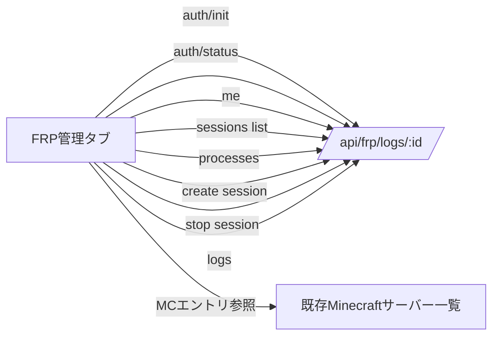

# FRPフロントエンド実装計画 (middleware/web)

## 目的
ミドルウェア `/api/frp/*` を使ったフロントエンド(UI)を `frontend/middleware/main/web` に実装する。Discordリンク状態の可視化、FRP管理メニュー追加、セッション/プロセス表示とログ閲覧、Minecraftエントリとの連携を行う。

## 要求事項 (今回必須)
- ナビバーのユーザーメニューに「Discordとリンク」ボタンを追加。リンク済みなら「ログアウト」(auth/logout) と `ログイン済み: [ユーザー名]`、Discordアイコン(avatar)を表示。
- サイドバーのハンバーガーメニュー内リストに「FRP管理」を追加。
- 「FRP管理」タブで以下を提供:
  - `/api/frp/me` の情報(Discordユーザー、許可ポート、maxSessions、activeSessions)と、サーバー側プロセス/セッション一覧(`/api/frp/processes` + `/api/frp/sessions`)を併記し、差異を視覚化。
  - エントリ追加フォーム: remote/local port、displayName、extraMetas(オプション)を入力。Minecraftエントリからポートを選択して自動入力できる。
  - frpcプロセスのログ閲覧(`/api/frp/logs/:sessionId?lines=`)。
  - セッション開始/停止(`/api/frp/sessions`)と実行中プロセスの状態表示。

## 推奨追加機能
- 状態バッジ: auth状態(pending/completed/expired)とセッション状態(starting/running/stopping/error)を色分け表示。
- ミスマッチ警告: `/me` の activeSessions と `/processes` の差分を検出し、警告バナーを表示。
- 既存ポート利用チェック: Minecraftエントリから選んだポートが `/me.permissions.allowedPorts` に含まれない場合に警告。
- ログのライブテール(短いポーリング/限定再取得)と「最新を再取得」ボタン。
- 失敗時リトライ導線: auth init/pollやセッション開始での再試行ボタンとエラーメッセージ。
- ダーク/ライト双方でのUI検証(既存テーマトグル連動)。

## 画面構成案
- ナビバー:
  - ユーザーメニュー: avatar(Discordリンク時)、`ログイン済み: [name]`、`Discordとリンク` / `ログアウト`
  - クリック外閉じは既存挙動に合わせる。
- サイドバー:
  - 既存メニューに `FRP管理` を追加(アイコン例: `fas fa-network-wired` など)。
  - クリックで `activeTab === 'frp'` に切り替え。
- FRP管理タブ:
  - 上段: 認証カード (リンク状態、authUrl、残セッション数、許可ポート一覧、最新のfingerprint表示)
  - 中段: セッション作成フォーム (remote/local、displayName、extraMetas key/value、Minecraftエントリから選択)
  - 下段: 2カラム
    - 左: サーバー情報 `/api/frp/processes` (プロセス状態、ポート、開始時刻)
    - 右: ストア情報 `/api/frp/sessions` + `/api/frp/me.activeSessions`
  - ログビュー: セッション行から「ログを見る」で `/api/frp/logs/:sessionId?lines=200` を取得、モーダル表示。

## データフロー (Mermaid)

## 実装タスク (優先順)
1) UI骨組み
   - `store.js` に `tabs/sidebarMenu` へ `frp` タブ追加、状態フィールド(frpAuthStatus, frpMe, frpSessions, frpProcesses, frpLogs, frpForm, frpWarnings)を追加。
   - `NavbarTemplate` に Discordリンク状態/アイコン/ログアウト/リンクボタンを表示するスロットを追加。クリック外閉じ既存ロジックと統合。
2) APIクライアント/メソッド
   - `Endpoints.js` に `/api/frp/*` を定義。
   - `useFrp.js` (新規 composable) を作成し、init/poll/status/refresh/logout/me/sessions/processes/logs のラッパとUI用整形を提供。ポーリングは必要最小限(手動ボタン + 軽い再取得)。
3) FRP管理タブUI
   - `components/templates.js` に FRPタブセクションを追加(認証カード/フォーム/リスト/ログモーダル)。
   - Minecraftエントリからのポート選択: 既存サーバー一覧(`servers`)から `port` を選ばせ、フォームに remote/local を設定するボタンを設置。
4) 状態整合チェック
   - `/me.activeSessions` と `/processes` の差分を計算し、警告バナーに表示(例: `セッション frp-xxx はプロセスに存在しません` など)。
5) ログビュー
   - セッション行に「ログ」ボタンを追加し、モーダル/ドロワーでテキスト表示。`lines` パラメータ指定可能、再取得ボタン付き。
6) スタイル/UX
   - 既存のライト/ダークテーマに合わせた配色(アクセントは既存ブルー系)。状態バッジの色/アイコンを統一。
7) テスト観点
   - 未リンク時: 「Discordとリンク」が表示され、セッション操作はブロック/案内。
   - リンク済み: ユーザー名/アイコン表示、/me の allowedPorts に基づく警告表示。
   - セッション開始→`/processes` と `/sessions` に反映され、ログ取得できる。
   - `/me` と `/processes` の不一致が警告に出る。

## リスク/留意点
- frpcログはファイルtailなので、linesが大きすぎると重い。UI側で最大行数を制限し、再取得間隔も抑制する。
- auth/pollはサーバー自動pollがあるため、UIは手動ステータス更新を基本とし、過剰ポーリングを避ける。
- port入力は数値/1-65535バリデーション必須。allowedPorts外なら警告。
- `FRP_VOLATILE_SESSIONS` が true の場合、再起動で sessions.json が空になる点を警告文に含めると親切。

## 次ステップ (実装順の目安)
1. `Endpoints.js` へ `/api/frp/*` を追加し、`useFrp.js` を作成。
2. `store.js` に FRP関連stateを追加し、`app.js` で `createFrpMethods` をマージ。
3. `NavbarTemplate`/`SidebarTemplate`/`templates.js` に UI追加 (Discordリンク/FRPタブ)。
4. FRPタブのカード/フォーム/リスト/ログモーダルを実装、差分警告ロジックを追加。
5. 簡易動作確認 (auth init→status→me→sessions/processes/logs)。
