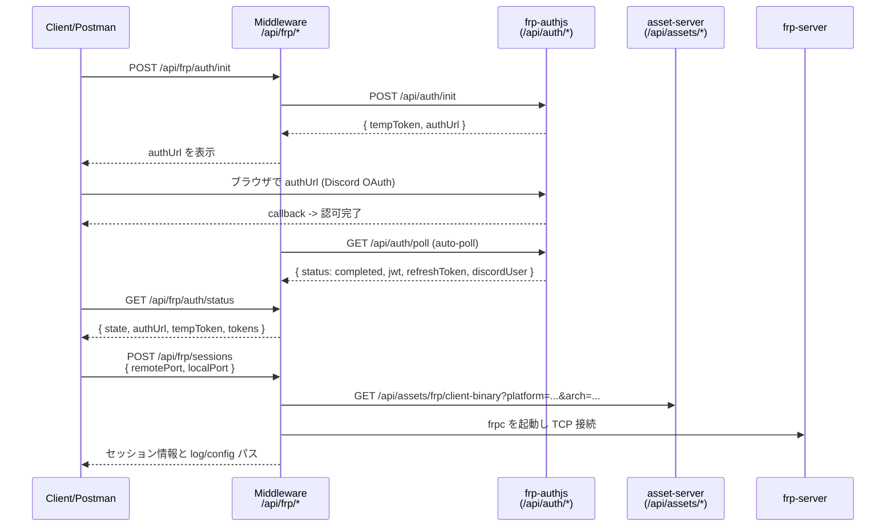

# FRP Manager API (middleware)

`/api/frp/*` エンドポイントで FRP 認証フローと frpc プロセス管理を操作できます。`backend/Docker` 側のコンテナを起動した状態で、ミドルウェアサーバーを `npm start`（デフォルトポート: `12800`）すると Postman などからそのまま叩けます。  
fingerprint はミドルウェアが `frontend/middleware/main/userdata/frp/fingerprint.txt` に自動生成・保存し、リクエストボディに含める必要はありません。

## 全体フロー



## エンドポイント一覧

| メソッド | パス | 役割 |
| --- | --- | --- |
| `POST` | `/api/frp/auth/init` | Discord 認証セッション開始（fingerprint はサーバー側で自動付与） |
| `GET` | `/api/frp/auth/poll` | 認証状態を手動ポーリング (通常は不要、auto-poll が実行される) |
| `GET` | `/api/frp/auth/status` | 現在の JWT/ユーザー状態を確認（auto-poll 状態はここで確認） |
| `POST` | `/api/frp/auth/refresh` | ストア済み `refreshToken` で JWT を再取得 |
| `POST` | `/api/frp/auth/logout` | JWT/ポーリング状態をリセット |
| `POST` | `/api/frp/sessions` | FRP セッション開始（`remotePort`, `localPort` 必須） |
| `GET` | `/api/frp/sessions` | 永続化されたセッション一覧を取得 |
| `DELETE` | `/api/frp/sessions/:sessionId` | セッション停止（frpc プロセス停止） |
| `GET` | `/api/frp/processes` | 起動中の frpc プロセス情報を取得 |
| `GET` | `/api/frp/logs/:sessionId` | ログ tail（`?lines=100` などで件数指定） |

> すべてのエンドポイントはミドルウェアの `authMiddleware` を通過するため、事前に `/user/login` でセッションを張ってください。

## Postman / curl サンプル

```bash
# 1) 認証セッション開始（fingerprintは自動付与）
curl -X POST http://localhost:12800/api/frp/auth/init

# 2) 認証 URL をブラウザで開いた後、状態確認（auto-pollの進捗）
curl "http://localhost:12800/api/frp/auth/status"

# 3) セッション起動（ローカル 25565 を FRP へ）
curl -X POST http://localhost:12800/api/frp/sessions \
  -H "Content-Type: application/json" \
  -d '{"remotePort":25565,"localPort":25565}'

# 4) ログ確認
curl "http://localhost:12800/api/frp/logs/frp-SESSION_ID?lines=50"
```

### 典型レスポンス

```json
{
  "ok": true,
  "data": {
    "sessionId": "frp-0f8c3c8e-1234-4d0a-9b2b-f1ab2cd34567",
    "discordId": "123456789012345678",
    "remotePort": 25565,
    "localPort": 25565,
    "status": "starting",
    "createdAt": "2025-12-04T12:00:00.000Z",
    "updatedAt": "2025-12-04T12:00:00.000Z",
    "logPath": ".../userdata/frp/logs/frp-0f8c3c8e-1234.log",
    "configPath": ".../userdata/frp/configs/frp-0f8c3c8e-1234.toml"
  }
}
```

### トラブルシュートの目安
- `authState: expired/not_found`: tempToken が期限切れ。`/api/frp/auth/init` を再実行してください。
- `Not authenticated. Run auth/init & auth/poll first.`: 認証が完了していないか、JWT がクリアされた。
- `remotePort and localPort must be integers`: ポート値が数値で渡っていない。

## 動作要件
- `backend/Docker` のコンテナ群が起動済み（特に `frp-authjs`, `frp-authz`, `asset-server`, `frp-server`）
- ミドルウェア環境変数（デフォルト値あり）
  - `FRP_AUTH_SERVER_URL` (例: `http://localhost:8080`)
  - `FRP_BINARY_BASE_URL` (例: `http://localhost:8080/api/assets/frp`)
  - `FRP_SERVER_ADDR` / `FRP_SERVER_PORT`
