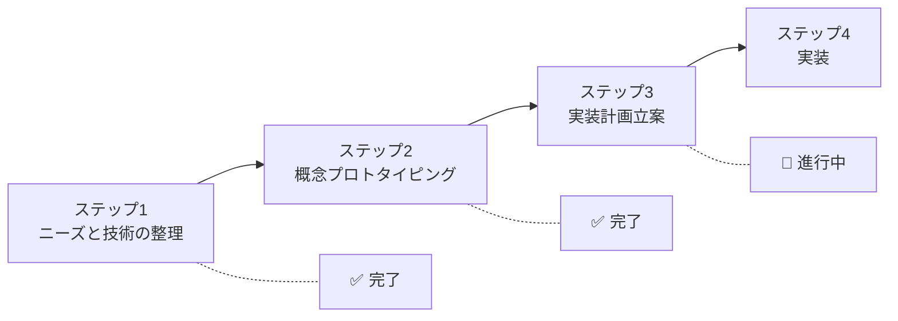
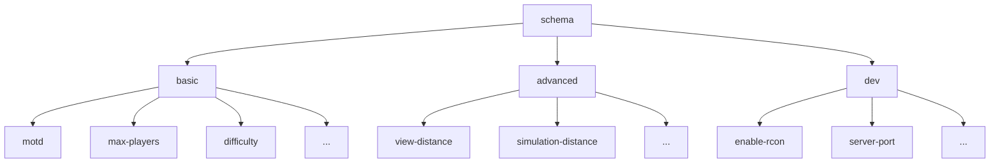
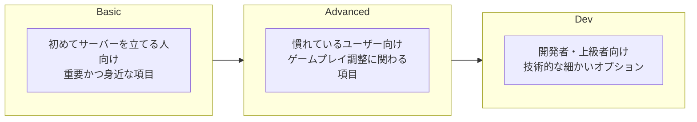

# Minecraft Server Properties スキーマ設計ドキュメント

## 1. プロジェクト概要

### 目的
Minecraftのserver.propertiesを編集するWebアプリケーション向けに、外部管理可能なスキーマを作成する。

### スキーマの用途
- server.properties各項目のパース
- バリデーション
- 説明文の多言語表示（日本語・英語）
- 動的な項目修正・説明更新の容易化

---

## 2. 設計プロセス



---

## 3. スキーマ構造

### 3.1 全体構造



### 3.2 項目構造

各項目は以下のプロパティを持つ。

| プロパティ | 型 | 必須 | 説明 |
|---|---|---|---|
| type | `"string"` / `"number"` / `"boolean"` / `"enum"` | ○ | 値の型 |
| default | any | ○ | デフォルト値 |
| required | boolean | ○ | 必須項目か |
| explanation | object | ○ | 多言語対応の説明文 |
| constraints | object | ○ | 制約条件（空でも可） |

### 3.3 constraints の定義

型に応じて以下の制約を持つ。

| 制約 | 対象の型 | 説明 |
|---|---|---|
| min / max | number | 数値の範囲 |
| minLength / maxLength | string | 文字列の長さ |
| options | enum | 選択肢リスト（多言語ラベル付き） |

### 3.4 多言語対応

explanationおよびenumのラベルは以下の形式で多言語対応する。

```javascript
explanation: {
  en: "English description",
  ja: "日本語の説明"
}
```

---

## 4. レベル分類

### 4.1 分類基準



### 4.2 項目振り分け

#### Basic（14項目）
| 項目名 | 型 | 概要 |
|---|---|---|
| motd | string | サーバーリスト表示メッセージ |
| max-players | number | 最大プレイヤー数 |
| difficulty | enum | 難易度 |
| gamemode | enum | ゲームモード |
| hardcore | boolean | ハードコアモード |
| pvp | boolean | PvP許可 |
| allow-nether | boolean | ネザー許可 |
| spawn-monsters | boolean | モンスタースポーン |
| spawn-animals | boolean | 動物スポーン |
| spawn-npcs | boolean | NPCスポーン |
| level-name | string | ワールド名 |
| level-seed | string | ワールドシード |
| level-type | enum | ワールドタイプ |
| white-list | boolean | ホワイトリスト有効化 |

#### Advanced（18項目）
| 項目名 | 型 | 概要 |
|---|---|---|
| view-distance | number | 描画距離 |
| simulation-distance | number | シミュレーション距離 |
| spawn-protection | number | スポーン保護範囲 |
| allow-flight | boolean | 飛行許可 |
| force-gamemode | boolean | ゲームモード強制 |
| generate-structures | boolean | 構造物生成 |
| max-world-size | number | 最大ワールドサイズ |
| player-idle-timeout | number | アイドルタイムアウト |
| online-mode | boolean | オンラインモード |
| enable-command-block | boolean | コマンドブロック許可 |
| op-permission-level | number | OP権限レベル |
| enforce-whitelist | boolean | ホワイトリスト強制 |
| require-resource-pack | boolean | リソースパック必須 |
| resource-pack | string | リソースパックURL |
| resource-pack-prompt | string | リソースパックプロンプト |
| resource-pack-sha1 | string | リソースパックハッシュ |
| generator-settings | string | ジェネレーター設定（JSON） |
| initial-enabled-packs | string | 有効なデータパック |
| initial-disabled-packs | string | 無効なデータパック |

#### Dev（約20項目）
| 項目名 | 型 | 概要 |
|---|---|---|
| server-ip | string | サーバーIP |
| server-port | number | サーバーポート |
| enable-rcon | boolean | RCON有効化 |
| rcon.port | number | RCONポート |
| rcon.password | string | RCONパスワード |
| enable-query | boolean | Query有効化 |
| query.port | number | Queryポート |
| enable-jmx-monitoring | boolean | JMX監視 |
| network-compression-threshold | number | 圧縮閾値 |
| max-tick-time | number | 最大Tick時間 |
| max-chained-neighbor-updates | number | 連鎖更新上限 |
| rate-limit | number | レート制限 |
| sync-chunk-writes | boolean | チャンク同期書き込み |
| use-native-transport | boolean | ネイティブトランスポート |
| prevent-proxy-connections | boolean | プロキシ接続防止 |
| enable-status | boolean | ステータス有効化 |
| hide-online-players | boolean | オンラインプレイヤー非表示 |
| broadcast-console-to-ops | boolean | コンソールOP通知 |
| broadcast-rcon-to-ops | boolean | RCON OP通知 |
| log-ips | boolean | IPログ |
| function-permission-level | number | Function権限レベル |
| entity-broadcast-range-percentage | number | エンティティ配信範囲 |
| enforce-secure-profile | boolean | セキュアプロファイル強制 |
| text-filtering-config | string | テキストフィルタ設定 |

---

## 5. スキーマ実装例

```javascript
const schema = {
  basic: {
    "motd": {
      type: "string",
      default: "A Minecraft Server",
      required: true,
      explanation: {
        en: "Message of the day shown in the server list",
        ja: "サーバーリストに表示されるメッセージ"
      },
      constraints: {
        minLength: 0,
        maxLength: 59
      }
    },
    "difficulty": {
      type: "enum",
      default: "easy",
      required: true,
      explanation: {
        en: "Defines the difficulty of the server",
        ja: "サーバーの難易度を設定します"
      },
      constraints: {
        options: [
          { value: "peaceful", label: { en: "Peaceful", ja: "ピースフル" } },
          { value: "easy", label: { en: "Easy", ja: "イージー" } },
          { value: "normal", label: { en: "Normal", ja: "ノーマル" } },
          { value: "hard", label: { en: "Hard", ja: "ハード" } }
        ]
      }
    },
    "pvp": {
      type: "boolean",
      default: true,
      required: true,
      explanation: {
        en: "Enable PvP on the server",
        ja: "プレイヤー同士の戦闘を許可します"
      },
      constraints: {}
    }
  },
  advanced: {
    // ...
  },
  dev: {
    // ...
  }
}
```

---

## 6. 次のステップ

### 実装計画（未確定）

1. **出力形式の決定**: JavaScript (.js/.ts) または JSON (.json)
2. **ファイル構成の決定**: 1ファイル or レベル別分割
3. **全項目のスキーマ作成**: Basic → Advanced → Dev の順で実装
4. **レビュー・調整**

---

## 7. 補足事項

### スコープ外とした項目
- 項目間の依存関係（例: difficulty=peacefulでspawn-monstersが無効になる等）
  - 理由: Minecraftサーバー側にフールプルーフがあるため
- restartRequired（再起動必要フラグ）
  - 理由: 基本的に再起動前提の運用のため

### 対応エディション
- Java Edition（本スキーマの対象）
- Bedrock Editionは現時点ではスコープ外
```