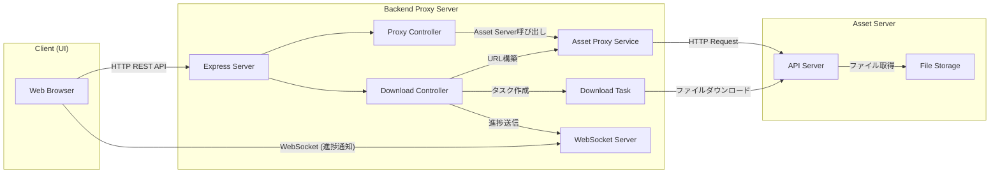

```mermaid
graph LR
    subgraph "Client (UI)"
        Browser["Web Browser"]
    end

    subgraph "Backend Proxy Server"
        direction LR
        Express["Express Server"]
        WS["WebSocket Server"]
        ProxyCtrl["Proxy Controller"]
        DownloadCtrl["Download Controller"]
        AssetProxy["Asset Proxy Service"]
        DownloadTask["Download Task"]
    end

    subgraph "Asset Server"
        direction LR
        AssetAPI["API Server"]
        Storage["File Storage"]
    end

    Browser -- "HTTP REST API" --> Express
    Browser -- "WebSocket (進捗通知)" --> WS

    Express --> ProxyCtrl
    Express --> DownloadCtrl

    ProxyCtrl -- "Asset Server呼び出し" --> AssetProxy
    DownloadCtrl -- "URL構築" --> AssetProxy
    DownloadCtrl -- "タスク作成" --> DownloadTask
    DownloadCtrl -- "進捗送信" --> WS

    AssetProxy -- "HTTP Request" --> AssetAPI
    DownloadTask -- "ファイルダウンロード" --> AssetAPI
    AssetAPI -- "ファイル取得" --> Storage

```