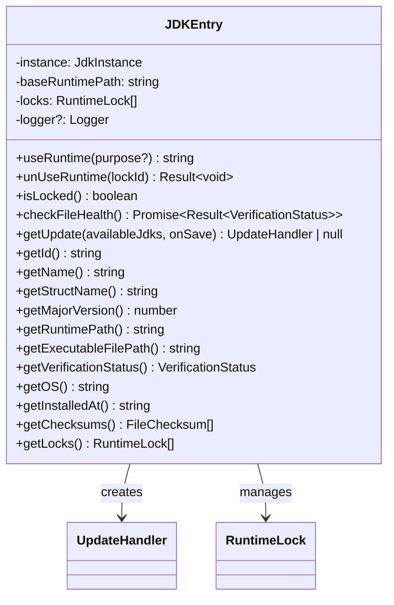
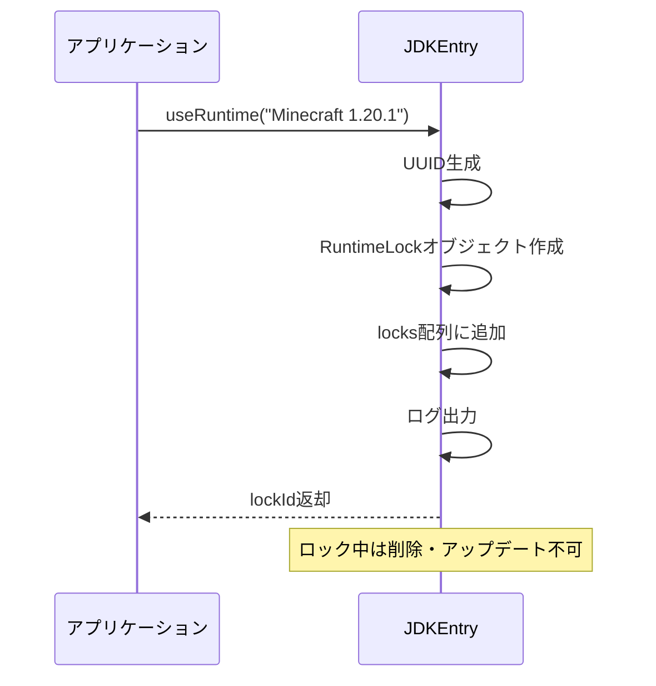
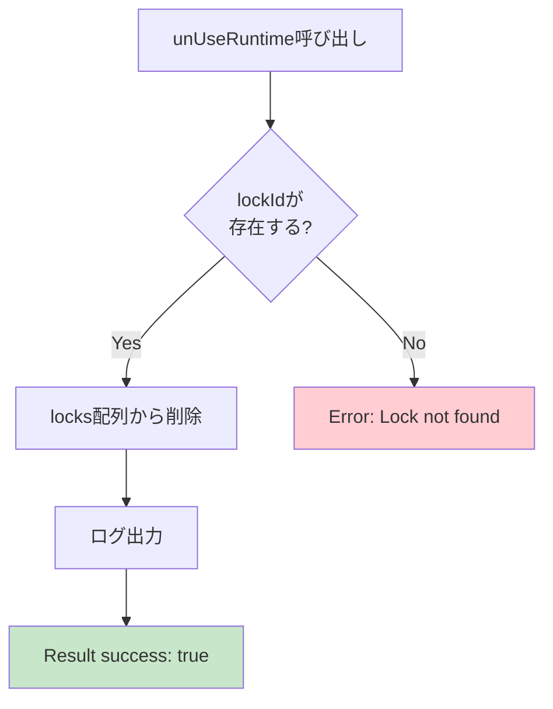
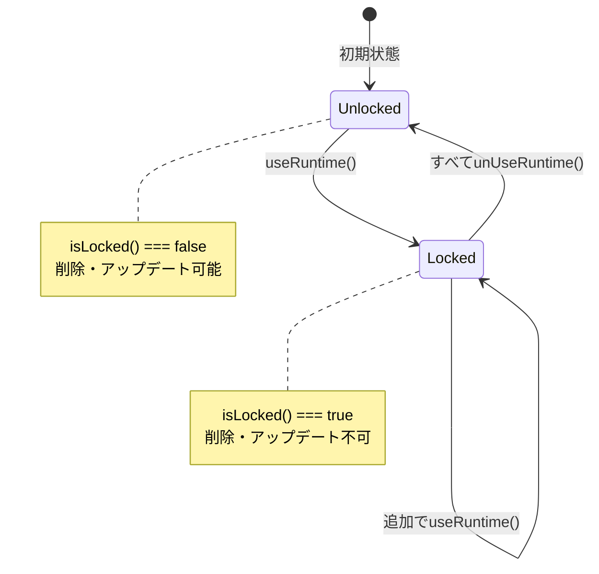
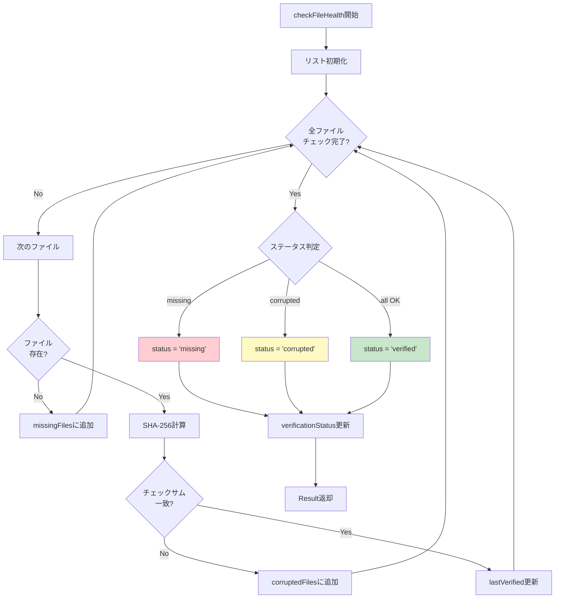
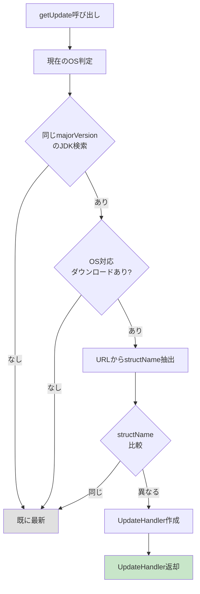

# JDKEntry クラス - 詳細APIドキュメント

## 概要

`JDKEntry`クラスは、個別のJDKインスタンスに対する操作を提供します。各JDKインスタンスは以下の機能を持ちます：

- ランタイムロック管理
- ファイル整合性検証
- アップデートチェック
- メタデータアクセス

## クラス図



---

## メソッド詳細

### ランタイムロック管理

#### `useRuntime(purpose?: string): string`

ランタイムの使用をロックし、lockIdを返します。

**パラメータ:**
- `purpose` (string, optional): ロックの目的（例: "Minecraft 1.20.1"）

**戻り値:**
- `string`: lockId（UUID形式）。ロック解除時に使用します。

**動作:**


**使用例:**
```typescript
const entry = manager.Entrys.getByVersion(17).data;

// ランタイムをロック
const lockId = entry.useRuntime('Minecraft 1.20.1');

// Javaプロセスを起動
const javaPath = entry.getExecutableFilePath();
const minecraft = spawn(javaPath, ['-Xmx2G', '-jar', 'server.jar']);

// プロセス終了時にロック解除
minecraft.on('close', () => {
  entry.unUseRuntime(lockId);
});
```

**注意点:**
- 複数のロックを同時に保持できます（参照カウント方式）
- ロック中のJDKは削除やアップデートができません
- lockIdは必ず保存してください（解放時に必要）

---

#### `unUseRuntime(lockId: string): Result<void>`

ランタイムのロックを解除します。

**パラメータ:**
- `lockId` (string): `useRuntime()`で取得したロックID

**戻り値:**
- `Result<void>`: 成功時は`success: true`、失敗時はエラーメッセージ

**エラーケース:**


**使用例:**
```typescript
const result = entry.unUseRuntime(lockId);

if (!result.success) {
  console.error('Failed to unlock:', result.error);
  // lockIdが無効または既に解放済み
}
```

---

#### `isLocked(): boolean`

ランタイムがロックされているか確認します。

**戻り値:**
- `boolean`: ロックされている場合`true`

**使用例:**
```typescript
if (entry.isLocked()) {
  console.log('Runtime is currently in use');
  console.log('Active locks:', entry.getLocks().length);
} else {
  // 削除やアップデートが可能
  await manager.Entrys.remove(entry.getId());
}
```

**ロック状態の確認フロー:**


---

### ファイル整合性検証

#### `checkFileHealth(): Promise<Result<VerificationStatus>>`

ファイルの整合性を検証します。

**戻り値:**
- `Promise<Result<VerificationStatus>>`: 検証結果
  - `'verified'`: すべてのファイルが正常
  - `'missing'`: ファイルが欠損している
  - `'corrupted'`: ファイルが破損している

**検証対象ファイル:**
- `bin/java.exe` (Windows) / `bin/java` (Unix)
- `bin/javaw.exe` (Windows)
- `bin/javac.exe` (Windows) / `bin/javac` (Unix)
- `lib/modules`
- `lib/jrt-fs.jar`

**検証フロー:**


**使用例:**
```typescript
// アプリケーション起動時の検証
const result = await entry.checkFileHealth();

if (result.success) {
  switch (result.data) {
    case 'verified':
      console.log('✅ All files are intact');
      break;
    
    case 'missing':
      console.error('❌ Some files are missing');
      console.error('Possible antivirus deletion detected');
      // 再インストールを促す
      break;
    
    case 'corrupted':
      console.error('⚠️ Some files are corrupted');
      console.error('File integrity compromised');
      // 再インストールを促す
      break;
  }
} else {
  console.error('Failed to check health:', result.error);
}
```

**推奨運用:**
```typescript
// 1. アプリケーション起動時
await manager.Entrys.checkFileHealthAll();

// 2. Minecraft起動前
const entry = manager.Entrys.getByVersion(17).data;
const healthResult = await entry.checkFileHealth();

if (healthResult.data !== 'verified') {
  throw new Error('JDK integrity check failed');
}

// 3. 定期的なバックグラウンド検証
setInterval(async () => {
  const results = await manager.Entrys.checkFileHealthAll();
  // 問題があれば通知
}, 3600000); // 1時間ごと
```

---

### アップデート管理

#### `getUpdate(availableJdks: AvailableJdk[], onSaveRegistry: () => Promise<Result<void>>): UpdateHandler | null`

アップデート可能かを確認し、可能な場合はUpdateHandlerを返します。

**パラメータ:**
- `availableJdks`: 利用可能なJDKのリスト
- `onSaveRegistry`: レジストリ保存用のコールバック関数

**戻り値:**
- `UpdateHandler | null`: アップデート可能な場合はハンドラ、不可能な場合は`null`

**処理フロー:**


**使用例:**
```typescript
// 利用可能なJDKリストを取得（外部API経由など）
const availableJdks: AvailableJdk[] = [
  {
    version: '17',
    downloads: [
      {
        os: 'windows',
        downloadUrl: 'https://example.com/jdk-17-new.zip'
      },
      {
        os: 'linux',
        downloadUrl: 'https://example.com/jdk-17-new.tar.gz'
      }
    ],
    vendor: 'OpenJDK',
    isLTS: true
  }
];

// アップデートチェック
const entry = manager.Entrys.getByVersion(17).data;
const updateHandler = entry.getUpdate(
  availableJdks,
  () => manager.Data.save()
);

if (updateHandler) {
  const info = updateHandler.getNewVersionInfo();
  console.log('Update available!');
  console.log('Current:', entry.getStructName());
  console.log('New:', info.structName);
  
  // ユーザーに確認
  if (await confirmUpdate()) {
    // ダウンロード
    const archivePath = await downloadJdk(info.downloadUrl);
    
    // インストール
    const result = await updateHandler.install(archivePath);
    
    if (result.success) {
      console.log('✅ Update completed successfully');
    } else {
      console.error('❌ Update failed:', result.error);
      console.log('Original version restored (rollback)');
    }
  }
} else {
  console.log('Already up to date');
}
```

---

## ゲッターメソッド

### 基本情報

#### `getId(): string`

JDKインスタンスの一意識別子を取得します。

**戻り値:** `string` - インスタンスID（例: `"jdk-17-temurin"`）

**使用例:**
```typescript
const id = entry.getId(); // "jdk-17-temurin"
```

---

#### `getName(): string`

JDKインスタンスの簡易名称を取得します。

**戻り値:** `string` - 簡易名称（例: `"Java 17"`）

**使用例:**
```typescript
const name = entry.getName(); // "Java 17"
console.log(`Using ${name}`);
```

---

#### `getStructName(): string`

JDKインスタンスの正式名称を取得します。

**戻り値:** `string` - 正式名称（アーカイブファイル名ベース）

**使用例:**
```typescript
const structName = entry.getStructName();
// "OpenJDK17U-jdk_x64_windows_hotspot_17.0.8_7"
```

---

#### `getMajorVersion(): number`

JDKのメジャーバージョンを取得します。

**戻り値:** `number` - メジャーバージョン（例: `17`）

**使用例:**
```typescript
const version = entry.getMajorVersion(); // 17

if (version >= 17) {
  console.log('Modern Java version');
}
```

---

### パス情報

#### `getRuntimePath(): string`

JDKランタイムのルートディレクトリパスを取得します。

**戻り値:** `string` - ランタイムのルートディレクトリパス（絶対パス）

**使用例:**
```typescript
const runtimePath = entry.getRuntimePath();
// Windows: "C:\\runtime\\jdk-17-temurin"
// Linux: "/home/user/runtime/jdk-17-temurin"

// ライブラリパスを構築
const libPath = path.join(runtimePath, 'lib');
```

---

#### `getExecutableFilePath(): string` ⭐ 推奨

Java実行ファイル（java.exe / java）のフルパスを取得します。

**このメソッドは child_process.spawn() や exec() などでJavaランタイムを直接実行する際に使用します。**

**戻り値:** `string` - java実行ファイルのフルパス（絶対パス）
- Windows: `"C:\\runtime\\jdk-17-temurin\\bin\\java.exe"`
- Unix/Linux/macOS: `"/runtime/jdk-17-temurin/bin/java"`

**使用例:**

```typescript
import { spawn } from 'child_process';

// Minecraftサーバー起動
const javaPath = entry.getExecutableFilePath();
const minecraft = spawn(javaPath, [
  '-Xmx2G',
  '-Xms1G',
  '-jar',
  'minecraft_server.jar',
  'nogui'
]);

minecraft.stdout.on('data', (data) => {
  console.log(data.toString());
});

minecraft.on('close', (code) => {
  console.log(`Server stopped with code ${code}`);
});
```

```typescript
import { exec } from 'child_process';
import { promisify } from 'util';

const execAsync = promisify(exec);

// Javaバージョン確認
const javaPath = entry.getExecutableFilePath();
const { stdout } = await execAsync(`"${javaPath}" -version`);
console.log(stdout);
```

```typescript
// Minecraftクライアント起動（複雑な引数）
const javaPath = entry.getExecutableFilePath();

const args = [
  '-Xmx4G',
  '-XX:+UseG1GC',
  '-XX:+UnlockExperimentalVMOptions',
  '-XX:G1NewSizePercent=20',
  `-Djava.library.path=${nativesPath}`,
  '-cp', classpathString,
  'net.minecraft.client.main.Main',
  '--username', playerName,
  '--version', '1.20.1',
  '--gameDir', gameDirectory,
  '--assetsDir', assetsDirectory
];

const minecraft = spawn(javaPath, args);
```

**パス比較:**
```typescript
// ❌ 誤った使い方
const runtimePath = entry.getRuntimePath();
// "/path/to/jdk-17-temurin"
// このまま実行できない！

// ✅ 正しい使い方
const javaPath = entry.getExecutableFilePath();
// "/path/to/jdk-17-temurin/bin/java"
// 直接実行可能！

const process = spawn(javaPath, ['-version']);
```

---

### ステータス情報

#### `getVerificationStatus(): VerificationStatus`

検証ステータスを取得します。

**戻り値:** `VerificationStatus`
- `'verified'`: 検証済み・正常
- `'unverified'`: 未検証
- `'corrupted'`: 破損検出
- `'missing'`: ファイル欠損

**使用例:**
```typescript
const status = entry.getVerificationStatus();

switch (status) {
  case 'verified':
    console.log('✅ JDK is healthy');
    break;
  case 'unverified':
    console.log('⚠️ JDK not yet verified');
    await entry.checkFileHealth();
    break;
  case 'missing':
    console.error('❌ JDK files missing');
    break;
  case 'corrupted':
    console.error('❌ JDK files corrupted');
    break;
}
```

---

#### `getOS(): string`

JDKのOS種別を取得します。

**戻り値:** `string` - OS種別（`"windows"`, `"linux"`, `"macos"`）

---

#### `getInstalledAt(): string`

JDKのインストール日時を取得します。

**戻り値:** `string` - インストール日時（ISO 8601形式）

**使用例:**
```typescript
const installedAt = entry.getInstalledAt();
// "2024-03-15T10:30:00Z"

const date = new Date(installedAt);
console.log(`Installed: ${date.toLocaleDateString()}`);
```

---

#### `getChecksums(): FileChecksum[]`

ファイルチェックサム情報を取得します。

**戻り値:** `FileChecksum[]` - チェックサム情報の配列（コピー）

**使用例:**
```typescript
const checksums = entry.getChecksums();

checksums.forEach(cs => {
  console.log(`${cs.path}:`);
  console.log(`  Checksum: ${cs.checksum}`);
  console.log(`  Last verified: ${cs.lastVerified}`);
});
```

---

#### `getLocks(): RuntimeLock[]`

現在のランタイムロック情報を取得します。

**戻り値:** `RuntimeLock[]` - ロック情報の配列（コピー）

**使用例:**
```typescript
const locks = entry.getLocks();

if (locks.length > 0) {
  console.log(`Active locks: ${locks.length}`);
  locks.forEach(lock => {
    console.log(`- ${lock.purpose || 'N/A'}`);
    console.log(`  Lock ID: ${lock.lockId}`);
    console.log(`  Locked at: ${lock.lockedAt}`);
  });
} else {
  console.log('No active locks');
}
```

---

## 非推奨メソッド

### `getPath(): string` ⚠️ 非推奨

**このメソッドは非推奨です。** 代わりに以下を使用してください：
- `getRuntimePath()` - ランタイムルートディレクトリパスが必要な場合
- `getExecutableFilePath()` - java実行ファイルのフルパスが必要な場合（推奨）

---

## 実践的な使用例

### 完全なMinecraftサーバー起動フロー

```typescript
async function launchMinecraftServer(
  manager: JdkManager,
  javaVersion: number,
  serverJarPath: string
) {
  // 1. JDKエントリを取得
  const entryResult = manager.Entrys.getByVersion(javaVersion);
  if (!entryResult.success) {
    throw new Error(`Java ${javaVersion} not found`);
  }
  const entry = entryResult.data;

  // 2. ファイル整合性チェック
  const healthResult = await entry.checkFileHealth();
  if (!healthResult.success || healthResult.data !== 'verified') {
    throw new Error('JDK integrity check failed');
  }

  // 3. ランタイムロック
  const lockId = entry.useRuntime(`Minecraft Server`);

  try {
    // 4. Java実行ファイルパスを取得
    const javaPath = entry.getExecutableFilePath();

    // 5. サーバー起動
    const server = spawn(javaPath, [
      '-Xmx2G',
      '-Xms1G',
      '-jar',
      serverJarPath,
      'nogui'
    ], {
      cwd: path.dirname(serverJarPath)
    });

    server.stdout.on('data', (data) => {
      console.log(data.toString());
    });

    server.stderr.on('data', (data) => {
      console.error(data.toString());
    });

    server.on('close', (code) => {
      console.log(`Server stopped with code ${code}`);
      // 6. ランタイムロック解除
      entry.unUseRuntime(lockId);
    });

    return server;
  } catch (error) {
    // エラー時もロック解除
    entry.unUseRuntime(lockId);
    throw error;
  }
}
```

---

**バージョン**: 1.0.0  
**最終更新**: 2025-10-21
