//sonnet 4.5
# Minecraft Server Manager - 実装依頼書

**バージョン:** 1.0.0  
**作成日:** 2025-11-03  
**対象:** コーダー・実装担当者

---

## 📋 目次

1. [プロジェクト概要](#1-プロジェクト概要)
2. [環境セットアップ](#2-環境セットアップ)
3. [アーキテクチャ全体像](#3-アーキテクチャ全体像)
4. [型定義](#4-型定義)
5. [クラス実装仕様](#5-クラス実装仕様)
6. [エラーハンドリング指針](#6-エラーハンドリング指針)
7. [テスト仕様](#7-テスト仕様)
8. [ドキュメント作成指示](#8-ドキュメント作成指示)
9. [実装チェックリスト](#9-実装チェックリスト)

---

## 1. プロジェクト概要

### **目的**

Node.js + TypeScript環境で、複数のMinecraftサーバーインスタンスを統合管理するシステムを構築します。

### **主要機能**

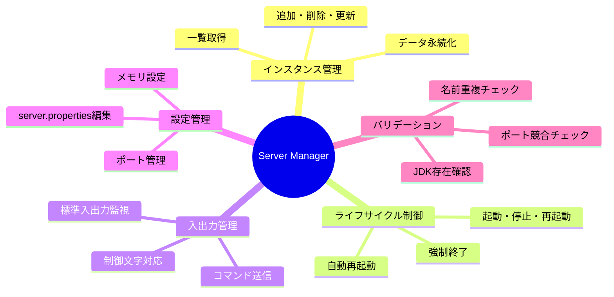

### **設計原則**

- ✅ **責任分離**: 各クラスが明確な責任を持つ
- ✅ **疎結合**: クラス間の依存を最小限に
- ✅ **拡張性**: 将来の機能追加を考慮
- ✅ **テスタビリティ**: 単体テスト可能な設計
- ✅ **可読性**: 初心者でも理解できるコード

---

## 2. 環境セットアップ

### **2.1 ディレクトリ構造**

```
project-root/
├── src/
│   ├── types/
│   │   ├── server-schema.ts           # データスキーマ定義
│   │   ├── validation.ts              # バリデーション型
│   │   └── callbacks.ts               # コールバック型
│   ├── classes/
│   │   ├── ServerManager.ts           # メインクラス
│   │   ├── ServerValidator.ts         # バリデーション
│   │   ├── ServerPropertiesManager.ts # server.properties管理
│   │   ├── ServerInstanceWrapper.ts   # インスタンス管理
│   │   └── ProcessExecutor.ts         # プロセス実行
│   ├── constants/
│   │   └── errors.ts                  # エラーメッセージ定数
│   └── index.ts                       # エントリポイント
├── config/
│   └── server-manager.json            # 設定ファイル（自動生成）
├── servers/                           # サーバーディレクトリ
├── logs/
│   └── manager.log                    # ログファイル
├── tests/
│   ├── setup/
│   │   └── test.env.json              # テスト用環境設定
│   ├── unit/                          # 単体テスト
│   ├── integration/                   # 統合テスト
│   └── e2e/                          # E2Eテスト
├── docs/
│   ├── test-cases.md                  # テスト項目一覧
│   ├── faq.md                        # FAQ（既知の問題）
│   └── api-usage.md                  # API使用例
├── package.json
├── tsconfig.json
└── README.md
```

### **2.2 依存パッケージ**

```json
{
  "name": "minecraft-server-manager",
  "version": "1.0.0",
  "dependencies": {
    "pino": "^8.16.0",
    "zod": "^3.22.0"
  },
  "devDependencies": {
    "@types/node": "^20.10.0",
    "typescript": "^5.3.0",
    "jest": "^29.7.0",
    "@types/jest": "^29.5.0",
    "ts-jest": "^29.1.0"
  }
}
```

### **2.3 TypeScript設定**

```json
{
  "compilerOptions": {
    "target": "ES2020",
    "module": "commonjs",
    "lib": ["ES2020"],
    "outDir": "./dist",
    "rootDir": "./src",
    "strict": true,
    "esModuleInterop": true,
    "skipLibCheck": true,
    "forceConsistentCasingInFileNames": true,
    "resolveJsonModule": true,
    "declaration": true,
    "declarationMap": true,
    "sourceMap": true
  },
  "include": ["src/**/*"],
  "exclude": ["node_modules", "dist", "tests"]
}
```

### **2.4 テスト環境設定**

`tests/setup/test.env.json`:
```json
{
  "jdkManager": {
    "configPath": "/path/to/jdk-registry.json",
    "jdkArchives": {
      "jdk8": "/path/to/jdk8.zip",
      "jdk17": "/path/to/jdk17.zip",
      "jdk21": "/path/to/jdk21.zip"
    }
  },
  "minecraftServer": {
    "vanillaJar": "/path/to/minecraft-server-1.20.1.jar",
    "paperJar": "/path/to/paper-1.20.1.jar"
  },
  "testPaths": {
    "configDir": "./tests/tmp/config",
    "serversDir": "./tests/tmp/servers",
    "logsDir": "./tests/tmp/logs"
  }
}
```

---

## 3. アーキテクチャ全体像

### **3.1 クラス関係図**

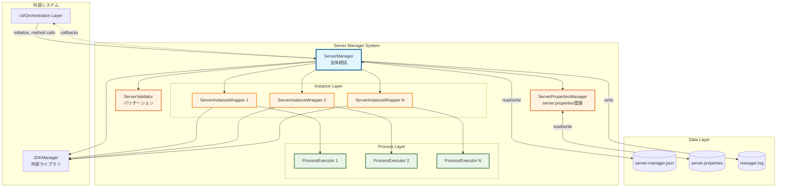

### **3.2 責任分離マトリクス**

| クラス | 責任 | 依存先 | 依存元 |
|-------|------|--------|--------|
| **ServerManager** | 全体統括、設定管理、外部API | Validator, Wrapper, JDKManager | UI層 |
| **ServerValidator** | バリデーションロジック | Manager（読み取り）, JDKManager | Manager |
| **ServerPropertiesManager** | server.properties管理 | なし（完全独立） | Manager, Wrapper |
| **ServerInstanceWrapper** | 個別サーバー制御 | ProcessExecutor, JDKManager | Manager |
| **ProcessExecutor** | プロセス実行 | なし（完全独立） | Wrapper |

### **3.3 データフロー**

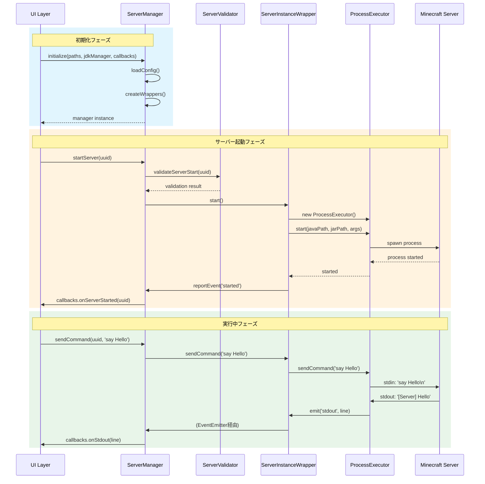

---

## 4. 型定義

### **4.1 データスキーマ（`types/server-schema.ts`）**

**重要ポイント:**
- Step1で確定したスキーマをそのまま使用
- Zodスキーマも併せて定義（バリデーション用）

```typescript
import { z } from 'zod';

// ========================================
// 基本型定義
// ========================================

export type ServerStatus = 'stopped' | 'running' | 'crashed';

export interface ServerSoftware {
  name: string;
  version: string;
}

export interface ServerLaunchConfig {
  jarPath: string;
  port: number;
  jdkVersion: number;  // ⚠️ number型（JDKManager仕様に合わせる）
  maxMemory: number;
  minMemory: number;
  jvmArguments: string[];
  serverArguments: string[];
}

export interface ServerMetadata {
  createdAt: string;
  updatedAt: string;
  lastStartedAt: string | null;
  totalUptime: number;
}

export interface AutoRestartConfig {
  enabled: boolean;
  maxConsecutiveRestarts: number;
  resetThresholdSeconds: number;
}

export interface ServerInstance {
  uuid: string;
  name: string;
  note: string;
  status: ServerStatus;
  software: ServerSoftware;
  launchConfig: ServerLaunchConfig;
  metadata: ServerMetadata;
  autoRestart: AutoRestartConfig;
}

export interface ServerManagerConfig {
  configVersion: string;
  instances: ServerInstance[];
  lastUpdated: string;
}

// ========================================
// 実行時専用型（非永続化）
// ========================================

export interface RuntimeState {
  consecutiveRestartCount: number;
  lastRestartTime: number | null;
  resetTimerId: NodeJS.Timeout | null;
  currentSessionStartTime: number | null;
}

// ========================================
// Zodスキーマ（バリデーション用）
// ========================================

export const ServerManagerConfigSchema = z.object({
  configVersion: z.string(),
  instances: z.array(z.any()), // 詳細は省略可
  lastUpdated: z.string()
});
```

### **4.2 バリデーション型（`types/validation.ts`）**

```typescript
export interface ValidationResult {
  valid: boolean;
  error?: string;
  warnings?: string[];
}

export class ValidationResultHelper {
  static success(warnings?: string[]): ValidationResult {
    return { valid: true, warnings };
  }
  
  static failure(error: string): ValidationResult {
    return { valid: false, error };
  }
  
  static warning(warnings: string[]): ValidationResult {
    return { valid: true, warnings };
  }
}
```

### **4.3 コールバック型（`types/callbacks.ts`）**

```typescript
export type InstanceEventType = 
  | 'started'
  | 'stopped'
  | 'crashed'
  | 'autoRestartLimitReached'
  | 'stopTimeout'
  | 'forcedKill';

export interface InstanceEvent {
  type: InstanceEventType;
  uuid: string;
  timestamp: number;
  data?: any;
}

export type NotifyFunction = (event: InstanceEvent) => void;

export interface ServerCallbacks {
  onServerStarted?: (uuid: string) => void;
  onServerStopped?: (uuid: string, exitCode: number) => void;
  onServerCrashed?: (uuid: string, error: Error) => void;
  onAutoRestartLimitReached?: (uuid: string) => void;
  onStopTimeout?: (uuid: string, message: string) => void;
  onForcedKill?: (uuid: string) => void;
}

export interface ProcessStdCallbacks {
  onStdout?: (line: string) => void;
  onStderr?: (line: string) => void;
}
```

### **4.4 エラーメッセージ定数（`constants/errors.ts`）**

```typescript
export const ServerManagerErrors = {
  // インスタンス管理
  INSTANCE_NOT_FOUND: 'Server instance not found',
  INSTANCE_NAME_DUPLICATE: 'Server name already exists',
  INSTANCE_RUNNING: 'Server is currently running',
  INSTANCE_NOT_RUNNING: 'Server is not running',
  
  // JDK関連
  JDK_NOT_FOUND: 'Required JDK version not found',
  JDK_VERSION_INVALID: 'Invalid JDK version',
  
  // ファイル操作
  FILE_NOT_FOUND: 'File not found',
  FILE_LOCKED: 'File is locked by another process',
  DIRECTORY_RENAME_FAILED: 'Failed to rename directory',
  DIRECTORY_DELETE_FAILED: 'Failed to delete directory',
  FILE_COPY_FAILED: 'Failed to copy file',
  
  // ポート
  PORT_IN_USE: 'Port is already in use by another server',
  PORT_INVALID: 'Invalid port number',
  
  // 設定
  CONFIG_LOAD_FAILED: 'Failed to load configuration',
  CONFIG_SAVE_FAILED: 'Failed to save configuration',
  CONFIG_INVALID: 'Invalid configuration data',
  
  // プロセス
  PROCESS_START_FAILED: 'Failed to start server process',
  PROCESS_STOP_TIMEOUT: 'Server did not stop within timeout period',
  
  // レジストリ
  REGISTRY_NOT_LOADED: 'Registry not loaded',
} as const;
```

---

## 5. クラス実装仕様

### **5.1 ServerManager**

#### **責任範囲**

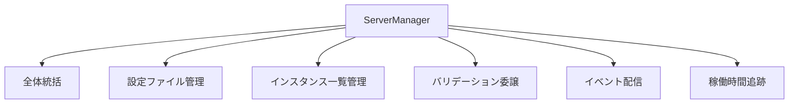

#### **主要メソッドとフロー**

**初期化:**
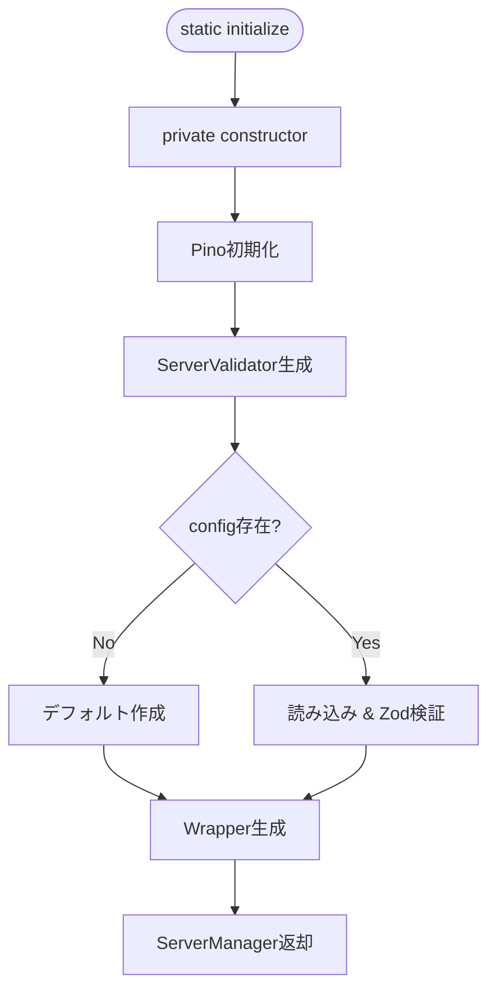

**addInstance:**
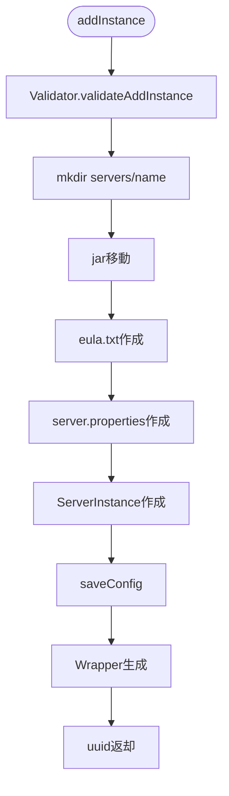

**startServer:**
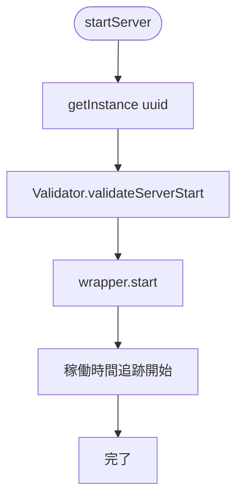

#### **実装時の重要ポイント**

1. **初期化は必ず`static initialize()`経由**
   - コンストラクタはprivate
   - 非同期処理（ファイル読み込み等）を含むため

2. **すべてのバリデーションはValidatorに委譲**
   - Manager内に直接バリデーションロジックを書かない

3. **稼働時間追跡は5分ごと**
   - `setInterval`でタイマー管理
   - `uptimeIntervals: Map<string, NodeJS.Timeout>`に保存

4. **エラーハンドリング**
   - すべてのファイル操作はtry-catchで囲む
   - エラー時は詳細なログを記録
   - 適切なエラーメッセージを返却

---

### **5.2 ServerValidator**

#### **責任範囲**

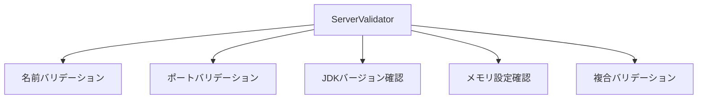

#### **バリデーションフロー**

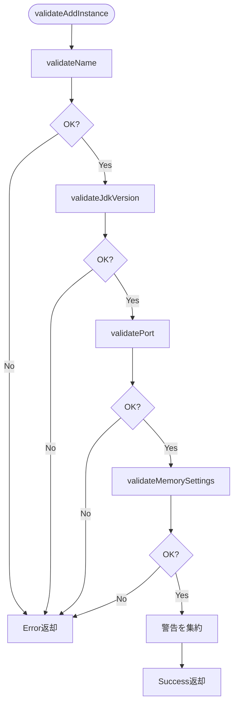

#### **実装時の重要ポイント**

1. **依存は読み取り専用**
   - ServerManagerのデータを変更しない
   - `getInstanceByName()`, `getAllInstances()`のみ使用

2. **警告とエラーの区別**
   - エラー: 処理を続行できない（`valid: false`）
   - 警告: 注意が必要だが続行可能（`valid: true, warnings: [...]`）

3. **JDK存在確認**
   - `jdkManager.Entrys.getByVersion()`の結果をチェック
   - 整合性ステータスも確認（missing/corrupted）

---

### **5.3 ServerPropertiesManager**

#### **責任範囲**

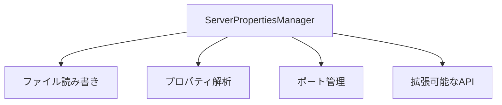

#### **プロパティ更新フロー**

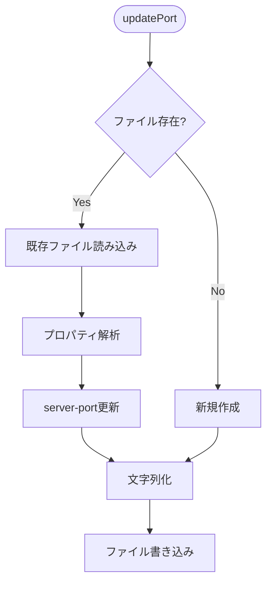

#### **実装時の重要ポイント**

1. **1インスタンス = 1ファイル**
   - 使い捨てインスタンス（呼び出しのたびに生成）
   - 内部のMapは1ファイル内のプロパティを表現

2. **既存データの保持**
   - `update()`時は他のプロパティを保持
   - 正規表現で該当行のみ置き換え

3. **拡張性**
   - `updatePort()`をテンプレートに他のプロパティ用メソッドを追加可能
   - コピペ+編集で簡単に拡張

---

### **5.4 ServerInstanceWrapper**

#### **責任範囲**

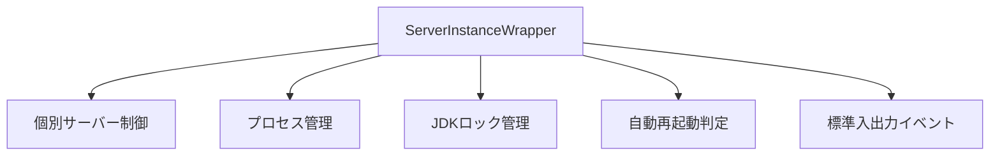

#### **起動フロー**

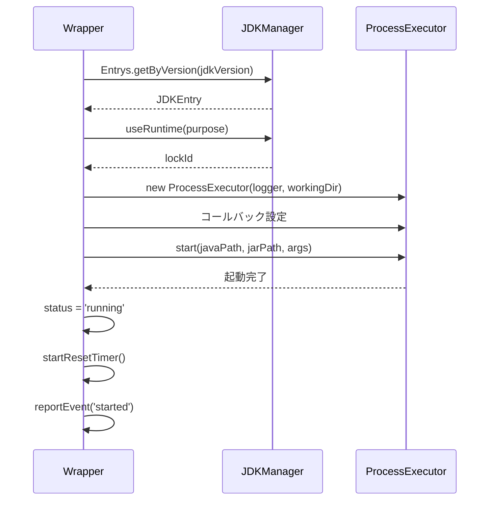

#### **自動再起動フロー**

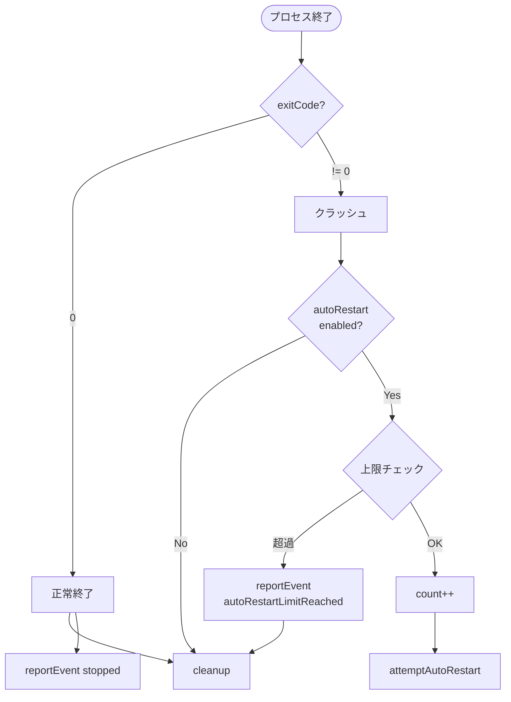

#### **実装時の重要ポイント**

1. **EventEmitterの継承**
   - `extends EventEmitter`
   - 標準入出力用に`emit('stdout', line)`等を使用

2. **JDKロックの確実な解放**
   - 起動成功時、失敗時、停止時すべてで解放
   - `finally`ブロックの活用

3. **リセットタイマーの管理**
   - 起動時に開始（10分後にリセット）
   - 停止時にクリア
   - `clearTimeout()`を忘れずに

4. **自己完結的なパス管理**
   - `serversBasePath`を保持
   - `getWorkingDirectory()`で自分でパス構築

---

### **5.5 ProcessExecutor**

#### **責任範囲**

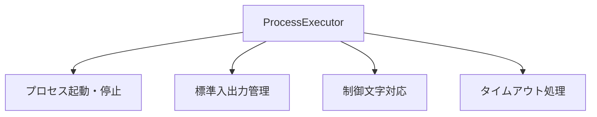

#### **起動・停止フロー**

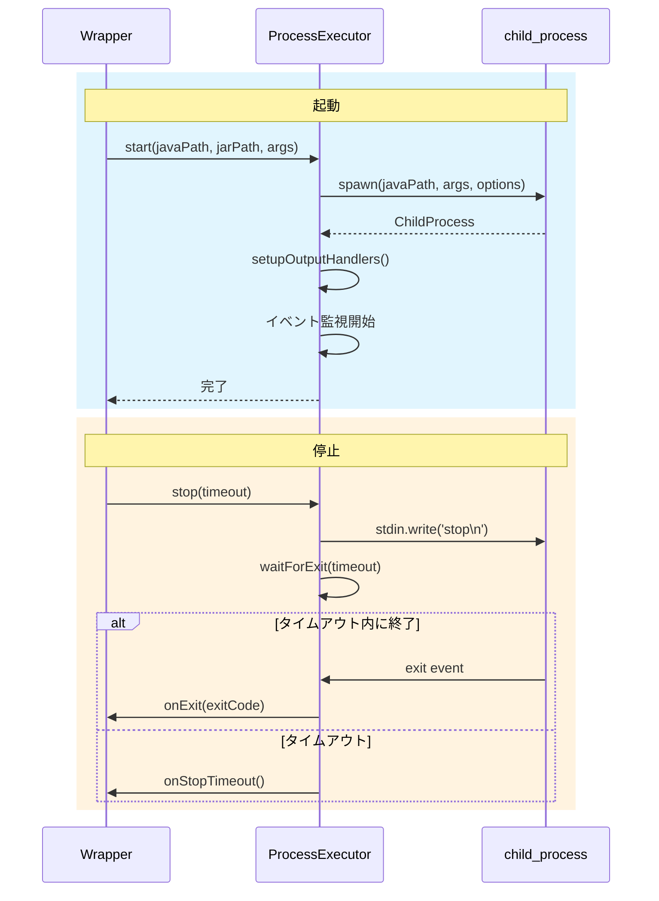

#### **制御文字対応**

```typescript
enum ControlCharacter {
  ENTER = '\n',
  CTRL_C = '\x03',
  TAB = '\t'
}
```

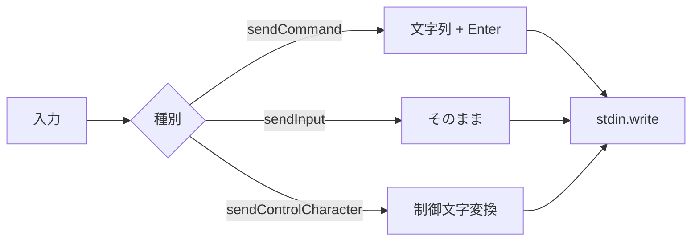

#### **実装時の重要ポイント**

1. **完全独立クラス**
   - ServerManager/Wrapperの概念に依存しない
   - 汎用的なプロセス実行クラス

2. **readline interfaceの使用**
   - 標準出力を行単位で処理
   - `createInterface({ input: process.stdout })`

3. **タイムアウトは通知のみ**
   - `stop()`でタイムアウトしても強制終了しない
   - `onStopTimeout`コールバックで通知
   - `kill()`はユーザーが明示的に呼び出す

4. **制御文字の実装**
   - `sendCommand()`: 既存互換（テキスト + Enter）
   - `sendInput()`: Enterなし
   - `sendControlCharacter()`: 制御文字送信

---

## 6. エラーハンドリング指針

### **6.1 基本方針**

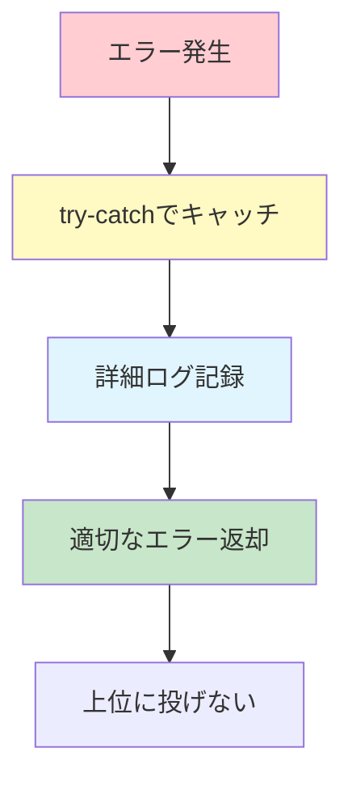

**原則:**
- ✅ すべてのファイル操作はtry-catchで囲む
- ✅ エラーは詳細にログ記録
- ✅ ユーザーに分かりやすいエラーメッセージ
- ✅ 例外を上位に投げず、Result型で返す
- ✅ クリティカルなエラーのみthrow

### **6.2 エラーハンドリングパターン**

#### **パターン1: ファイル操作**

```typescript
async removeInstance(uuid: string): Promise<VoidResult> {
  const instance = this.instances.get(uuid);
  if (!instance) {
    return { success: false, error: ServerManagerErrors.INSTANCE_NOT_FOUND };
  }
  
  const serverDir = path.join(this.serversBasePath, instance.getData().name);
  
  try {
    await fs.promises.rm(serverDir, { recursive: true, force: true });
    this.logger.info(`Deleted directory: ${serverDir}`);
  } catch (error) {
    this.logger.error(`Failed to delete directory: ${serverDir}`, error);
    // ❌ ディレクトリ削除失敗 → 全処理キャンセル
    return { 
      success: false, 
      error: `${ServerManagerErrors.DIRECTORY_DELETE_FAILED}: ${error.message}` 
    };
  }
  
  // ✅ ディレクトリ削除成功 → レジストリ更新
  this.instances.delete(uuid);
  await this.saveConfig();
  
  return { success: true };
}
```

#### **パターン2: 非クリティカルなエラー**

```typescript
async updateInstance(params: UpdateInstanceParams): Promise<VoidResult> {
  // ... 前処理
  
  // ポート変更（失敗しても処理継続）
  if (params.updates.port !== undefined) {
    try {
      const propManager = this.getServerPropertiesManager(params.uuid);
      await propManager.updatePort(params.updates.port);
      this.logger.info(`Updated port to ${params.updates.port}`);
    } catch (error) {
      // ⚠️ server.properties更新失敗 → 警告のみ
      this.logger.warn('Failed to update server.properties', error);
      this.logger.warn('Port updated in registry, but server.properties update failed');
      // 処理は継続
    }
  }
  
  // インスタンスデータ更新（必ず実行）
  instance.updateData(params.updates);
  await this.saveConfig();
  
  return { success: true };
}
```

#### **パターン3: バリデーションエラー**

```typescript
async addInstance(params: AddInstanceParams): Promise<AddInstanceResult> {
  // バリデーション
  const validation = await this.validator.validateAddInstance(params);
  if (!validation.valid) {
    // ❌ バリデーション失敗 → 即座に返却
    return { success: false, error: validation.error };
  }
  
  // ⚠️ 警告がある場合はログ記録
  if (validation.warnings && validation.warnings.length > 0) {
    validation.warnings.forEach(warning => {
      this.logger.warn(warning);
    });
  }
  
  // 処理継続...
}
```

### **6.3 ログレベルの使い分け**

| レベル | 用途 | 例 |
|--------|------|-----|
| `debug` | 詳細な処理内容 | メソッド呼び出し、変数の値 |
| `info` | 正常な処理 | サーバー起動成功、設定保存 |
| `warn` | 警告（処理は継続） | server.properties更新失敗、メモリ警告 |
| `error` | エラー（処理中断） | ディレクトリ削除失敗、JDK未発見 |

---

## 7. テスト仕様

### **7.1 テスト環境のセットアップ**

#### **test.env.json の使用**

```typescript
// tests/setup/loadTestEnv.ts
import * as fs from 'fs';
import * as path from 'path';

export interface TestEnv {
  jdkManager: {
    configPath: string;
    jdkArchives: {
      jdk8: string;
      jdk17: string;
      jdk21: string;
    };
  };
  minecraftServer: {
    vanillaJar: string;
    paperJar: string;
  };
  testPaths: {
    configDir: string;
    serversDir: string;
    logsDir: string;
  };
}

export function loadTestEnv(): TestEnv {
  const envPath = path.join(__dirname, 'test.env.json');
  const content = fs.readFileSync(envPath, 'utf-8');
  return JSON.parse(content);
}
```

### **7.2 テストの構成**

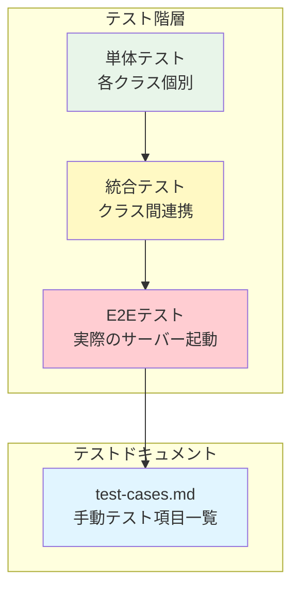

### **7.3 統合テストの例**

```typescript
// tests/integration/server-lifecycle.test.ts
import { ServerManager } from '../../src/classes/ServerManager';
import { JdkManager } from 'jdk-manager';
import { loadTestEnv } from '../setup/loadTestEnv';

describe('Server Lifecycle Integration Test', () => {
  let manager: ServerManager;
  let jdkManager: JdkManager;
  const testEnv = loadTestEnv();
  
  beforeAll(async () => {
    // JDKManager初期化
    jdkManager = new JdkManager(testEnv.jdkManager.configPath);
    await jdkManager.Data.load();
    
    // ServerManager初期化
    manager = await ServerManager.initialize(
      testEnv.testPaths.configDir + '/server-manager.json',
      testEnv.testPaths.serversDir,
      testEnv.testPaths.logsDir + '/manager.log',
      jdkManager
    );
  });
  
  test('サーバーの追加・起動・停止・削除', async () => {
    // 1. サーバー追加
    const addResult = await manager.addInstance({
      name: 'test-server',
      note: 'テスト用サーバー',
      software: { name: 'Vanilla', version: '1.20.1' },
      jdkVersion: 17,
      serverBinaryFilePath: testEnv.minecraftServer.vanillaJar
    });
    
    expect(addResult.success).toBe(true);
    const uuid = addResult.uuid!;
    
    // 2. サーバー起動
    const startResult = await manager.startServer(uuid);
    expect(startResult.success).toBe(true);
    
    // 3. ステータス確認
    const data = manager.getInstanceData(uuid);
    expect(data?.status).toBe('running');
    
    // 4. サーバー停止
    const stopResult = await manager.stopServer(uuid);
    expect(stopResult.success).toBe(true);
    
    // 5. サーバー削除
    const removeResult = await manager.removeInstance(uuid);
    expect(removeResult.success).toBe(true);
  });
});
```

### **7.4 E2Eテストの例**

```typescript
// tests/e2e/minecraft-server.test.ts
describe('Minecraft Server E2E Test', () => {
  test('実際にMinecraftサーバーが起動し、コマンドが実行できる', async () => {
    // ... 初期化
    
    const addResult = await manager.addInstance({
      name: 'e2e-server',
      note: 'E2Eテスト',
      software: { name: 'Vanilla', version: '1.20.1' },
      jdkVersion: 17,
      serverBinaryFilePath: testEnv.minecraftServer.vanillaJar
    });
    
    const uuid = addResult.uuid!;
    
    // 標準出力監視
    const outputs: string[] = [];
    manager.openProcessStd(uuid, {
      onStdout: (line) => outputs.push(line)
    });
    
    // 起動
    await manager.startServer(uuid);
    
    // サーバー起動完了を待機（"Done"メッセージ）
    await waitForServerReady(outputs, 60000);
    
    // コマンド送信
    manager.sendCommand(uuid, 'list');
    
    // 応答待機
    await new Promise(resolve => setTimeout(resolve, 1000));
    
    // 出力確認
    const hasListOutput = outputs.some(line => 
      line.includes('There are') && line.includes('players online')
    );
    expect(hasListOutput).toBe(true);
    
    // 停止
    await manager.stopServer(uuid, 30000);
    await manager.removeInstance(uuid);
  });
});
```

---

## 8. ドキュメント作成指示

### **8.1 テスト項目一覧（`docs/test-cases.md`）**

以下の形式でテストケースを記載してください：

```markdown
# テスト項目一覧

## 1. インスタンス管理

### 1.1 インスタンス追加

| ID | テスト項目 | 手順 | 期待結果 |
|----|----------|------|---------|
| TC-001 | 正常なインスタンス追加 | 1. 有効なパラメータでaddInstance呼び出し<br/>2. 結果確認 | success: true, uuidが返却される |
| TC-002 | 名前重複エラー | 1. 同じ名前で2回addInstance<br/>2. 2回目の結果確認 | success: false, error: "Name already exists" |
| TC-003 | 無効なJDKバージョン | 1. 存在しないJDKバージョンを指定<br/>2. 結果確認 | success: false, error: "JDK not found" |

## 2. サーバー起動・停止

### 2.1 起動

| ID | テスト項目 | 手順 | 期待結果 |
|----|----------|------|---------|
| TC-101 | 正常起動 | 1. stopServer呼び出し<br/>2. ステータス確認 | status: 'running' |
| TC-102 | 既に起動中のサーバー起動 | 1. 起動中のサーバーに対してstartServer<br/>2. 結果確認 | success: false, error: "Already running" |

...
```

### **8.2 FAQ（`docs/faq.md`）**

```markdown
# FAQ - 既知の問題と対処法

## ポート関連

### Q1: ポート重複チェックを通過したのに起動に失敗する

**原因:**
- 外部アプリケーションがポートを使用中
- OS側でポートがブロックされている
- ファイアウォールの設定

**対処法:**
1. `netstat -ano | findstr :{PORT}` (Windows) でポート使用状況確認
2. 他のアプリケーションを終了
3. ファイアウォール設定を確認

## クラッシュ判定

### Q2: 正常終了なのにクラッシュ扱いになる

**原因:**
- 一部のサーバーソフトウェアは正常終了でもexitCode != 0を返す場合がある

**対処法:**
- 現在の実装ではexitCode == 0のみを正常終了と判定
- 将来的にソフトウェアごとの判定ロジック追加を検討

...
```

### **8.3 API使用例（`docs/api-usage.md`）**

```markdown
# API使用例

## 基本的な使用方法

### 初期化

\`\`\`typescript
import { ServerManager } from './classes/ServerManager';
import { JdkManager } from 'jdk-manager';

// JDKManager初期化
const jdkManager = new JdkManager('./jdk-registry.json');
await jdkManager.Data.load();

// ServerManager初期化
const manager = await ServerManager.initialize(
  './config/server-manager.json',
  './servers',
  './logs/manager.log',
  jdkManager,
  {
    onServerStarted: (uuid) => console.log(`Started: ${uuid}`),
    onServerCrashed: (uuid, error) => console.error(`Crashed: ${uuid}`, error)
  }
);
\`\`\`

...
```

---

## 9. 実装チェックリスト

### **9.1 クラス実装**

#### **ServerManager**
- [ ] `static initialize()`の実装
- [ ] `addInstance()`の実装
- [ ] `removeInstance()`の実装（ディレクトリ削除失敗時は全キャンセル）
- [ ] `updateInstance()`の実装（noteのみ起動中更新可）
- [ ] `startServer()`の実装
- [ ] `stopServer()`の実装
- [ ] `restartServer()`の実装
- [ ] `forceKillServer()`の実装
- [ ] `getInstance()`の実装
- [ ] `getInstanceData()`の実装
- [ ] `getAllInstances()`の実装
- [ ] `getRunningInstances()`の実装
- [ ] `getValidator()`の実装
- [ ] `getServerPropertiesManager()`の実装
- [ ] `openProcessStd()`の実装
- [ ] `closeProcessStd()`の実装
- [ ] `sendCommand()`の実装
- [ ] 稼働時間追跡（5分ごと）の実装
- [ ] イベントハンドリングの実装

#### **ServerValidator**
- [ ] `validateName()`の実装
- [ ] `validatePort()`の実装（警告機能含む）
- [ ] `validateJdkVersion()`の実装
- [ ] `validateMemorySettings()`の実装
- [ ] `validateJvmArguments()`の実装
- [ ] `validateAddInstance()`の実装
- [ ] `validateUpdateInstance()`の実装
- [ ] `validateServerStart()`の実装

#### **ServerPropertiesManager**
- [ ] `create()`の実装
- [ ] `read()`の実装
- [ ] `write()`の実装
- [ ] `update()`の実装
- [ ] `updateMultiple()`の実装
- [ ] `get()`の実装
- [ ] `exists()`の実装
- [ ] `updatePort()`の実装
- [ ] `getPort()`の実装
- [ ] プロパティ解析ロジックの実装

#### **ServerInstanceWrapper**
- [ ] コンストラクタの実装
- [ ] `start()`の実装
- [ ] `stop()`の実装
- [ ] `restart()`の実装
- [ ] `forceKill()`の実装
- [ ] `sendCommand()`の実装
- [ ] `getData()`の実装（ディープコピー）
- [ ] `updateData()`の実装
- [ ] `getStatus()`の実装
- [ ] `isRunning()`の実装
- [ ] EventEmitter機能の実装
- [ ] JDKロック管理の実装
- [ ] 自動再起動ロジックの実装
- [ ] リセットタイマーの実装
- [ ] プロセス終了ハンドリングの実装

#### **ProcessExecutor**
- [ ] コンストラクタの実装
- [ ] `start()`の実装
- [ ] `stop()`の実装（タイムアウト処理）
- [ ] `kill()`の実装
- [ ] `sendCommand()`の実装
- [ ] `sendInput()`の実装
- [ ] `sendControlCharacter()`の実装
- [ ] `isRunning()`の実装
- [ ] `getPid()`の実装
- [ ] 標準出力ハンドラーの実装
- [ ] 標準エラー出力ハンドラーの実装
- [ ] `waitForExit()`の実装
- [ ] `cleanup()`の実装

### **9.2 エラーハンドリング**
- [ ] すべてのファイル操作にtry-catchを実装
- [ ] 適切なエラーメッセージの返却
- [ ] ログ記録の実装
- [ ] クリティカルエラーとそうでないエラーの区別

### **9.3 テスト**
- [ ] 統合テストの実装
- [ ] E2Eテストの実装
- [ ] テスト項目一覧ドキュメントの作成
- [ ] test.env.jsonの設定

### **9.4 ドキュメント**
- [ ] test-cases.mdの作成
- [ ] faq.mdの作成
- [ ] api-usage.mdの作成
- [ ] README.mdの作成

---

## 🎉 完了

この実装依頼書に従って実装を進めてください。

**不明点がある場合:**
1. 設計ドキュメント（Step1, Step2）を参照
2. JDKManagerのソースコードを参照
3. 質問リストを作成して確認

**実装のポイント:**
- ✅ 責任分離を意識
- ✅ エラーハンドリングを徹底
- ✅ ログを詳細に記録
- ✅ テストを書きながら実装
- ✅ ドキュメントを更新

**頑張ってください！🚀**

# 補足セクション - 実装依頼書への追記（最終版）

以下の内容を実装依頼書の末尾に追加してください。

---

## 10. 補足事項と重要な仕様

### **10.1 追加の型定義**

実装依頼書の「4. 型定義」セクションに以下の型が不足していました。

#### **Result型（`types/result.ts`）**

ServerManager専用のResult型を定義します。JDKManagerのResult型とは別物です。

```typescript
export type ServerManagerResult<T = void> = 
  | { success: true; data: T }
  | { success: false; error: string };

export type VoidResult = ServerManagerResult<void>;

export interface AddInstanceResult {
  success: boolean;
  uuid?: string;
  error?: string;
}
```

#### **パラメータ型（`types/params.ts`）**

```typescript
export interface AddInstanceParams {
  name: string;
  note: string;
  software: ServerSoftware;
  jdkVersion: number;
  serverBinaryFilePath: string;
  port?: number;
  maxMemory?: number;
  minMemory?: number;
}

export interface UpdateInstanceParams {
  uuid: string;
  updates: {
    name?: string;
    note?: string;
    maxMemory?: number;
    minMemory?: number;
    jvmArguments?: string[];
    serverArguments?: string[];
    autoRestart?: AutoRestartConfig;
    port?: number;
  };
}
```

#### **制御文字列挙型（`types/control-character.ts`）**

```typescript
export enum ControlCharacter {
  ENTER = '\n',      // 必須機能
  CTRL_C = '\x03',   // 推奨機能（プロセス割り込み）
  TAB = '\t'         // 推奨機能（タブ補完）
}
```

---

### **10.2 Zodスキーマの詳細版**

実装依頼書の「4.1 データスキーマ」で省略されていたZodスキーマの詳細版です。

```typescript
import { z } from 'zod';

const ServerSoftwareSchema = z.object({
  name: z.string(),
  version: z.string()
});

const ServerLaunchConfigSchema = z.object({
  jarPath: z.string(),
  port: z.number().int().min(1).max(65535),
  jdkVersion: z.number().int().positive(),
  maxMemory: z.number().int().positive(),
  minMemory: z.number().int().positive(),
  jvmArguments: z.array(z.string()),
  serverArguments: z.array(z.string())
});

const ServerMetadataSchema = z.object({
  createdAt: z.string(),
  updatedAt: z.string(),
  lastStartedAt: z.string().nullable(),
  totalUptime: z.number().nonnegative()
});

const AutoRestartConfigSchema = z.object({
  enabled: z.boolean(),
  maxConsecutiveRestarts: z.number().int().positive(),
  resetThresholdSeconds: z.number().int().positive()
});

const ServerInstanceSchema = z.object({
  uuid: z.string().uuid(),
  name: z.string(),
  note: z.string(),
  status: z.enum(['stopped', 'running', 'crashed']),
  software: ServerSoftwareSchema,
  launchConfig: ServerLaunchConfigSchema,
  metadata: ServerMetadataSchema,
  autoRestart: AutoRestartConfigSchema
});

export const ServerManagerConfigSchema = z.object({
  configVersion: z.string(),
  instances: z.array(ServerInstanceSchema),
  lastUpdated: z.string()
});
```

---

### **10.3 クラス別の重要な実装仕様**

#### **ServerManager**

**コンストラクタでの初期化順序:**


**重要な仕様:**
1. ログディレクトリが存在しない場合は`recursive: true`で作成
2. Validatorには`this`（ServerManager自身）を渡す
3. `instances`と`uptimeIntervals`は空のMapで初期化

**Wrapper生成時の引数順序:**
```typescript
new ServerInstanceWrapper(
  data,
  this.serversBasePath,  // ← 必須
  this.jdkManager,
  this.logger,
  (event) => this.handleInstanceEvent(event)
)
```

**稼働時間追跡の仕様:**
- 起動時にタイマー開始
- 5分ごとに`updateUptime()`を実行
- 停止時に最終更新してタイマークリア
- `uptimeIntervals`マップで管理

**設定保存時の自動更新:**
- `saveConfig()`呼び出し時に`config.lastUpdated`を自動更新
- ISO 8601形式の現在時刻を設定

**親ディレクトリの扱い:**
- 設定ファイルの親ディレクトリが存在しない場合はエラー
- ログファイルの親ディレクトリは自動作成
- サーバーディレクトリは`recursive: true`で作成

---

#### **ServerValidator**

**依存の性質:**

```mermaid
graph LR
    SV[ServerValidator] -->|読み取り専用| SM[ServerManager]
    SV -->|読み取り専用| JDK[JDKManager]
    
    Note[データの変更は行わない]
    
    style Note fill:#fff9c4
```

**使用するServerManagerのメソッド:**
- `getInstanceByName()` - 名前重複チェック用
- `getAllInstances()` - ポート重複チェック用
- `getRunningInstances()` - 稼働中ポートチェック用

**使用するJDKManagerのメソッド:**
- `Entrys.getByVersion()` - JDK存在確認用

**警告とエラーの区別:**

| 結果 | 意味 | 処理 |
|------|------|------|
| `valid: true` | 問題なし | 処理続行 |
| `valid: true, warnings: [...]` | 注意が必要 | 警告ログ記録後、処理続行 |
| `valid: false, error: "..."` | エラー | 処理中断、エラー返却 |

**メモリバリデーションの基準:**
- 最小メモリ: 512MB以上
- 最大メモリ >= 最小メモリ
- システムメモリの80%超過: 警告
- 利用可能メモリ超過: 警告

---

#### **ServerPropertiesManager**

**インスタンスの性質:**

```mermaid
graph TB
    Call1[呼び出し1] --> New1[new ServerPropertiesManager]
    Call2[呼び出し2] --> New2[new ServerPropertiesManager]
    
    New1 -.使い捨て.-> GC1[GC]
    New2 -.使い捨て.-> GC2[GC]
    
    Note[毎回新規生成<br/>インスタンスは保持しない]
    
    style Note fill:#fff9c4
```

**1インスタンス = 1ファイルの原則:**
- 各インスタンスは1つの`server.properties`ファイルのみを管理
- 内部のMapは「1ファイル内のプロパティ（key-value）」を表現
- 複数のファイルを管理する場合は、複数のインスタンスを生成

**プロパティ解析の仕様:**
- 空行とコメント行（`#`で始まる）をスキップ
- `key=value`形式をパース
- `=`が含まれない行はスキップ
- 前後の空白はトリム

**プロパティ更新の仕様:**
- ファイルが存在しない場合は新規作成
- 既存ファイルがある場合は該当キーのみ更新
- 他のプロパティは保持

**拡張方法:**
- `updatePort()`をテンプレートに新しいメソッドを追加
- 型定義は必要に応じてハードコード

---

#### **ServerInstanceWrapper**

**serversBasePathの重要性:**

ServerInstanceWrapperは自己完結的にパスを管理します。

```mermaid
graph LR
    Base[serversBasePath<br/>"./servers"] --> Name[data.name<br/>"survival-server"]
    Name --> Working[workingDir<br/>"./servers/survival-server"]
    
    Working --> Jar[jarPath<br/>"./servers/survival-server/server.jar"]
    Working --> Props[server.properties<br/>"./servers/survival-server/server.properties"]
```

**コンストラクタの引数:**
```typescript
constructor(
  data: ServerInstance,
  serversBasePath: string,  // ← 自己完結のために必須
  jdkManager: JDKManager,
  logger: Logger,
  notify: NotifyFunction
)
```

**JDKロック管理の仕様:**
- 起動時に`jdkEntry.useRuntime()`でロック取得
- `jdkLockId`を保持
- 停止時、エラー時に必ず`unUseRuntime()`で解放
- 解放はfinallyブロックまたはcleanup()で確実に実行

**自動再起動の仕様:**

```mermaid
stateDiagram-v2
    [*] --> Running: 起動
    Running --> Crashed: exitCode != 0
    Crashed --> CheckAuto: autoRestart確認
    CheckAuto --> CheckLimit: enabled=true
    CheckAuto --> Stopped: enabled=false
    CheckLimit --> Restart: 上限未満
    CheckLimit --> Stopped: 上限到達
    Restart --> Running: 再起動
    Running --> ResetTimer: 10分経過
    ResetTimer --> Running: カウンターリセット
    Running --> Stopped: exitCode=0
```

**リセットタイマーの仕様:**
- 起動時に`setTimeout`で10分後のタイマー設定
- タイマー発火時に`consecutiveRestartCount = 0`
- 停止時に`clearTimeout()`でタイマークリア

**EventEmitterの使用:**
- 標準出力: `emit('stdout', line)`
- 標準エラー出力: `emit('stderr', line)`
- ServerManager経由で外部からリスナー登録可能

**getData()のディープコピー:**
- 外部からの直接変更を防ぐため、必ずディープコピー
- `JSON.parse(JSON.stringify(this.data))`を使用

**updateData()の自動更新:**
- `metadata.updatedAt`を自動的に現在時刻に更新
- 呼び出し側は意識する必要なし

**getRuntimeState()の用途:**
- ServerManagerが稼働時間を更新するために使用
- 外部APIとしては公開しない（内部使用のみ）

---

#### **ProcessExecutor**

**完全独立クラスの原則:**

```mermaid
graph TB
    PE[ProcessExecutor]
    
    Independent[ServerManager/Wrapper<br/>の概念に依存しない]
    Reusable[他のプロジェクトでも<br/>再利用可能]
    Generic[汎用的なプロセス実行]
    
    PE --> Independent
    PE --> Reusable
    PE --> Generic
    
    style PE fill:#e8f5e9
    style Independent fill:#c8e6c9
    style Reusable fill:#c8e6c9
    style Generic fill:#c8e6c9
```

**標準入出力の行単位処理:**
- `readline.createInterface()`を使用
- `crlfDelay: Infinity`で改行コードを統一
- `line`イベントで1行ずつ処理

**制御文字対応の仕様:**

| メソッド | 動作 | 用途 |
|---------|------|------|
| `sendCommand(text)` | テキスト + Enter | 通常のコマンド実行 |
| `sendInput(text)` | テキストのみ（Enterなし） | 部分入力、Tab補完前 |
| `sendControlCharacter(char)` | 制御文字送信 | Ctrl+C、Tab等 |

**タイムアウト処理の仕様:**
- `stop()`でタイムアウトしても強制終了しない
- `onStopTimeout`コールバックで通知のみ
- `kill()`はユーザーが明示的に呼び出す必要がある

**cleanup()の重要性:**
- `exit`イベントと`error`イベントの両方で呼び出す
- `stdin.end()`を必ず実行
- すべてのリスナーを削除
- `isRunningFlag`をfalseに設定

**プロセス起動失敗の即座の検出:**
- `spawn()`実行後に`process.pid`の存在を確認
- PIDが存在しない場合は即座にエラー

---

### **10.4 デフォルト値の定義**

addInstance時の省略可能パラメータのデフォルト値を明確に定義します。

| パラメータ | デフォルト値 | 理由 |
|-----------|------------|------|
| `port` | `25565` | Minecraftのデフォルトポート |
| `maxMemory` | `2048` MB | 一般的な推奨値 |
| `minMemory` | `1024` MB | 最小限の安定動作 |
| `jvmArguments` | `[]` | カスタマイズなし |
| `serverArguments` | `["--nogui"]` | GUIなしで起動 |
| `autoRestart.enabled` | `false` | 明示的に有効化が必要 |
| `autoRestart.maxConsecutiveRestarts` | `3` | 過度な再起動を防ぐ |
| `autoRestart.resetThresholdSeconds` | `600` | 10分 |
| `status` | `"stopped"` | 初期状態 |
| `metadata.totalUptime` | `0` | 初期値 |
| `metadata.lastStartedAt` | `null` | 未起動 |

---

### **10.5 重要な処理順序**

#### **updateInstance()でのname変更とport変更の同時処理**

```mermaid
sequenceDiagram
    participant U as updateInstance
    participant FS as FileSystem
    participant PM as PropertiesManager
    
    Note over U: name変更を先に実行
    U->>FS: rename(oldDir, newDir)
    FS-->>U: 完了
    U->>U: currentName = newName
    
    Note over U: port変更は新しいディレクトリ名で実行
    U->>PM: new ServerPropertiesManager(newDir/server.properties)
    U->>PM: updatePort(newPort)
    PM-->>U: 完了
```

**重要:** name変更後の新しいディレクトリ名を使用してserver.propertiesを更新します。

---

#### **removeInstance()での処理順序**

```mermaid
flowchart TD
    Start([removeInstance]) --> Check1[起動状態チェック]
    Check1 --> Delete[ディレクトリ削除]
    Delete --> Success{成功?}
    
    Success -->|No| Cancel[全処理キャンセル<br/>レジストリ変更なし]
    Success -->|Yes| RemoveMap[Mapから削除]
    RemoveMap --> RemoveTimer[タイマー削除]
    RemoveTimer --> SaveConfig[設定保存]
    
    Cancel --> End([終了])
    SaveConfig --> End
    
    style Cancel fill:#ffcdd2
    style SaveConfig fill:#c8e6c9
```

**重要:** ディレクトリ削除が成功した場合のみ、レジストリを更新します。

---

#### **addInstance()での処理順序とロールバック**

```mermaid
flowchart TD
    Start([addInstance]) --> Validate[Validator検証]
    Validate --> CreateDir[ディレクトリ作成]
    CreateDir --> CopyJar[jar移動]
    CopyJar --> CreateEula[eula.txt作成]
    CreateEula --> CreateProps[server.properties作成]
    
    CreateProps --> PropsOK{成功?}
    PropsOK -->|No| Rollback[ディレクトリごと削除]
    PropsOK -->|Yes| Continue[以降の処理]
    
    Rollback --> Error[Error返却]
    Continue --> Success[Success返却]
    
    style Rollback fill:#ffcdd2
    style Success fill:#c8e6c9
```

**重要:** server.properties作成に失敗した場合、作成したディレクトリごと削除してロールバックします。

---

### **10.6 特別な更新仕様**

#### **updateInstance()のnote更新**

```mermaid
flowchart TD
    Start([updateInstance]) --> Parse[updates分解]
    Parse --> Check{noteのみ?}
    
    Check -->|Yes| DirectUpdate[即座に更新<br/>起動状態無視]
    Check -->|No| CheckRunning{起動中?}
    
    CheckRunning -->|Yes| Error[Error:<br/>起動中は更新不可]
    CheckRunning -->|No| NormalUpdate[通常の更新処理]
    
    DirectUpdate --> Save[設定保存]
    NormalUpdate --> Save
    Save --> Success[Success]
    
    Error --> End([終了])
    Success --> End
    
    style DirectUpdate fill:#c8e6c9
    style Error fill:#ffcdd2
```

**更新可能な項目:**

| 項目 | 起動中 | 制約 | 特記事項 |
|------|--------|------|---------|
| `note` | ✅ 可能 | なし | 唯一起動中でも更新可能 |
| `name` | ❌ 不可 | 重複不可 | ディレクトリ名も変更 |
| `port` | ❌ 不可 | 重複不可 | server.propertiesも更新 |
| その他 | ❌ 不可 | - | 停止中のみ |

---

### **10.7 JDKManagerとの連携仕様**

#### **前提条件**

```mermaid
graph LR
    Init1[JDKManager生成] --> Init2[Data.load or init]
    Init2 --> Init3[ServerManager.initialize]
    Init3 --> Ready[準備完了]
    
    style Init2 fill:#fff9c4
    Note[JDKManagerは必ず<br/>初期化済みで渡す]
```

**ServerManagerに渡すJDKManagerは必ず初期化済み**（`Data.load()`または`Data.init()`実行済み）である必要があります。

#### **JDK取得の流れ**

```mermaid
sequenceDiagram
    participant W as Wrapper
    participant JDK as JDKManager
    participant Entry as JDKEntry
    
    W->>JDK: Entrys.getByVersion(version)
    JDK-->>W: Result~JDKEntry~
    
    alt success = false
        W->>W: Error: JDK not found
    end
    
    W->>Entry: getExecutableFilePath()
    Entry-->>W: "/path/to/java"
    
    W->>Entry: useRuntime(purpose)
    Entry-->>W: lockId
    
    Note over W: プロセス使用中...
    
    W->>Entry: unUseRuntime(lockId)
    Entry-->>W: Result~void~
```

**使用するJDKManagerのAPI:**
- `Entrys.getByVersion(majorVersion: number): Result<JDKEntry>`
- `JDKEntry.getExecutableFilePath(): string`
- `JDKEntry.useRuntime(purpose?: string): string`
- `JDKEntry.unUseRuntime(lockId: string): Result<void>`

---

### **10.8 設定ファイルのバージョン管理仕様**

**現在のバージョン:** `"1.0.0"`

**バージョンチェックの処理:**
```mermaid
flowchart TD
    Load[設定ファイル読み込み] --> Parse[JSON解析]
    Parse --> CheckVer{configVersion<br/>チェック}
    
    CheckVer -->|"1.0.0"| Valid[正常]
    CheckVer -->|その他| Warn[警告ログ記録]
    
    Warn --> Future[将来的にマイグレーション]
    Future --> Valid
    
    Valid --> Zod[Zodバリデーション]
    
    style Warn fill:#fff9c4
    style Future fill:#e0e0e0
```

**現時点の実装:**
- バージョンが`"1.0.0"`でない場合、警告ログを記録
- マイグレーション処理はコメントアウトで残す
- Zodバリデーションは実行

---

### **10.9 エラーの分類と対応方針**

#### **エラーの重大度**

| 重大度 | 説明 | 対応 |
|--------|------|------|
| **Critical** | システムが動作不能 | 即座にエラー返却、処理中断 |
| **High** | 機能が使用不可 | エラー返却、ロールバック |
| **Medium** | 一部機能に影響 | 警告ログ、処理継続可能 |
| **Low** | 注意が必要 | 警告のみ、処理継続 |

#### **リトライ方針**

```mermaid
graph TB
    Error[エラー発生] --> Type{種別}
    
    Type -->|バリデーション| NoRetry[リトライ不可<br/>ユーザー修正必要]
    Type -->|ファイルロック| ManualRetry[手動リトライ<br/>原因解決後]
    Type -->|ネットワーク| AutoRetry[自動リトライ<br/>将来的に実装]
    Type -->|一時的エラー| ManualRetry
    
    style NoRetry fill:#ffcdd2
    style ManualRetry fill:#fff9c4
    style AutoRetry fill:#e0e0e0
```

**現時点の方針:**
- 自動リトライは実装しない
- すべてユーザーが原因を解決してから手動でリトライ
- エラーメッセージに対処法を含める

---

### **10.10 既知の制約と懸念事項**

実装時に理解しておくべき制約を記載します。これらは`docs/faq.md`に記載してください。

#### **1. ポート重複チェックの制限**

**制約:**
- 管理下のサーバー間でのポート重複のみ検出
- 外部アプリケーションが使用中のポートは検出不可
- OS側でブロックされているポートも検出不可

**対応:** FAQに記載、ユーザーが`netstat`等で確認

---

#### **2. クラッシュ判定の制約**

**現在の実装:**
- `exitCode === 0`: 正常終了
- `exitCode !== 0`: クラッシュ

**懸念:**
- 一部のサーバーソフトウェアは正常終了でも`exitCode !== 0`を返す可能性
- 現時点では遭遇していないが、将来的に発生する可能性あり

**対応:** FAQに既知の問題として記載、遭遇時に改善を検討

---

#### **3. jarファイルの検証なし**

**制約:**
- jarファイルが本当にMinecraftサーバーかは検証しない
- 起動してみないと判明しない

**理由:** 検証ロジックが複雑、様々なサーバーソフトウェアへの対応が困難

**対応:** ユーザーの責任として扱う

---

#### **4. メモリ不足の検出**

**制約:**
- Validatorで警告は出すが、起動は試みる
- 実際のメモリ不足は起動時に判明

**理由:** システム全体のメモリ管理はユーザーの責任

**対応:** 警告メッセージで注意喚起

---

### **10.11 実装チェックリストの追加項目**

「9. 実装チェックリスト」に以下を追加してください。

#### **型定義**
- [ ] `ServerManagerResult<T>`型の定義
- [ ] `VoidResult`型の定義
- [ ] `AddInstanceResult`型の定義
- [ ] `AddInstanceParams`型の定義
- [ ] `UpdateInstanceParams`型の定義
- [ ] `ControlCharacter`列挙型の定義
- [ ] Zodスキーマの詳細版実装

#### **ServerManager - 追加項目**
- [ ] ログディレクトリの自動作成
- [ ] Wrapper生成時に`serversBasePath`を渡す
- [ ] `updateInstance()`でnoteのみ起動中更新可能
- [ ] `updateInstance()`でname変更とport変更の順序制御
- [ ] `removeInstance()`でディレクトリ削除失敗時は全キャンセル
- [ ] `uptimeIntervals`の適切な削除（メモリリーク防止）
- [ ] `saveConfig()`前に`config.lastUpdated`を自動更新
- [ ] 設定ファイルのバージョンチェック（警告のみ）
- [ ] サーバーディレクトリ作成時に`recursive: true`を使用

#### **ServerValidator - 追加項目**
- [ ] `os.totalmem()`と`os.freemem()`を使用したメモリチェック
- [ ] 警告とエラーの適切な区別

#### **ServerPropertiesManager - 追加項目**
- [ ] プロパティ解析時にコメント行と空行をスキップ
- [ ] `=`が含まれない行をスキップ
- [ ] 既存プロパティの保持（更新時）

#### **ServerInstanceWrapper - 追加項目**
- [ ] コンストラクタで`serversBasePath`を受け取る
- [ ] `getRuntimeState()`メソッドの実装（ServerManager専用）
- [ ] JDKロック解放の確実な実行（finally/cleanup）
- [ ] `getData()`でのディープコピー
- [ ] `updateData()`での`metadata.updatedAt`自動更新
- [ ] リセットタイマーの適切な管理

#### **ProcessExecutor - 追加項目**
- [ ] `readline.createInterface()`の使用
- [ ] `crlfDelay: Infinity`の設定
- [ ] `stdin.end()`の呼び出し
- [ ] `process.pid`の存在確認
- [ ] `exit`と`error`両イベントでの`cleanup()`呼び出し
- [ ] `sendInput()`メソッドの実装
- [ ] `sendControlCharacter()`メソッドの実装

---

### **10.12 テスト項目の追加**

「8.1 テスト項目一覧」に以下のテストケースを追加してください。

#### **自動再起動のテスト**

| ID | テスト項目 | 手順 | 期待結果 |
|----|----------|------|---------|
| TC-301 | 自動再起動成功 | autoRestart有効なサーバーをクラッシュさせる | 自動的に再起動、`consecutiveRestartCount`が増加 |
| TC-302 | 再起動上限到達 | 短時間で3回クラッシュさせる | `onAutoRestartLimitReached`コールバック発火、再起動しない |
| TC-303 | カウンターリセット | クラッシュ後10分以上稼働させてから再度クラッシュ | `consecutiveRestartCount`がリセットされている |

#### **標準入出力のテスト**

| ID | テスト項目 | 手順 | 期待結果 |
|----|----------|------|---------|
| TC-401 | コマンド送信 | `sendCommand('list')`を実行 | 標準出力にプレイヤーリストが表示される |
| TC-402 | 制御文字送信（Ctrl+C） | `sendControlCharacter(CTRL_C)`を実行 | プロセスが割り込まれる |
| TC-403 | 制御文字送信（Tab） | 部分入力後に`sendControlCharacter(TAB)`を実行 | 補完候補が表示される |
| TC-404 | リスナー解除 | `openProcessStd`後に`closeProcessStd`を実行 | コールバックが発火しなくなる |

#### **設定更新のテスト**

| ID | テスト項目 | 手順 | 期待結果 |
|----|----------|------|---------|
| TC-501 | note更新（起動中） | 起動中のサーバーのnoteを更新 | 成功 |
| TC-502 | その他更新（起動中） | 起動中のサーバーのmaxMemoryを更新 | エラー: "起動中はnoteのみ更新可能" |
| TC-503 | name変更 | 停止中のサーバーのnameを変更 | ディレクトリ名も変更される |
| TC-504 | port変更 | 停止中のサーバーのportを変更 | server.propertiesのserver-port行が更新される |
| TC-505 | name+port同時変更 | nameとportを同時に変更 | 新しいディレクトリ名でserver.propertiesが更新される |

---

### **10.13 FAQの追加項目**

「8.2 FAQ」に以下のセクションを追加してください。

```markdown
## ファイル操作関連

### Q3: ディレクトリ削除に失敗する

**原因:**
- ファイルが使用中（ロック状態）
- サーバープロセスが完全に終了していない
- ファイルエクスプローラーでディレクトリを開いている
- アンチウイルスソフトがスキャン中

**対処法:**
1. サーバーが完全に停止していることを確認
2. ファイルエクスプローラーを閉じる
3. タスクマネージャーでJavaプロセスが残っていないか確認
4. しばらく待ってから再試行

**重要:** ディレクトリ削除に失敗した場合、レジストリからも削除されません。これはゴミファイルの蓄積を防ぐための仕様です。

---

## server.properties関連

### Q4: ポートを変更したのにサーバーが古いポートで起動する

**原因:**
- server.propertiesの更新に失敗した
- 更新後にサーバーを再起動していない

**対処法:**
1. サーバーを停止
2. 手動でserver.propertiesを確認
3. server-port行が正しいか確認
4. サーバーを起動
5. ログを確認してserver.properties更新のエラーがないかチェック

---

## メモリ関連

### Q5: メモリ不足で起動に失敗する

**原因:**
- システムの空きメモリが不足
- 他のアプリケーションがメモリを大量消費
- 設定したmaxMemoryが大きすぎる

**対処法:**
1. タスクマネージャーでメモリ使用状況を確認
2. 不要なアプリケーションを終了
3. サーバーの`maxMemory`設定を下げる
4. システムメモリの増設を検討
```

---

### **10.14 実装の推奨順序**

```mermaid
graph TB
    S1[Step 1: 型定義<br/>すべての型を定義] --> S2[Step 2: 定数定義<br/>エラーメッセージ等]
    S2 --> S3[Step 3: ProcessExecutor<br/>完全独立クラス]
    S3 --> S4[Step 4: ServerPropertiesManager<br/>完全独立クラス]
    S4 --> S5[Step 5: ServerValidator<br/>依存が少ない]
    S5 --> S6[Step 6: ServerInstanceWrapper<br/>ProcessExecutorに依存]
    S6 --> S7[Step 7: ServerManager<br/>すべてに依存]
    S7 --> S8[Step 8: テスト実装]
    S8 --> S9[Step 9: ドキュメント作成]
    
    style S1 fill:#e1f5ff
    style S2 fill:#e1f5ff
    style S3 fill:#e8f5e9
    style S4 fill:#e8f5e9
    style S5 fill:#fff3e0
    style S6 fill:#fff4e1
    style S7 fill:#e1f5ff
    style S8 fill:#fff9c4
    style S9 fill:#c8e6c9
```

**理由:**
- 依存関係の少ないクラスから実装
- 各クラスを単体テストしながら進められる
- 問題の早期発見が可能
- 統合時のデバッグが容易

---

### **10.15 必須のimport文一覧**

各ファイルで必要な主要なimport文を記載します。

#### **ServerManager.ts**
```typescript
import * as fs from 'fs';
import * as path from 'path';
import pino from 'pino';
import { randomUUID } from 'crypto';
import type { JdkManager } from 'jdk-manager';
```

#### **ServerValidator.ts**
```typescript
import * as os from 'os';
import type { JdkManager } from 'jdk-manager';
import type { Logger } from 'pino';
```

#### **ServerPropertiesManager.ts**
```typescript
import * as fs from 'fs';
import * as path from 'path';
import type { Logger } from 'pino';
```

#### **ServerInstanceWrapper.ts**
```typescript
import * as path from 'path';
import { EventEmitter } from 'events';
import type { JdkManager } from 'jdk-manager';
import type { Logger } from 'pino';
```

#### **ProcessExecutor.ts**
```typescript
import { spawn, ChildProcess } from 'child_process';
import { createInterface } from 'readline';
import type { Logger } from 'pino';
```

---

## 🎯 実装開始の準備完了

### **実装前に確認すべきこと**

- ✅ JDKManagerのソースコードを参照可能
- ✅ test.env.jsonを作成済み
- ✅ テスト用のJDKアーカイブを準備
- ✅ テスト用のMinecraft Server jarを準備
- ✅ 実装依頼書と本補足セクションを理解

### **実装時の重要原則**

- ✅ 責任分離を常に意識
- ✅ エラーハンドリングを徹底（try-catchで囲む）
- ✅ ログを詳細に記録（debug, info, warn, error）
- ✅ 自動リトライは実装しない
- ✅ ディープコピーを適切に使用

---

## 🚀 実装を開始してください！

この補足セクションと実装依頼書に従って実装を進めてください。

**不明点がある場合:**
1. 本ドキュメントを再確認
2. JDKManagerのソースコードを参照
3. 質問リストを作成

**Good luck! 🎉**